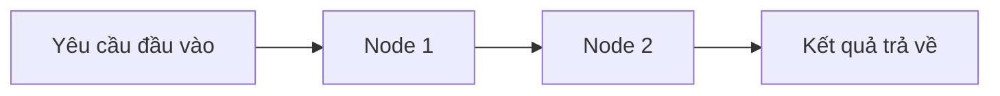

# 🚀 Chào mừng đến với LangGraph: Xây dựng AI Agent tùy biến bằng flow engineering

> Nguồn: `001-Intro.txt` · [Udemy](https://ua.udemy.com/course/langgraph/learn/lecture/50028787)

Xin chào các bạn, mình là Eden đây! 👋

Trong khóa học này, mình sẽ cùng các bạn đi từ đầu đến cuối (the ins and outs) về **LangGraph** — gói (package) mới nằm trong hệ sinh thái LangChain, cho phép chúng ta xây dựng những **AI agent cực kỳ tinh vi và tùy biến cao**. Mình tin rằng trong tương lai gần, chúng ta sẽ chứng kiến rất nhiều agent xuất hiện trong ngành công nghiệp này.

Và tin vui là: với agent, chúng ta có thể đạt được rất nhiều thứ phức tạp.

Hãy cùng mình xem vì sao LangGraph lại là mảnh ghép đáng học ở thời điểm hiện tại nhé!

### 🧭 LangGraph là gì và vì sao các bạn nên học nó?

LangGraph cho phép chúng ta làm được rất nhiều thứ phức tạp với agent. Về bản chất, nó hiện thực hóa ý tưởng **flow engineering (kỹ thuật thiết kế luồng)** — cho phép lập trình viên chúng ta **định nghĩa phạm vi (scope)** mà LLM sẽ được sử dụng trong suốt quá trình agent chạy.

Nghe có vẻ khá trừu tượng, nhưng đừng lo, chúng ta sẽ đi sâu vào nó trong khóa học. Điểm mấu chốt là: với LangGraph, các bạn có thể xây dựng những agent được tùy biến ở mức cao nhất.

---

### 🔄 Đã có LangChain rồi, tại sao lại cần LangGraph?

Chắc hẳn các bạn đang tự hỏi: chúng ta đã có thể dùng LangChain để xây dựng agent rồi mà? Đúng vậy — mình thậm chí còn hướng dẫn xây dựng **ReAct agent** trong các khóa học khác của mình.

Tuy nhiên, **mọi thứ có thể xây bằng LangChain đều có thể xây bằng LangGraph — dễ dàng hơn nhiều và mô tả hành vi của agent rõ ràng hơn nhiều.**

* Với LangChain, mọi thứ khá trừu tượng và ẩn đi nhiều chi tiết bên trong.
* Với LangGraph, chúng ta được **linh hoạt hơn rất nhiều**, đồng thời có thời gian dễ thở hơn khi hiện thực và mô tả agent.

| Tiêu chí | LangChain | LangGraph |
|---|---|---|
| Mức trừu tượng | Trừu tượng, ẩn nhiều chi tiết bên trong | Tường minh hơn, dễ nắm luồng chạy |
| Độ linh hoạt | Hạn chế hơn khi tùy biến agent | Linh hoạt hơn rất nhiều |
| Mô tả hành vi agent | Khó mô tả rõ ràng | Mô tả rõ ràng, dễ thở hơn |

Các bạn có thể hình dung chúng ta sẽ **tận dụng graph (đồ thị) với nodes (nút) và edges (cạnh)**. Bằng cách mô tả luồng chạy của agent trong một graph, việc hiện thực những logic nâng cao trở nên vô cùng đơn giản. Cụ thể, luồng chạy đó được nối từ node này sang node khác bằng các edge:

---

### ⚠️ Vài lưu ý trước khi bắt đầu

Trước khi vào bài, mình có vài điều cần nói thẳng thắn:

1. **Đây không phải khóa học cho người mới bắt đầu.** Mình kỳ vọng các bạn đã có hiểu biết vững chắc về **Python** và về **LangChain**. Nếu các bạn đã học khóa LangChain trước đó của mình thì quá tốt. Xin lỗi vì mình sẽ không giảng lại kiến thức nền — bù lại, chúng ta có thể đi nhanh, đào sâu và làm được rất nhiều thứ thú vị với LangGraph.
2. **Discord server của khóa học.** Giống các khóa học khác của mình, khóa này cũng có một máy chủ Discord để chúng ta trao đổi và bàn luận về các chủ đề nâng cao. Các bạn có thể dùng nó để đặt câu hỏi, và ở đó có một cộng đồng cực kỳ vững mạnh.

*Đừng lo nếu bạn thấy thiếu tự tin một chút — mình sẽ đồng hành để bù đắp phần nền tảng cần thiết.*

### 🎯 Tự kiểm tra nhanh

**Câu 1:** LangGraph hiện thực hóa ý tưởng nào?

<b>Xem đáp án</b>

**Đáp án:** flow engineering (kỹ thuật thiết kế luồng).

Giải thích: Nó cho phép lập trình viên định nghĩa phạm vi LLM được sử dụng trong suốt quá trình agent chạy.

Tham chiếu: Mục LangGraph là gì.

**Câu 2:** Vì sao nên chọn LangGraph thay vì chỉ dùng LangChain?

<b>Xem đáp án</b>

**Đáp án:** Mọi thứ xây bằng LangChain đều xây được bằng LangGraph — dễ hơn và mô tả hành vi agent rõ ràng hơn.

Giải thích: LangChain khá trừu tượng và ẩn chi tiết bên trong; LangGraph linh hoạt hơn nhờ graph với nodes và edges.

Tham chiếu: Mục Đã có LangChain rồi.

**Câu 3:** LangGraph biểu diễn luồng chạy của agent bằng gì?

<b>Xem đáp án</b>

**Đáp án:** Graph với nodes (nút) và edges (cạnh).

Giải thích: Mô tả luồng chạy dưới dạng graph giúp hiện thực logic nâng cao trở nên đơn giản.

Tham chiếu: Mục Đã có LangChain rồi.

**Câu 4:** Khóa học này phù hợp với ai?

<b>Xem đáp án</b>

**Đáp án:** Người đã vững Python và LangChain.

Giải thích: Đây không phải khóa cho người mới; kiến thức nền sẽ không được giảng lại.

Tham chiếu: Mục Vài lưu ý trước khi bắt đầu.

**Câu 5:** Kênh nào để trao đổi khi gặp khó khăn trong khóa học?

<b>Xem đáp án</b>

**Đáp án:** Discord server của khóa học.

Giải thích: Đây là nơi đặt câu hỏi và bàn luận các chủ đề nâng cao với cộng đồng.

Tham chiếu: Mục Vài lưu ý trước khi bắt đầu.

Vậy là đủ cho phần giới thiệu rồi! Hãy sẵn sàng và cùng mình xây dựng những thứ tuyệt vời với graph trong các bài tiếp theo nhé! 🚀

## Nguồn tham khảo

- [Udemy — LangGraph: Intro](https://ua.udemy.com/course/langgraph/learn/lecture/50028787)
- [LangGraph overview — Docs by LangChain](https://docs.langchain.com/oss/python/langgraph/overview)
- [langchain-ai/langgraph — GitHub](https://github.com/langchain-ai/langgraph)
