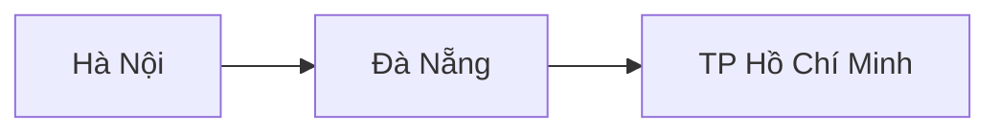

# 🧮 Graph và State Machine là gì? Hai khái niệm bạn sẽ dùng suốt khóa học

> Nguồn: `006-But-wait-What-are-Graphs.txt` · [Udemy](https://ua.udemy.com/course/langgraph/learn/lecture/43614272)

Chào các bạn, mình là Eden đây! Trước khi lao vào LangGraph, mình muốn dành một bài để làm quen với hai khái niệm lý thuyết và thuật ngữ mà chúng ta sẽ dùng liên tục trong suốt khóa học: **graph (đồ thị)** — một cấu trúc dữ liệu — và **state machine (máy trạng thái)**.

Bài này nhẹ nhàng thôi, nhưng sẽ giúp các bạn có "nền móng" vững chắc để không bị bỡ ngỡ ở các bài sau.

### 🕸️ Graph — cấu trúc dữ liệu mô tả các mối quan hệ

**Graph là một đối tượng toán học giúp chúng ta biểu diễn các mối quan hệ.** Nó bao gồm:

* **Nodes (nút)** — còn được gọi là **vertices (đỉnh)**.
* **Edges (cạnh)** — kết nối các node với nhau.

Cấu trúc dữ liệu graph **cực kỳ đa dụng** và được dùng trong vô số ứng dụng ở nhiều lĩnh vực khác nhau. Chúng ta có thể dùng graph để mô tả:

* Mạng xã hội (social networks).
* Bản đồ giao thông giữa các thành phố và các con đường.
* Các tuyến đường giữa các thành phố.

Ví dụ trực quan với các thành phố là node và tuyến đường là edge:

Điều tuyệt vời là trong khoa học máy tính có **rất nhiều nghiên cứu về cấu trúc dữ liệu này**, cùng vô số thuật toán và kỹ thuật trích xuất thuộc tính của graph, giúp giải quyết nhiều bài toán thực tế.

---

### 🛡️ Câu chuyện thực tế: graph database và bảo mật cloud

Chia sẻ một chút "ngoài lề" của một người từng là kỹ sư phần mềm: mình từng làm việc rất nhiều với **graph database (cơ sở dữ liệu đồ thị)** khi làm cho các công ty an ninh mạng. Bọn mình dùng graph để:

* Tìm và mô tả **attack vector (đường tấn công)** của các **cloud asset (tài sản đám mây)** trên những nền tảng public cloud như **AWS, GCP và Azure**.
* Mô tả **tính kết nối** giữa các tài sản đó, để trả lời những câu hỏi như: *"Web server này có lộ ra internet không?"* và *"Nó có đang kết nối vào một database không?"*
* Phục vụ **cloud security posture management (quản trị tư thế bảo mật đám mây)**.

Nếu chủ đề này hấp dẫn bạn, mình sẽ để lại trong **tài nguyên của video** một buổi talk mình từng trình bày ở **Minsk trong một meetup cho Python developer**, nơi mình nói về đúng chủ đề này.

Nếu muốn "geek" một chút, đây là **định nghĩa toán học chính thức** của graph: một graph G(V, E) bao gồm **V — tập hợp các đỉnh (vertices)** và **E — tập hợp các cạnh (edges)**, trong đó mỗi cạnh được mô tả bằng một cặp (x, y) với x và y thuộc tập đỉnh. Và các bạn cứ yên tâm: *đây là lần cuối cùng chúng ta thấy toán trong khóa học này!* 😉

---

### ⚙️ State machine — mô hình của các trạng thái và chuyển tiếp

**State machine (máy trạng thái)** là một **mô hình tính toán (model of computation)** bao gồm **các trạng thái (states)** và **các chuyển tiếp (transitions)** giữa chúng.

Bằng cách định nghĩa các trạng thái khác nhau và luật chuyển tiếp giữa chúng, state machine có thể quản lý những điều kiện và chuỗi hành vi phức tạp trong hệ thống phần mềm.

Điểm thú vị: **state machine có thể được biểu diễn dưới dạng graph**, trong đó **các state chính là node** và **các transition chính là edge**. Cách trực quan hóa này giúp chúng ta hiểu rõ luồng chạy của state machine và quản lý độ phức tạp của nó.

| Tiêu chí | Graph | State machine |
|---|---|---|
| Định nghĩa | Đối tượng toán học biểu diễn các mối quan hệ | Mô hình tính toán gồm các trạng thái và chuyển tiếp |
| Thành phần chính | Nodes/vertices và edges | States và transitions |
| Liên hệ | — | Biểu diễn được dưới dạng graph: state là node, transition là edge |

---

### 🚀 Và đây là lúc LangGraph xuất hiện

Và đó là lý do **LangGraph** — một thư viện mạnh mẽ được xây dựng trên nền LangChain — bước vào cuộc chơi.

Với LangGraph, chúng ta có thể **mô tả các luồng chạy của mình bằng chính những node và edge**. Từ đó, ta xây dựng được những ứng dụng **cực kỳ mạnh mẽ và tinh vi**. Trong khóa học, các bạn sẽ thấy chúng ta mô tả những agent rất nâng cao và phức tạp — và việc viết chúng bằng LangGraph rồi chạy sẽ vô cùng dễ dàng.

### 🎯 Tự kiểm tra nhanh

**Câu 1:** Graph gồm những thành phần nào?

<b>Xem đáp án</b>

**Đáp án:** Nodes (nút, còn gọi là vertices — đỉnh) và edges (cạnh) kết nối các node với nhau.

Giải thích: Đây là cấu trúc dữ liệu cực kỳ đa dụng, được dùng trong vô số ứng dụng.

Tham chiếu: Mục Graph — cấu trúc dữ liệu.

**Câu 2:** Định nghĩa toán học chính thức của graph G(V, E) là gì?

<b>Xem đáp án</b>

**Đáp án:** V là tập hợp các đỉnh (vertices), E là tập hợp các cạnh (edges); mỗi cạnh được mô tả bằng một cặp (x, y) với x và y thuộc tập đỉnh.

Giải thích: Đây là lần cuối cùng toán học xuất hiện trong khóa học.

Tham chiếu: Mục Câu chuyện thực tế.

**Câu 3:** Trong ví dụ bảo mật cloud của giảng viên, graph được dùng để làm gì?

<b>Xem đáp án</b>

**Đáp án:** Tìm và mô tả attack vector của các cloud asset trên AWS, GCP, Azure; mô tả tính kết nối giữa các tài sản đó để trả lời các câu hỏi an ninh.

Giải thích: Ví dụ: "Web server này có lộ ra internet không?", "Nó có kết nối vào database không?" — phục vụ cloud security posture management.

Tham chiếu: Mục Câu chuyện thực tế.

**Câu 4:** State machine là gì và gồm những gì?

<b>Xem đáp án</b>

**Đáp án:** Là một mô hình tính toán gồm các trạng thái (states) và các chuyển tiếp (transitions) giữa chúng.

Giải thích: Nhờ đó nó có thể quản lý những điều kiện và chuỗi hành vi phức tạp trong phần mềm.

Tham chiếu: Mục State machine.

**Câu 5:** State machine được biểu diễn dưới dạng graph như thế nào?

<b>Xem đáp án</b>

**Đáp án:** Các state chính là node, các transition chính là edge.

Giải thích: Cách trực quan hóa này giúp hiểu rõ luồng chạy và quản lý độ phức tạp của state machine.

Tham chiếu: Mục State machine.

*Việc "thống nhất ngôn ngữ" về graph và state machine ngay từ đầu là rất quan trọng, trước khi chúng ta bước vào flow engineering và LangGraph.* Hẹn gặp lại các bạn ở bài tiếp theo! 🚀

## Nguồn tham khảo

- [Udemy — LangGraph: But wait.. What are Graphs?](https://ua.udemy.com/course/langgraph/learn/lecture/43614272)
- [LangGraph overview — Docs by LangChain](https://docs.langchain.com/oss/python/langgraph/overview)
- [Graph API overview — Docs by LangChain](https://docs.langchain.com/oss/python/langgraph/graph-api)
