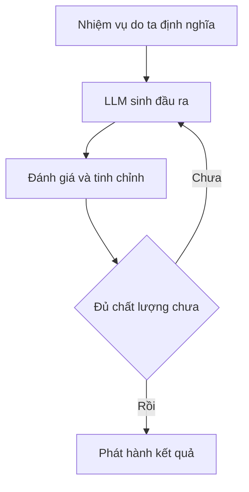

# 🗺️ Flow Engineering là gì? Tương lai của việc phát triển phần mềm AI

> Nguồn: `007-Flow-Engineering.txt` · [Udemy](https://ua.udemy.com/course/langgraph/learn/lecture/43466296)

Chào các bạn, mình là Eden đây! Hôm nay chúng ta sẽ bàn về một ý tưởng mới đang được thảo luận sôi nổi trong cộng đồng generative AI: **flow engineering (kỹ thuật thiết kế luồng)**.

Mình xin "cảnh báo trước": đây là một bài **rất lý thuyết**, và bản thân ý tưởng flow engineering còn khá trừu tượng, chưa được định hình hoàn toàn. Nên nếu các bạn chưa hiểu hết mọi thứ trong bài này thì cũng đừng bận tâm — *mình hứa là đến cuối khóa, các bạn sẽ hiểu chính xác flow engineering là gì.*

### 🧠 Flow engineering — định nghĩa và mục tiêu

**Flow engineering là một cách tiếp cận có hệ thống và có chiến lược để phát triển phần mềm, trong đó tích hợp các quy trình ra quyết định do AI dẫn dắt.**

Mục tiêu cốt lõi của flow engineering là **quản lý và tối ưu cách các hệ thống AI dùng LLM xử lý nhiệm vụ**, thông qua việc **định nghĩa một luồng rõ ràng hoặc một chuỗi các thao tác**.

Những luồng này **không chỉ là tuyến tính** — chúng có thể chứa các **decision-making node (nút ra quyết định)** phức tạp, nơi AI sinh ra nhiều đầu ra khác nhau, và những đầu ra đó thường được **đánh giá rồi tinh chỉnh trong một vòng lặp (iterative cycle)**. Khung luồng cơ bản đó trông như thế này:

Nói cách khác, flow engineering là một **quy trình có cấu trúc** trong phát triển hệ thống AI: nó dẫn dắt AI đi qua một chuỗi bước được định nghĩa rõ ràng để nâng cao chất lượng đầu ra. Nó cũng đưa vào các **pha lập kế hoạch và kiểm thử có hệ thống, mô phỏng quy trình phát triển của con người** — tất cả nhằm tăng **độ tin cậy và tính năng** cho các giải pháp do AI tạo ra.

---

### ⚠️ Vì sao autonomous agent kiểu "long-term planning" chưa hoạt động?

Một trong những vấn đề của **AutoGPT** và các dự án autonomous agent khác là chúng hoạt động theo kiểu **long-term planning (lập kế hoạch dài hạn)**: nhận một mục tiêu, chia nhỏ thành các task, rồi bắt đầu hiện thực và thực thi, lại tách ra các subtask, cứ thế tiếp diễn... Và **trên thực tế, chúng không thực sự hoạt động.**

Điểm mấu chốt mình muốn nhấn mạnh là: **chúng ta — những lập trình viên — muốn đưa ra chỉ dẫn về việc cần làm.** Chúng ta **không muốn AI tự tạo ra những đoạn văn bản tưởng tượng rồi bắt đầu thực thi chúng** — điều này cực kỳ dễ phát sinh vấn đề và khiến LLM "vượt khỏi tầm kiểm soát". Thay vào đó:

* Chúng ta muốn **định nghĩa rõ các task**, và giữ LLM **trong phạm vi ngữ cảnh của những task đó**.
* Tất nhiên LLM vẫn có thể ra một số quyết định: ví dụ **đầu ra đã đủ tốt để phát hành chưa**, đây đã phải là giải pháp đủ tốt chưa, hoặc **bước tiếp theo nên là bước nào**.
* **Nhưng chúng ta định nghĩa phạm vi (scope) và làm phần lớn việc lập kế hoạch cho LLM** — còn LLM chỉ vận hành bên trong luồng mà ta tạo ra.

Hãy hình dung nó như việc **chúng ta trao cho LLM những bản thiết kế (blueprints) để đi theo.**

---

### 🔗 LangGraph — "điểm giữa" của flow engineering

Nếu nghĩ theo state machine: **chúng ta viết ra các state** — tức viết ra luồng chạy, việc cần làm, các bước cần có. Nhưng ta có thể **đưa LLM vào để quyết định sẽ đi theo luồng nào** dựa trên đầu vào: ví dụ nên **tinh chỉnh câu trả lời (curate)** hay **trả thẳng cho người dùng**, nên đi bước I hay bước I+2. Điều quan trọng: **state machine là một quyết định kỹ thuật (engineering decision), không có yếu tố thống kê nào trong đó cả.**

Trong bối cảnh flow engineering, **LangGraph hiện thực hóa "điểm giữa" này**:

* Nó là **trung gian giữa hai thái cực**: autonomous agent (tự quyết định làm gì và làm thế nào) và **chain của LangChain (hoàn toàn deterministic, không có chút linh hoạt nào trong luồng)**.
* Với flow engineering, ta đạt được những **giải pháp agentic phức tạp**: cần xây một state machine để định nghĩa các bước của luồng, và có thể dùng LLM **như một thành phần của bước** (ví dụ một lời gọi LLM để sinh một tweet), hoặc dùng LLM để **chỉ ra bước nên đi tiếp**.
* Ví dụ cụ thể: một graph **viết một tweet**, rồi **phản chiếu (reflect) và phê bình (critique) tweet đó**, và lặp lại theo từng vòng (iterations) cho đến khi có được một bài đăng Twitter thật sự chất lượng.

| Tiêu chí | Autonomous agent | LangGraph | Chain LangChain |
|---|---|---|---|
| Ai định nghĩa luồng | LLM tự quyết mọi thứ | Lập trình viên định nghĩa, LLM chọn nhánh | Lập trình viên viết sẵn |
| Mức linh hoạt | Tối đa | Cân bằng, nằm trong phạm vi định trước | Không có |
| Mức kiểm soát | Thấp | Cao | Tuyệt đối |

Nói gọn lại: ta dùng LLM để làm việc bên trong một bước, và ta cũng có thể dùng LLM để quyết định nên đi bước nào. **Nhưng chính chúng ta định nghĩa luồng và nắm toàn quyền kiểm soát nó.** Với LangGraph, ta định nghĩa các graph gồm **node và edge**, có thể chứa **cycles (chu trình)** — và trong khóa học, chúng ta sẽ cùng xây dựng những logic rất nâng cao để tạo nên một hệ thống AI phức tạp.

---

### ⏳ Tương lai: 60% flow engineering, 35% fine-tuning, 5% prompt engineering

Mình tin rằng trong tương lai gần, khi chúng ta phát triển phần mềm AI và generative AI, **thời gian dành cho phần mềm sẽ được phân bổ như sau**:

1. **60%** dành cho **flow engineering** — kiến trúc, state machine, các node, những bước nào có thể làm, có thể tích hợp LLM vào đó, thậm chí để LLM quyết định bước nào nên thực hiện.
2. **35%** dành cho **fine-tuning (tinh chỉnh model)** — làm cho model thật chuyên biệt cho những nhiệm vụ cần đạt được.
3. **5%** dành cho **prompt engineering**.

### 🎯 Tự kiểm tra nhanh

**Câu 1:** Flow engineering là gì?

<b>Xem đáp án</b>

**Đáp án:** Là cách tiếp cận có hệ thống, có chiến lược để phát triển phần mềm, trong đó tích hợp các quy trình ra quyết định do AI dẫn dắt.

Giải thích: Mục tiêu là quản lý và tối ưu cách hệ thống AI dùng LLM xử lý nhiệm vụ, thông qua một luồng rõ ràng hoặc chuỗi thao tác.

Tham chiếu: Mục Flow engineering — định nghĩa và mục tiêu.

**Câu 2:** Vì sao kiểu long-term planning của AutoGPT chưa hoạt động?

<b>Xem đáp án</b>

**Đáp án:** Vì nó để AI tự tạo ra những đoạn văn bản tưởng tượng rồi tự thực thi, rất dễ vượt khỏi tầm kiểm soát.

Giải thích: Thay vào đó, lập trình viên muốn định nghĩa rõ các task và giữ LLM trong phạm vi ngữ cảnh của các task đó.

Tham chiếu: Mục Vì sao autonomous agent kiểu long-term planning chưa hoạt động.

**Câu 3:** Trong luồng do ta định nghĩa, LLM được phép quyết định những gì?

<b>Xem đáp án</b>

**Đáp án:** Một số quyết định trong phạm vi cho phép — ví dụ đầu ra đã đủ tốt để phát hành chưa, hoặc bước tiếp theo nên là bước nào.

Giải thích: Còn phần lớn việc lập kế hoạch và phạm vi (scope) là do chúng ta định nghĩa — như trao cho LLM những bản thiết kế để đi theo.

Tham chiếu: Mục Vì sao autonomous agent kiểu long-term planning chưa hoạt động.

**Câu 4:** Vì sao nói LangGraph là "điểm giữa" của flow engineering?

<b>Xem đáp án</b>

**Đáp án:** Vì nó nằm giữa autonomous agent (tự quyết mọi thứ) và chain LangChain (hoàn toàn deterministic, không linh hoạt).

Giải thích: Ta định nghĩa graph với node/edge, có thể chứa cycles; LLM chỉ chọn nhánh trong luồng ta đã thiết kế.

Tham chiếu: Mục LangGraph — "điểm giữa" của flow engineering.

**Câu 5:** Tương lai được dự đoán phân bổ thời gian phát triển phần mềm AI như thế nào?

<b>Xem đáp án</b>

**Đáp án:** 60% cho flow engineering, 35% cho fine-tuning, 5% cho prompt engineering.

Giải thích: Phần lớn công sức sẽ dành cho kiến trúc, state machine, các node và luồng tích hợp LLM.

Tham chiếu: Mục Tương lai 60/35/5.

Và như mình đã nói, bài này **siêu trừu tượng** — nếu các bạn chưa nắm được mọi thứ thì hoàn toàn bình thường. *Đây là một chủ đề mới và còn khá mơ hồ.* Nhưng mình cam kết: đến cuối khóa, các bạn sẽ hiểu chính xác flow engineering là gì, và hiểu vì sao nó lại quan trọng đến vậy khi xây dựng những agent nâng cao bằng các kỹ thuật flow engineering.

Hẹn gặp lại các bạn ở bài tiếp theo! 🚀

## Nguồn tham khảo

- [Udemy — LangGraph: Flow Engineering](https://ua.udemy.com/course/langgraph/learn/lecture/43466296)
- [LangGraph overview — Docs by LangChain](https://docs.langchain.com/oss/python/langgraph/overview)
- [langchain-ai/langgraph — GitHub](https://github.com/langchain-ai/langgraph)
