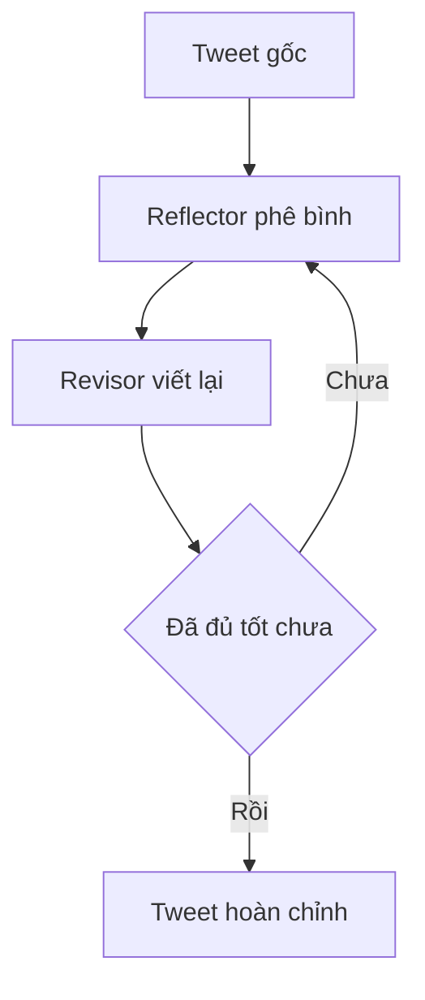

# 🪞 Reflection Agent: Dự án đầu tiên giúp AI tự "soi gương" và viết lại Tweet của bạn

> Nguồn: `009-What-are-we-building.txt` · [Udemy](https://ua.udemy.com/course/langgraph/learn/lecture/43455440)

Chào các bạn, Eden đây! Chúng ta đã đi qua phần giới thiệu khóa học, và giờ là lúc bước vào **Section đầu tiên: Reflection Agent**. Trong bài này, mình sẽ kể cho các bạn nghe chúng ta sẽ xây dựng điều gì, và vì sao đây là dự án hoàn hảo để khởi động hành trình LangGraph.

### 🪞 Reflection Agent — "tấm gương" giúp AI tự hoàn thiện

Reflection agent (agent tự phản chiếu) là một công cụ đầy sức mạnh, được dùng để **nâng cao chất lượng và tỷ lệ thành công của các hệ thống AI**.

* Thay vì trả lời một lần rồi dừng lại, nó **thúc đẩy LLM nhìn lại những hành động trong quá khứ**.
* Nhờ đó, hệ thống có thể **học hỏi và cải thiện dần theo thời gian**.
* Đây là một trong những mô hình agentic nền tảng và trực quan nhất, rất phù hợp để các bạn làm quen với tư duy xây dựng vòng lặp trong LangGraph.

Nói cách khác: thay vì "một phát ăn ngay", chúng ta dạy cho AI biết **tự phê bình chính mình** rồi làm lại tốt hơn.

---

### 🐦 Dự án: Viết lại một bài đăng Twitter

Cụ thể, reflection agent của chúng ta sẽ giúp **chỉnh sửa các bài đăng Twitter**. Mình sẽ lấy ví dụ là chính chiếc tweet mình từng viết cách đây ít lâu về **LangChain**, và để agent giúp chúng ta lặp đi lặp lại cho tới khi bài đăng trở nên "mượt" hơn.

**Quy trình sẽ diễn ra như sau:**

1. Agent nhận **tweet gốc**.
2. Bước **reflection (tự phản chiếu)** đưa ra **critique (lời phê bình)** — nó phản hồi và chỉ trích bài đăng của chúng ta.
3. Lấy phản hồi đó **feed ngược trở lại LLM** rồi yêu cầu viết lại — ta có **revision number one**.
4. Tiếp tục lặp quy trình này hết lần này đến lần khác, cho tới khi ta có một bài đăng tử tế — và biết đâu đấy, đủ sức **lan truyền (viral)**.

Toàn bộ vòng lặp gói gọn trong sơ đồ sau:

Các bạn để ý: vai trò của **reflector (bên phản chiếu)** ở đây là một **người phản biện khó tính**, còn LLM sẽ đóng vai người viết và sửa bài.

| Thành phần | Vai trò | Nhiệm vụ trong vòng lặp |
|---|---|---|
| Reflector | Người phản biện khó tính | Đưa ra critique và gợi ý cải thiện |
| Revisor | Người viết và sửa bài | Sinh tweet mới dựa trên critique |

---

### ⚡ Nghe "ghê gớm" nhưng chỉ dưới 100 dòng code

Có lẽ các bạn sẽ bất ngờ: dự án này tốn **chưa tới 100 dòng code**, bởi **LangGraph sẽ đảm nhiệm phần lớn công việc nặng nhọc** cho chúng ta. Việc của chúng ta chỉ là mô tả đúng luồng chạy, còn framework sẽ lo phần còn lại.

*Đừng lo nếu những khái niệm như graph, node hay reflection còn mơ hồ — mình sẽ giải thích từng bước ngay trong các video tiếp theo, các bạn nhé.*

### 🎯 Tự kiểm tra nhanh

**Câu 1:** Reflection agent cải thiện chất lượng hệ thống AI bằng cách nào?

<b>Xem đáp án</b>

**Đáp án:** Thúc đẩy LLM nhìn lại những hành động trong quá khứ để học hỏi và cải thiện dần.

Giải thích: Thay vì trả lời một lần rồi dừng, agent tự phản chiếu rồi làm lại tốt hơn.

Tham chiếu: Mục Reflection Agent.

**Câu 2:** Dự án đầu tiên của section này giúp chỉnh sửa loại nội dung nào?

<b>Xem đáp án</b>

**Đáp án:** Các bài đăng Twitter.

Giải thích: Agent nhận tweet gốc, phản chiếu và viết lại cho tới khi "mượt" hơn.

Tham chiếu: Mục Dự án.

**Câu 3:** Vai trò của reflector và revisor khác nhau thế nào?

<b>Xem đáp án</b>

**Đáp án:** Reflector là người phản biện khó tính đưa critique, còn revisor viết và sửa bài theo critique đó.

Giải thích: Hai vai này thay nhau chạy trong vòng lặp để tweet tốt dần lên.

Tham chiếu: Mục Dự án.

**Câu 4:** Sau khi nhận critique, bước tiếp theo trong vòng lặp là gì?

<b>Xem đáp án</b>

**Đáp án:** Feed phản hồi ngược lại LLM để viết lại, tạo ra revision number one, rồi lặp tiếp.

Giải thích: Quy trình critique rồi revise được lặp hết lần này đến lần khác.

Tham chiếu: Mục Dự án.

**Câu 5:** Vì sao dự án "nghe ghê gớm" nhưng chỉ tốn chưa tới 100 dòng code?

<b>Xem đáp án</b>

**Đáp án:** Vì LangGraph đảm nhiệm phần lớn công việc nặng nhọc, ta chỉ cần mô tả đúng luồng chạy.

Giải thích: Framework lo phần còn lại khi ta mô tả đúng luồng và các node.

Tham chiếu: Mục Chưa tới 100 dòng code.

Vậy là các bạn đã biết chúng ta sắp xây gì rồi đấy! Ở bài tiếp theo, chúng ta sẽ cùng nhau **setup project** với Poetry, PyCharm và các biến môi trường. Hẹn gặp lại các bạn! 🚀

## Nguồn tham khảo

- [Udemy — What are we building](https://ua.udemy.com/course/langgraph/learn/lecture/43455440)
- [LangGraph — Reflection agent example chính thức](https://github.com/langchain-ai/langgraph/blob/main/examples/reflection/reflection.ipynb)
- [LangGraph Docs — Graph API overview](https://docs.langchain.com/oss/python/langgraph/graph-api)
