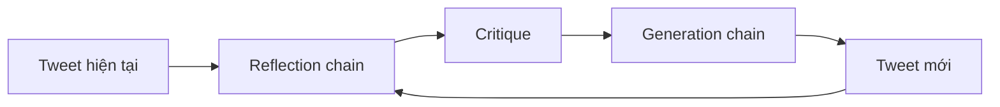

# 🧠 Reflector & Revisor: Xây hai "bộ não" chạy bên trong Reflection Agent

> Nguồn: `011-Creating-the-Reflector-Chain-and-the-Tweet-Reviosr-Chain.txt` · [Udemy](https://ua.udemy.com/course/langgraph/learn/lecture/43455420)

Chào các bạn, Eden đây! Sau khi đã dựng xong môi trường, hôm nay chúng ta sẽ cùng viết các **chain** — những "cỗ máy" thực sự chạy bên trong graph. Trước khi dựng graph, ta phải dựng những thành phần sẽ chạy trong nó, đúng không nào?

### 📐 Hai chain, hai nhiệm vụ

Trong video này, chúng ta sẽ triển khai hai chain:

* **Generation chain (chuỗi sinh — revisor):** chịu trách nhiệm **sinh và chỉnh sửa (revise) tweet** của chúng ta, mỗi vòng một tốt hơn.
* **Reflection chain (chuỗi phản chiếu — reflector):** nhận tweet và đưa ra **phản hồi, phê bình**, kèm gợi ý cải thiện — lặp đi lặp lại.

| Chain | System prompt | Nhiệm vụ |
|---|---|---|
| Reflection chain | Influencer viral trên Twitter | Tạo critique và recommendation cho tweet |
| Generation chain | Trợ lý tech influencer | Viết tweet tốt nhất, revise theo critique |

Cứ mỗi vòng lặp trong graph, critique (lời phê bình) từ reflection chain sẽ được đưa vào generation chain để viết lại tweet. Đây chính là "trái tim" của kỹ thuật reflection mà chúng ta đang xây.

Vòng lặp giữa hai chain diễn ra như sau:

---

### ✍️ Reflection prompt — "bên phản chiếu"

Mình tạo một file mới tên là `chains.py` — nơi chứa toàn bộ prompt và chain dùng trong graph. Bắt đầu với các import:

* `ChatPromptTemplate` (mẫu prompt chat) và `MessagesPlaceholder` (chỗ trống cho message) từ LangChain. Nhắc lại một chút: **ChatPromptTemplate** chứa nội dung ta gửi cho LLM với vai trò con người, hoặc nhận về từ LLM với nhãn AI; còn **MessagesPlaceholder** cho phép ta đặt một **chỗ trống cho những message sẽ đến sau**.
* `ChatOpenAI` từ `langchain_openai`.

Prompt đầu tiên là **reflection prompt**. Đây là một **system message**, đại ý như sau:

* Bạn là một **influencer viral trên Twitter**.
* Nhiệm vụ: **tạo critique và recommendation** cho tweet của người dùng.
* Luôn đưa ra gợi ý chi tiết, bao gồm cả **độ dài (length), độ viral, style**, v.v.

Ngay dưới đó, mình đặt một `MessagesPlaceholder` với tên biến là `messages` — đây là chỗ chứa **lịch sử hội thoại**. Chính những message này sẽ được agent dùng để phê bình và nhận gợi ý hết lần này đến lần khác. Khi khởi tạo reflector, ta sẽ nối prompt này với biến `messages`.

---

### 🐦 Generation prompt — "bên duyệt lại"

Tiếp theo là **generation prompt**. Trong kiến trúc agent của chúng ta, prompt này sẽ sinh ra những chiếc tweet được **revision liên tục** dựa trên feedback từ reflection prompt — cho tới khi có được chiếc tweet hoàn hảo.

System message của nó đại ý:

* Bạn là **trợ lý của một tech influencer trên Twitter**, chịu trách nhiệm viết những bài đăng Twitter xuất sắc.
* Hãy tạo **tweet tốt nhất có thể** để đáp ứng yêu cầu của người dùng.
* Nếu người dùng đưa ra critique, hãy trả lời bằng **một phiên bản đã chỉnh sửa** của những lần thử trước đó.

Bạn có thể đặt tên cho prompt này tùy thích, nhưng mục tiêu của nó là **revise tweet dựa trên phản hồi nhận được**. Cuối prompt, mình cũng đặt một `MessagesPlaceholder` với key `messages` để chứa tất cả reflection và revision trước đó.

---

### 🔗 Khởi tạo LLM và ghép hai chain

Giờ là bước cuối: khởi tạo một **LM (language model)** với `ChatOpenAI` — mặc định sẽ dùng **GPT-3.5 Turbo**. Sau đó, mình dùng **LCEL (LangChain Expression Language)** để ghép prompt với model và tạo ra hai chain đơn giản:

* Chain thứ nhất: **generation chain** (trong code là `generate_chain`) — prompt generation + LM.
* Chain thứ hai: **reflection chain** (trong code là `reflect_chain`) — prompt reflection + LM.

### 🎯 Tự kiểm tra nhanh

**Câu 1:** Vì sao phải viết chain trước khi dựng graph?

<b>Xem đáp án</b>

**Đáp án:** Vì chain là những thành phần thực sự chạy bên trong các node của graph.

Giải thích: Trước khi dựng graph, ta phải dựng những gì sẽ chạy trong nó.

Tham chiếu: Đoạn mở bài.

**Câu 2:** `MessagesPlaceholder` trong prompt có tác dụng gì?

<b>Xem đáp án</b>

**Đáp án:** Đặt một chỗ trống cho những message sẽ đến sau — tức lịch sử hội thoại.

Giải thích: Nhờ đó agent dùng lại message cũ để phê bình và nhận gợi ý nhiều lần.

Tham chiếu: Mục Reflection prompt.

**Câu 3:** Reflection prompt đóng vai gì và yêu cầu điều gì?

<b>Xem đáp án</b>

**Đáp án:** Là system message đóng vai influencer viral trên Twitter, yêu cầu tạo critique và recommendation chi tiết về độ dài, độ viral, style...

Giải thích: Đây là "bên phản chiếu" chuyên đưa ra lời phê bình.

Tham chiếu: Mục Reflection prompt.

**Câu 4:** Generation prompt xử lý critique như thế nào?

<b>Xem đáp án</b>

**Đáp án:** Nếu người dùng đưa critique, nó trả lời bằng một phiên bản đã chỉnh sửa của những lần thử trước đó.

Giải thích: Mục tiêu là liên tục revise tweet dựa trên phản hồi nhận được.

Tham chiếu: Mục Generation prompt.

**Câu 5:** Hai chain được ghép với model bằng công nghệ nào?

<b>Xem đáp án</b>

**Đáp án:** LCEL (LangChain Expression Language), nối prompt với `ChatOpenAI` mặc định dùng GPT-3.5 Turbo.

Giải thích: Kết quả là `generate_chain` và `reflect_chain` — hai chain đơn giản.

Tham chiếu: Mục Khởi tạo LLM.

Vậy là xong phần chain! Ở video tiếp theo, chúng ta sẽ thực sự **dựng graph** và nối các mảnh ghép này lại với nhau. Hẹn gặp lại các bạn! 🚀

## Nguồn tham khảo

- [Udemy — Creating the Reflector Chain and the Tweet Revisor Chain](https://ua.udemy.com/course/langgraph/learn/lecture/43455420)
- [LangGraph — Reflection example chính thức, chứa prompt gốc](https://github.com/langchain-ai/langgraph/blob/main/examples/reflection/reflection.ipynb)
