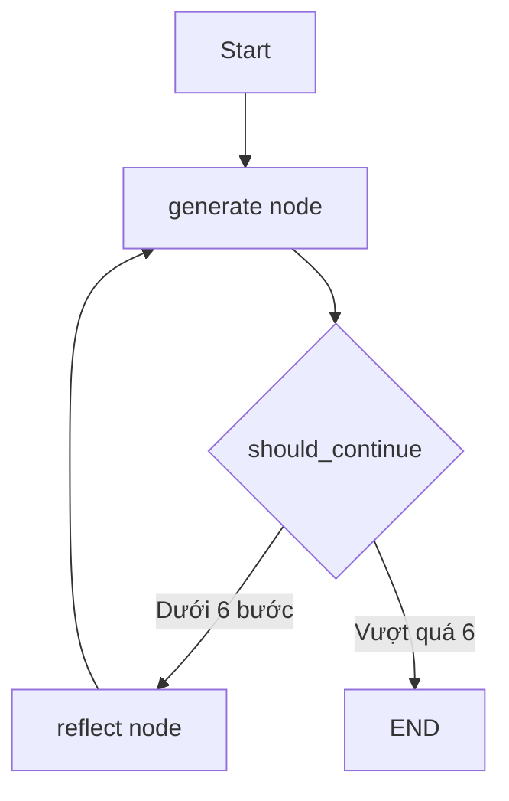

# 🕸️ Định nghĩa LangGraph Graph: Node, Conditional Edge và lần đầu "vẽ" graph

> Nguồn: `012-Defining-our-LangGraph-Graph.txt` · [Udemy](https://ua.udemy.com/course/langgraph/learn/lecture/43455436)

Chào các bạn, Eden đây! Sau khi các chain đã sẵn sàng, hôm nay chúng ta sẽ **dựng graph thật sự**: định nghĩa node, nối các edge — trong đó có cả một **conditional edge (cạnh có điều kiện)** — rồi compile và visualize thành quả.

### 📦 Import và làm quen với MessageGraph

Chúng ta bắt đầu với file `main.py` — nơi sẽ chứa toàn bộ phần triển khai graph. Các import gồm:

* `List`, `Sequence` từ thư viện `typing`.
* `BaseMessage` và `HumanMessage`.
* `MessageGraph` cùng hằng số `END` — key của **node kết thúc mặc định**; khi graph chạm tới node này, quá trình thực thi sẽ dừng lại.
* `generate_chain` và `reflect_chain` từ module `chains` mà chúng ta đã viết.

**MessageGraph** là một kiểu graph đặc biệt, trong đó **state chỉ đơn giản là một chuỗi message**. Mỗi node nhận đầu vào là một list message, và trả về một (hoặc vài) message. Đoạn code mình dùng được lấy trực tiếp từ phần triển khai mã nguồn mở của LangGraph: hàm `add_messages` nhận output rồi **append message vào state** — và đó chính là state mới.

### 🔧 Hai node: generate và reflect

Mình định nghĩa hai hằng số `reflect` và `generate` — đây sẽ là **key của các node** trong graph. Có thể hình dung: node `reflect` chạy reflection chain, còn node `generate` chạy generation chain. Ngoài hai node do người dùng định nghĩa này, graph còn dùng **node start** và **node end mặc định** mà chúng ta đã biết.

**1. Generation node:** nhận vào `state` — vốn chỉ là một sequence (list) các message. Node này chạy generation chain và invoke với **toàn bộ state hiện có**. Dù là lần chạy đầu tiên, thứ hai hay thứ ba, tweet vẫn được revise liên tục, vì system prompt đã nói rằng đây là một Twitter influencer cần viết và **chỉnh sửa tweet theo reflection**. Response từ LLM sau đó được append vào state — tất cả diễn ra "dưới mui xe" (under the hood).

**2. Reflection node:** cũng nhận vào sequence message và invoke reflection chain theo cách tương tự. Nhưng có **một khác biệt tinh tế cực kỳ quan trọng**: response trả về từ LLM — thường mang role AI — sẽ được **đổi thành `HumanMessage`**. Ta lấy content của message đó, gán cho vai trò con người rồi trả về. Mục đích là **"đánh lừa" LLM** rằng chính con người đang gửi message này, để có một cuộc hội thoại qua lại: critique, generate, critique, generate... Cứ như thể các bạn đang chat với ChatGPT để cùng sửa một chiếc tweet vậy. Đây là **kỹ thuật rất quan trọng** khi làm việc với LangGraph.

| Node | Nhận vào | Làm gì | Trả về |
|---|---|---|---|
| `generate` | Toàn bộ list message | Chạy generation chain | AI message được append vào state |
| `reflect` | Toàn bộ list message | Chạy reflection chain | AI message đổi thành `HumanMessage` |

### 🔀 Conditional edge và hàm `should_continue`

Mình khởi tạo `builder = MessageGraph()`, thêm hai node bằng `add_node` với key `generate` và `reflect`, rồi dùng `set_entry_point("generate")` để nói với LangGraph rằng node bắt đầu là generate.

Giả sử ta đã chạy generate và revise tweet một lần. Giờ ta cần logic quyết định: tweet đã ổn để kết thúc, hay cần thêm một bước reflection? Vì thế mình viết hàm `should_continue`:

* Nhận vào `state` — toàn bộ message hiện có.
* **Trả về một string** — chính là key của node mà graph nên đi tới.

Trong ví dụ này, mình không dùng LLM để quyết định mà viết logic đơn giản: **đếm số bước đã thực hiện**; nếu đã **vượt quá 6** thì kết thúc, còn không thì đi tiếp sang node `reflect`.

Thuật ngữ chính thức của LangGraph cho loại hàm này là **conditional edge**. Điều thú vị là về lý thuyết lẫn thực tế, hàm này **hoàn toàn có thể dùng một LLM để quyết định** nên đi đâu — để AI lý luận xem bước tiếp theo là gì, node nào cần chạy. Theo mình, điều này cực kỳ ấn tượng và mở ra rất nhiều khả năng cho những hệ thống phức tạp về sau.

Khi gọi `add_conditional_edges`, ta truyền vào **tham số thứ ba là một path mapping dictionary**: hàm conditional trả về string, còn dictionary này ánh xạ các string đó sang node thật trong graph (ví dụ `end` → node kết thúc, hoặc tên node xử lý tool tương ứng). Không có mapping, LangGraph sẽ không biết phải route đi đâu. **LangGraph Studio cũng cần mapping tường minh này** để visualize đúng các kết nối — nếu thiếu, Studio sẽ vẽ mọi edge có thể từ node gốc tới tất cả các node.

Sau khi có feedback, ta muốn revise tweet, nên thêm một edge **từ `reflect` sang `generate`**. Thế là đã đủ node và edge cho graph.

### 🎨 Compile và visualize graph

Giờ chỉ cần gọi `compile()` để có object graph hoàn chỉnh và có thể invoke được. Việc nhìn thấy graph dưới dạng hình ảnh rất quan trọng — để giải thích cho người khác hoặc để debug khi cần.

* `get_graph()` rồi gọi `draw_mermaid()` → ta nhận được một đoạn syntax "hơi dị", chỉ cần copy, dán vào **Mermaid Live** và bấm Generate, thế là graph hiện ra ở bên phải. *Lưu ý nhỏ: đôi khi bạn có thể nhận được graph khác một chút do bug, thừa một hai edge — cứ thoải mái xóa hoặc sửa trực tiếp bằng ngôn ngữ Mermaid ở khung bên trái nhé.*
* Cách khác: dùng `print_ascii()` để in graph dưới dạng hình ASCII. Lần đầu chạy mình gặp lỗi vì thiếu package hỗ trợ, nên mình **cài thêm `grandalf` bằng Poetry** rồi chạy lại — và graph hiện ra trông rất "chuẩn".

### 🎯 Tự kiểm tra nhanh

**Câu 1:** `MessageGraph` đặc biệt ở điểm nào?

<b>Xem đáp án</b>

**Đáp án:** State chỉ đơn giản là một chuỗi message; mỗi node nhận vào list message và trả về một hoặc vài message.

Giải thích: Hàm `add_messages` append output vào state — đó chính là state mới.

Tham chiếu: Mục Import và làm quen với MessageGraph.

**Câu 2:** Node `generate` làm gì mỗi lần chạy?

<b>Xem đáp án</b>

**Đáp án:** Chạy generation chain với toàn bộ state hiện có để sinh hoặc revise tweet.

Giải thích: Dù là lần chạy thứ nhất hay thứ ba, tweet vẫn được revise liên tục theo reflection.

Tham chiếu: Mục Hai node.

**Câu 3:** Vì sao response của reflection node bị đổi thành `HumanMessage`?

<b>Xem đáp án</b>

**Đáp án:** Để "đánh lừa" LLM rằng chính con người gửi critique, tạo cuộc hội thoại qua lại.

Giải thích: Kỹ thuật này giúp vòng critique — generate diễn ra tự nhiên như đang chat để sửa tweet.

Tham chiếu: Mục Hai node.

**Câu 4:** Hàm `should_continue` quyết định dựa trên logic nào?

<b>Xem đáp án</b>

**Đáp án:** Đếm số bước đã thực hiện; vượt quá 6 thì kết thúc, còn không thì đi tiếp sang node `reflect`.

Giải thích: Hàm trả về string — chính là key của node mà graph nên đi tới.

Tham chiếu: Mục Conditional edge.

**Câu 5:** Vì sao `add_conditional_edges` cần path mapping dictionary?

<b>Xem đáp án</b>

**Đáp án:** Để ánh xạ string do hàm conditional trả về sang node thật trong graph; thiếu mapping thì LangGraph không biết route đi đâu.

Giải thích: LangGraph Studio cũng cần mapping tường minh để visualize đúng các kết nối.

Tham chiếu: Mục Conditional edge.

Các bạn đã có trong tay một graph hoàn chỉnh! Ở bài tiếp theo, chúng ta sẽ invoke graph với input thật và mở trace trên LangSmith để xem từng bước agent suy nghĩ. Hẹn gặp lại các bạn! 🚀

## Nguồn tham khảo

- [Udemy — Defining our LangGraph Graph](https://ua.udemy.com/course/langgraph/learn/lecture/43455436)
- [LangGraph — Reflection example với MessageGraph gốc](https://github.com/langchain-ai/langgraph/blob/main/examples/reflection/reflection.ipynb)
- [LangGraph Docs — Graph API overview](https://docs.langchain.com/oss/python/langgraph/graph-api)
