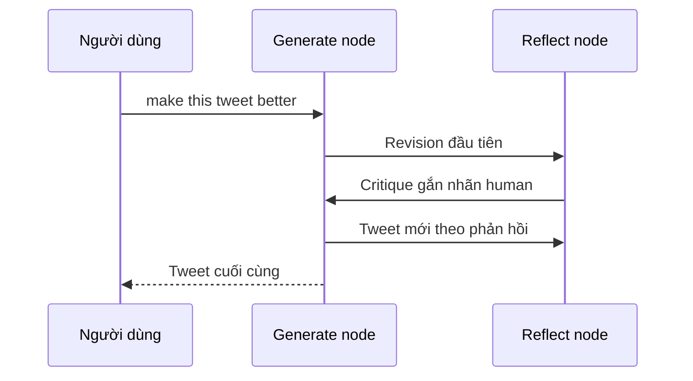

# 🔍 LangSmith Tracing: Chạy thử Reflection Agent và xem lại toàn bộ "hành trình" của LLM

> Nguồn: `014-LangSmith-Tracing.txt` · [Udemy](https://ua.udemy.com/course/langgraph/learn/lecture/43455438)

Chào các bạn, Eden đây! Graph đã sẵn sàng, giờ là lúc **test thật**. Trong bài này, chúng ta sẽ invoke graph với một input, rồi mở **LangSmith** để xem agent đã làm những gì qua từng bước.

### 🐦 Input đầu tiên: "Make this tweet better"

Mình để input là câu lệnh **"make this tweet better"**, kèm theo một chiếc tweet mình viết cách đây ít lâu về **tính năng tool calling mới của LangChain** — tính năng mang đến một **giao diện duy nhất (single interface) cho function calling**.

Đây là một cột mốc khá lớn, vì trước đó chỉ có **function của OpenAI** được hỗ trợ. Nhưng với interface thống nhất này, ta có thể dùng **Gemini, Anthropic Claude**, và bất kỳ model nào hỗ trợ function calling. Mình gọi `graph.invoke(...)` với input trên rồi để graph chạy — hãy xem nó "nói" gì về chiếc tweet này nhé.

---

### 📊 Mở trace trên LangSmith

Trong lúc graph đang thực thi, mình vào **LangSmith**, mở project **Reflection Agent** — ta thấy có một **trace đang chạy**. Chờ nó xong rồi mở ra xem, có vài điều rất đáng chú ý:

* Đầu tiên: trace **mất gần 20 giây** để chạy. Nghe có vẻ lâu, nhưng hoàn toàn hợp lý — chúng ta đã thực hiện **rất nhiều API call** tới LLM.
* Mình mở **prompt cuối cùng gửi cho LLM**: output ở đó chính là **chiếc tweet cuối cùng sau tất cả các vòng reflection**. Mình không phải chuyên gia bản quyền, nên điều mình muốn các bạn thấy là **quá trình** mà LLM đã đi để tới kết quả này.
* Xem prompt cuối là cách dễ nhất, vì nó đã chứa **toàn bộ lịch sử** và mọi tương tác giữa agent với LLM.

Trình tự trong trace diễn ra như sau:

1. Bắt đầu với **system message**: "bạn là một tech influencer với nhiệm vụ viết những bài đăng Twitter xuất sắc..." và một loạt hướng dẫn kèm theo.
2. Tiếp theo là câu lệnh của mình: **"make this tweet better"**.
3. **Generate node** tạo bản revision đầu tiên cho chiếc tweet.
4. Vì chưa hết số vòng lặp, graph đi sang **reflection node** — response nhận về từ LM, được gắn nhãn **human** một cách "nhân tạo", chính là phản hồi về chiếc tweet.
5. Ta quay lại **generate node** để sinh tweet mới theo phản hồi đó, và cứ thế lặp mãi... cho tới output cuối cùng.

Trình tự đó được LangSmith ghi lại thành một trace:

---

### 🧭 Observability dành riêng cho LangGraph

Điểm mình rất thích: ở cột bên trái, **LangChain cung cấp khả năng traceability (truy vết) và observability (quan sát) cho các đối tượng LangGraph**. Các bạn sẽ thấy cả hàm `should_continue`, các reflection node, và toàn bộ object LangGraph hiện diện ngay trong trace của mình.

Nhìn lại, chúng ta vừa triển khai **một phiên bản tinh gọn của thuật toán critiquing (phê bình và cải thiện)** bằng LangGraph. Hoàn toàn có thể làm điều này với LangChain, **nhưng hãy xem nó đơn giản đến nhường nào với LangGraph!**

### 🎯 Tự kiểm tra nhanh

**Câu 1:** Input của lần chạy thử là gì?

<b>Xem đáp án</b>

**Đáp án:** Câu lệnh "make this tweet better" kèm một chiếc tweet cũ về tính năng tool calling của LangChain.

Giải thích: Đây là nội dung được đưa vào `graph.invoke(...)`.

Tham chiếu: Mục Input đầu tiên.

**Câu 2:** Vì sao trace mất gần 20 giây?

<b>Xem đáp án</b>

**Đáp án:** Vì graph thực hiện rất nhiều API call tới LLM qua các vòng reflection.

Giải thích: Nghe lâu nhưng hoàn toàn hợp lý với số lần gọi model.

Tham chiếu: Mục Mở trace trên LangSmith.

**Câu 3:** Vì sao xem prompt cuối là cách dễ nhất để hiểu kết quả?

<b>Xem đáp án</b>

**Đáp án:** Vì prompt cuối đã chứa toàn bộ lịch sử và mọi tương tác giữa agent với LLM.

Giải thích: Output nằm trong prompt cuối chính là chiếc tweet sau tất cả các vòng.

Tham chiếu: Mục Mở trace trên LangSmith.

**Câu 4:** Trong trace, response của reflection node được gắn nhãn gì?

<b>Xem đáp án</b>

**Đáp án:** Nhãn human — theo cách "nhân tạo" mà logic của graph tạo ra.

Giải thích: Đây chính là phản hồi về chiếc tweet được feed ngược lại cho node generate.

Tham chiếu: Mục Mở trace trên LangSmith.

**Câu 5:** LangSmith hiển thị được những đối tượng LangGraph nào trong trace?

<b>Xem đáp án</b>

**Đáp án:** Hàm `should_continue`, các reflection node và toàn bộ object LangGraph.

Giải thích: LangChain cung cấp traceability và observability riêng cho các đối tượng LangGraph.

Tham chiếu: Mục Observability dành riêng cho LangGraph.

Các bạn vừa hoàn thành dự án Reflection Agent đầu tiên của mình đấy — một cột mốc đáng tự hào! Ở phần tiếp theo của khóa học, chúng ta sẽ tiếp tục nâng cấp kỹ thuật này lên một tầm cao mới. Hẹn gặp lại các bạn! 🚀

## Nguồn tham khảo

- [Udemy — LangSmith Tracing](https://ua.udemy.com/course/langgraph/learn/lecture/43455438)
- [LangSmith Docs — Trace LangGraph applications](https://docs.langchain.com/langsmith/trace-with-langgraph)
- [LangSmith Docs — Observability](https://docs.langchain.com/langsmith/observability)
