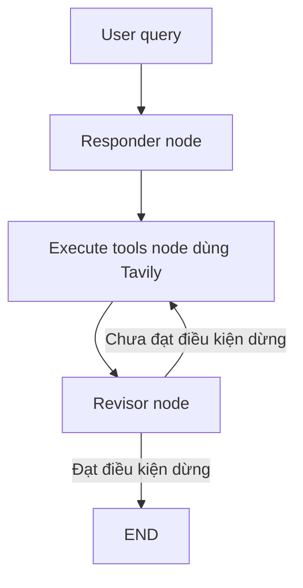

# 🧠 Reflexion Agent có "vũ khí": Xây dựng AI Agent biết tự tra cứu web và tự phê bình

> Nguồn: `016-What-are-we-building.txt` · [Udemy](https://ua.udemy.com/course/langgraph/learn/lecture/43511256)

Chào các bạn, mình là Eden đây! 👋 Trong section này, chúng ta sẽ cùng nhau xây dựng một **reflexion agent (agent phản chiếu)** — phiên bản nâng cấp của **reflection agent** mà các bạn đã gặp ở section trước. Lần này agent sẽ được trang bị thêm **tool**, cụ thể là một **search tool** có khả năng tìm kiếm dữ liệu thời gian thực (real-time data) trên internet để làm giàu câu trả lời.

Bên cạnh đó, mình sẽ giới thiệu những **kỹ thuật prompt engineering nâng cao** để agent có thể "tiêu hóa" phản hồi một cách chính xác và thực sự tiến bộ qua từng vòng lặp.

*Tạo ra một lời phê bình (critique) thì không khó. Cái khó là làm sao để LLM thực sự tận dụng lời phê bình đó và cải thiện dần qua từng vòng — đó mới là phần thách thức mà chúng ta sẽ cùng giải quyết.*

---

### 📄 Kiến trúc này đến từ đâu?

Kiến trúc chúng ta sắp xây dựng xuất phát từ bài báo mang tên **Reflection**, là công trình hợp tác giữa **Northeastern, MIT và Princeton**. Ý tưởng triển khai thì đến từ một **blog của đội ngũ LangChain**, nơi họ viết về reflection agent và áp dụng bài báo Reflection bằng **LangGraph**.

Mình phải nói thật: đội ngũ LangChain, đặc biệt là **Lance** bên LangChain, đã làm một công việc tuyệt vời. Nhưng với mình, phần implementation của họ khá khó hiểu — mình mất rất nhiều thời gian mới nắm được mạch chạy. Vì vậy mình đã **refactor lại một chút** cho dễ giải thích và dễ tiêu hóa hơn. Link gốc sẽ có trong phần **Resources** của video nhé!

---

### 🎯 Mục tiêu: Bài viết chất lượng cao, có nguồn, có vòng phê bình

Mục tiêu của reflexion agent lần này là tạo ra một **bài viết thật chi tiết** về một chủ đề cho trước, với ba yêu cầu:

1. **Tự động lấy dữ liệu liên quan từ web** để bài viết luôn mới.
2. **Có citation (trích dẫn)** cho dữ liệu tham khảo.
3. **Có vòng lặp phê bình chất lượng cao** — quality critique loop.

Ví dụ câu hỏi: **AI-powered SOC / autonomous SOC problem domain và những startup đã gọi vốn trong lĩnh vực này**. **Autonomous SOC** (Security Operations Center tự hành) đang bùng nổ và nhận rất nhiều sự chú ý. Ý tưởng là đưa **AI agent** vào **SOC** để bắt đầu xử lý các **tier-one ticket** và sự cố bảo mật — nhóm việc không đòi hỏi suy luận phức tạp, có thể dùng **tool bên ngoài** để phân loại (triage) và giải quyết, từ đó giải phóng rất nhiều thời gian cho các **SOC analyst**.

---

### 🗺️ Kiến trúc tổng thể — quen mà lạ

Kiến trúc trông rất giống **reflection agent** ở section trước, chỉ khác là có thêm **search engine** ở giữa:

* **Responder node:** tạo câu trả lời ban đầu, đồng thời sinh luôn một **critique** cho chính bài viết đó và **search term** — những truy vấn tối ưu để **ground (neo) output** với dữ liệu bên ngoài.
* **Execute tools node:** lấy các search query và dùng **search engine** để lấy kết quả thời gian thực.
* **Revisor node (bên duyệt lại):** nhận câu trả lời ban đầu kèm critique + kết quả tìm kiếm, chỉnh sửa bài viết, xử lý các góp ý từ bước trước, rồi cung cấp **critique mới**, **search term mới** và **citation** cho vòng tìm kiếm đầu tiên.
* Vòng lặp **search → revise** cứ thế tiếp diễn cho đến khi chạm **stopping condition (điều kiện dừng)**.

Toàn bộ vòng chạy gói gọn trong sơ đồ sau:

Còn đây là mức độ "nâng cấp" so với reflection agent ở section trước:

| Tiêu chí | Reflection agent | Reflexion agent |
|---|---|---|
| Nguồn dữ liệu | Kiến thức sẵn có của LLM | Thêm search engine lấy dữ liệu real-time |
| Tool | Không có | Function calling + Tavily |
| Citation | Không | Có trích dẫn cho dữ liệu tham khảo |
| Vòng lặp | Generate → reflect | Search → revise kèm critique từng vòng |

Công cụ mình chọn cho section này:

* **Model:** một phiên bản **GPT mini** — cần model đủ mạnh để viết nội dung và viết critique với khả năng suy luận tốt.
* **Function calling** — cực kỳ quan trọng trong implementation này.
* **Tavily** — search engine bên thứ ba, tối ưu hóa cho ứng dụng LLM, cho phép downstream kết quả về LLM rất dễ dàng.
* **LangSmith** — để tracing, vì kiến trúc phức tạp thì việc trace mượt mà là bắt buộc.

---

### 📂 Code nằm ở đâu?

Toàn bộ code của section này được host trên **GitHub** và cập nhật liên tục. Cách truy cập: vào **repository của khóa học**, chọn **branch reflection agent**. Mình xây branch này sao cho **mỗi commit tương ứng đúng một video** — cuối mỗi video, các bạn tìm code ở commit được link trong phần **Resources**.

### 🎯 Tự kiểm tra nhanh

**Câu 1:** Reflexion agent lần này nâng cấp gì so với reflection agent ở section trước?

<b>Xem đáp án</b>

**Đáp án:** Được trang bị thêm tool — cụ thể là search engine tìm dữ liệu thời gian thực.

Giải thích: Nhờ đó agent có thể ground (neo) câu trả lời bằng dữ liệu bên ngoài thay vì chỉ dựa vào kiến thức sẵn có.

Tham chiếu: Mục Mục tiêu.

**Câu 2:** Kiến trúc reflexion này xuất phát từ đâu?

<b>Xem đáp án</b>

**Đáp án:** Bài báo **Reflection** (Northeastern, MIT, Princeton) + blog của đội ngũ LangChain áp dụng bằng LangGraph.

Giải thích: Eden refactor lại implementation của LangChain cho dễ hiểu hơn; link gốc nằm trong phần Resources.

Tham chiếu: Mục Kiến trúc này đến từ đâu.

**Câu 3:** Responder node chịu trách nhiệm gì?

<b>Xem đáp án</b>

**Đáp án:** Tạo câu trả lời ban đầu, sinh critique cho chính bài viết và đề xuất search term.

Giải thích: Đây là node khởi đầu, cung cấp nguyên liệu cho các vòng search → revise sau đó.

Tham chiếu: Mục Kiến trúc tổng thể.

**Câu 4:** Ba yêu cầu của bài viết mục tiêu là gì?

<b>Xem đáp án</b>

**Đáp án:** Tự động lấy dữ liệu từ web, có citation, và có vòng lặp phê bình chất lượng cao.

Giải thích: Ví dụ là chủ đề AI-powered SOC / autonomous SOC cùng các startup gọi vốn.

Tham chiếu: Mục Mục tiêu.

**Câu 5:** Vì sao LangSmith là bắt buộc trong section này?

<b>Xem đáp án</b>

**Đáp án:** Vì kiến trúc phức tạp nên cần trace mượt mà để theo dõi từng vòng chạy.

Giải thích: Trace giúp nhìn rõ luồng search → revise diễn ra thế nào.

Tham chiếu: Mục Kiến trúc tổng thể.

*Đừng lo nếu kiến trúc nhìn có vẻ rối — chúng ta sẽ đi từng bước thật chậm rãi.* Video tiếp theo, mình sẽ cùng các bạn **setup project** với Python, Poetry và các biến môi trường nhé! 🚀

## Nguồn tham khảo

- [Udemy — What are we building?](https://ua.udemy.com/course/langgraph/learn/lecture/43511256)
- [LangChain Blog — Reflection Agents](https://www.langchain.com/blog/reflection-agents)
- [arXiv — Reflexion: Language Agents with Verbal Reinforcement Learning](https://arxiv.org/abs/2303.11366)
