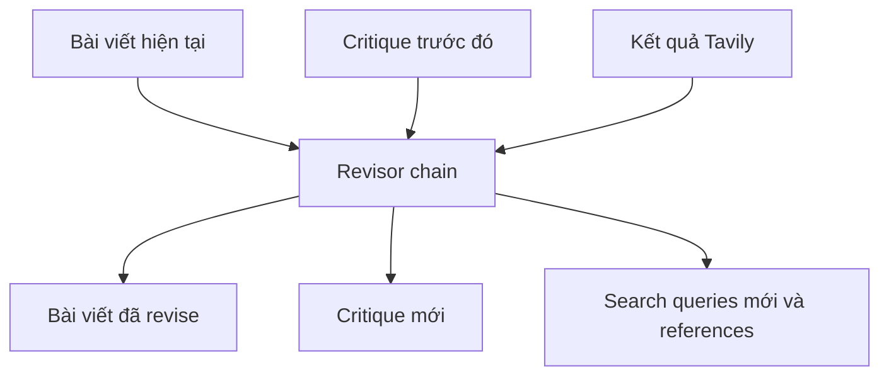

# 🔁 Revisor Agent: Vòng lặp "duyệt – sửa" nâng cấp bài viết qua từng vòng

> Nguồn: `019-Revisor-Agent.txt` · [Udemy](https://ua.udemy.com/course/langgraph/learn/lecture/43517754)

Chào các bạn, mình là Eden đây! 👋 Mình biết video trước khá dài, nhưng tin vui là video này **ngắn hơn rất nhiều**. Chúng ta sẽ implement **Reviser agent (bên duyệt lại)** — nhân vật chịu trách nhiệm nhận bản thảo mới nhất, dùng **critique** để sửa và trả về một bài viết tốt hơn.

Vì hạ tầng đã gần như hoàn chỉnh, công việc của chúng ta chỉ gồm hai việc: **thêm instruction vào prompt** và **tạo class mới cho response**.

---

### ✏️ Revision instructions — "đề bài" cho bên duyệt lại

Mình thêm một template mới chứa các chỉ dẫn revision:

1. **Revise your previous answer using the new information** — dùng thông tin mới để sửa câu trả lời trước.
2. Dùng critique trước đó để **bổ sung thông tin quan trọng**.
3. **Bắt buộc thêm numerical citations** vào câu trả lời đã sửa để đảm bảo có thể kiểm chứng.
4. Thêm **reference section** ở cuối bài (không tính vào word limit) dưới dạng các **URL**.
5. Dùng critique để **loại bỏ thông tin superfluous (thừa)**, đảm bảo bài không vượt quá **250 từ**.

Template này được "nhét" vào **actor prompt template** ở dòng 23, ngay tại placeholder **First Instruction**.

---

### 🧬 Class ReviseAnswer: kế thừa để mở rộng

Trong **schemas.py**, mình tạo class mới tên **ReviseAnswer**, kế thừa từ **AnswerQuestion** — nghĩa là nó có trọn vẹn các field **answer**, **reflection**, **search_queries**, và thêm một field mới:

* **references** — một **list of strings** chứa các citation URL, chủ yếu lấy từ **search engine**.

Vì kế thừa từ `AnswerQuestion` nên `ReviseAnswer` chỉ thêm đúng một field mới:

| Class | Kế thừa từ | Field | Vai trò |
|---|---|---|---|
| `AnswerQuestion` | Pydantic | answer, reflection, search_queries | Bản nháp đầu tiên của actor |
| `ReviseAnswer` | `AnswerQuestion` | thêm references | Bản đã sửa kèm citation URL |

*Còn search engine hoạt động ra sao thì mình sẽ để dành cho video sau — đừng lo nhé!*

---

### 🔗 Revision chain trong Chains.py

Quay lại **chains.py**, mình tạo chain mới theo đúng công thức cũ: lấy **actor prompt template**, điền **revision instructions** vào ô first instruction, rồi pipe vào **LLM GPT-4 Turbo** với **function calling**.

Điểm mấu chốt:

* Supply **tools = ReviseAnswer**.
* Đặt **tool_choice = "revise_answer"** — điều này **enforce (bắt buộc)** schema của Pydantic object **ReviseAnswer**, khiến LLM tuân thủ và **ground** câu trả lời đúng dạng object mong muốn.

Mình cũng import **ReviseAnswer** từ `schemas.py` (dòng 15) và thế là xong phần **Revisor**.

---

### 🎁 Tổng kết nhanh

Trong **Revisor node**, agent sẽ:

* Nhận kết quả từ **Tavily** với các search query liên quan.
* Kết hợp với bài viết hiện có và **critique đã được sinh ra**.
* **Revise** câu trả lời dựa trên critique, thêm dữ liệu tìm kiếm được.
* **Citate (trích dẫn)** toàn bộ nguồn tài liệu đã dùng từ internet.

Luồng vào/ra của node này có thể tóm tắt như sau:

### 🎯 Tự kiểm tra nhanh

**Câu 1:** Revisor node nhận những nguyên liệu nào để sửa bài?

<b>Xem đáp án</b>

**Đáp án:** Kết quả Tavily, bài viết hiện có và critique đã sinh ra từ trước.

Giải thích: Từ đó node revise câu trả lời, thêm dữ liệu mới và bổ sung citation.

Tham chiếu: Mục Tổng kết nhanh.

**Câu 2:** Revision instructions yêu cầu những gì?

<b>Xem đáp án</b>

**Đáp án:** Sửa câu trả lời bằng thông tin mới, bổ sung ý quan trọng, thêm numerical citations, thêm reference section dạng URL, và loại bỏ thông tin thừa.

Giải thích: Reference section không tính vào word limit; bài không vượt quá 250 từ.

Tham chiếu: Mục Revision instructions.

**Câu 3:** Class `ReviseAnswer` thêm field gì so với `AnswerQuestion`?

<b>Xem đáp án</b>

**Đáp án:** Field **references** — list of strings chứa citation URL từ search engine.

Giải thích: Nhờ kế thừa, class mới vẫn có đủ answer, reflection và search_queries.

Tham chiếu: Mục Class ReviseAnswer.

**Câu 4:** `tool_choice` trong revision chain được đặt là gì và để làm gì?

<b>Xem đáp án</b>

**Đáp án:** `"revise_answer"` — enforce schema Pydantic của `ReviseAnswer`, buộc LLM tuân thủ.

Giải thích: Nhờ đó câu trả lời được ground đúng dạng object mong muốn.

Tham chiếu: Mục Revision chain trong Chains.py.

**Câu 5:** Revision instruction xử lý critique cũ như thế nào?

<b>Xem đáp án</b>

**Đáp án:** Dùng critique để bổ sung thông tin quan trọng còn thiếu và loại bỏ thông tin superfluous (thừa).

Giải thích: Mục tiêu là bài viết cô đọng, không vượt quá 250 từ.

Tham chiếu: Mục Revision instructions.

Chúng ta vừa hoàn thành thêm một mảnh ghép quan trọng! Video tiếp theo, mình sẽ xử lý **tool executions** — toàn bộ phần web searching với **Tavily** — rồi truyền kết quả vào bài viết đã revise nhé! 🚀

## Nguồn tham khảo

- [Udemy — Revisor Agent](https://ua.udemy.com/course/langgraph/learn/lecture/43517754)
- [LangChain Blog — Reflection Agents](https://www.langchain.com/blog/reflection-agents)
- [LangChain Docs — Structured output](https://docs.langchain.com/oss/python/langchain/structured-output)
