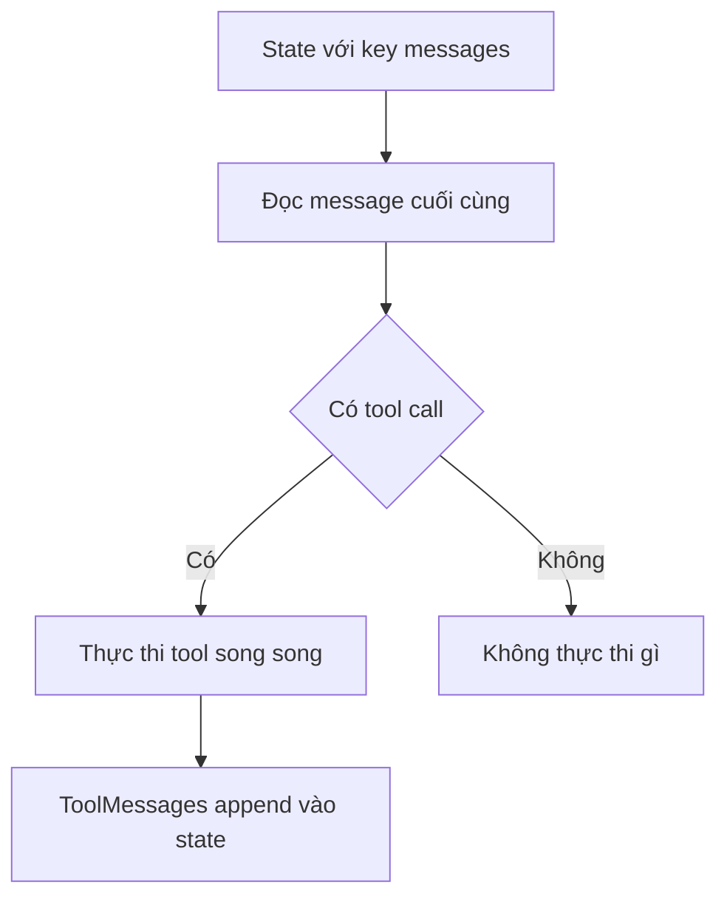

# 🔧 ToolNode: "Cỗ máy" thực thi tool giúp bạn tiết kiệm hàng tấn công việc

> Nguồn: `020-ToolNode---Executing-Tools.txt` · [Udemy](https://ua.udemy.com/course/langgraph/learn/lecture/49845787)

Chào các bạn, mình là Eden đây! 👋 Video này đánh dấu một cột mốc quan trọng: chúng ta sẽ implement **tool executor node** (node thực thi tool) — nhân vật nhận vào **AI message** chứa các **search query** mà agent muốn tra cứu, rồi chạy **Tavily** để mang về kết quả và thông tin thời gian thực từ internet.

Tin vui là sau video này, chúng ta sẽ có đủ **mọi mảnh ghép** cho graph và sẵn sàng dựng nó. Cùng vào code thôi!

---

### 🧰 Chuẩn bị "đồ nghề": file tool_executor.py và StructuredTool

Mình tạo file mới tên **`tool_executor.py`**, mở đầu bằng `load_dotenv` và nạp biến môi trường như thường lệ. Sau đó mình import **`TavilySearch`** từ **`langchain_tavily`** — nhớ cài package bằng `poetry add langchain-tavily` và chuẩn bị **Tavily API key** trong file `.env` nhé.

*Mình có copy API key của mình vào file `.env` để demo, nhưng các bạn đừng lo — mình đã **revoke (thu hồi)** toàn bộ key sau khi quay xong video này!*

Tiếp theo là **`StructuredTool`** — class của LangChain cho phép biến một **Python function** thành **tool** mà LLM có thể dùng. Nó cung cấp cho LLM một **structured schema (lược đồ có cấu trúc)** của function, giúp LLM hiểu đúng cách sử dụng tool này.

Cuối cùng, mình import **`ToolNode`** từ LangGraph, cùng hai class **`AnswerQuestion`** và **`ReviseAnswer`** đã xây dựng ở các video trước.

---

### 🧠 ToolNode: class "đỡ việc" đỉnh nhất mà LangGraph dành cho bạn

`ToolNode` là một class cực hay vì nó **tiết kiệm cho chúng ta hàng tấn công việc**. Đây là một **node (nút)** trong LangGraph mà ta có thể invoke, và khi chạy nó sẽ:

1. Nhìn vào **state (trạng thái)** ở key **`messages`**.
2. Kiểm tra **message cuối cùng**.
3. Xem LLM có quyết định **tool call** nào không.
4. Nếu có, nó **thực thi đúng tool đó** — thậm chí chạy **song song (parallel)** nhiều tool một lúc.

*Trước đây, mọi thứ phải tự làm bằng tay.* Mình từng làm đúng như vậy trong phiên bản gốc của khóa học, nên mình giữ lại phần implementation thủ công đó dưới dạng **bài optional** — để các bạn thấy tận mắt `ToolNode` đã "gánh" giúp chúng ta những gì.

---

### ✨ Chiêu hay: một search engine, hai tool, hai cái tên

Mình khởi tạo object `TavilySearch` với **`max_results=5`** — đơn giản để mỗi query trả về 5 kết quả. Object này cho ta một **LangChain tool** bọc sẵn chức năng của search engine.

Nhưng mình không dùng nó "trần" như mọi khi. Từ chính tool đó, mình tạo ra **hai tool khác nhau** — cùng chung chức năng Tavily search nhưng **khác tên**, vì chúng phục vụ hai mục đích trong workflow:

* **`answer_question`** — dùng ở **giai đoạn research ban đầu**, khi agent trả lời câu hỏi lần đầu.
* **`revise_answer`** — dùng ở **giai đoạn revision**, khi agent cải thiện câu trả lời dựa trên **reflection**.

Hai tool chạy chung một function nhưng khác tên, để hệ thống phân biệt rõ giai đoạn:

| Tool | Giai đoạn dùng | Mục đích |
|---|---|---|
| `answer_question` | Research ban đầu | Trả lời câu hỏi lần đầu |
| `revise_answer` | Revision | Cải thiện câu trả lời theo reflection |

Về lý thuyết, dùng một tool duy nhất cũng chạy được. Nhưng **hai cái tên riêng** giúp hệ thống biết chính xác **search được kích hoạt ở giai đoạn nào** — research ban đầu hay research để revise — nhờ đó việc **debug và đánh giá câu trả lời** trở nên dễ dàng hơn nhiều.

---

### 🧩 Lắp ráp: run_queries, StructuredTool.from_function và ToolNode

"Ngôi sao" của file là function **`run_queries`**, nhận vào **`search_queries`** — một **list of strings** — với description *"run the generated queries"*. Mình thêm cả `**kwargs` vào chữ ký hàm để nếu LLM truyền thêm giá trị nào khác thì cũng không bị lỗi.

Phần implementation rất gọn: mình chạy tool search trên các query và dùng phương thức **`batch`** để thực thi chúng **đồng thời (concurrently)** thay vì lần lượt.

Từ function này, **`StructuredTool.from_function`** giúp mình "đúc" ra hai tool với đầy đủ **schema và description**:

* Tool thứ nhất mang tên của class **`AnswerQuestion`**.
* Tool thứ hai chạy **cùng function** nhưng mang tên của class **`ReviseAnswer`**.

Cả hai đều chạy chung `run_queries`, và mình lấy **tên class** để đặt tên tool — đó chính là lý do ta cần hai object này.

Cuối cùng, mình khởi tạo object **`ToolNode`** và truyền vào **list hai tool** vừa tạo. Từ giờ, node này sẽ tự soi state, kiểm tra message cuối và thực thi đúng tool call liên quan.

Mình format code, commit lên **branch reflection agent** của repository — như mọi khi, commit của video này nằm trong phần **Resources** nhé.

### 🎯 Tự kiểm tra nhanh

**Câu 1:** `ToolNode` tự động làm những bước nào?

<b>Xem đáp án</b>

**Đáp án:** Nhìn state ở key `messages` → kiểm tra message cuối → xem có tool call không → nếu có thì thực thi, thậm chí chạy song song nhiều tool.

Giải thích: Nhờ vậy ta không phải tự viết logic thực thi tool bằng tay.

Tham chiếu: Mục ToolNode.

**Câu 2:** Vì sao tạo hai tool khác tên từ cùng một `TavilySearch`?

<b>Xem đáp án</b>

**Đáp án:** Để biết chính xác search được kích hoạt ở giai đoạn nào — research ban đầu hay revision.

Giải thích: Điều này giúp debug và đánh giá câu trả lời dễ dàng hơn nhiều.

Tham chiếu: Mục Chiêu hay.

**Câu 3:** `max_results=5` có ý nghĩa gì?

<b>Xem đáp án</b>

**Đáp án:** Mỗi query Tavily trả về tối đa 5 kết quả.

Giải thích: Object `TavilySearch` bọc sẵn chức năng search engine thành một LangChain tool.

Tham chiếu: Mục Chiêu hay.

**Câu 4:** `StructuredTool.from_function` giúp gì cho function `run_queries`?

<b>Xem đáp án</b>

**Đáp án:** Biến Python function thành tool có đầy đủ schema và description để LLM dùng đúng cách.

Giải thích: Từ đó "đúc" ra hai tool mang tên hai class `AnswerQuestion` và `ReviseAnswer`.

Tham chiếu: Mục Lắp ráp.

**Câu 5:** Vì sao `run_queries` thêm `**kwargs` vào chữ ký hàm?

<b>Xem đáp án</b>

**Đáp án:** Để nếu LLM truyền thêm giá trị nào khác thì hàm cũng không bị lỗi.

Giải thích: Implementation chạy tool search và dùng `batch` để thực thi đồng thời các query.

Tham chiếu: Mục Lắp ráp.

Vậy là toàn bộ "đồ nghề" đã sẵn sàng, chúng ta có thể dựng graph được rồi! Còn một món quà nhỏ: trong các bài **optional** kế tiếp, mình sẽ đưa các bạn về "thời kỳ đồ đá" — tự tay viết tool executor mà không có `ToolNode` — để bạn thấy rõ giá trị của nó. Hẹn gặp lại! 🚀

## Nguồn tham khảo

- [Udemy — ToolNode - Executing Tools](https://ua.udemy.com/course/langgraph/learn/lecture/49845787)
- [LangGraph Reference — ToolNode](https://reference.langchain.com/python/langgraph.prebuilt/tool_node)
- [Tavily Docs — Welcome](https://docs.tavily.com/)
