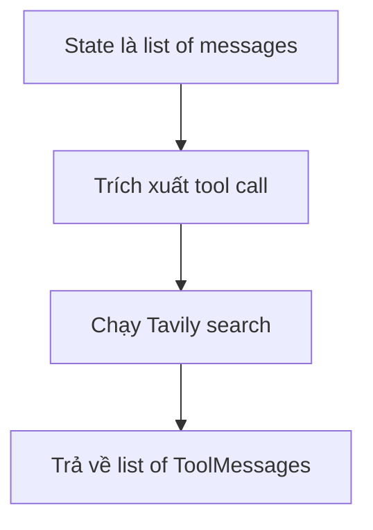

# 🕰️ Tool Executor thời "tiền ToolNode" (Phần A): Tự tay viết execute_tools

> Nguồn: `021-Optional-Tool-Executor-Agent-Part-A--Life-Before-ToolNode.txt` · [Udemy](https://ua.udemy.com/course/langgraph/learn/lecture/43547862)

Chào các bạn, mình là Eden đây! 👋 Trong hai bài tới, chúng ta sẽ cùng implement **tool executor node** (node thực thi tool) — nơi nhận **AI message** chứa các **search query** mong muốn rồi chạy **Tavily** để lấy kết quả và thông tin thời gian thực từ web.

Điểm đặc biệt: đây là các bài **optional**. Chúng ta sẽ quay về "cuộc sống trước khi có `ToolNode`" để tự tay viết từng dòng, qua đó hiểu sâu bản chất và thấy rõ `ToolNode` đã tiết kiệm cho mình những gì. Sau bài này, mọi component của graph đã sẵn sàng.

---

### 🏗️ Boilerplate và những import quen thuộc

Mình tạo file mới tên **`tool_executor.py`** và viết phần boilerplate cơ bản: `if __name__ == "__main__"` rồi print thử vài chữ để chạy **sanity check** — thấy output hiện ra là biết setup ổn.

Sau đó là import **`load_dotenv`** và nạp biến môi trường như mọi khi. Rồi mình import ba thứ cần cho bài này:

* **`List`** từ `typing`.
* **`BaseMessage`** từ LangChain.
* **`ToolMessage`** — class đại diện cho **kết quả của một lần thực thi tool**, thứ mà ta muốn **downstream (truyền tiếp) cho LLM**.

---

### 🎯 execute_tools: "trái tim" của video

"Ngôi sao" của bài chính là function **`execute_tools`**. Hợp đồng (contract) của nó rất rõ ràng:

1. Nhận vào **`state`** — đơn giản là một **list of messages**.
2. **Trích xuất** ra những tool cần thực thi từ các message đó.
3. **Chạy** chúng.
4. **Trả về** một **list of ToolMessages**.

Trong kiến trúc của chúng ta, function này sẽ chạy **Tavily search tool** với những **search query** đã được sinh ra ở bước trước.

---

### 🧪 Dummy state: "kính hiển vi" soi internals

Trước khi implement, mình tạo một **dummy state object** — state giả có sẵn dữ liệu — để việc **debug và hiểu internals** của các object dễ dàng hơn nhiều.

Khi graph chạy, nó luôn bắt đầu bằng một **HumanMessage**. Message ví dụ của mình: *"write about AI-powered SOC / autonomous SOC and list startups that raised capital in this domain"*.

Để ý nhé: trong kiến trúc, **trước khi tới được execute tools node**, chúng ta đã có **initial response**, tức là trong tay đã có một object **`AnswerQuestion`** với các field:

* **`answer`** — có thể để rỗng, vì `execute_tools` không cần dùng tới.
* **`reflection`** — cũng chưa cần giá trị thực ở bước này.
* **`search_queries`** — đây mới là thứ quan trọng: một **list**, mỗi phần tử là một **search query** sẽ được chạy qua Tavily, hy vọng mang về kết quả tốt để đưa vào bài viết.
* **`id`** — được **LLM vendor sinh tự động** khi dùng **function calling**, để sau này ta **nối kết quả thực thi với đúng function-calling request** đã tạo ra nó.

---

### 🐞 Gọi hàm và chạy debug để nhìn tận mắt

Giờ mình gọi **`execute_tools`** với dummy state vừa chuẩn bị: phần tử đầu là **HumanMessage**, phần tử thứ hai là **AIMessage** có content giống hệt những gì ta thấy trên **LangSmith tracing**. Content thực ra không quan trọng, cái mình quan tâm là field **`tool_calls`** — ở đây mình truyền tool call của class `AnswerQuestion`, thứ giúp ta có **structured output**.

Điều duy nhất mình thực sự cần trong dummy state là **`search_queries`**. Nên mình "đảo ngược" object `AnswerQuestion` về **raw format** — tức trạng thái trước khi nó được **output parse thành Pydantic object**: `content` để rỗng, tên trong `tool_calls` là **tên class**, `args` là chính object ở dạng **dict**, và `id` giữ nguyên id ban đầu.

Hai dạng representation này khác nhau ở chỗ:

| Dạng | Kiểu dữ liệu | Đặc điểm |
|---|---|---|
| Raw trong `tool_calls` | dictionary | `args` là object dạng dict, `content` rỗng, giữ nguyên `id` |
| Pydantic object | `AnswerQuestion` | Kết quả sau output parse, truy cập được attribute |

Mình import **`AIMessage`**, in thử kết quả và nhận về **`None`** — hoàn toàn đúng như mong đợi, vì function chưa được implement. Sau đó mình thêm vào **dòng 12** một dòng quan trọng: **`tool_invocation: AIMessage = state[-1]`** — giả định rằng message cuối cùng trước khi tới execute tools node luôn là **AI message chứa function calling**.

Mình đặt **breakpoint** và chạy **debug** để soi input của state. State là một **list gồm hai object**: HumanMessage về autonomous SOC, và AI message có chứa **`tool_calls`** cùng **`args`** — y hệt những gì mình thấy trên LangSmith. Đó chính là dữ liệu mà function của chúng ta sẽ xử lý.

### 🎯 Tự kiểm tra nhanh

**Câu 1:** Hợp đồng (contract) của function `execute_tools` gồm những bước nào?

<b>Xem đáp án</b>

**Đáp án:** Nhận state (list of messages) → trích xuất tool cần chạy → chạy chúng → trả về list of ToolMessages.

Giải thích: Trong kiến trúc này, function chạy Tavily search với các search query đã sinh ở bước trước.

Tham chiếu: Mục execute_tools.

**Câu 2:** Vì sao tạo dummy state object trước khi implement?

<b>Xem đáp án</b>

**Đáp án:** Để việc debug và hiểu internals của các object dễ dàng hơn nhiều.

Giải thích: Khi graph chạy, state luôn bắt đầu bằng một HumanMessage.

Tham chiếu: Mục Dummy state.

**Câu 3:** Trong dummy state, field nào của `AnswerQuestion` mới thực sự cần thiết?

<b>Xem đáp án</b>

**Đáp án:** `search_queries` — danh sách query sẽ được chạy qua Tavily.

Giải thích: `answer` có thể để rỗng, `reflection` chưa cần giá trị thực ở bước này.

Tham chiếu: Mục Dummy state.

**Câu 4:** Field `id` được sinh ra khi nào và dùng để làm gì?

<b>Xem đáp án</b>

**Đáp án:** Được **LLM vendor sinh tự động** khi dùng function calling, để nối kết quả thực thi với đúng function-calling request đã tạo ra nó.

Giải thích: Vì vậy khi đảo về raw format, `id` phải giữ nguyên.

Tham chiếu: Mục Dummy state.

**Câu 5:** Dòng `tool_invocation: AIMessage = state[-1]` ngầm định điều gì?

<b>Xem đáp án</b>

**Đáp án:** Message cuối cùng trước khi tới execute tools node luôn là AI message chứa function calling.

Giải thích: Đó là dữ liệu mà function sẽ xử lý, có `tool_calls` và `args` y hệt trên LangSmith.

Tham chiếu: Mục Gọi hàm và chạy debug.

Ở bài tiếp theo (Phần B), mình sẽ **lấy các search query ra, chạy Tavily** trên chúng và xuất kết quả. *Nếu phần internals này hơi xoắn não, cứ xem lại từ từ — đây là nền tảng để hiểu `ToolNode` sau này.* Hẹn gặp lại các bạn! 🚀

## Nguồn tham khảo

- [Udemy — Tool Executor Agent (Part A): Life Before ToolNode](https://ua.udemy.com/course/langgraph/learn/lecture/43547862)
- [LangGraph Reference — ToolNode](https://reference.langchain.com/python/langgraph.prebuilt/tool_node)
- [LangChain Blog — Reflection Agents](https://www.langchain.com/blog/reflection-agents)
