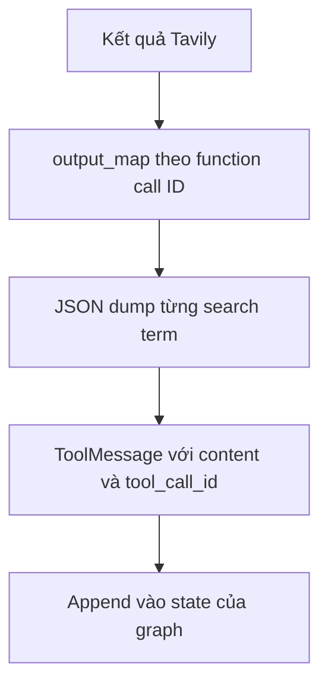

# 🧰 Tool Executor Agent (Phần C): "Đóng gói" kết quả Tavily thành ToolMessage

> Nguồn: `023-Optional-Tool-Executor-Agent-Part-C--Life-Before-ToolNode.txt` · [Udemy](https://ua.udemy.com/course/langgraph/learn/lecture/43561296)

Chào các bạn, mình là Eden đây! 👋 Chúng ta đã đi gần hết chặng đường của **tool executor node**, và hôm nay là phần cuối: "massage" kết quả tìm kiếm rồi biến chúng thành **giá trị trả về** đúng chuẩn. Sau video này, mọi "mảnh ghép chuyển động" sẽ sẵn sàng để lắp thành một **LangGraph graph** hoàn chỉnh — Reflexion Agent của chúng ta đang ở rất gần đích!

Mục tiêu của video rất gọn: lấy output từ **Tavily** và transform toàn bộ thành một **return value** — cụ thể là một **list of messages** chỉ chứa đúng **một tool message**, với field **content** bên trong là một chuỗi **JSON**.

---

### 🎯 Giá trị trả về sẽ trông như thế nào?

Khi load JSON đó ra, các bạn sẽ thấy nội dung của nó là một **dictionary**:

* Mỗi **key** là một **search term (từ khóa tìm kiếm)** chúng ta muốn tra cứu.
* Mỗi **value** là **kết quả tìm kiếm từ Tavily** — bao gồm phần **content (nội dung tóm tắt)** và **URL gốc** của bài viết.

Đây chính là thứ chúng ta sẽ output từ function, bởi function trả về một list các message kế thừa từ **BaseMessage** của LangChain. List này sau đó sẽ được **append vào state của graph**, và phần parsing "hơi khô khan" này khép lại toàn bộ logic cần thiết để ráp graph.

---

### 🗺️ Output Map: cấu trúc dữ liệu "nhiều tầng"

Mình tạo một dictionary mới tên là **output_map**, với luật chơi như sau:

* **Key** là **ID của function call** — trong trường hợp này chỉ có duy nhất một key, chính là **function calling ID** chúng ta có được từ trước.
* **Value** là một **dictionary** khác: key là **search term**, value là **list các string** — mỗi phần tử là một kết quả tìm kiếm.

Cấu trúc "nhiều tầng" này nhìn qua một bảng cho dễ hình dung:

| Tầng | Key | Value |
|---|---|---|
| 1 | Function call ID | Dictionary các search term |
| 2 | Search term | List kết quả tìm kiếm từ Tavily |
| Đầu ra cuối | `tool_call_id` | Content JSON chứa term, URL và nội dung tóm tắt |

Hãy đặt breakpoint và xem thử: **output_map** đúng là dictionary một key, value của nó là dict chứa các search term, và mỗi term trỏ tới một list kết quả. *Nghe có vẻ nhiều tầng và khá phức tạp, nhưng cứ "bóc" từng lớp một là các bạn sẽ thấy logic rất rõ ràng.*

---

### 📦 Wrap thành ToolMessage và kiểm tra "thành quả"

Đến bước cuối cùng: gói tất cả lại thành **tool message**. Mình tạo một list tên **tool_messages**, rồi **iterate** qua tầng đầu tiên của cấu trúc dữ liệu — với trường hợp này, vòng lặp chỉ chạy **đúng một lần**, vì chỉ có một function calling ID và một mapped output.

* Vì sao vẫn dùng list cho "hoành tráng"? Để solution **robust (mạnh mẽ, dễ mở rộng)** hơn: nếu sau này có vài tool cùng được gọi, chúng ta đã sẵn sàng xử lý.
* Mỗi vòng lặp, mình **append** một **ToolMessage object** có `content` là kết quả đã **JSON dump**, kèm **tool_call_id** bằng đúng ID gốc ban đầu.

Luồng đóng gói kết quả để trả về state của graph:

Chạy debug để xem thứ được trả về — nó sẽ được **thêm vào state của graph**. Kết quả: **tool_messages** là list chỉ có một phần tử, với tool_call_id khớp chính xác **function calling ID** mà chúng ta nhận từ LLM. Truy cập phần tử đầu tiên, mở field **content** và load lại thành JSON, các bạn sẽ thấy trọn bộ search term cùng kết quả từ Tavily: phần **nội dung tóm tắt** và **URL nguồn**.

### 🎯 Tự kiểm tra nhanh

**Câu 1:** Giá trị trả về cuối cùng của `execute_tools` là gì?

<b>Xem đáp án</b>

**Đáp án:** Một list of messages chỉ chứa đúng **một ToolMessage**, với `content` là chuỗi JSON.

Giải thích: List này sau đó được append vào state của graph.

Tham chiếu: Đoạn mở đầu.

**Câu 2:** Tầng đầu tiên của `output_map` có key và value là gì?

<b>Xem đáp án</b>

**Đáp án:** Key là **function call ID**, value là dictionary với key search term và value là list kết quả.

Giải thích: Trường hợp này chỉ có một key vì chỉ có một function call.

Tham chiếu: Mục Output Map.

**Câu 3:** Vì sao vẫn dùng list dù vòng lặp chỉ chạy một lần?

<b>Xem đáp án</b>

**Đáp án:** Để solution robust hơn — nếu sau này có vài tool cùng được gọi thì đã sẵn sàng xử lý.

Giải thích: Đây là cách viết phòng xa cho tương lai.

Tham chiếu: Mục Wrap thành ToolMessage.

**Câu 4:** `tool_call_id` của ToolMessage cần khớp với gì?

<b>Xem đáp án</b>

**Đáp án:** Khớp chính xác với **function calling ID** mà LLM đã trả về từ trước.

Giải thích: Nhờ đó kết quả thực thi được nối đúng với nguồn gốc của nó.

Tham chiếu: Mục Wrap thành ToolMessage.

**Câu 5:** Khi load JSON từ `content` ra, ta thấy gì?

<b>Xem đáp án</b>

**Đáp án:** Trọn bộ search term cùng kết quả Tavily — gồm nội dung tóm tắt và URL nguồn.

Giải thích: Mỗi key là một search term, mỗi value là danh sách kết quả.

Tham chiếu: Mục Giá trị trả về.

Và thế là xong! **Logic cho execute tools node đã hoàn tất.** Việc còn lại duy nhất là kết nối mọi thứ và dựng nên graph — chúng ta sẽ có một **Reflexion Agent** hoàn chỉnh. Hẹn gặp các bạn ở video tiếp theo nhé! 🚀

## Nguồn tham khảo

- [Udemy — Tool Executor Agent (Part C): Life Before ToolNode](https://ua.udemy.com/course/langgraph/learn/lecture/43561296)
- [Tavily Docs — API Reference](https://docs.tavily.com/documentation/api-reference)
- [LangChain Blog — Reflection Agents](https://www.langchain.com/blog/reflection-agents)
