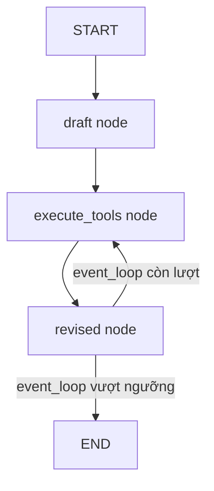

# 🕸️ Building Our LangGraph Graph: Ghép mọi mảnh ghép thành Reflexion Agent hoàn chỉnh

> Nguồn: `024-NEW-Building-Our-LangGraph-Graph.txt` · [Udemy](https://ua.udemy.com/course/langgraph/learn/lecture/54152097)

Chào các bạn, mình là Eden đây! 👋 Đây là video được **quay lại (refilmed)** để khớp với phiên bản LangGraph mới nhất — bản mình dùng là **1.0.5**, và toàn bộ nội dung được cập nhật theo **LangGraph 1.x+**. Chúng ta sẽ cùng mở `main.py`, assemble mọi mảnh ghép và dựng nên **graph hoàn chỉnh** cho Reflexion Agent.

---

### 📥 Imports, state và "nút thắt" MAX_ITERATIONS

Đầu tiên là các import:

* **Literal** từ `typing`.
* **AIMessage** và **ToolMessage** — hai loại message chúng ta sẽ làm việc.
* Từ `langgraph`: **START**, **END** và **StateGraph**.
* **MessagesState** — vì state graph của chúng ta chỉ chứa một **list of messages**. Ở section Reflection Agent, chúng ta từng tự tay implement "message state" này; lần này có thể import sẵn từ **`langgraph.prebuilt`** cho gọn.
* Từ **`chains.py`**: **first responder chain** và **Revisor chain**; từ **`tool_executor.py`**: node **execute tools** — thực chất là một **ToolNode**, chuyên chạy các tool (search tool của chúng ta) **concurrently (song song)**.

```python
from typing import Literal
from langchain_core.messages import AIMessage, ToolMessage
from langgraph.graph import END, START, StateGraph
from langgraph.prebuilt import MessagesState

MAX_ITERATIONS = 2
```

Biến **MAX_ITERATIONS = 2** nghĩa là chỉ cho phép **tối đa hai vòng revision**. Đây là một **heuristic**, chưa phải cách làm hay nhất: muốn nâng cấp, ta có thể tích hợp kiến trúc **LLM as a judge** — thay vì giới hạn bằng con số, hãy để một **LLM call** tự quyết định có nên chạy tiếp hay không. Cách này sẽ xuất hiện ở **section tiếp theo**, nơi chúng ta xây một **agentic solution**.

---

### 🧱 Hai node chính: draft và revised

**Draft node** nhận **state** (list of messages) và gọi **first responder chain**, truyền toàn bộ messages vào key `messages`. Ở lần chạy đầu tiên, message đầu vào chính là **human message** chứa input của người dùng.

Response trả về có dạng **AnswerQuestion**, gồm ba phần: **answer** (câu trả lời), **reflection** (điều gì cần thay đổi, còn thiếu gì, còn thừa gì) và **search_queries** (những truy vấn sẽ được tìm kiếm ở bước sau). Nhận xong, mình **append message này vào state**.

**Revised node** làm việc tương tự: gọi **Revisor chain** với toàn bộ messages hiện có, sửa câu trả lời dựa trên **kết quả tool** — chính là những **critique có cấu trúc Pydantic** — rồi cũng **append vào state của graph**.

Đối chiếu nhanh vai trò của ba node:

| Node | Nhiệm vụ | Ghi chú |
|---|---|---|
| `draft` | Gọi first responder chain, tạo `AnswerQuestion` | Nhận input người dùng |
| `execute_tools` | ToolNode chạy các search song song | Không gọi LLM nên không tính vào tool call |
| `revised` | Gọi Revisor chain, sửa bài theo critique + tool results | Sinh `ReviseAnswer` kèm references |

---

### 🔀 Conditional edge "event_loop": đếm tool call để dừng vòng lặp

Vì dùng **function calling** để ép **structured output**, mỗi **tool call** thực chất là một **LLM response**. Điều này cho chúng ta cách đếm số vòng lặp:

1. Gọi **responder** → **một** tool call.
2. **Execute tools** → đây là **ToolNode**, không có LLM nào gọi tool, nên **không tính**.
3. Gọi **Revisor chain** → sinh thêm **một** tool call.

Quy tắc: nếu **tổng số tool call > 2** thì dừng (**END**), ngược lại đi tiếp tới **execute tools**. Mình implement thành **conditional edge** tên **event_loop**: iterate qua các message, đếm số tool call, rồi trả về một trong hai giá trị — **execute tools** hoặc **END**. Nhờ đó vòng lặp chỉ chạy đúng **hai vòng**.

---

### 🕸️ Lắp ráp graph, compile và chạy thử

Mình khởi tạo **StateGraph** với **MessagesState**, thêm ba node rồi nối các edge theo đúng kiến trúc:

```python
graph = StateGraph(MessagesState)

graph.add_node("draft", draft_node)
graph.add_node("execute_tools", execute_tools_node)
graph.add_node("revised", revised_node)

graph.add_edge(START, "draft")
graph.add_edge("draft", "execute_tools")
graph.add_edge("execute_tools", "revised")

graph.add_conditional_edges("revised", event_loop, ["execute_tools", END])

graph = graph.compile()
print(graph.get_graph().draw_mermaid())
```

Từ **START**, graph đi vào **draft** để nhận input người dùng. Sau đó là chuỗi quen thuộc: **draft → execute_tools → revised**, rồi từ **revised** rẽ nhánh có điều kiện — hoặc kết thúc, hoặc quay lại tìm kiếm và revise theo truy vấn mới. Tham số thứ ba của `add_conditional_edges` là **list các node** có thể chạy sau nhánh điều kiện; các giá trị này phải **khớp với những gì event_loop trả về**, đồng thời giúp bản vẽ graph hiển thị rõ ràng. Mình **compile** graph rồi **print với mermaid**, copy sang **mermaid.live** để xem toàn bộ luồng chạy.



Giờ hãy invoke thử:

```python
graph.invoke({"messages": [{"role": "user", "content": "Write about AI-Powered SOC, autonomous SOC problem domain, list startups that have raised capital on that"}]})
```

Ta truyền vào một **dictionary** với key `messages`. Với `role: "user"`, LangChain sẽ tự **cast thành HumanMessage**, và phần `content` là câu hỏi demo quen thuộc về **AI-powered SOC / autonomous SOC**.

Chạy debug, mình kiểm tra response: message cuối cùng là một **AI message** chứa **tool call**, và trong `args` chính là **câu trả lời đã revise**. Muốn in đẹp, chỉ cần: kiểm tra message cuối là AI message và có tool call → lấy tool call đầu tiên (vì chỉ có một) → vào `args` → đọc key **answer**, rồi in toàn bộ messages còn lại.

Và đây là kết quả! Bài viết in ra khá chi tiết: **AI-powered SOC** giảm **false positive tới 50%**, tự động hóa **70% cảnh báo thường ngày**, cắt thời gian điều tra **70–90%**; **autonomous SOC** xử lý phản hồi rủi ro thấp như **cách ly email, cô lập endpoint, cấu hình lại firewall**, kéo **dwell time** và **MTTR** xuống **dưới 5 phút**. Danh sách startup cũng được chia theo **maturity tier**: **leaders** có Darktrace, **scale-ups** có Exabeam và Cybereason, **innovators** có Deep Instinct hay Blue Mirror. *Một câu trả lời có số liệu, có citation — đúng tinh thần Reflexion!*

### 🎯 Tự kiểm tra nhanh

**Câu 1:** `MAX_ITERATIONS = 2` nghĩa là gì và đây có phải cách làm tốt nhất không?

<details>
<summary><b>Xem đáp án</b></summary>

**Đáp án:** Chỉ cho phép tối đa hai vòng revision; đây chỉ là một **heuristic**, chưa phải cách hay nhất.

Giải thích: Muốn nâng cấp có thể dùng **LLM as a judge** — để LLM tự quyết định có chạy tiếp hay không, sẽ xuất hiện ở section sau.

Tham chiếu: Mục MAX_ITERATIONS.

</details>

**Câu 2:** Vì sao mỗi tool call được tính như một LLM response?

<details>
<summary><b>Xem đáp án</b></summary>

**Đáp án:** Vì ta dùng **function calling** để ép **structured output** — mỗi tool call là kết quả của một lần gọi LLM.

Giải thích: Nhờ đó có thể đếm số vòng lặp qua số tool call.

Tham chiếu: Mục Conditional edge event_loop.

</details>

**Câu 3:** Conditional edge `event_loop` đếm gì và dừng vòng lặp khi nào?

<details>
<summary><b>Xem đáp án</b></summary>

**Đáp án:** Đếm tổng số tool call trong các message; nếu **> 2** thì trả về **END**, ngược lại tới **execute_tools**.

Giải thích: Execute tools là ToolNode nên không có LLM call, không được tính.

Tham chiếu: Mục Conditional edge event_loop.

</details>

**Câu 4:** Tham số thứ ba của `add_conditional_edges` có vai trò gì?

<details>
<summary><b>Xem đáp án</b></summary>

**Đáp án:** Liệt kê các node có thể chạy sau nhánh điều kiện — phải khớp giá trị `event_loop` trả về và giúp vẽ graph rõ ràng.

Giải thích: Ở đây là `["execute_tools", END]`.

Tham chiếu: Mục Lắp ráp graph.

</details>

**Câu 5:** `MessagesState` trong phiên bản mới được lấy từ đâu?

<details>
<summary><b>Xem đáp án</b></summary>

**Đáp án:** Import sẵn từ `langgraph.prebuilt`.

Giải thích: Ở section Reflection Agent trước, ta tự tay implement message state; lần này dùng đồ có sẵn cho gọn.

Tham chiếu: Mục Imports, state.

</details>

Vậy là chúng ta đã có một **Reflexion Agent** hoàn chỉnh chạy bằng LangGraph phiên bản mới. Video tiếp theo, mình sẽ mở **LangSmith** và mổ xẻ từng bước chạy của nó nhé! 🚀

## Nguồn tham khảo

- [Udemy — [NEW] Building Our LangGraph Graph](https://ua.udemy.com/course/langgraph/learn/lecture/54152097)
- [LangGraph Docs — Overview](https://docs.langchain.com/oss/python/langgraph)
- [LangChain Reference — langgraph](https://reference.langchain.com/python/langgraph)
