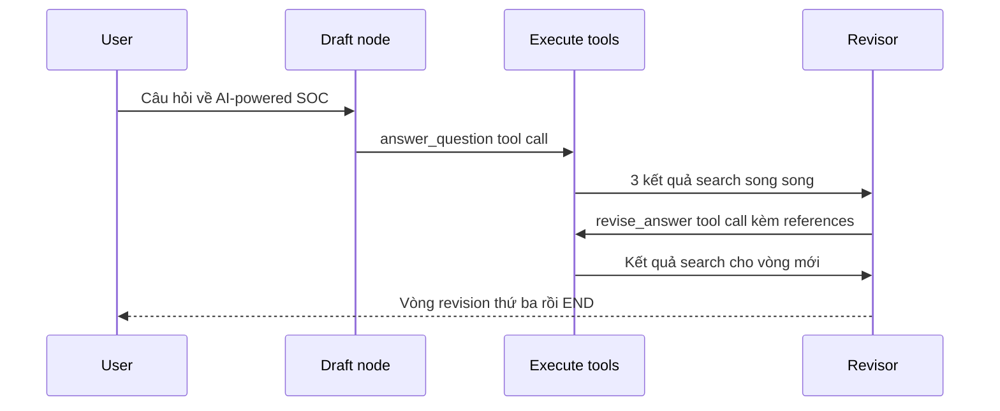

# 🔍 Tracing Graph với LangSmith: Mổ xẻ từng bước chạy của Reflexion Agent

> Nguồn: `025-New-Tracing-Our-Graph.txt` · [Udemy](https://ua.udemy.com/course/langgraph/learn/lecture/54197993)

Chào các bạn, mình là Eden đây! 👋 Graph đã chạy được rồi, nhưng câu hỏi thú vị hơn là: **bên trong nó thực sự diễn ra những gì?** Hôm nay chúng ta sẽ mở **LangSmith** và "soi" toàn bộ **trace (theo dõi luồng chạy)** của graph, đối chiếu từng node với kiến trúc Reflexion mà chúng ta đã thiết kế.

---

### 📊 Toàn cảnh trace: gần 50 giây và 35K token

Trace lần này khá dài. Mình thu gọn nó lại để chỉ còn các node đang chạy, và có thể thấy toàn bộ graph chạy hết **gần 50 giây**, tiêu tốn **35K token**. Chỉ cần nhìn vào con số này là thấy mỗi vòng lặp "ngốn" không ít thời gian và chi phí.

Diễn tiến các node trong trace:

---

### 📝 Draft node: tool call đầu tiên

Mọi thứ bắt đầu từ **responder** — node tạo bản nháp đầu tiên. Response của nó gồm:

* **answer** — bản draft cho câu trả lời.
* **reflection** — gồm **missing** (thông tin còn thiếu) và **superfluous** (thông tin nên loại bỏ).
* **search queries** — những truy vấn cần tìm kiếm thêm.

Lúc này số **tool call** là **1**. Mở trace của lần gọi OpenAI ra, các bạn sẽ thấy đúng **một invocation** gọi tool **answer_question** — nghĩa là mình đã dùng **Pydantic object** như một tool, và cơ chế function calling hoạt động chính xác như thiết kế.

---

### ⚡ Execute tools: ba truy vấn chạy song song

Sang **execute tools node**, node này chạy **ba search query**:

1. **AI-powered SOC startups venture fundings in 2025**
2. **autonomous SOC market sizing and use cases**
3. **comparative analysis of AI SOC platforms**

Và đây là chi tiết rất "cool": cả ba chạy **concurrently (đồng thời)**, vì **ToolNode** hỗ trợ thực thi nhiều tool **song song**. Nếu mở từng tool ra so **start time**, các bạn sẽ thấy chúng **giống hệt nhau** — bằng chứng rõ ràng cho việc chạy cùng lúc. Sau node này, chúng ta có một **AI message** chứa một loạt **kết quả tool**.

---

### 🔁 Revisor node, event_loop và "vòng lặp thứ ba" bất ngờ

Ở **Revisor**, lịch sử đã có đủ: kết quả tool, kết quả search, câu trả lời đầu tiên và critique. Node này **revise** câu trả lời dựa trên kết quả tìm kiếm, đưa ra critique mới và **thêm citation**. Response trả về vẫn là một **tool call** — dive sâu vào sẽ thấy đây là một **LLM call** với **schema của revised answer**. Sang vòng hai, tool call còn có thêm field **references**, kèm bộ truy vấn hoàn toàn mới:

* **AI SOC ROI case studies**
* **autonomous SOC market size in 2025**
* **industry adoption in AI SOC**

Giờ đến phần thú vị nhất: **event_loop** kiểm tra số **tool call**. Nếu **> 2** thì **END**, ngược lại chạy tiếp **execute tools**. Sau lần revision thứ hai, ta kỳ vọng graph kết thúc — nhưng trace cho thấy nó **chạy thêm một vòng nữa**. Lý do: khi event_loop được thực thi, **revised node vẫn chưa hoàn tất** và chưa cập nhật state, nên phép đếm lúc đó **vẫn chưa vượt quá max iterations**. Phải tới lần kiểm tra sau, khi state đã thực sự có thêm tool call từ Revisor, con số mới **> 2**, và graph mới đi đến **END**.

Kết quả: với **MAX_ITERATIONS = 2**, graph thực tế chạy **ba vòng revision** chứ không phải hai. **Đây là lỗi của mình — xin lỗi các bạn nhé!** Và nó để lại một bài học đáng nhớ: **"đếm" số vòng lặp bằng tay hóa ra không hề đơn giản chút nào.**

Đối chiếu kỳ vọng và thực tế:

| Hạng mục | Kỳ vọng | Thực tế trên trace |
|---|---|---|
| Số vòng revision | 2 theo `MAX_ITERATIONS` | 3 vòng |
| Thời điểm đếm tool call | Đã gồm tool call mới của Revisor | Chưa cập nhật vì revised node chưa hoàn tất |
| Cách khắc phục | | Chuyển sang LLM as a judge ở section sau |

### 🎯 Tự kiểm tra nhanh

**Câu 1:** Trace lần này cho thấy tổng thời gian và token là bao nhiêu?

<b>Xem đáp án</b>

**Đáp án:** Gần **50 giây** và **35K token**.

Giải thích: Con số này cho thấy mỗi vòng lặp ngốn không ít thời gian và chi phí.

Tham chiếu: Mục Toàn cảnh trace.

**Câu 2:** Draft node trả về những gì và có mấy tool call?

<b>Xem đáp án</b>

**Đáp án:** answer, reflection (missing/superfluous), search queries — với **1 tool call** gọi tool `answer_question`.

Giải thích: Trace cho thấy cơ chế function calling hoạt động đúng như thiết kế.

Tham chiếu: Mục Draft node.

**Câu 3:** Bằng chứng nào cho thấy 3 search query chạy song song?

<b>Xem đáp án</b>

**Đáp án:** Khi mở từng tool ra so **start time**, các bạn sẽ thấy chúng giống hệt nhau.

Giải thích: ToolNode hỗ trợ thực thi nhiều tool đồng thời nên chúng chạy cùng lúc.

Tham chiếu: Mục Execute tools.

**Câu 4:** Vì sao graph chạy 3 vòng revision dù `MAX_ITERATIONS = 2`?

<b>Xem đáp án</b>

**Đáp án:** Khi `event_loop` kiểm tra, **revised node vẫn chưa hoàn tất** và chưa cập nhật state, nên phép đếm chưa vượt max iterations; lần kiểm tra sau con số mới > 2.

Giải thích: Đây là lỗi của Eden, và là bài học rằng đếm vòng lặp bằng tay không đơn giản.

Tham chiếu: Mục Revisor node, event_loop.

**Câu 5:** Section tiếp theo giải quyết vấn đề đếm vòng lặp bằng cách nào?

<b>Xem đáp án</b>

**Đáp án:** Dùng **LLM as a judge** — để một LLM tự quyết định có nên chạy thêm vòng nữa hay không, không phụ thuộc max iterations.

Giải thích: Kiến trúc này nằm trong nội dung LangGraph Agentic RAG của section kế tiếp.

Tham chiếu: Đoạn kết bài.

Vì vậy ở **section tiếp theo**, chúng ta sẽ chuyển sang dùng **LLM as a judge**: không còn phụ thuộc vào max iterations, mà để một **LLM tự quyết định** có nên chạy thêm vòng nữa hay không. Các bạn có thể tìm tài liệu về kiến trúc này trong phần **LangGraph Agentic RAG** — đó cũng chính là nội dung của section kế tiếp. Hẹn gặp lại các bạn! 🚀

## Nguồn tham khảo

- [Udemy — [New] Tracing Our Graph](https://ua.udemy.com/course/langgraph/learn/lecture/54197993)
- [LangSmith Docs — Trace LangGraph applications](https://docs.langchain.com/langsmith/trace-with-langgraph)
- [LangSmith Docs — View traces](https://docs.langchain.com/langsmith/view-traces)
