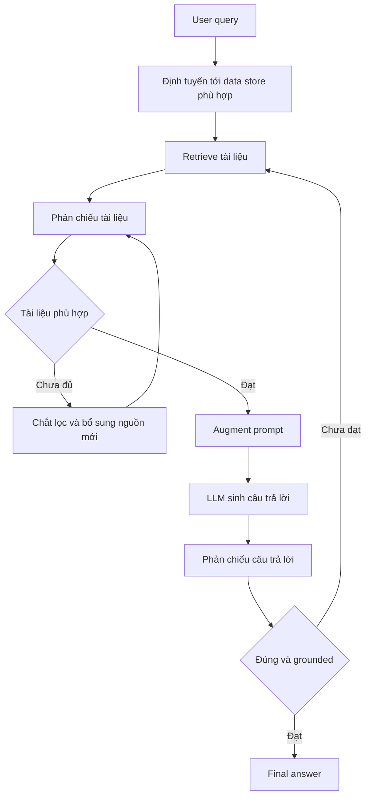

# 🧩 Kiến trúc Agentic RAG: Chúng ta sẽ xây dựng gì trong chương này?

> Nguồn: `026-What-are-Building-In-this-Section--Agentic-RAG-Architecture.txt` · [Udemy](https://ua.udemy.com/course/langgraph/learn/lecture/44106660)

Chào mừng các bạn đã đi được một chặng đường dài đến tận đây! Trong bài này, mình muốn chia sẻ trước về **những gì chúng ta sẽ cùng nhau xây dựng** trong chương Agentic RAG Flows. Cụ thể, chúng ta sẽ triển khai một **RAG workflow phức tạp và nâng cao**, cho ra kết quả chất lượng hơn hẳn những hệ thống RAG thông thường — tất cả là nhờ tận dụng sức mạnh của LangGraph.

### 🎯 Điểm khởi nguồn và góc nhìn "software engineering"

Dự án này được truyền cảm hứng từ **LangChain và Mistral Cookbook**, nơi họ giới thiệu chủ đề này, cùng một video YouTube rất hay. Code gốc của họ cũng có sẵn trong repository của khóa học.

Tuy nhiên, điều mình cảm thấy còn thiếu trong cookbook của họ chính là **góc nhìn kỹ thuật phần mềm (software engineering perspective)**. Vì vậy, mình đã lấy code của họ, thay đổi và refactor lại để hướng tới môi trường production hơn:

* **Dễ bảo trì (maintainable)** hơn.
* **Dễ đọc (readable)** hơn.
* **Dễ kiểm thử (testable)** hơn.
* **Dễ mở rộng**, nếu các bạn muốn thêm chức năng mới.

Mình cũng sẽ **xây dựng hệ thống từ con số không (from zero)**, từng bước một, để các bạn thấy được tư duy kỹ thuật phần mềm xuyên suốt quá trình làm một workflow nâng cao như thế nào.

---

### 📚 Ba bài báo nghiên cứu làm nền móng

Vậy cái "advanced RAG workflow" mà mình nhắc mãi là gì? Nó được xây dựng dựa trên **ba bài báo nghiên cứu (research papers)**:

1. **Self RAG**
2. **Corrective RAG**
3. **Adaptive RAG**

Chúng ta sẽ đi vào tinh thần cốt lõi của từng bài báo trong các video sau, nhưng ý tưởng chung của cả ba là **thêm khả năng phản chiếu (reflection) vào workflow**:

* Phản chiếu lại **các tài liệu mình truy xuất được**, xem chúng có thực sự đúng và phù hợp với mình hay không.
* **Chắt lọc (curate)** những tài liệu đó, và bổ sung thêm thông tin mới nếu chúng chưa đủ.
* Sau khi phản chiếu tài liệu, phản chiếu tiếp **câu trả lời**: kiểm tra xem câu trả lời có thực sự **dựa trên tài liệu (grounded in the documents)** hay không, và có thực sự **trả lời đúng câu hỏi** hay không.

Có thể hình dung toàn bộ vòng reflection kèm định tuyến như sau:

Ngoài ra còn có một yếu tố **định tuyến (routing)**: chúng ta sẽ route request đến đúng kho dữ liệu (data store) chứa thông tin cần thiết cho câu trả lời.

---

### 🗂️ Code đi kèm và cách theo dõi

Toàn bộ code của chương này nằm trong một **repository GitHub công khai**, các bạn có thể tham khảo bất cứ lúc nào khi xem video.

Mình đã sắp xếp để **mỗi video tương ứng với một branch**, và các bạn có thể tìm thấy code ở cuối mỗi video — hoàn toàn khớp với code trong repository. Cứ thoải mái xem qua nhé!

### 🎯 Tự kiểm tra nhanh

**Câu 1:** Ba bài báo nghiên cứu nào là nền móng của advanced RAG workflow trong chương này?

<b>Xem đáp án</b>

**Đáp án:** Self RAG, Corrective RAG và Adaptive RAG.

Giải thích: Cả ba bài báo đều được nhắc là nền tảng của workflow nâng cao này.

Tham chiếu: Mục Ba bài báo nghiên cứu làm nền móng.

**Câu 2:** Ý tưởng chung của cả ba bài báo là gì?

<b>Xem đáp án</b>

**Đáp án:** Thêm khả năng phản chiếu (reflection) vào workflow.

Giải thích: Reflection được áp dụng cho cả tài liệu truy xuất lẫn câu trả lời.

Tham chiếu: Mục Ba bài báo nghiên cứu làm nền móng.

**Câu 3:** Sau khi phản chiếu tài liệu, chúng ta phản chiếu tiếp điều gì?

<b>Xem đáp án</b>

**Đáp án:** Câu trả lời — kiểm tra xem nó có dựa trên tài liệu (grounded) và có trả lời đúng câu hỏi hay không.

Giải thích: Đây là lớp kiểm soát chất lượng thứ hai sau lớp kiểm soát tài liệu.

Tham chiếu: Mục Ba bài báo nghiên cứu làm nền móng.

**Câu 4:** Vì sao Eden refactor code từ cookbook của LangChain và Mistral?

<b>Xem đáp án</b>

**Đáp án:** Để mang lại góc nhìn kỹ thuật phần mềm, hướng tới môi trường production hơn.

Giải thích: Code trở nên dễ bảo trì, dễ đọc, dễ kiểm thử và dễ mở rộng hơn.

Tham chiếu: Mục Điểm khởi nguồn và góc nhìn software engineering.

**Câu 5:** Yếu tố định tuyến (routing) trong workflow dùng để làm gì?

<b>Xem đáp án</b>

**Đáp án:** Route request đến đúng data store chứa thông tin cần thiết cho câu trả lời.

Giải thích: Routing giúp tìm đúng nguồn dữ liệu thay vì tìm tràn lan.

Tham chiếu: Mục Ba bài báo nghiên cứu làm nền móng.

Đó là bức tranh tổng thể về những gì chúng ta sắp làm. *Đừng lo nếu các khái niệm nghe còn lạ tai — mình sẽ đi chậm rãi từng bước một.* Hãy bắt đầu ngay với phần đầu tiên: triển khai bài báo nghiên cứu **Corrective RAG**. Hẹn gặp lại các bạn ở bài tiếp theo! 🚀

## Nguồn tham khảo

- [Udemy — What are Building In this Section: Agentic RAG Architecture](https://ua.udemy.com/course/langgraph/learn/lecture/44106660)
- [arXiv — Corrective Retrieval Augmented Generation](https://arxiv.org/abs/2401.15884)
- [arXiv — Self-RAG: Learning to Retrieve, Generate, and Critique through Self-Reflection](https://arxiv.org/abs/2310.11511)
- [arXiv — Adaptive-RAG: Learning to Adapt Retrieval-Augmented Large Language Models through Question Complexity](https://arxiv.org/abs/2403.14403)
