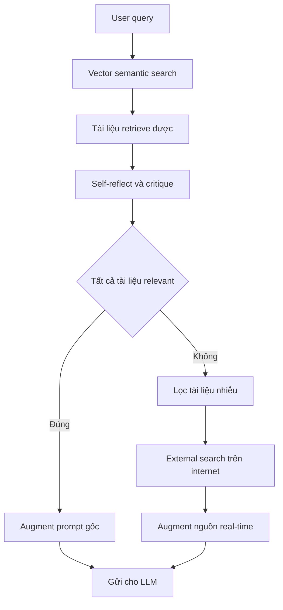

# 🔍 Corrective RAG (RAG tự sửa): Nâng tầm chất lượng câu trả lời khi truy xuất tài liệu

> Nguồn: `027-Improving-RAG-Quality-with-the-Corrective-RAG-Flow.txt` · [Udemy](https://ua.udemy.com/course/langgraph/learn/lecture/43844196)

Chào các bạn, Eden đây! Trong vài video tới, chúng ta sẽ cùng nhau triển khai **CRAG — Corrective RAG** dựa trên bài báo nghiên cứu cùng tên. Đây là một **kỹ thuật RAG nâng cao (advanced RAG technique)** giúp chúng ta nhận được câu trả lời chất lượng hơn khi thực hiện **retrieval, augmentation, generation**.

### 🧠 Ý tưởng cốt lõi: tự phản chiếu trước khi trả lời

Khái niệm cơ bản của Corrective RAG thực ra khá đơn giản. Quy trình bắt đầu như sau:

1. Lấy **query** của người dùng và thực hiện **vector semantic search (tìm kiếm ngữ nghĩa trên vector store)** để truy xuất các tài liệu liên quan.
2. Sau khi đã có các tài liệu đó, chúng ta bắt đầu **tự phản chiếu (self-reflect)** — phê bình (critique) chúng để xác định xem liệu chúng có thực sự liên quan đến query ban đầu hay không.

Điểm mấu chốt nằm ở bước phản chiếu này: thay vì tin tưởng mù quáng vào kết quả truy xuất, hệ thống chủ động "soi" lại chất lượng của từng tài liệu trước khi dùng chúng để trả lời.

---

### 🔀 Hai nhánh xử lý: Happy flow và External search

Sau bước phản chiếu, workflow sẽ rẽ thành hai nhánh rõ ràng:

**1. Happy flow — mọi tài liệu đều liên quan:**
Nếu tất cả tài liệu đều relevant với query của chúng ta, đây là một happy flow. Chúng ta chỉ việc **augment (bổ sung ngữ cảnh vào) prompt gốc** rồi gửi tất cả cho LLM — đúng như cách chúng ta vẫn làm trong RAG thông thường.

**2. Nhánh còn lại — có tài liệu "rác":**
Nếu phát hiện ra những tài liệu không liên quan đến query, chúng ta sẽ:

* **Lọc bỏ (filter)** những tài liệu đó ra khỏi ngữ cảnh.
* Thực hiện **tìm kiếm bên ngoài (external search) trên internet** để thu thập thêm thông tin.

Sau đó, chúng ta **augment prompt với nguồn thông tin thời gian thực (real-time)** vừa lấy được từ internet, rồi gửi tất cả cho LLM.

Hai nhánh được tóm tắt nhanh như sau:

| Nhánh | Điều kiện | Hành động |
|---|---|---|
| Happy flow | Tất cả tài liệu đều relevant với query | Augment prompt gốc rồi gửi cho LLM như RAG thường |
| External search | Có tài liệu không liên quan | Lọc tài liệu nhiễu + tìm kiếm internet, augment nguồn real-time |

Toàn bộ CRAG flow gói gọn như sau:

---

### 💡 Vì sao kỹ thuật này đáng học?

Nhờ việc lọc bỏ tài liệu nhiễu và bổ sung dữ liệu thời gian thực khi cần thiết, Corrective RAG mang lại cho chúng ta **câu trả lời chất lượng hơn rất nhiều** so với RAG truyền thống.

Điểm mình thích ở kỹ thuật này là nó không thay đổi cách chúng ta gọi LLM — chúng ta vẫn augment prompt rồi gửi tất cả cho model như bình thường. Cái mới nằm ở **tư duy kiểm soát chất lượng dữ liệu đầu vào**: biết khi nào nên tin vào vector store, và biết khi nào cần bổ sung nguồn tin từ bên ngoài.

*Đừng lo nếu luồng xử lý nghe hơi nhiều bước — mình sẽ hiện thực hóa toàn bộ bằng LangGraph ngay trong các video tiếp theo, từng bước một.*

### 🎯 Tự kiểm tra nhanh

**Câu 1:** CRAG là viết tắt của gì và được xây dựng dựa trên gì?

<b>Xem đáp án</b>

**Đáp án:** Corrective RAG — kỹ thuật RAG nâng cao dựa trên bài báo nghiên cứu cùng tên.

Giải thích: CRAG giúp câu trả lời chất lượng hơn khi thực hiện retrieval, augmentation, generation.

Tham chiếu: Đoạn mở đầu.

**Câu 2:** Bước đầu tiên của Corrective RAG là gì?

<b>Xem đáp án</b>

**Đáp án:** Lấy query của người dùng và thực hiện vector semantic search để truy xuất tài liệu liên quan.

Giải thích: Đây vẫn là bước retrieval quen thuộc của RAG.

Tham chiếu: Mục Ý tưởng cốt lõi.

**Câu 3:** Sau khi truy xuất tài liệu, hệ thống làm gì tiếp theo?

<b>Xem đáp án</b>

**Đáp án:** Tự phản chiếu (self-reflect), phê bình tài liệu xem chúng có thực sự liên quan đến query gốc hay không.

Giải thích: Đây là điểm mấu chốt — không tin tưởng mù quáng vào kết quả truy xuất.

Tham chiếu: Mục Ý tưởng cốt lõi.

**Câu 4:** Happy flow của CRAG xử lý như thế nào?

<b>Xem đáp án</b>

**Đáp án:** Khi mọi tài liệu đều relevant, ta augment prompt gốc rồi gửi tất cả cho LLM như RAG thông thường.

Giải thích: Không cần bước sửa chữa nào vì ngữ cảnh đã đạt yêu cầu.

Tham chiếu: Mục Hai nhánh xử lý.

**Câu 5:** Khi phát hiện tài liệu không liên quan, CRAG làm gì?

<b>Xem đáp án</b>

**Đáp án:** Lọc bỏ tài liệu rác và thực hiện external search trên internet để bổ sung thông tin thời gian thực.

Giải thích: Sau đó augment prompt với nguồn real-time rồi mới gửi cho LLM.

Tham chiếu: Mục Hai nhánh xử lý.

Giờ thì cùng bắt tay vào code thôi. Hẹn gặp lại các bạn ở bài sau! 🚀

## Nguồn tham khảo

- [Udemy — Improving RAG Quality with the Corrective RAG Flow](https://ua.udemy.com/course/langgraph/learn/lecture/43844196)
- [arXiv — Corrective Retrieval Augmented Generation](https://arxiv.org/abs/2401.15884)
- [LangGraph Overview — Docs by LangChain](https://docs.langchain.com/oss/python/langgraph/overview)
