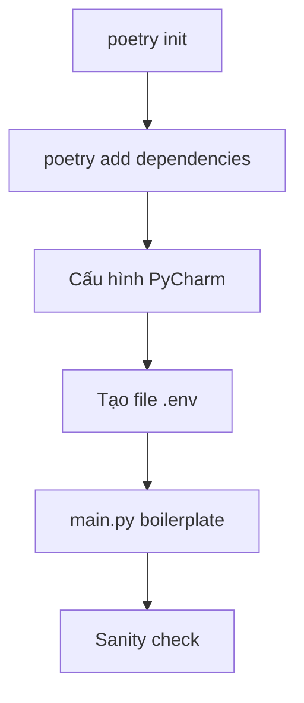

# ⚙️ Khởi tạo dự án Agentic RAG với LangGraph: Poetry, PyCharm và bản cập nhật mới nhất

> Nguồn: `028-Boilerplate-Setup-for-an-Agentic-RAG-Agent-with-LangGraph.txt` · [Udemy](https://ua.udemy.com/course/langgraph/learn/lecture/57118229)

Chào các bạn, Eden đây! Trong bài này, chúng ta sẽ cùng nhau **thiết lập dự án cho reflection agent** của mình. Cụ thể, mình sẽ tạo thư mục dự án, dùng **Poetry** để tạo môi trường ảo và cài đặt dependency, cấu hình **PyCharm** trỏ đúng vào môi trường ảo đang dùng, rồi tạo file `.env` chứa các API key cần thiết.

### 🧰 Dựng "bộ khung" dự án với Poetry

Mình bắt đầu bằng việc `cd` vào Desktop, tạo một thư mục mới tên là **LangGraphCourse**, rồi chạy `poetry init` và nhấn Enter để đi tiếp qua các bước thiết lập. Lúc này mình đã có file **pyproject.toml** — nhưng chưa có gì được cài đặt cả, nên chúng ta sẽ cài mọi thứ bằng `poetry add`:

* **Beautiful Soup** — LangChain sẽ dùng thư viện này để tải các file từ web về, phục vụ việc ingest vào vector store.
* **LangChain**, **LangGraph**, **LangChain Hub**.
* **LangChain Community** — để dùng các third-party loader khi nạp tài liệu.
* **Tavily SDK** — cho search engine của chúng ta.
* **Chroma** — open-source vector store.
* **python-dotenv** — quản lý biến môi trường.
* **Black** và **Isort** — định dạng code.
* **PyTest** — vì chúng ta sẽ viết test.

Toàn bộ code của bài này và cả series nằm trên **GitHub**, ở branch `one start here`. Nếu cần so sánh hoặc xem mình đang dùng phiên bản nào, các bạn cứ thoải mái tham khảo nhé!

Các bước setup diễn ra theo trình tự:

---

### 🔄 Cập nhật quan trọng: LangChain Community đã bị deprecated

Đây là đoạn mình quay bổ sung sau này (cũng khoảng **hai năm** kể từ lúc quay video gốc, nên trông mình có "già" hơn một chút 😄). Lý do là mình muốn đảm bảo chúng ta **khớp với phiên bản LangChain mới nhất**. Tin vui là toàn bộ code vẫn giữ nguyên, chỉ thay đổi một vài import:

* **LangChain Community đã deprecated**, nên chúng ta không cài package này nữa.
* Với document loader, thay vào đó hãy cài **LangChain-Unstructured**.
* Với text reader, cài **LangChain-TextReaders**.

| Mục đích | Trước đây | Thay thế |
|---|---|---|
| Document loader | LangChain Community | LangChain-Unstructured |
| Text reader | LangChain Community | LangChain-TextReaders |

Mình cũng muốn nhấn mạnh: **viết test trong các ứng dụng generative là điều cực kỳ quan trọng** — và đó là lý do mình nhất định đưa phần testing vào khóa học này.

---

### 🗝️ Cấu hình .env và kiểm tra "sức khỏe" dự án

Sau khi các package được cài xong, mình mở dự án bằng **PyCharm**. PyCharm tự phát hiện môi trường Poetry, mình bấm approve và để nó index toàn bộ package. Mở file **pyproject.toml** là thấy ngay các phiên bản đang dùng — và mình sẽ luôn cập nhật repository của khóa học theo phiên bản LangChain, LangGraph mới nhất.

Tiếp theo, mình tạo file **.env** để chứa biến môi trường:

* **OpenAI API key** và **LangSmith API key** (chúng ta dùng LangSmith để tracing).
* Bật **LangSmith Tracing**, với project đặt tên là **Crag**.
* **Tavily API key** cho search engine.
* Biến **PYTHONPATH** trỏ về thư mục gốc của dự án.

Cuối cùng, mình tạo file **main.py** với code boilerplate: nạp biến môi trường rồi in ra dòng `Hello Advanced RAG`. Chạy thử như một **sanity check** — mọi thứ hoạt động trơn tru!

*Nếu bạn thấy có bước nào chưa khớp, đừng lo — cứ xem lại branch `one start here` trong repository để đối chiếu nhé.*

### 🎯 Tự kiểm tra nhanh

**Câu 1:** Poetry được dùng để làm gì trong dự án này?

<b>Xem đáp án</b>

**Đáp án:** Tạo môi trường ảo và cài đặt/quản lý dependency cho dự án.

Giải thích: Sau `poetry init` ta có `pyproject.toml`, sau đó cài package bằng `poetry add`.

Tham chiếu: Mục Dựng bộ khung dự án với Poetry.

**Câu 2:** Vì sao dự án cần thư viện Beautiful Soup?

<b>Xem đáp án</b>

**Đáp án:** LangChain dùng nó để tải các file từ web về, phục vụ việc ingest vào vector store.

Giải thích: Đây là một trong các package được cài bằng `poetry add` ngay từ đầu.

Tham chiếu: Mục Dựng bộ khung dự án với Poetry.

**Câu 3:** LangChain Community đã deprecated, ta thay thế bằng những package nào?

<b>Xem đáp án</b>

**Đáp án:** Document loader dùng LangChain-Unstructured; text reader dùng LangChain-TextReaders.

Giải thích: Code vẫn giữ nguyên, chỉ thay đổi một vài import và package cài đặt.

Tham chiếu: Mục Cập nhật quan trọng.

**Câu 4:** File `.env` chứa những biến môi trường nào?

<b>Xem đáp án</b>

**Đáp án:** OpenAI API key, LangSmith API key (bật tracing, project tên Crag), Tavily API key và PYTHONPATH.

Giải thích: LangSmith dùng để tracing, Tavily dùng cho search engine.

Tham chiếu: Mục Cấu hình .env và kiểm tra sức khỏe dự án.

**Câu 5:** Sanity check sau khi setup được thực hiện như thế nào?

<b>Xem đáp án</b>

**Đáp án:** Tạo `main.py` nạp biến môi trường rồi in ra dòng `Hello Advanced RAG`.

Giải thích: Chạy thử file này để xác nhận mọi thứ hoạt động trơn tru.

Tham chiếu: Mục Cấu hình .env và kiểm tra sức khỏe dự án.

Trong video tiếp theo, chúng ta sẽ cùng điểm qua **cấu trúc repository**. Hẹn gặp lại các bạn! 🚀

## Nguồn tham khảo

- [Udemy — Boilerplate Setup for an Agentic RAG Agent with LangGraph](https://ua.udemy.com/course/langgraph/learn/lecture/57118229)
- [Poetry — Basic usage](https://python-poetry.org/docs/basic-usage)
- [LangSmith — Tracing quickstart](https://docs.langchain.com/langsmith/observability-quickstart)
