# 📥 Ingestion Pipeline: Nạp tài liệu vào ChromaDB với UnstructuredLoader

> Nguồn: `030-LangChain-Vector-Store-Ingestion-Pipeline-UnstructuredLoader.txt` · [Udemy](https://ua.udemy.com/course/langgraph/learn/lecture/57118861)

Chào các bạn, Eden đây! Như các bạn đã biết, trước khi triển khai một giải pháp RAG nâng cao, chúng ta cần **index tài liệu vào vector store** trước đã. Trong bài này, mình sẽ viết file **ingestion**: nạp các bài viết thành **LangChain Documents**, **chunk (chia nhỏ)** chúng, **embed** rồi lưu vào **ChromaDB** — open-source vector store.

### 🎯 Trọng tâm của dự án: Retrieval, không phải Ingestion

Một lời "bật mí" trước khi bắt đầu: trong một ứng dụng Gen AI — đặc biệt là ứng dụng RAG — thì **ingestion pipeline có thể được tối ưu ở rất nhiều khâu**, từ lúc load tài liệu, transform và chunk, cho đến khi embed (tùy vào model các bạn dùng).

Tuy nhiên, ở dự án này chúng ta sẽ **tập trung vào phần retrieval (truy xuất) hơn là ingestion**. Vì vậy phần ingestion mình chỉ dùng lại các thiết lập mặc định, không làm gì đặc biệt: cứ chunk tài liệu rồi nạp vào vector store. Còn ở phần retrieval, chúng ta sẽ dùng LangGraph để triển khai những **kỹ thuật truy xuất cực kỳ nâng cao**.

---

### 🌐 Chuẩn bị dữ liệu: ba bài viết về Generative AI

Đầu tiên là phần import: `load_dotenv` để nạp biến môi trường, **RecursiveCharacterTextSplitter** để chia nhỏ tài liệu, **UnstructuredLoader** để nạp tài liệu từ internet, **Chroma** làm vector store, và **OpenAIEmbeddings** cho phần embedding.

Mình cũng tạo một danh sách URL — là ba bài viết về Generative AI mà chúng ta sẽ scrape:

1. Một bài về **autonomous agents (agent tự chủ)** — bàn về memory, planning và reasoning.
2. Một bài về **prompt engineering** — với đầy đủ các kỹ thuật như zero-shot, few-shot, chain of thought, ReAct, v.v.
3. Một bài về **adversarial attacks on LLM security (tấn công đối kháng vào bảo mật LLM)** — prompt hacking và những thứ tương tự.

Sau khi load từng URL, mình nhận về một danh sách mà mỗi phần tử lại là một danh sách con chứa đúng một document. Vì vậy mình **làm phẳng (flatten)** nó bằng cách lặp qua từng sublist và lấy document bên trong. Kiểm tra bằng debugger, ta có `document_list` gồm **3 phần tử**, mỗi phần tử là một LangChain Document.

---

### ✂️ Chunk tài liệu và index vào ChromaDB

Tiếp theo, mình dùng `RecursiveCharacterTextSplitter.from_tiktoken_encoder` với **chunk size = 250** và **không overlap (không chồng lấn)**. Chạy debug, ta thấy tài liệu được chia thành **gần 200 chunks**.

Toàn bộ pipeline đi từ URL đến retriever như sau:

```mermaid
flowchart LR
    A[Danh sách URL] --> B[UnstructuredLoader]
    B --> C[Document list]
    C --> D[Làm phẳng]
    D --> E[RecursiveCharacterTextSplitter]
    E --> F[Khoảng 200 chunks]
    F --> G[OpenAIEmbeddings]
    G --> H[ChromaDB rag-chroma]
    H --> I[as_retriever]
    I --> J[Similarity search]
```



Giờ thì sẵn sàng index vào ChromaDB — vector store này sẽ chạy **local trên máy của các bạn**:

```python
vectorstore = Chroma.from_documents(
    documents=chunks,
    collection_name="rag-chroma",
    embedding=OpenAIEmbeddings(),
    persist_directory="./.chroma",
)
```

Mình dùng `Chroma.from_documents` để nạp các chunk, đặt tên collection/index là **rag-chroma**, dùng **OpenAI Embeddings** (mặc định sẽ là **text-embedding-3-small**), và thêm `persist_directory` là `./.chroma` để **lưu vector store xuống ổ đĩa**.

Sau đó, mình tạo một **LangChain Retriever** từ ChromaDB bằng cách khởi tạo đối tượng Chroma (nạp từ disk với đúng collection name, persist directory và embedding function) rồi gọi `.as_retriever()` — từ đây có thể thực hiện **similarity search (tìm kiếm tương đồng)**:

```python
retriever = Chroma(
    collection_name="rag-chroma",
    persist_directory="./.chroma",
    embedding_function=OpenAIEmbeddings(),
).as_retriever()
```

Hai API này chia nhau hai giai đoạn khác nhau:

| Việc cần làm | API | Chi tiết |
|---|---|---|
| Index tài liệu mới | `Chroma.from_documents` | collection `rag-chroma`, lưu xuống `./.chroma` |
| Load lại để truy vấn | `Chroma(...).as_retriever()` | Nạp từ disk với đúng collection và embedding function |

Chạy chương trình: thư mục `.chroma` xuất hiện với dữ liệu persistent. Sau đó mình **comment phần index lại**, vì không muốn index lại mỗi lần chạy — chỉ cần load từ disk. Chạy lại lần nữa, mọi thứ hoạt động không lỗi.

### 🎯 Tự kiểm tra nhanh

**Câu 1:** Vì sao dự án này chỉ dùng thiết lập mặc định cho phần ingestion?

<details>
<summary><b>Xem đáp án</b></summary>

**Đáp án:** Vì trọng tâm dự án là phần retrieval chứ không phải ingestion.

Giải thích: Retrieval mới là nơi áp dụng các kỹ thuật LangGraph nâng cao; ingestion chỉ cần đủ tốt để có dữ liệu.

Tham chiếu: Mục Trọng tâm của dự án.

</details>

**Câu 2:** Ba bài viết được scrape nói về chủ đề gì?

<details>
<summary><b>Xem đáp án</b></summary>

**Đáp án:** Autonomous agents, prompt engineering và adversarial attacks on LLM security.

Giải thích: Prompt engineering gồm zero-shot, few-shot, chain of thought, ReAct...; bài còn lại nói về prompt hacking.

Tham chiếu: Mục Chuẩn bị dữ liệu.

</details>

**Câu 3:** Cấu hình chunking được dùng là gì?

<details>
<summary><b>Xem đáp án</b></summary>

**Đáp án:** `RecursiveCharacterTextSplitter.from_tiktoken_encoder` với chunk size 250 và không overlap.

Giải thích: Ba tài liệu sau khi chia tạo ra gần 200 chunks.

Tham chiếu: Mục Chunk tài liệu và index vào ChromaDB.

</details>

**Câu 4:** Vector store được cấu hình như thế nào?

<details>
<summary><b>Xem đáp án</b></summary>

**Đáp án:** ChromaDB chạy local, collection tên `rag-chroma`, dùng OpenAIEmbeddings (mặc định text-embedding-3-small), persist tại `./.chroma`.

Giải thích: Nhờ persist directory mà vector store được lưu xuống ổ đĩa.

Tham chiếu: Mục Chunk tài liệu và index vào ChromaDB.

</details>

**Câu 5:** Vì sao sau lần chạy đầu, Eden comment phần index lại?

<details>
<summary><b>Xem đáp án</b></summary>

**Đáp án:** Để không phải index lại mỗi lần chạy — chỉ cần load vector store từ disk.

Giải thích: Retriever được tạo từ Chroma đọc dữ liệu đã persist.

Tham chiếu: Mục Chunk tài liệu và index vào ChromaDB.

</details>

Toàn bộ code nằm ở branch **three ingestion** trên GitHub. *Các bạn cứ thoải mái so sánh và dùng lại nhé!*

Trong bài tiếp theo, chúng ta sẽ định nghĩa **GraphState** — trái tim của graph. Hẹn gặp lại! 🚀

## Nguồn tham khảo

- [Udemy — LangChain Vector Store Ingestion Pipeline (UnstructuredLoader, ChromaDB)](https://ua.udemy.com/course/langgraph/learn/lecture/57118861)
- [Chroma Docs — LangChain integration](https://docs.trychroma.com/integrations/frameworks/langchain)
- [Docs by LangChain — Unstructured integration](https://docs.langchain.com/oss/python/integrations/document_loaders/unstructured_file)
