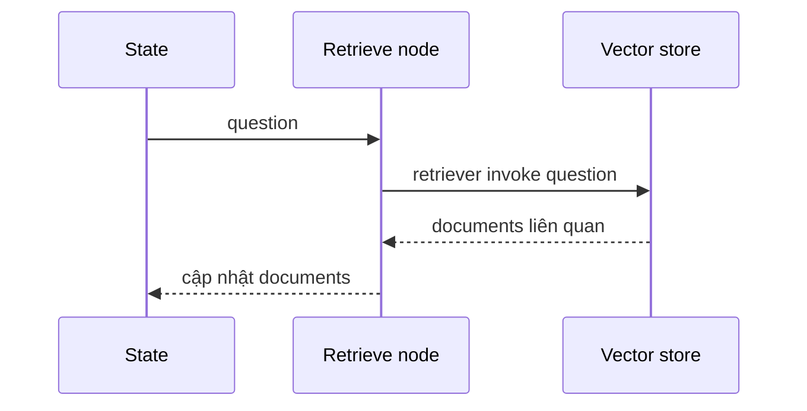

# 🔎 Retrieve Node: Lấy ngữ cảnh liên quan từ vector store cho LLM

> Nguồn: `032-Fetching-Context-for-LLMs-The-LangGraph-Retrieve-Node.txt` · [Udemy](https://ua.udemy.com/course/langgraph/learn/lecture/43831580)

Chào các bạn, Eden đây! Trong bài này, chúng ta sẽ triển khai **retrieve node** — node đầu tiên trong graph. Node này sẽ nhận state, lấy ra câu hỏi mà người dùng đã đặt, rồi **truy xuất những tài liệu liên quan** cho câu hỏi đó bằng khả năng **semantic search (tìm kiếm ngữ nghĩa)** của vector store.

### 🎯 Nhiệm vụ của Retrieve Node

Luồng hoạt động của node rất rõ ràng:

1. Nhận **state** làm đầu vào.
2. **Trích xuất câu hỏi (question)** mà người dùng đã hỏi.
3. Gọi vector store để **retrieve các tài liệu liên quan**.
4. **Cập nhật lại state**, cụ thể là trường `documents`, để giữ những tài liệu vừa lấy về.

Diễn biến bên trong node như sau:



Nói cách khác, node này chính là cầu nối giữa câu hỏi của người dùng và kho tri thức mà chúng ta đã index ở bài trước.

---

### 🧩 Viết node trong `nodes/retrieve.py`

Mình vào package **nodes**, tạo file mới tên **retrieve.py** và bắt đầu với các import:

* Từ `typing`: import **Any** và **Dict** để **type hinting (khai báo kiểu dữ liệu)**.
* Import **GraphState** — vì đó là đầu vào của node, đồng thời là thứ node sẽ cập nhật.
* Import **retriever** từ file `ingestion` — biến này đang trỏ tới vector store local với toàn bộ embedding đã được lưu sẵn.

Tiếp theo, mình định nghĩa node dưới dạng một **hàm (function)**: nhận vào `state` và trả về một **dictionary** chứa những gì cần cập nhật trong state:

```python
from typing import Any, Dict

from graph.state import GraphState
from ingestion import retriever


def retrieve(state: GraphState) -> Dict[str, Any]:
    print("---RETRIEVE---")
    question = state["question"]

    documents = retriever.invoke(question)
    return {"documents": documents, "question": question}
```

Trong hàm này, mình in ra thông báo rằng đang retrieve, trích xuất `question` từ state hiện tại, rồi gọi **`retriever.invoke(question)`** — phương thức này sẽ thực hiện semantic search và trả về tất cả tài liệu liên quan.

Giá trị trả về của node là state mới: trường `documents` được cập nhật bằng những tài liệu vừa retrieve. Ngoài ra, mình cũng thêm cả **question gốc** vào phần trả về — *thật ra điều này là không bắt buộc, mình chỉ làm cho chắc ăn thôi.*

### 🎯 Tự kiểm tra nhanh

**Câu 1:** Nhiệm vụ của retrieve node là gì?

<details>
<summary><b>Xem đáp án</b></summary>

**Đáp án:** Nhận state, trích câu hỏi của người dùng, retrieve tài liệu liên quan rồi cập nhật lại trường `documents`.

Giải thích: Node là cầu nối giữa câu hỏi và kho tri thức đã index.

Tham chiếu: Mục Nhiệm vụ của Retrieve Node.

</details>

**Câu 2:** Node trong LangGraph được định nghĩa dưới dạng gì trong bài này?

<details>
<summary><b>Xem đáp án</b></summary>

**Đáp án:** Một hàm (function) nhận vào `state` và trả về dictionary chứa những gì cần cập nhật trong state.

Giải thích: Đây là cách viết node đơn giản nhất trong LangGraph.

Tham chiếu: Mục Viết node trong nodes/retrieve.py.

</details>

**Câu 3:** Lệnh `retriever.invoke(question)` thực hiện việc gì?

<details>
<summary><b>Xem đáp án</b></summary>

**Đáp án:** Thực hiện semantic search trên vector store và trả về tất cả tài liệu liên quan.

Giải thích: Retriever được import từ file `ingestion`, trỏ tới vector store local đã lưu embedding.

Tham chiếu: Mục Viết node trong nodes/retrieve.py.

</details>

**Câu 4:** Vì sao node trả về cả `question` gốc bên cạnh `documents`?

<details>
<summary><b>Xem đáp án</b></summary>

**Đáp án:** Điều này không bắt buộc — Eden làm cho chắc ăn thôi.

Giải thích: Giá trị cốt lõi mà node cập nhật vẫn là `documents`.

Tham chiếu: Mục Viết node trong nodes/retrieve.py.

</details>

**Câu 5:** Node này nằm ở đâu trong luồng Corrective RAG?

<details>
<summary><b>Xem đáp án</b></summary>

**Đáp án:** Đây là node đầu tiên trong graph — bước lấy ngữ cảnh trước khi phản chiếu và sinh câu trả lời.

Giải thích: Các video tiếp theo sẽ xây thêm nhiều node nữa để hoàn thiện luồng.

Tham chiếu: Đoạn kết bài.

</details>

Vậy là node đầu tiên đã xong! Nếu muốn xem code chính xác, các bạn hãy tham khảo **branch tương ứng trên GitHub**. Trong các video tiếp theo, chúng ta sẽ lần lượt xây thêm nhiều node nữa để hoàn thiện luồng Corrective RAG. Hẹn gặp lại các bạn! 🚀

## Nguồn tham khảo

- [Udemy — Fetching Context for LLMs: The LangGraph Retrieve Node](https://ua.udemy.com/course/langgraph/learn/lecture/43831580)
- [Docs by LangChain — Graph API overview](https://docs.langchain.com/oss/python/langgraph/graph-api)
- [Chroma Docs — LangChain integration](https://docs.trychroma.com/integrations/frameworks/langchain)
