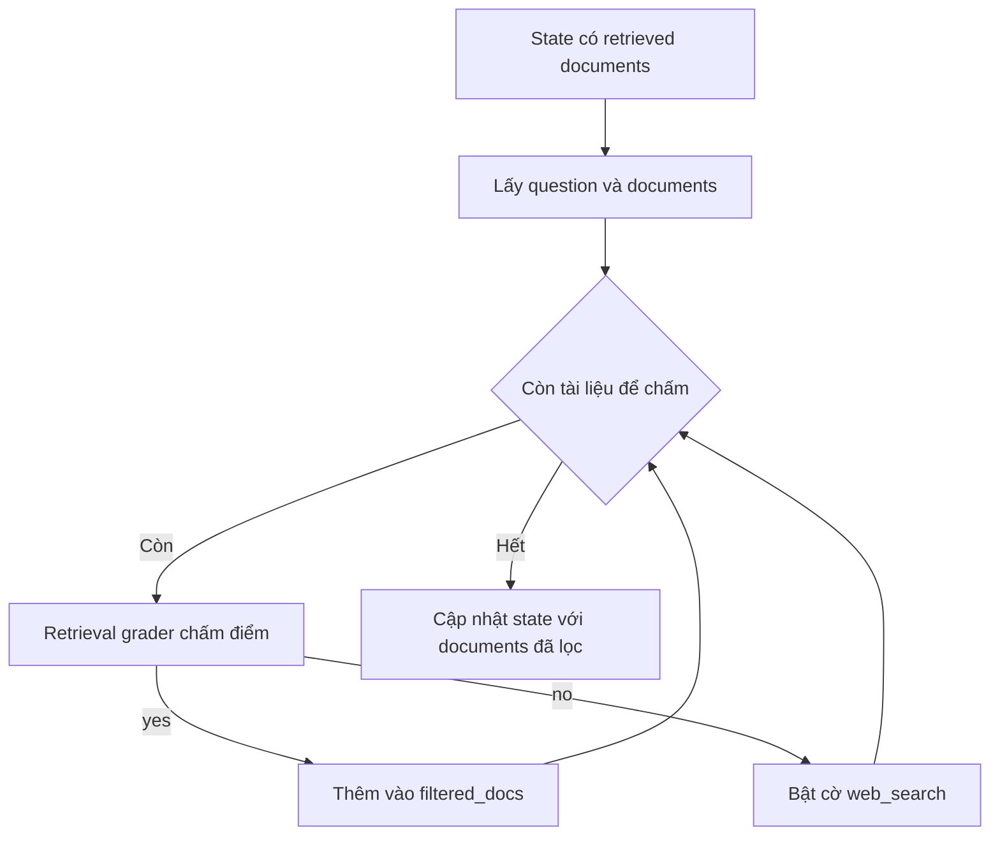

# 🔍 Bộ lọc Độ liên quan cho RAG: Dạy LLM "chấm điểm" tài liệu trước khi trả lời (Đừng bỏ qua nhé!)

> Nguồn: `033-Building-a-Relevance-Filter-for-RAG-using-LangChains-Structu.txt` · [Udemy](https://ua.udemy.com/course/langgraph/learn/lecture/43831588)

Chào các bạn, mình là Eden đây! Sau khi đã hoàn thành **retrieve node**, chúng ta đã có trong tay một loạt tài liệu lấy từ vector store. Nhưng câu hỏi lớn là: *liệu tất cả chúng có thực sự liên quan đến câu hỏi của người dùng hay không?*

Trong bài này, mình và các bạn sẽ cùng xây dựng **document grader node (nút chấm điểm tài liệu)** — trái tim của bộ lọc độ liên quan, sử dụng sức mạnh của **structured output (đầu ra có cấu trúc)** trong LangChain.

---

### 🎯 Vì sao phải "chấm điểm" tài liệu?

Khi bước vào node này, trong **state (trạng thái)** của graph chúng ta đã có sẵn các **retrieved documents**. Nhiệm vụ của node là:

1. Duyệt qua từng tài liệu đã lấy về.
2. Xác định xem tài liệu đó có thực sự liên quan đến câu hỏi hay không.
3. **Lọc bỏ** những tài liệu không liên quan, chỉ giữ lại những tài liệu hữu ích.

Và đây là **heuristic (quy tắc ngầm)** khá đơn giản nhưng cực kỳ hiệu quả mà mình cài đặt: nếu **không phải tất cả** tài liệu đều liên quan — tức là có **ít nhất một tài liệu "rác"** — thì mình sẽ bật cờ **web search** lên `true`. Lý do rất thực tế: khi vector store đã "hết vốn", chúng ta cần tìm thêm thông tin từ bên ngoài.

---

### ⚙️ Retrieval Grader chain — "giám khảo" của từng tài liệu

Mình tạo một file mới trong package `chains` với tên **`retrieval_grader`**. Chain này nhận vào **câu hỏi gốc** cùng **một tài liệu đã retrieve**, rồi trả về kết quả *có liên quan hay không* — và nó sẽ chạy cho **từng tài liệu một**.

Điểm cốt lõi nằm ở **structured output**: thay vì nhận về một đoạn text lộn xộn, chúng ta ép LLM trả về đúng một **Pydantic object**.

```python
class GradeDocuments(BaseModel):
    binary_score: str = Field(
        description="Documents are relevant to the question, 'yes' or 'no'"
    )

structured_llm_grader = llm.with_structured_output(GradeDocuments)
retrieval_grader = grade_prompt | structured_llm_grader
```

Điểm khác biệt so với cách trả lời text thông thường:

| Tiêu chí | Text tự do | Structured output |
|---|---|---|
| Kiểu trả về | Chuỗi lộn xộn, phải tự parse | Pydantic object đúng schema |
| Độ ổn định | Dễ "trôi", khó ép giá trị | Field description giúp enforce schema |
| Cơ chế bên dưới | Sinh text thuần | Function calling của LLM |

Vài lưu ý quan trọng mình muốn các bạn ghi nhớ:

* LLM được khởi tạo mặc định với **temperature = 0** để kết quả ổn định nhất.
* **Description của field** chính là "mệnh lệnh" mà LLM dựa vào để quyết định — nó giúp **enforce schema** để `binary_score` chỉ có thể là `yes` hoặc `no`.
* Bên dưới lớp vỏ, LangChain dùng **function calling**. LLM mặc định của ChatOpenAI là **GPT-3.5**, nên hãy chắc chắn model bạn dùng **hỗ trợ function calling**, nếu không mọi thứ sẽ "đổ sập".
* Mình rất khuyến khích các bạn mở hàm `with_structured_output` ra đọc để xem LangChain triển khai nó như thế nào.

System prompt gửi cho LLM như sau:

> *You are a grader assessing relevance of a retrieved document to a user question. If the document contains keywords or semantic meaning related to the question, grade it as relevant. Give a binary score 'yes' or 'no' to indicate whether the document is relevant to the question.*

Sau đó mình dùng `ChatPromptTemplate.from_messages` để ghép **system message** với **human message** chứa placeholder cho tài liệu và câu hỏi gốc. Đơn giản, thẳng thắn, hiệu quả!

---

### 🧪 Viết test cho ứng dụng LLM: khó nhưng đáng làm

Mình thích viết test — nó là phần không thể thiếu của vòng đời phát triển phần mềm. Nhưng phải thành thật mà nói: **viết test cho ứng dụng LLM-based rất "khoai"**, vì:

1. **Tính xác suất (stochastic):** đầu ra không mang tính **idempotent** — mỗi lần gửi request, câu trả lời không đảm bảo giống y hệt lần trước.
2. **Phụ thuộc bên thứ ba:** chúng ta không kiểm soát được **availability** và **durability** của dịch vụ — có thể gặp **rate limiting**, service không khả dụng, hay lỗi internal server.
3. **Tốn tiền:** mỗi lần gọi LLM là một lần tốn token. Có thể dùng model rẻ hơn hoặc model open-source, nhưng khi đó bạn phải tự lo toàn bộ vận hành: deployment, scalability, availability.

*Đừng lo lắng nếu bạn chưa có đủ nguồn lực để chạy test trong CI/CD pipeline.* Chỉ cần chạy thủ công cũng đã là một **sanity check** quý giá để biết ứng dụng đang làm đúng việc của nó. Tin vui là các model top-tier ngày càng tốt hơn về chất lượng, độ trễ và chi phí — mình đã thấy nhiều công ty tích hợp chúng vào hệ thống CI/CD của họ.

Hai test case mình viết:

* **`test_retrieval_grader_answer_yes`:** đặt câu hỏi *"agent memory"*, retrieve tài liệu rồi lấy tài liệu đầu tiên (index 0 hoặc 1 đều được — tài liệu đầu mảng luôn có điểm cao nhất) → kỳ vọng `binary_score == "yes"`.
* **`test_retrieval_grader_answer_no`:** vẫn retrieve tài liệu về *"agent memory"*, nhưng đưa câu hỏi *"how to make pizza"* vào grader → kỳ vọng `"no"`.

Mẹo nhỏ: hãy thử **đảo ngược assert** để chắc chắn test thực sự biết "fail" — mình đã thử và nó fail đúng như mong đợi. Chạy nhanh bằng terminal với `pytest -s -v` để thấy tất cả đều xanh.

---

### 🔧 Ghép tất cả vào node `grade_documents`

Cuối cùng, mình tạo file **`grade_documents.py`** trong thư mục `nodes`. Hàm nhận vào `state`, sau đó:

* Lấy ra **câu hỏi gốc** và **danh sách tài liệu**.
* Khởi tạo danh sách `filtered_docs` rỗng và biến boolean `web_search = False`.
* Với mỗi tài liệu: gọi **retrieval grader** để chấm điểm. Nếu `yes` → thêm vào `filtered_docs`; nếu `no` → bật `web_search = True` và bỏ qua tài liệu đó.
* Cập nhật lại **graph state**: `documents` là danh sách đã lọc, `question` giữ nguyên câu hỏi gốc, và cờ `web_search` được cập nhật.

Toàn bộ luồng chấm điểm và lọc tài liệu gói gọn như sau:



### 🎯 Tự kiểm tra nhanh

**Câu 1:** Nhiệm vụ của document grader node là gì?

<details>
<summary><b>Xem đáp án</b></summary>

**Đáp án:** Duyệt từng tài liệu đã retrieve, xác định tài liệu có liên quan đến câu hỏi hay không rồi lọc bỏ tài liệu không liên quan.

Giải thích: Chỉ những tài liệu hữu ích mới được giữ lại trong `filtered_docs`.

Tham chiếu: Mục Vì sao phải chấm điểm tài liệu.

</details>

**Câu 2:** Vì sao description của field `binary_score` lại quan trọng?

<details>
<summary><b>Xem đáp án</b></summary>

**Đáp án:** Vì LLM dựa vào description để quyết định, nó giúp enforce schema để điểm chỉ có thể là `yes` hoặc `no`.

Giải thích: Description chính là "mệnh lệnh" định hướng cho LLM khi sinh structured output.

Tham chiếu: Mục Retrieval Grader chain.

</details>

**Câu 3:** Khi nào cờ `web_search` được bật lên `True`?

<details>
<summary><b>Xem đáp án</b></summary>

**Đáp án:** Khi có ít nhất một tài liệu không liên quan — tức không phải tất cả tài liệu đều vượt qua vòng chấm điểm.

Giải thích: Đây là heuristic để quyết định khi nào cần tìm thêm thông tin từ bên ngoài.

Tham chiếu: Mục Vì sao phải chấm điểm tài liệu.

</details>

**Câu 4:** Để `with_structured_output` chạy được, LLM của bạn cần hỗ trợ gì?

<details>
<summary><b>Xem đáp án</b></summary>

**Đáp án:** Function calling.

Giải thích: LangChain dùng function calling ở bên dưới; model không hỗ trợ thì mọi thứ sẽ "đổ sập".

Tham chiếu: Mục Retrieval Grader chain.

</details>

**Câu 5:** Vì sao viết test cho ứng dụng LLM-based lại khó?

<details>
<summary><b>Xem đáp án</b></summary>

**Đáp án:** Đầu ra mang tính xác suất nên không idempotent, phụ thuộc dịch vụ bên thứ ba (availability, rate limiting) và tốn tiền token.

Giải thích: Vì vậy chỉ chạy test thủ công cũng đã là một sanity check quý giá.

Tham chiếu: Mục Viết test cho ứng dụng LLM.

</details>

Vậy là chúng ta đã có một "trạm kiểm duyệt" tài liệu thực sự nghiêm khắc. Vector store không còn có thể "tuồn" thông tin nhiễu cho LLM nữa! 🎉

Ở bài tiếp theo, mình sẽ cùng các bạn xây dựng **web search node** với **Tavily** — "pha cứu cánh" mỗi khi vector store bó tay. Hẹn gặp các bạn ở đó! 🚀

## Nguồn tham khảo

- [Udemy — Building a Relevance Filter for RAG using LangChain's Structured Output](https://ua.udemy.com/course/langgraph/learn/lecture/43831588)
- [LangChain Docs — Structured output](https://docs.langchain.com/oss/python/langchain/structured-output)
- [LangGraph Docs — Build a custom RAG agent with LangGraph](https://docs.langchain.com/oss/python/langgraph/agentic-rag)
