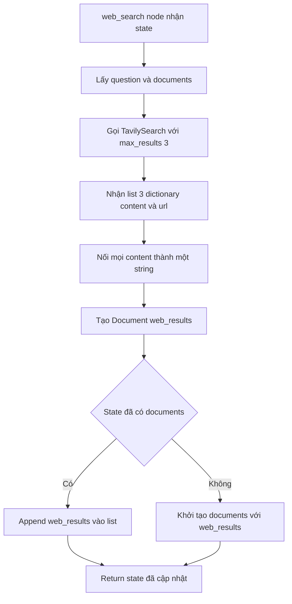

# 🌐 Web Search Node với Tavily: "Pha cứu cánh" khi Vector Store bó tay

> Nguồn: `034-Implementing-a-Web-Search-Node-in-LangGraph-using-Tavily-API.txt` · [Udemy](https://ua.udemy.com/course/langgraph/learn/lecture/43844344)

Chào các bạn, lại là Eden đây! Ở bài trước, bộ lọc độ liên quan của chúng ta đã biết cách bật cờ **web search** khi phát hiện tài liệu "rác". Vậy cắm cờ rồi thì... ai sẽ đi tìm thông tin? Câu trả lời chính là **web search node** — nhân vật chính của bài hôm nay.

Chúng ta sẽ dùng **Tavily** — một search engine được tối ưu hóa đặc biệt để "chảy" kết quả tìm kiếm trực tiếp vào ứng dụng LLM. Cùng bắt tay vào code nhé!

---

### 🔑 Chuẩn bị: API key và cấu trúc file

Việc đầu tiên, hãy chắc chắn file **`.env`** của các bạn đã có **Tavily API key**. Không có "chìa khóa" này thì mọi thứ chỉ là lý thuyết suông!

Sau đó mình tạo file mới trong thư mục `nodes` với tên **`web_search.py`**. Các import cần thiết gồm:

* `typing` — phục vụ type hinting.
* **`Document`** của LangChain — vì mình muốn chuyển kết quả tìm kiếm của Tavily thành **LangChain Document** cho đồng bộ với phần còn lại của hệ thống.
* **`TavilySearch`** — công cụ của LangChain đóng gói search engine Tavily, sẵn sàng chạy trên bất kỳ query nào chúng ta đưa vào.

Cuối cùng, mình import **GraphState** và khởi tạo công cụ tìm kiếm với **`max_results=3`** — tức là tối đa 3 kết quả mỗi lần search. Ít mà chất, các bạn ạ!

---

### 🛠️ Node `web_search`: lấy thông tin từ internet

Hàm `web_search` nhận vào `state` và trả về một dictionary để cập nhật graph. Trong thân hàm, mình lấy ra **question** và **documents**, đồng thời thêm vài dòng `print` để tiện debug.

Một điểm tinh tế cần nhớ: node này **chỉ chạy sau khi đã grade documents**, nên danh sách tài liệu lúc này đã được lọc sạch — không còn tài liệu nào không liên quan. Nghĩa là mọi document trong state đều đáng tin.

Trước khi ghép vào graph, mình debug "trần trụi" bằng khối `if __name__ == "__main__"`:

* Đặt câu hỏi **"agent memory"**.
* Đặt `documents = None` — mô phỏng tình huống chúng ta **không tìm được tài liệu liên quan nào cả**.

Khi gọi Tavily, đây là điều thú vị mình muốn các bạn tận mắt chứng kiến:

* Vì `max_results=3`, ta nhận về một **list đúng 3 phần tử**.
* Mỗi phần tử là một **dictionary** với hai key quan trọng: **`content`** và **`url`**.

---

### 🧩 Gộp kết quả thành một Document duy nhất

Mình không muốn ném 3 mảnh rời rạc cho LLM xử lý. Thay vào đó:

1. Dùng hàm `join` với `"\n"` để nối toàn bộ nội dung trong key `content` lại thành **một string khổng lồ**.
2. Tạo biến **`web_results`** là một `Document`, với `page_content` chính là string vừa nối.
3. Kiểm tra state: nếu đã có tài liệu liên quan → **append** document web vào danh sách; nếu chưa có gì → đặt `documents = [web_results]`.
4. Trả về state đã cập nhật: `documents` mới và `question` giữ nguyên.

Quy tắc cập nhật `documents` trong state:

| Tình huống state | Hành động | Lý do |
|---|---|---|
| Đã có documents liên quan | Append `web_results` vào list | Giữ tài liệu cũ, bổ sung thông tin từ web |
| Chưa có document nào | Gán `documents = [web_results]` | Web search là nguồn duy nhất lúc này |

```python
web_results = Document(page_content="\n".join([d["content"] for d in search_results]))
```

Toàn bộ node chạy theo luồng:



Cuối video, mình chỉnh lại tên file thành **`web_search`** (thêm dấu gạch dưới) cho đúng chuẩn đặt tên. Vậy là xong node tìm kiếm web — đơn giản đến bất ngờ phải không nào?

### 🎯 Tự kiểm tra nhanh

**Câu 1:** Tavily là gì và vì sao nó phù hợp với ứng dụng LLM?

<details>
<summary><b>Xem đáp án</b></summary>

**Đáp án:** Là search engine được tối ưu hóa đặc biệt để kết quả tìm kiếm "chảy" trực tiếp vào ứng dụng LLM.

Giải thích: Đây là lý do mình chọn Tavily thay vì tự gọi một search engine thông thường.

Tham chiếu: Đoạn mở đầu bài.

</details>

**Câu 2:** `max_results=3` có ý nghĩa gì?

<details>
<summary><b>Xem đáp án</b></summary>

**Đáp án:** Mỗi lần search nhận về tối đa 3 kết quả.

Giải thích: Khi debug, ta thấy đúng một list 3 phần tử — "ít mà chất".

Tham chiếu: Mục Chuẩn bị API key và cấu trúc file.

</details>

**Câu 3:** Kết quả Tavily trả về có dạng gì?

<details>
<summary><b>Xem đáp án</b></summary>

**Đáp án:** Một list các dictionary, mỗi dictionary có hai key quan trọng là `content` và `url`.

Giải thích: Ta chỉ dùng `content` để tổng hợp thành một Document duy nhất.

Tham chiếu: Mục Node web_search.

</details>

**Câu 4:** Vì sao mình gộp nội dung 3 kết quả vào một `Document` duy nhất?

<details>
<summary><b>Xem đáp án</b></summary>

**Đáp án:** Để đồng bộ với hệ thống đang dùng LangChain Document và tránh ném cho LLM nhiều mảnh rời rạc.

Giải thích: Hàm `join` với `"\n"` nối mọi `content` thành một string khổng lồ.

Tham chiếu: Mục Gộp kết quả thành một Document duy nhất.

</details>

**Câu 5:** Vì sao node này luôn nhận được danh sách documents "sạch"?

<details>
<summary><b>Xem đáp án</b></summary>

**Đáp án:** Vì node chỉ chạy sau bước grade documents — lúc đó tài liệu không liên quan đã bị lọc bỏ.

Giải thích: Mọi document trong state đều đã được kiểm duyệt, đáng tin.

Tham chiếu: Mục Node web_search.

</details>

Giờ thì graph của chúng ta đã biết "hỏi" cả vector store lẫn internet. Ở bài tiếp theo, mình sẽ cùng các bạn xây dựng **generation chain** — nơi "nấu chín" câu trả lời cuối cùng để gửi đến người dùng. Hẹn gặp lại! 🚀

## Nguồn tham khảo

- [Udemy — Implementing a Web Search Node in LangGraph using Tavily API](https://ua.udemy.com/course/langgraph/learn/lecture/43844344)
- [LangChain Docs — Tavily search integration](https://docs.langchain.com/oss/python/integrations/tools/tavily_search)
- [Tavily Docs — LangChain integration](https://docs.tavily.com/documentation/integrations/langchain)
