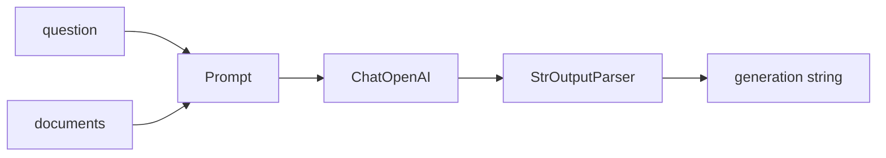

# ✍️ Generation Node: Nơi LLM "nấu chín" câu trả lời cuối cùng

> Nguồn: `035-Creating-the-LLM-Generation-Chain-and-Node-for-LangGraph.txt` · [Udemy](https://ua.udemy.com/course/langgraph/learn/lecture/43849636)

Chào các bạn, Eden đây! Trong video ngắn này, chúng ta sẽ cùng nhau hoàn thiện **generation node** — node **cuối cùng** được thực thi trong graph. Sau khi đã retrieve, lọc tài liệu và thậm chí lùng sục cả internet, giờ là lúc "thu hoạch": tổng hợp mọi thứ và giao cho LLM trả lời.

---

### 🎯 Nhìn lại hành trình trước khi generate

Hãy nhớ lại thứ tự công việc mà graph đã làm:

1. **Retrieve** thông tin và các tài liệu liên quan từ vector store.
2. **Grade & filter** — loại bỏ tài liệu không liên quan đến câu hỏi.
3. **Web search** — bổ sung kiến thức từ bên ngoài khi cần.

Khi đã có **đủ tài liệu trong tay**, chúng ta **augment (tăng cường) câu hỏi gốc** rồi "stuff" (nhồi) tất cả vào LLM để sinh câu trả lời. Đó chính là nhiệm vụ của generation node.

---

### ⚙️ Xây dựng generation chain

Mình tạo file **`generation.py`** trong module `chains` với ba import chính:

* **`hub`** từ LangChain — để tải prompt từ **LangChain Hub**.
* **`StrOutputParser`** — lấy phần `content` từ message và chuyển thành string.
* **`ChatOpenAI`** — tạo instance LLM để sinh câu trả lời.

Prompt được dùng là một **RAG prompt** rất chuẩn do **Lance Martin** — thành viên đội ngũ LangChain — viết: giao cho LLM vai trò **trợ lý trả lời câu hỏi**, đưa vào **context** (toàn bộ tài liệu retrieve hoặc kết quả web search) cùng **câu hỏi gốc**.

Chain của chúng ta cũng "chuẩn không cần chỉnh":

```python
generation_chain = prompt | llm | StrOutputParser()
```

Luồng dữ liệu của chain:



Chỉ cần invoke chain với `documents` và `question` là chúng ta nhận được câu trả lời mong muốn.

---

### ⚠️ Cập nhật quan trọng: LangChain Hub đã "chuyển nhà"

Trước khi đi tiếp, mình có một cập nhật nóng hổi theo phiên bản LangChain mới nhất. LangChain đã **deprecated (khai tử) object `hub`** và chuyển khả năng tải prompt sang **LangSmith prompt hub** thông qua **LangSmith client**:

* Dùng phương thức **`pull_prompt`** và truyền vào **prompt identifier**.
* Điểm đáng chú ý: mặc định client **sẽ không cho tải public prompt** — bạn phải bật cờ **`dangerously_pull_public_prompt_hub = True`** một cách tường minh, nếu không sẽ gặp lỗi ngay.

Ba cách lấy prompt và trade-off của chúng:

| Cách lấy prompt | Cần gì | Đặc điểm |
|---|---|---|
| `hub` cũ | LangChain Hub | Đã deprecated, không còn dùng được |
| LangSmith client `pull_prompt` | LangSmith API key, cờ cho public prompt | Prompt là executable configuration, nên pin SHA |
| Dán plain text vào code | Không cần gì | Không network call, không cần API key, biết rõ mình chạy gì |

Mình thực sự thích thay đổi này vì nó kể một câu chuyện rất hay về sự trưởng thành của LangChain: bảo mật ngày càng được đặt nặng. Theo tài liệu, việc pull prompt cần được đối xử như **executable configuration (cấu hình có thể thực thi)**, chứ không phải văn bản thuần. Vì vậy hãy tránh dùng public prompt ngoài tổ chức của bạn trừ khi đã kiểm tra và tin tưởng — và nếu buộc phải pull, hãy **pin vào một SHA/commit cụ thể** thay vì luôn lấy bản `latest`.

Cách hiện đại và được khuyến nghị hơn cả: **dán prompt dưới dạng plain text thẳng vào code**. Cách này không tạo network call, không cần LangSmith API key, và bạn biết chính xác mình đang chạy cái gì vì chính bạn viết ra nó. Đây cũng chính là nội dung mình đưa vào GitHub repository của khóa học.

*Hy vọng phần cập nhật này không làm các bạn rối — mình chỉ muốn các bạn thấy hệ sinh thái đã thay đổi và tiến hóa ra sao!*

---

### 🧪 Test & generate node

Mình thêm `test_generation_chain` — thành thật mà nói đây không phải một test "cứng" mà chỉ là **sanity check**: chạy chain với topic **agent memory**, retrieve tài liệu liên quan rồi xem in ra cái gì. Kết quả là một bản tóm tắt gọn gàng về agent memory.

Sau đó mình mở **LangSmith** để soi kỹ:

* Thấy bước **retrieval** cùng toàn bộ tài liệu được lấy về.
* Xem nội dung document và xác nhận nó liên quan đến memory.
* Trong **runnable sequence**, thấy rõ câu hỏi, vai trò *"You are an assistant"*, context được nhồi vào, và câu trả lời đã qua **output parser** thành string.

Chạy toàn bộ test — tất cả đều xanh, và mình thì luôn mê cảm giác nhìn thấy những dấu tick xanh đó!

Cuối cùng, file **`generate.py`** trong thư mục `nodes` được tạo ra: node này lấy `question` và `documents` từ state, chạy generation chain, và cập nhật key **`generation`** trong graph state bằng câu trả lời của LLM. Đơn giản vậy thôi!

### 🎯 Tự kiểm tra nhanh

**Câu 1:** Generation node nằm ở đâu trong graph?

<details>
<summary><b>Xem đáp án</b></summary>

**Đáp án:** Là node cuối cùng được thực thi, sau retrieve, grade & filter và web search.

Giải thích: Node này nhận đủ tài liệu rồi mới "nấu chín" câu trả lời.

Tham chiếu: Mục Nhìn lại hành trình trước khi generate.

</details>

**Câu 2:** Prompt RAG dùng trong bài do ai viết?

<details>
<summary><b>Xem đáp án</b></summary>

**Đáp án:** Lance Martin — thành viên đội ngũ LangChain.

Giải thích: Đây là một RAG prompt rất chuẩn, giao cho LLM vai trò trợ lý trả lời câu hỏi.

Tham chiếu: Mục Xây dựng generation chain.

</details>

**Câu 3:** Generation chain được ghép từ những thành phần nào?

<details>
<summary><b>Xem đáp án</b></summary>

**Đáp án:** `prompt | llm | StrOutputParser()`.

Giải thích: StrOutputParser lấy phần `content` từ message và chuyển thành string.

Tham chiếu: Mục Xây dựng generation chain.

</details>

**Câu 4:** Vì sao object `hub` bị deprecated và được thay bằng gì?

<details>
<summary><b>Xem đáp án</b></summary>

**Đáp án:** Thay bằng LangSmith prompt hub qua LangSmith client với phương thức `pull_prompt`.

Giải thích: Việc pull prompt được đối xử như executable configuration, bảo mật được đặt nặng hơn.

Tham chiếu: Mục Cập nhật quan trọng.

</details>

**Câu 5:** Vì sao dán prompt plain text vào code là cách được khuyến nghị?

<details>
<summary><b>Xem đáp án</b></summary>

**Đáp án:** Vì không tạo network call, không cần LangSmith API key, và bạn biết chính xác mình đang chạy gì.

Giải thích: Đây cũng là nội dung Eden đưa vào GitHub repository của khóa học.

Tham chiếu: Mục Cập nhật quan trọng.

</details>

Các mảnh ghép đã gần đủ cả rồi. Ở bài tiếp theo, chúng ta sẽ **nối tất cả node và edge lại với nhau** để tạo thành một LangGraph agent hoàn chỉnh. Hẹn gặp các bạn! 🚀

## Nguồn tham khảo

- [Udemy — Creating the LLM Generation Chain and Node for LangGraph](https://ua.udemy.com/course/langgraph/learn/lecture/43849636)
- [LangSmith Docs — Manage prompts programmatically](https://docs.langchain.com/langsmith/manage-prompts-programmatically)
