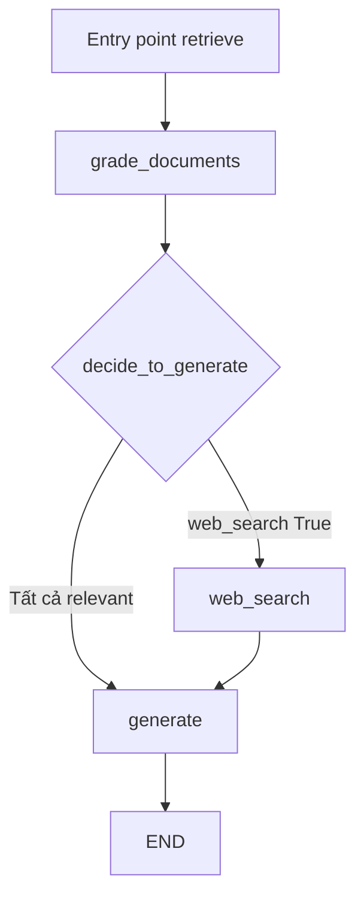

# 🧩 Lắp ráp Graph hoàn chỉnh: Khoảnh khắc mọi mảnh ghép "về chung một nhà"

> Nguồn: `036-Building-and-Running-the-Complete-LangGraph-Agent.txt` · [Udemy](https://ua.udemy.com/course/langgraph/learn/lecture/43956394)

Chào các bạn, Eden đây! Đây là khoảnh khắc mình chờ đợi nhất trong section: chúng ta sẽ **nối tất cả các node và edge** đã xây dựng thành một graph hoàn chỉnh, rồi chạy nó từ đầu đến cuối. Hồi hộp chưa nào?

---

### 🗂️ Dọn dẹp package: `__init__.py` và `const.py`

Trước khi lắp ráp, mình "dọn nhà" một chút cho gọn gàng:

* Trong file **`__init__.py`** của module `nodes`, mình import **tất cả các node** đã tạo: `generate`, `grade_documents`, `retrieve`, `web_search`.
* Để các node có thể được import từ **bên ngoài package**, mình khai báo biến **`__all__`** chứa tên các node — nhờ đó chúng "xuất khẩu" hợp lệ ra thế giới bên ngoài.
* Sang file **`const.py`**, mình định nghĩa một loạt **hằng số** chính là **tên các node** sẽ dùng trong graph. Mục đích là tránh **code duplication (lặp code)**: mọi nơi đều tham chiếu đến hằng số, nên nếu muốn đổi tên node, chỉ cần sửa **đúng một chỗ**. Ví dụ: `RETRIEVE = "retrieve"`.

---

### 🔀 Conditional edge: rẽ nhánh web search hay generate?

Đây là "ngã ba đường" quan trọng nhất của graph. Nhìn vào sơ đồ, sau **grade documents node** chúng ta có **hai edge**:

* Một edge đi tới **web search** — khi phát hiện **ít nhất một tài liệu không liên quan**.
* Một edge đi tới **generate** — khi **mọi tài liệu đều hợp lệ** và xoay quanh câu hỏi.

Hàm quyết định `decide_to_generate` nhận vào graph state và trả về node kế tiếp:

```python
def decide_to_generate(state: GraphState):
    if state["web_search"]:
        return WEB_SEARCH
    return GENERATE
```

*Nếu cờ `web_search` bật `True`, nghĩa là có tài liệu "không đạt chuẩn" — heuristic của chúng ta nói rằng hãy tìm kiếm online. Ngược lại, tất cả tài liệu đều liên quan thì đi thẳng tới generate.*

Phân biệt nhanh các loại kết nối trong graph:

| Loại kết nối | Khai báo bằng | Khi nào dùng |
|---|---|---|
| Normal edge | `add_edge` | Luôn đi thẳng từ node A sang node B |
| Conditional edge | `add_conditional_edges` | Rẽ nhánh theo state qua hàm quyết định |
| Path map | Tham số thứ ba của conditional edge | Ánh xạ giá trị hàm trả về sang node thật hoặc END |

---

### ⚙️ Kết nối mọi thứ: node, edge và entry point

Trong file **`graph.py`**, mình import `load_dotenv`, **`END`** và **`StateGraph`** từ LangGraph, toàn bộ hằng số, các node, và `GraphState` từ `states.py`. Sau đó:

1. Khởi tạo `workflow = StateGraph(GraphState)`.
2. Dùng `add_node` để thêm **bốn node**: `retrieve`, `grade_documents`, `generate`, `web_search`.
3. Đặt **entry point** là node `retrieve` — node đầu tiên chạy để lấy tài liệu.
4. Thêm edge `retrieve → grade_documents`.
5. Thêm **conditional edge** từ `grade_documents` với hàm `decide_to_generate`.
6. Thêm edge `web_search → generate`, rồi `generate → END`.

Sơ đồ graph hoàn chỉnh trông như thế này:



Về **path map** — tham số thứ ba của `add_conditional_edges`, mình truyền vào dictionary ánh xạ `{"web_search": "web_search", "generate": "generate"}`. Mình cố ý để nó ở đây để các bạn biết rằng **tùy chọn này tồn tại**: nó cực kỳ hữu ích khi hàm quyết định của bạn **không trả về tên node thật**. Ví dụ, nếu thay value `web_search` bằng `END`, bạn sẽ có một mapping hoàn toàn khác. Với hàm hiện tại thì ta chưa thực sự cần, nhưng biết vẫn hơn!

Sau khi `compile()` và in graph ra file **`graph.png`**, chúng ta đã có một orchestrator graph hoàn chỉnh.

---

### 🚀 Chạy thử và "soi" từng bước thực thi

Trong **`main.py`**, mình import graph và invoke với câu hỏi **"what is agent memory"**. Nhìn vào log, ta thấy cả hành trình:

* Retrieve tài liệu về. ✅
* Kiểm tra độ liên quan của từng document.
* Phát hiện **một tài liệu không liên quan** → kích hoạt **external search**.
* Đi vào node generate.
* Nhận về **câu trả lời chất lượng**.

Mở file `graph.png` — cấu trúc graph hiện ra y hệt sơ đồ chúng ta thiết kế. Rồi mình vào **LangSmith** để trace lần chạy cuối: thứ tự các node hiện rõ mồn một. Đặc biệt, ở bước **web search**, các bạn sẽ thấy Tavily được gọi với đúng search term **"what is agent memory"**.

### 🎯 Tự kiểm tra nhanh

**Câu 1:** Vì sao tên các node được đưa vào `const.py`?

<details>
<summary><b>Xem đáp án</b></summary>

**Đáp án:** Để tránh code duplication — muốn đổi tên node chỉ cần sửa đúng một chỗ.

Giải thích: Mọi nơi trong graph đều tham chiếu đến hằng số thay vì chuỗi cứng.

Tham chiếu: Mục Dọn dẹp package.

</details>

**Câu 2:** Biến `__all__` trong `__init__.py` có tác dụng gì?

<details>
<summary><b>Xem đáp án</b></summary>

**Đáp án:** Khai báo danh sách node được "xuất khẩu" để import từ bên ngoài package.

Giải thích: Nhờ đó các node trở nên importable từ package khác.

Tham chiếu: Mục Dọn dẹp package.

</details>

**Câu 3:** Hàm `decide_to_generate` quyết định dựa trên gì?

<details>
<summary><b>Xem đáp án</b></summary>

**Đáp án:** Cờ `web_search` trong graph state.

Giải thích: Cờ bật `True` thì đi web search, ngược lại đi thẳng tới generate.

Tham chiếu: Mục Conditional edge.

</details>

**Câu 4:** Khi nào bạn thực sự cần path map?

<details>
<summary><b>Xem đáp án</b></summary>

**Đáp án:** Khi hàm quyết định không trả về tên node thật, mà trả về giá trị trung gian cần ánh xạ sang node hoặc END.

Giải thích: Ví dụ đổi value `web_search` thành `END` sẽ cho mapping hoàn toàn khác.

Tham chiếu: Mục Kết nối mọi thứ.

</details>

**Câu 5:** Chạy `main.py` với câu hỏi "what is agent memory", graph lần lượt đi qua những node nào?

<details>
<summary><b>Xem đáp án</b></summary>

**Đáp án:** Retrieve → grade_documents (phát hiện một tài liệu không liên quan) → web_search → generate → END.

Giải thích: Kết quả cuối cùng là một câu trả lời chất lượng.

Tham chiếu: Mục Chạy thử và soi từng bước thực thi.

</details>

*Cảm giác nối được tất cả dây điện lại với nhau và thấy cỗ máy chạy trơn tru thật khó tả!* Nhưng còn một tầng nữa để agent thông minh hơn hẳn: **Self-RAG**. Hẹn gặp các bạn ở bài tiếp theo! 🚀

## Nguồn tham khảo

- [Udemy — Building and Running the Complete LangGraph Agent](https://ua.udemy.com/course/langgraph/learn/lecture/43956394)
- [LangGraph Docs — Graph API overview](https://docs.langchain.com/oss/python/langgraph/graph-api)
- [LangGraph Docs — Build a custom RAG agent with LangGraph](https://docs.langchain.com/oss/python/langgraph/agentic-rag)
