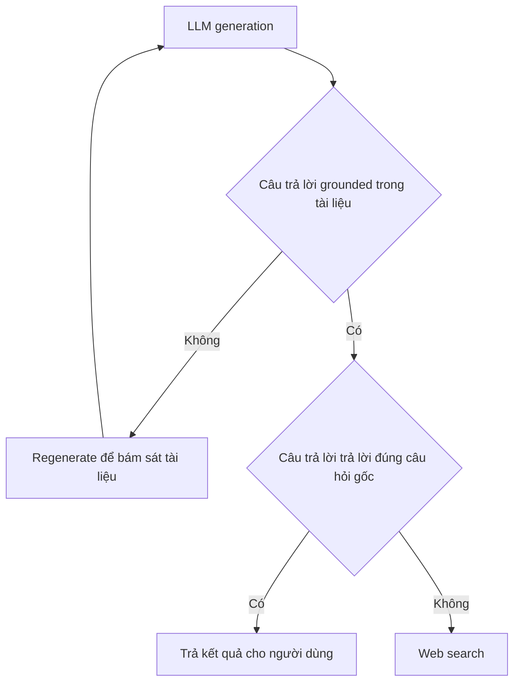

# 🪞 Self-RAG: Dạy AI "tự soi gương" trước khi trả lời (Ý tưởng cực hay!)

> Nguồn: `037-Self-RAG-Intro.txt` · [Udemy](https://ua.udemy.com/course/langgraph/learn/lecture/43978374)

Chào các bạn, Eden đây! Hy vọng các bạn đang tận hưởng dự án của chúng ta. Sau khi đã có một **Agentic RAG flow** chạy ngon lành, hôm nay mình giới thiệu một ý tưởng nâng cấp cực kỳ thú vị: **Self-RAG**.

---

### 📚 Self-RAG là gì?

Self-RAG được lấy cảm hứng từ **Self-RAG paper (bài báo Self-RAG)**, và ý tưởng cốt lõi rất trực diện: chúng ta sẽ **reflect (phản tư)** lại chính câu trả lời mà model vừa tạo ra.

Cụ thể, mình lấy **generation (câu trả lời đã sinh)** đặt cạnh **các tài liệu** và kiểm tra xem model có **hallucinate (bịa đặt/ảo giác)** hay không — tức là câu trả lời có thực sự **grounded (bám rễ)** vào nội dung tài liệu hay không.

---

### 🔍 Hai câu hỏi phản tư quyết định "số phận" câu trả lời

Quy trình Self-RAG xoay quanh hai bước kiểm tra:

1. **Câu trả lời có grounded trong tài liệu không?**
   * Nếu **có** → tuyệt vời, chúng ta chuyển sang bước thứ hai.
   * Nếu **không** (tức là model đã hallucinate) → chúng ta cần **regenerate (sinh lại)** câu trả lời để buộc nó bám sát tài liệu.
2. **Câu trả lời có thực sự trả lời đúng câu hỏi gốc của người dùng không?**
   * Nếu **có** → chúng ta tự tin trả kết quả về cho người dùng.
   * Nếu **không** → rất có thể chúng ta cần **web search**, vì trong **vector store** khó mà tìm thêm được thông tin gì mới mẻ nữa.

Toàn bộ quy trình phản tư gói gọn như sau:

---

### 🗺️ Kế hoạch bài này: làm từ A đến Z

Lý thuyết đã rõ, giờ là hành động. Trong video này mình sẽ cùng các bạn:

* Viết **các chain** đảm nhiệm việc phản tư.
* Viết **test** để kiểm chứng từng chain hoạt động đúng.
* Thêm **các node** tương ứng vào graph.
* Nối tất cả **conditional branch (nhánh điều kiện)** để luồng chạy thông minh hơn hẳn.

*Đừng lo nếu bạn thấy hơi nhiều bước — chúng ta sẽ làm chậm mà chắc, từng phần một.*

### 🎯 Tự kiểm tra nhanh

**Câu 1:** Self-RAG lấy cảm hứng từ đâu?

<b>Xem đáp án</b>

**Đáp án:** Từ Self-RAG paper (bài báo Self-RAG).

Giải thích: Đây là ý tưởng nâng cấp được giới thiệu sau khi Agentic RAG flow đã chạy ngon lành.

Tham chiếu: Mục Self-RAG là gì.

**Câu 2:** Ý tưởng cốt lõi của Self-RAG là gì?

<b>Xem đáp án</b>

**Đáp án:** Reflect (phản tư) lại chính câu trả lời model vừa tạo — so generation với tài liệu để kiểm tra xem có hallucinate không.

Giải thích: Tức là kiểm tra câu trả lời có thực sự grounded vào nội dung tài liệu hay không.

Tham chiếu: Mục Self-RAG là gì.

**Câu 3:** Nếu câu trả lời không grounded trong tài liệu thì làm gì?

<b>Xem đáp án</b>

**Đáp án:** Regenerate (sinh lại) câu trả lời để buộc nó bám sát tài liệu.

Giải thích: Đây là bước xử lý khi model đã hallucinate.

Tham chiếu: Mục Hai câu hỏi phản tư.

**Câu 4:** Nếu câu trả lời grounded nhưng không trả lời đúng câu hỏi gốc thì sao?

<b>Xem đáp án</b>

**Đáp án:** Cần web search, vì vector store khó mà tìm thêm được thông tin gì mới mẻ nữa.

Giải thích: Đây là lúc chuyển sang nguồn tri thức bên ngoài.

Tham chiếu: Mục Hai câu hỏi phản tư.

**Câu 5:** Trong video này Eden sẽ làm những phần nào?

<b>Xem đáp án</b>

**Đáp án:** Viết các chain phản tư, viết test, thêm các node tương ứng vào graph, và nối các conditional branch.

Giải thích: Làm từ A đến Z, chậm mà chắc.

Tham chiếu: Mục Kế hoạch bài này.

Hãy sẵn sàng gặp lại trong code nhé — một chút kiên nhẫn nữa thôi là các bạn sẽ làm chủ Self-RAG! 🚀

## Nguồn tham khảo

- [Udemy — Self RAG Intro](https://ua.udemy.com/course/langgraph/learn/lecture/43978374)
- [arXiv — Self-RAG: Learning to Retrieve, Generate, and Critique through Self-Reflection](https://arxiv.org/abs/2310.11511)
