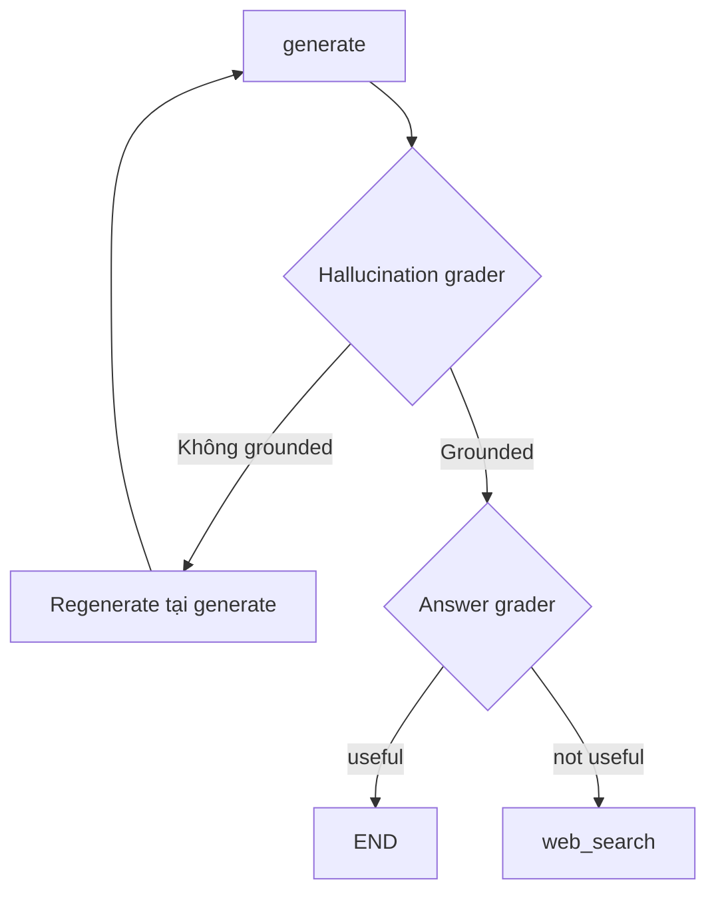

# 🛠️ Triển khai Self-RAG từ A đến Z: Hallucination Grader & Answer Grader (Bài thực hành dài)

> Nguồn: `038-Self-RAG--Implementation.txt` · [Udemy](https://ua.udemy.com/course/langgraph/learn/lecture/43979046)

Chào các bạn, Eden đây! Video này sẽ **dài hơn thường lệ** vì chúng ta triển khai trọn vẹn **Self-RAG paper** từ đầu đến cuối. Tin vui là mọi thứ sẽ dễ thở hơn nhiều, bởi chúng ta đã có sẵn cấu trúc và đã làm những việc tương tự suốt chặng đường vừa qua.

Ý tưởng chính gói gọn như sau: thay vì để `generate` đi thẳng tới `END`, chúng ta chèn thêm **một tầng phản tư (reflection layer)** ngay sau node generate, với **conditional branching** để quyết định bước tiếp theo.

---

### 🗺️ Vì sao dùng conditional edge thay vì một node mới?

Các bạn có thể thắc mắc: *"Sao không tạo một node kiểm tra grounding trong tài liệu, một node kiểm tra câu hỏi, rồi quyết định?"* — Mình hoàn toàn có thể làm vậy. Nhưng vì trong quá trình này chúng ta phải **quyết định xem nên kết thúc, sinh lại câu trả lời, hay thực hiện thêm một lần tìm kiếm**, nghĩa là phải **chọn node kế tiếp**, nên với mình **conditional branching** là lựa chọn trực quan hơn hẳn.

Kế hoạch hôm nay: viết **hallucination grader chain**, **answer grader chain**, viết test cho cả hai, rồi gắn chúng vào graph qua conditional edge.

---

### 🧠 Hallucination Grader: câu trả lời có bám vào tài liệu?

Mình tạo file **`hallucination_grader.py`** trong `chains`. Như thường lệ, ta dùng lại "tuyệt chiêu" **structured output**:

```python
class GradeHallucinations(BaseModel):
    binary_score: bool = Field(description="Answer is grounded in the facts, 'yes' or 'no'")

structured_llm_grader = llm.with_structured_output(GradeHallucinations)
hallucination_grader = hallucination_prompt | structured_llm_grader
```

Điểm đáng chú ý: `binary_score` lần này có type hint là **boolean**, nên output parser của LangChain sẽ tự động chuyển câu trả lời của LLM thành `True`/`False`.

System prompt gửi cho LLM:

> *You are a grader assessing whether an LLM generation is grounded in / supported by a set of documents. Give a binary score 'yes' or 'no'. 'yes' means that the answer is grounded / supported by the facts.*

Prompt template dùng `ChatPromptTemplate.from_messages` với **system message** và **human message** chứa *"Set of facts"* (các tài liệu) cùng **LLM generation**.

**Viết test ngay cho "software hygiene":**

* **`test_hallucination_grader_answer_yes`:** câu hỏi *"agent memory"*, retrieve tài liệu, chạy generation chain để tạo câu trả lời, rồi đưa tài liệu + generation vào grader → kỳ vọng `True`.
* **`test_hallucination_grader_answer_no`:** giữ nguyên tài liệu nhưng thay generation bằng "rác": *"in order to make pizza we first need to start with the dough"* → kỳ vọng `False`.

Trong lúc chạy test, mình gặp một lỗi nho nhỏ: **import đặt trước khi load environment variables** — sửa lại vị trí là xong, và test pass. *Các bạn cứ yên tâm, lỗi kiểu này ai cũng gặp, quan trọng là mình sửa nhanh.* Cuối cùng chạy toàn bộ test — tất cả đều xanh.

---

### 🎯 Answer Grader: câu trả lời có trả lời đúng câu hỏi?

Tiếp theo, file **`answer_grader.py`** trong `chains`:

```python
class GradeAnswer(BaseModel):
    binary_score: bool = Field(description="Answer addresses the question, 'yes' or 'no'")

structured_llm_grader = llm.with_structured_output(GradeAnswer)
answer_grader = answer_prompt | structured_llm_grader
```

System prompt:

> *You are a grader assessing whether an answer addresses / resolves the question. Give a binary score 'yes' or 'no'. 'yes' means that the answer resolves the question.*

Chat prompt template lần này ghép **system message** với **human message** chứa **câu hỏi của người dùng** và **LLM generation**. Chain này có cấu trúc gần như y hệt hallucination grader — không có kỹ thuật prompt engineering nào mới, chỉ là structured output với một Pydantic class khác.

Đặt hai grader cạnh nhau cho dễ nhớ:

| Tiêu chí | Hallucination Grader | Answer Grader |
|---|---|---|
| File | `hallucination_grader.py` | `answer_grader.py` |
| Kiểm tra điều gì | Generation có bám vào tài liệu không | Answer có trả lời đúng câu hỏi không |
| Input chính | Documents + generation | Question + generation |
| Nhánh khi không đạt | `not supported` → regenerate | `not useful` → web search |

---

### 🔀 Tích hợp vào graph và chạy thử luồng "happy flow"

Trong **`graph.py`**, mình viết hàm conditional edge **`grade_generation_v_documents_and_question(state)`**, trả về string tên node kế tiếp:

1. Lấy ra `question`, `documents`, `generation` từ state.
2. Chạy **hallucination grader**:
   * Nếu **grounded** → chạy tiếp **answer grader**:
     * Trả lời đúng câu hỏi → trả về **`"useful"`**.
     * Grounded nhưng không trả lời được câu hỏi → trả về **`"not useful"`** (vector store không đủ thông tin → cần external search).
   * Nếu **không grounded** (hallucinated) → trả về **`"not supported"`** → cần **regenerate** từ tài liệu.

Sơ đồ conditional branching sau node generate:



Điểm hay ho: mình cố tình trả về các string `"useful"` / `"not useful"` / `"not supported"` thay vì tên node, để dùng **path map** của graph:

```python
workflow.add_conditional_edges(
    GENERATE,
    grade_generation_v_documents_and_question,
    {
        "not supported": GENERATE,
        "useful": END,
        "not useful": WEB_SEARCH,
    },
)
```

Nhờ mapping này: **not supported → generate** (sinh lại), **useful → END** (trả kết quả cho người dùng), **not useful → web search**. Và một điều thú vị: những string này còn **hiển thị trực tiếp trên các edge của graph**, khiến graph của chúng ta trở nên **explainable (dễ giải thích)** hơn bao giờ hết.

Chạy `main.py` với câu hỏi **"what is agent memory"**, ta gặp ngay **happy flow**: câu trả lời grounded trong tài liệu và trả lời đúng câu hỏi. Mở **LangSmith**, chúng ta thấy toàn bộ node đã chạy — và sau node generate là **`grade_generation`**, chính là bước kích hoạt conditional branch. Hai query tới LLM đã được thực hiện để quyết định xem đây có phải câu trả lời đúng để trả về cho người dùng hay không.

### 🎯 Tự kiểm tra nhanh

**Câu 1:** Vì sao dùng conditional edge thay vì một node kiểm tra riêng?

<details>
<summary><b>Xem đáp án</b></summary>

**Đáp án:** Vì quá trình này phải chọn node kế tiếp (kết thúc, sinh lại, hay tìm kiếm thêm) nên conditional branching trực quan hơn.

Giải thích: Eden hoàn toàn có thể viết node riêng, nhưng chọn cách này cho tự nhiên.

Tham chiếu: Mục Vì sao dùng conditional edge.

</details>

**Câu 2:** `binary_score` của `GradeHallucinations` có type gì và lợi ích là gì?

<details>
<summary><b>Xem đáp án</b></summary>

**Đáp án:** Type boolean — output parser của LangChain tự động chuyển câu trả lời của LLM thành `True`/`False`.

Giải thích: Không cần tự parse chuỗi "yes"/"no".

Tham chiếu: Mục Hallucination Grader.

</details>

**Câu 3:** Ba giá trị conditional edge trả về được map như thế nào?

<details>
<summary><b>Xem đáp án</b></summary>

**Đáp án:** `not supported` → generate (sinh lại), `useful` → END, `not useful` → web_search.

Giải thích: Mapping nằm trong dictionary truyền cho `add_conditional_edges`.

Tham chiếu: Mục Tích hợp vào graph.

</details>

**Câu 4:** Lỗi nho nhỏ gặp phải khi viết test là gì và sửa ra sao?

<details>
<summary><b>Xem đáp án</b></summary>

**Đáp án:** Import được đặt trước khi load environment variables — chỉ cần đổi vị trí là test pass.

Giải thích: Lỗi kiểu này ai cũng gặp, quan trọng là sửa nhanh.

Tham chiếu: Mục Hallucination Grader.

</details>

**Câu 5:** Vì sao các string `"useful"` / `"not useful"` / `"not supported"` giúp graph explainable hơn?

<details>
<summary><b>Xem đáp án</b></summary>

**Đáp án:** Vì chúng hiển thị trực tiếp trên các edge của graph, nhìn là hiểu ngay ý nghĩa từng nhánh.

Giải thích: Thay vì tên node khô khan, các nhãn này kể câu chuyện của luồng chạy.

Tham chiếu: Mục Tích hợp vào graph.

</details>

Workflow của chúng ta giờ đã phức tạp và "người lớn" hơn rất nhiều. Còn một mảnh ghép cuối cùng của section: **Adaptive RAG** — bộ định tuyến câu hỏi thông minh. Hẹn gặp các bạn ở bài cuối nhé! 🚀

## Nguồn tham khảo

- [Udemy — Self RAG- Implementation](https://ua.udemy.com/course/langgraph/learn/lecture/43979046)
- [arXiv — Self-RAG: Learning to Retrieve, Generate, and Critique through Self-Reflection](https://arxiv.org/abs/2310.11511)
- [LangGraph Docs — Graph API overview](https://docs.langchain.com/oss/python/langgraph/graph-api)
