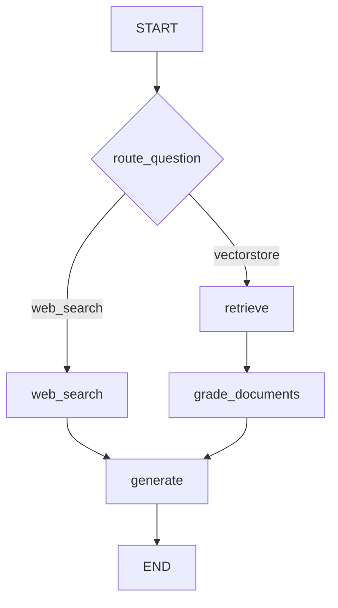

# 🧭 Adaptive RAG: Bộ định tuyến câu hỏi thông minh (Vector Store hay Web Search?)

> Nguồn: `039-Adaptive-RAG--Implementation.txt` · [Udemy](https://ua.udemy.com/course/langgraph/learn/lecture/44086612)

Chào các bạn, Eden đây! Chúng ta đã đến phần cuối cùng của section này rồi. Hôm nay mình sẽ triển khai một phiên bản của **Adaptive RAG (RAG thích ứng)** — dựa trên một **research paper (bài báo nghiên cứu)** mà các bạn thấy trên màn hình.

Thành thật mà nói, đây chỉ là một cái tên "kêu" cho một ý tưởng rất gọn gàng: dùng **question router (bộ định tuyến câu hỏi)** để đưa câu hỏi đi theo những **RAG flow** khác nhau.

---

### 📚 Hai luồng RAG và bài toán định tuyến

Trong bài này chúng ta dùng **hai RAG flow**:

1. **Định tuyến ra internet:** tìm kiếm trên web rồi tiếp tục "thuận dòng" theo đúng logic chúng ta đã xây dựng trước đó.
2. **Retrieval augmentation từ vector store:** dùng dữ liệu đã index sẵn trong vector store.

Bảng đối chiếu hai route:

| Route | Khi nào được chọn | Nguồn trả lời |
|---|---|---|
| `vectorstore` | Câu hỏi về agents, prompt engineering, adversarial attacks | Retrieval augmentation từ dữ liệu đã index |
| `web_search` | Mọi chủ đề còn lại | Tavily search trên internet |

Cách vận hành: nhận **câu hỏi của người dùng** → quyết định xem **vector store có chứa thông tin để trả lời hay không**. Nếu không có → đi thẳng vào nhánh **web search** và trả lời từ đó.

Nhiệm vụ chính của chúng ta: viết **question router chain**, viết test, và tích hợp vào graph bằng **`set_conditional_entry_point`**.

---

### ⚙️ Router chain: `Literal` và structured output

Mình tạo file **`router.py`** trong `chains`. Import đầu tiên đáng chú ý là **`Literal`** từ `typing` — nếu các bạn chưa quen, nó cho phép khai báo rằng một biến **chỉ được nhận một trong các giá trị định trước**, cực kỳ hữu ích cho **validation** và **type checking**.

Pydantic class `RouteQuery` có duy nhất một attribute `data_source`, cùng field với **`...` (ellipsis)** — nghĩa là field này **bắt buộc** khi khởi tạo object:

```python
class RouteQuery(BaseModel):
    data_source: Literal["vectorstore", "web_search"] = Field(
        ...,
        description="Given a user question, choose to route it to web search or vector store.",
    )
```

Sau đó mình tạo LLM với **structured output** gắn class này — về bản chất là **bind** Pydantic class thành một **function call**, đúng như kỹ thuật chúng ta đã dùng nhiều lần trong khóa học.

System prompt là "kim chỉ nam" cho router:

> *You are an expert at routing a user question to a vectorstore or web search. The vectorstore contains documents related to agents, prompt engineering, and adversarial attacks. Use the vectorstore for questions on those topics. For everything else, use web search.*

Các chủ đề **agents**, **prompt engineering** và **adversarial attacks** chính là nội dung chúng ta đã ingest vào vector store từ video đầu tiên của section. Cuối cùng, `question_router = route_prompt | structured_llm_router`.

---

### 🧪 Test router: một câu vào vector store, một câu ra web

*Với mình, viết test cho chain là phần "vệ sinh phần mềm" bắt buộc — và lần này lại là một động tác cực kỳ quen thuộc.* Trong `test_chains.py`, mình import `question_router` và class `RouteQuery`, **đặt import sau bước load `.env`** để tránh mọi rắc rối về biến môi trường.

Hai test cần có:

* **`test_router_to_vectorstore`:** đặt câu hỏi **"agent memory"** → invoke chain, nhận về object `RouteQuery` → assert `data_source == "vectorstore"`. Kết quả: pass.
* **`test_router_to_websearch`:** đổi câu hỏi thành **"how to make pizza"** → assert `data_source == "web_search"`. Kết quả: pass.

Chạy toàn bộ test — tất cả xanh mướt. *Mình thừa nhận, như mọi lập trình viên, nhìn thấy chuỗi dấu tick xanh là một cảm giác rất đã!* Một ghi chú nhỏ cho tương lai: hoàn toàn có thể **tối ưu bằng cách chạy test song song (concurrently)** vì chúng không phụ thuộc nhau — nhưng chuyện đó để dịp khác trong khóa học nhé.

---

### 🚀 Conditional Entry Point: "cửa ngõ" mới của graph

Đây là điểm mới mẻ của bài: graph của chúng ta giờ bắt đầu bằng một **conditional entry point**. Nói một cách dễ hiểu, đây chính là **conditional edge tại node đầu tiên (entry point)** — tức là ngay từ "cửa vào", graph đã biết phải rẽ về `retrieve` hay `web_search`.

Trong `graph.py`, mình viết hàm `route_question(state)`:

* Lấy `question` từ graph state, in log để tiện theo dõi.
* Invoke `question_router` và lưu kết quả vào biến `source` (một `RouteQuery`).
* Nếu `data_source == "web_search"` → trả về `"web_search"`; nếu là vector store → trả về `"retrieve"`.

Sau đó gắn vào workflow:

```python
workflow.set_conditional_entry_point(
    route_question,
    {"web_search": WEB_SEARCH, "retrieve": RETRIEVE},
)
```

Sơ đồ luồng với conditional entry point:



Và chỉ có thế — **không thêm node mới nào cả**, chỉ một conditional edge từ entry point.

Chạy `main.py` với **"what is agent memory"**: router quyết định đi vào **vector store** để retrieval augmentation, rồi phần còn lại của luồng diễn ra y như chúng ta đã biết. Mở **LangSmith** để xem trace và toàn bộ node tham gia. Rồi mình đổi câu hỏi thành **"how to make pizza"** — lần này router chuyển hướng sang **web search**, Tavily được kích hoạt và luồng tiếp tục từ đó. Và câu trả lời cuối cùng vẫn đến đúng nơi cần đến.

### 🎯 Tự kiểm tra nhanh

**Câu 1:** Theo Eden, Adaptive RAG thực chất là gì?

<details>
<summary><b>Xem đáp án</b></summary>

**Đáp án:** Là cái tên "kêu" cho một ý tưởng gọn gàng — dùng question router để đưa câu hỏi đi theo các RAG flow khác nhau.

Giải thích: Bài này dùng hai flow là web search và retrieval augmentation từ vector store.

Tham chiếu: Đoạn mở đầu bài.

</details>

**Câu 2:** `Literal` từ `typing` dùng để làm gì?

<details>
<summary><b>Xem đáp án</b></summary>

**Đáp án:** Khai báo rằng biến chỉ được nhận một trong các giá trị định trước — hữu ích cho validation và type checking.

Giải thích: `data_source` chỉ có thể là `"vectorstore"` hoặc `"web_search"`.

Tham chiếu: Mục Router chain.

</details>

**Câu 3:** Dấu `...` trong `Field` của `RouteQuery` có ý nghĩa gì?

<details>
<summary><b>Xem đáp án</b></summary>

**Đáp án:** Field đó là bắt buộc khi khởi tạo object.

Giải thích: Thiếu `data_source` thì không thể tạo `RouteQuery` hợp lệ.

Tham chiếu: Mục Router chain.

</details>

**Câu 4:** Vector store chứa các chủ đề gì và điều đó ảnh hưởng thế nào tới router?

<details>
<summary><b>Xem đáp án</b></summary>

**Đáp án:** Chứa tài liệu về agents, prompt engineering và adversarial attacks — câu hỏi thuộc các chủ đề này đi vectorstore, còn lại đi web search.

Giải thích: Đây chính là nội dung đã ingest vào vector store từ video đầu tiên của section.

Tham chiếu: Mục Router chain.

</details>

**Câu 5:** `set_conditional_entry_point` khác gì entry point thông thường?

<details>
<summary><b>Xem đáp án</b></summary>

**Đáp án:** Nó là conditional edge ngay tại entry point — graph biết rẽ về `retrieve` hay `web_search` ngay từ "cửa vào", không cần thêm node mới.

Giải thích: Đây là điểm mới mẻ của bài.

Tham chiếu: Mục Conditional Entry Point.

</details>

Vậy là chúng ta đã hoàn thành **advanced RAG flow** của mình — một agent biết tự quyết định nguồn tri thức, tự kiểm tra câu trả lời và tự sửa sai. Tự hào về các bạn lắm! Hẹn gặp lại ở những chặng đường tiếp theo của khóa học. 🚀

## Nguồn tham khảo

- [Udemy — Adaptive RAG- Implementation](https://ua.udemy.com/course/langgraph/learn/lecture/44086612)
- [arXiv — Adaptive-RAG: Learning to Adapt Retrieval-Augmented Large Language Models through Question Complexity](https://arxiv.org/abs/2403.14403)
