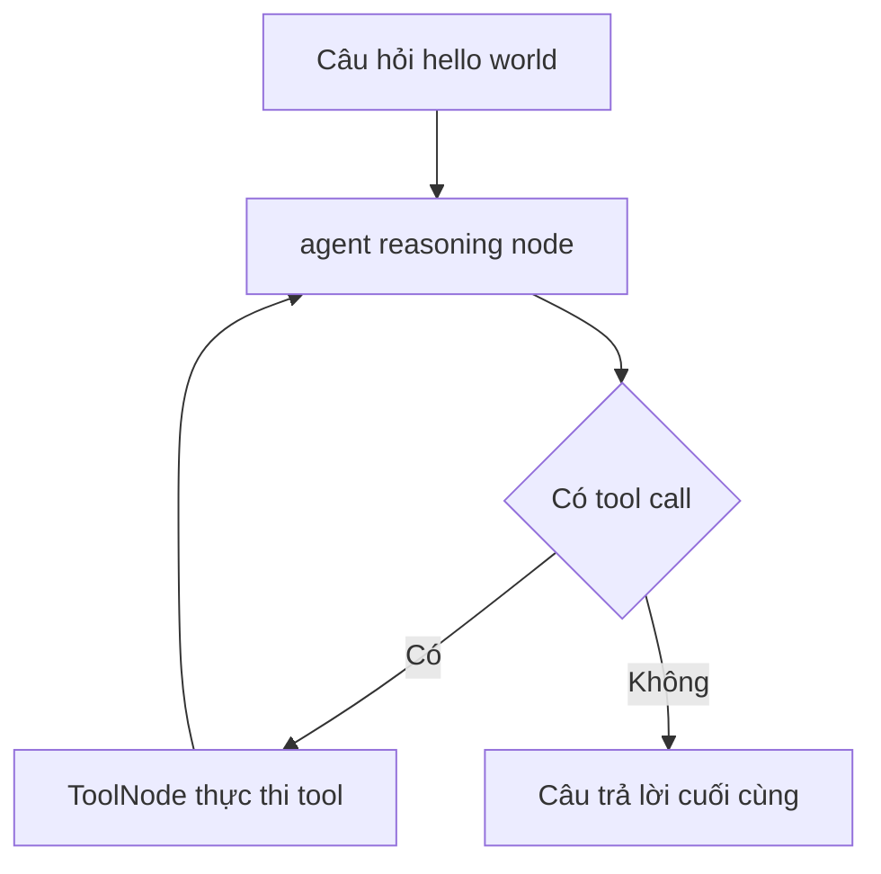

# 🎯 Chúng ta sẽ xây dựng gì? ReAct AgentExecutor trên LangGraph (Dự án "Hello World" của Agent)

> Nguồn: `040-What-are-we-building-ReAct-AgentExecutor-in-LangGraph.txt` · [Udemy](https://ua.udemy.com/course/langgraph/learn/lecture/43638176)

Chào các bạn, mình là Eden đây! 👋

Sang section mới này, chúng ta sẽ cùng nhau **hiện thực hóa một ReAct agent executor — nhưng lần này là với LangGraph**. Đây là dự án mình rất tâm đắc, và ngay dưới đây mình sẽ chia sẻ lý do vì sao.

---

### 🧩 Vì sao mình chọn dự án này?

Lý do đầu tiên rất đơn giản: dự án này thể hiện rõ nhất **việc dùng graph (đồ thị) để mô tả luồng chạy của agent dễ dàng đến mức nào**. Đặc biệt là với **ReAct agent** — thuật toán vốn khá khó hiểu — khi đưa lên graph, mọi thứ trở nên cực kỳ dễ triển khai.

Bên cạnh đó, chúng ta sẽ **đi sâu vào graph state (trạng thái của đồ thị)** và học cách **tự định nghĩa một custom state (trạng thái tùy chỉnh)** cho riêng mình.

Kết quả cuối cùng của section: các bạn sẽ có một **agent executor hoạt động được**, dùng thuật toán ReAct nhưng được implement bằng graph. Cụ thể:

* Agent được **trang bị tools (công cụ)**: một **search tool (công cụ tìm kiếm)** và một **custom tool do chính chúng ta viết**.
* Agent sẽ chạy graph có **một vòng lặp (loop)**, tự quyết định có dùng tool hay không, và cuối cùng đưa ra câu trả lời cho chúng ta.

Và câu hỏi "hello world" mà chúng ta sẽ hỏi agent là: **"Thời tiết ở San Francisco thế nào? Và nhân kết quả đó lên ba lần giúp mình."** Nghe có vẻ đơn giản, nhưng đây chính là ví dụ kinh điển của mọi agent.

---

### 🔄 Một lần quay lại: tool node và function calling

Một cập nhật nho nhỏ trước khi bắt đầu: đây là mình của **một năm sau**, với ít tóc hơn một chút và vài ký cân thừa. Vì LangChain đang ngày càng nghiêng về LangGraph khi nói đến việc xây dựng và triển khai agent, mình đã **quay lại toàn bộ section này** để bám sát các phiên bản mới nhất của LangGraph.

Phiên bản mới này dùng:

1. **Tool node (nút thực thi công cụ)** dựng sẵn của LangGraph.
2. **Function calling (gọi hàm)** — giúp agent của chúng ta trở nên **mạnh mẽ (robust)** và **đáng tin cậy (trustworthy)** hơn hẳn.

---

### 💡 Một lưu ý quan trọng về nền tảng

Trong thế giới Generative AI, **mọi thứ đều được xây dựng chồng lên nhau**. Vì vậy, hiểu cách **thuật toán ReAct hoạt động cùng ReAct prompt** theo cách "cũ" là điều — theo mình — **cực kỳ quan trọng**.

*Khi các bạn hiểu được phần nền tảng và biết mọi thứ bắt nguồn từ đâu, mọi thứ còn lại sẽ tự nhiên trở nên dễ hiểu.*

Nếu các bạn đã tự tay implement ReAct executor ở section trước, thì section này sẽ nhẹ nhàng hơn rất nhiều: các bạn đã nắm concepts, đã hiểu ý tưởng, đã thấy mọi thứ tiến hóa ra sao — và giờ chỉ là nâng lên một tầm hiểu biết sâu hơn về agent mà thôi.

### 🎯 Tự kiểm tra nhanh

**Câu 1:** Vì sao mình chọn dự án ReAct agent executor bằng graph?

<b>Xem đáp án</b>

**Đáp án:** Vì nó cho thấy dùng graph mô tả luồng chạy của agent — đặc biệt là ReAct — dễ đến mức nào.

Giải thích: ReAct vốn khá khó hiểu, nhưng khi đưa lên graph thì triển khai cực kỳ dễ.

Tham chiếu: Mục Vì sao mình chọn dự án này.

**Câu 2:** Section này sẽ đi sâu vào hai thứ nào?

<b>Xem đáp án</b>

**Đáp án:** Graph state và cách tự định nghĩa một custom state.

Giải thích: Đây là nền tảng để hiểu cách graph mang state qua các node.

Tham chiếu: Mục Vì sao mình chọn dự án này.

**Câu 3:** Agent trong dự án được trang bị những tool gì?

<b>Xem đáp án</b>

**Đáp án:** Một search tool và một custom tool do chính chúng ta viết.

Giải thích: Agent tự quyết định có dùng tool hay không nhờ vòng lặp trong graph.

Tham chiếu: Mục Vì sao mình chọn dự án này.

**Câu 4:** Phiên bản cập nhật của section dùng những gì?

<b>Xem đáp án</b>

**Đáp án:** Tool node dựng sẵn của LangGraph và function calling.

Giải thích: Nhờ đó agent trở nên robust và trustworthy hơn hẳn.

Tham chiếu: Mục Một lần quay lại.

**Câu 5:** Vì sao cần hiểu thuật toán ReAct và ReAct prompt theo cách "cũ"?

<b>Xem đáp án</b>

**Đáp án:** Vì mọi thứ trong Generative AI đều xây chồng lên nhau; hiểu nền tảng thì phần còn lại tự nhiên dễ hiểu.

Giải thích: Biết mọi thứ bắt nguồn từ đâu giúp nắm các abstraction mới nhanh hơn.

Tham chiếu: Mục Một lưu ý quan trọng về nền tảng.

Hãy sẵn sàng nhé, ngay bài tiếp theo chúng ta sẽ bắt tay vào setup project. Hẹn gặp lại các bạn! 🚀

## Nguồn tham khảo

- [Udemy — What are we building? ReAct AgentExecutor in LangGraph](https://ua.udemy.com/course/langgraph/learn/lecture/43638176)
- [LangGraph overview — Docs by LangChain](https://docs.langchain.com/oss/python/langgraph/overview)
