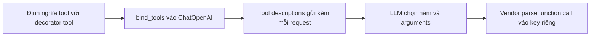

# 🧠 Lập trình "bộ não" của Agent: Hiện thực ReAct Runnable với Function Calling

> Nguồn: `042-Coding-the-Agents-Brain-Implementing-the-ReAct-Runnable.txt` · [Udemy](https://ua.udemy.com/course/langgraph/learn/lecture/50657813)

Chào các bạn, mình là Eden đây! 👋

Trong bài này chúng ta sẽ implement file **`react.py`** — nơi chứa **toàn bộ logic suy luận (reasoning logic)** mà graph sẽ dùng. Nói ngắn gọn (TL;DR): chúng ta sẽ dùng **function calling (gọi hàm)** làm **reasoning engine (bộ máy suy luận)** để agent tự quyết định gọi tool nào.

---

### 📦 Imports và hai tool của agent

Bắt đầu với các import:

* Từ `dotenv` — hàm `load` để nạp biến môi trường và API keys.
* Từ `langchain_core` — **`tool` decorator**, giúp biến một hàm chúng ta tự viết thành **LangChain tool (công cụ)**.
* Từ `langchain_openai` — **`ChatOpenAI`**, để gọi LLM của GPT.
* Từ `langchain_tavily` — **`TavilySearch`**, một **search tool dựng sẵn (pre-made)** có thể "cắm" thẳng vào agent.

Sau khi load biến môi trường, đến phần thú vị nhất: viết tool. Chúng ta cần một **triple tool** — hàm nhận vào một số (int hoặc float) và trả về số đó nhân ba. Mình chỉ gõ phần đầu của hàm thôi, và **Cursor tự động hoàn thiện (auto-complete)** phần còn lại. *Thật lòng mà nói, mình vẫn thấy việc lập trình đã thay đổi đến mức "không tưởng" nhờ LLM — mọi thứ trở nên dễ dàng và tiện lợi hơn rất nhiều.*

```python
@tool
def triple(num: float) -> float:
    return num * 3
```

Hàm này đi kèm **description (mô tả)** — phần mô tả đó sẽ được **propagate (truyền) tới LLM**, và LLM dựa vào nó để quyết định có dùng hàm hay không. Chỉ cần thêm **decorator `@tool`** là ta có ngay một LangChain tool để mang đi sử dụng.

Giờ hãy trang bị cho agent **hai tool** bằng cách khai báo một list `tools`:

```python
tools = [TavilySearch(max_results=1), triple]
```

* Phần tử đầu tiên là **TavilySearch khởi tạo với `max_results=1`** — giới hạn search chỉ trả về **đúng một kết quả**. Tiện thể, tool này đã có **description dựng sẵn** do nhóm maintainer của package viết, và nó cũng sẽ được truyền tới LLM.
* Phần tử thứ hai là **triple tool** mà chúng ta vừa implement.

---

### 🔍 Từ ReAct prompt đến Function Calling

Giờ hãy bàn về khả năng suy luận của LLM: làm sao nó biết đường gọi tool nào? Đến đây hẳn các bạn đã quen với **thuật toán ReAct** và **ReAct prompt** — một loại prompt rất đặc biệt, phái sinh từ **bài báo ReAct**, giúp khai thác năng lực suy luận của LLM. Thời kỳ đầu của agent, mọi người dùng chính prompt đặc biệt này để LLM quyết định gọi tool nào. Ngày nay mọi thứ đã tiến hóa và chúng ta có cách làm tốt hơn — nhưng tất cả đều bắt nguồn từ prompt đặc biệt đó.

Thứ mình đang nói tới là **function calling**: một tính năng có trong hầu hết các LLM hiện đại. Khi khởi tạo LLM, chúng ta truyền cho nó **định nghĩa, hướng dẫn và thông tin chi tiết của các tool**; LLM sẽ trả về trong response xem có cần gọi hàm nào và với **arguments (đối số)** gì.

| Tiêu chí | ReAct prompt | Function calling |
|---|---|---|
| Cách chọn tool | Prompt đặc biệt hướng dẫn LLM suy luận | LLM trả về function call field trong response |
| Ai parse response | Chúng ta tự xử lý trong code | Vendor parse và đặt vào key riêng |
| Lượng code | Nhiều hơn | Ít hơn hẳn |
| Trạng thái hiện nay | Cách làm thời kỳ đầu | Cách hiện đại, vendor tinh chỉnh liên tục |

Chúng ta thực sự không "thấy" phần implementation bên trong của các nhà cung cấp LLM — mỗi vendor làm một kiểu. Nhiều khả năng đó là một **system prompt đặc biệt** tương tự ReAct prompt, giúp LLM chọn tool và trả kết quả đúng định dạng. Điểm khác biệt lớn: **vendor chịu trách nhiệm parse response**, sắp xếp mọi thứ gọn gàng và đặt function call vào đúng key trong response trả về.

*Đừng lo nếu các bạn chưa hiểu hết phần này.* Điều cần nhớ là: đây chính là **cách hiện đại để chọn tool**, và chúng ta đang **"outsource" việc chọn tool cho LLM vendor**. Nhờ đó code ít hơn hẳn so với trước, và kết quả chỉ ngày càng tốt lên vì các vendor có những kỹ sư chuyên trách tinh chỉnh việc này.



---

### 🔗 Bind tools vào LLM

Đã đến lúc implement khả năng suy luận cho agent. Khác với cách làm cũ, chúng ta sẽ **không dùng ReAct prompt** nữa — ta có thứ tốt hơn là function calling. Ta khởi tạo một LLM hỗ trợ function calling và đưa cho nó các tool đã định nghĩa; cả search tool lẫn triple tool đều là LangChain tool có kèm mô tả về những arguments mà chúng nhận.

```python
from langchain_openai import ChatOpenAI

llm = ChatOpenAI().bind_tools(tools)
```

Phương thức **`bind_tools`** sẽ đưa danh sách tool vào LLM. LangChain lấy **tool descriptions** và gửi kèm trong **mỗi request** chúng ta thực hiện, để LLM có thể trả về **function call / tool calling field** với đúng hàm cần gọi. Chúng ta không phải parse gì cả — vendor lo hết, và nếu có function call thì nó nằm trong một **key riêng** của response.

Mình chạy thử script để chắc chắn mọi thứ không lỗi (dù hiện tại chưa chạy gì cả), rồi **commit** với tên **function calling reasoning** và push lên repository — các bạn có thể xem code trong commit đó.

### 🎯 Tự kiểm tra nhanh

**Câu 1:** Function calling được dùng làm gì trong bài này?

<details>
<summary><b>Xem đáp án</b></summary>

**Đáp án:** Làm reasoning engine để agent tự quyết định gọi tool nào.

Giải thích: Đây là TL;DR của cả file `react.py`.

Tham chiếu: Đoạn mở đầu.

</details>

**Câu 2:** `bind_tools` làm gì với LLM?

<details>
<summary><b>Xem đáp án</b></summary>

**Đáp án:** Đưa danh sách tool vào LLM; LangChain gửi kèm tool descriptions trong mỗi request.

Giải thích: Nhờ đó LLM có thể trả về function call field với đúng hàm cần gọi.

Tham chiếu: Mục Bind tools vào LLM.

</details>

**Câu 3:** Vì sao không cần ReAct prompt nữa?

<details>
<summary><b>Xem đáp án</b></summary>

**Đáp án:** Vì function calling để vendor parse response và đặt function call vào key riêng.

Giải thích: Code ít hơn hẳn và kết quả tốt lên nhờ vendor tinh chỉnh liên tục.

Tham chiếu: Mục Từ ReAct prompt đến Function Calling.

</details>

**Câu 4:** Tool description ảnh hưởng gì tới LLM?

<details>
<summary><b>Xem đáp án</b></summary>

**Đáp án:** Description được propagate tới LLM để nó quyết định có dùng hàm hay không.

Giải thích: Cả search tool lẫn triple tool đều có description đi kèm.

Tham chiếu: Mục Imports và hai tool của agent.

</details>

**Câu 5:** `TavilySearch(max_results=1)` nghĩa là gì?

<details>
<summary><b>Xem đáp án</b></summary>

**Đáp án:** Giới hạn search chỉ trả về đúng một kết quả.

Giải thích: Tool này có description dựng sẵn do nhóm maintainer viết và cũng được truyền tới LLM.

Tham chiếu: Mục Imports và hai tool của agent.

</details>

Bài sau chúng ta sẽ implement các **LangGraph node** — những "executable" sẽ chạy trong quá trình thực thi. Hẹn gặp lại các bạn! 🚀

## Nguồn tham khảo

- [Udemy — Coding the Agent's Brain: Implementing the ReAct Runnable](https://ua.udemy.com/course/langgraph/learn/lecture/50657813)
- [Tools — Docs by LangChain](https://docs.langchain.com/oss/python/langchain/tools)
- [bind_tools — langchain_openai Reference](https://reference.langchain.com/python/langchain-openai/chat_models/base/BaseChatOpenAI/bind_tools)
