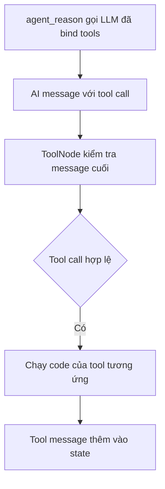

# 🧱 Building Blocks: Định nghĩa các Node của Agent trong LangGraph (Reasoning Node & ToolNode)

> Nguồn: `043-Building-Blocks-Defining-Your-Agents-Nodes-in-LangGraph.txt` · [Udemy](https://ua.udemy.com/course/langgraph/learn/lecture/50657819)

Chào các bạn, mình là Eden đây! 👋

Sang bài này chúng ta mở file **`node.py`** và implement các **node (nút)** — những khối xây dựng nên graph của agent: node suy luận và node thực thi tool. Nghe có vẻ nhiều, nhưng nhờ các primitive (khối nguyên thủy) mà LangGraph cung cấp, code sẽ ngắn hơn các bạn tưởng đấy.

---

### 📥 Imports và MessagesState

Đầu tiên, import `load_dotenv` từ `dotenv` để nạp biến môi trường, rồi import các primitive từ `langgraph.graph`: **`Graph`** và **`MessagesState`**.

**`MessagesState`** là một object đơn giản, chứa một dictionary với key **`messages`** — bên trong là **danh sách các message**. Nó sẽ **theo dõi trạng thái của toàn bộ message** qua lại giữa agent: **human message** và **AI message**.

Tiếp theo, import từ `langgraph.prebuilt` một node dựng sẵn tên là **`ToolNode`**. Đây là node chuyên **thực thi tool**: nó kiểm tra **message cuối cùng** giữa agent và human; nếu message cuối là một **AI message có tool call hợp lệ**, nó sẽ chạy code của tool tương ứng — miễn là `ToolNode` được khởi tạo với object tools. Nếu agent quyết định chạy search hoặc gọi hàm triple, mọi thứ sẽ diễn ra bên trong node này.

Cuối cùng, import từ `react.py`: **LLM đã bind tools** và **danh sách tools**. Sau đó gọi `load_dotenv()`.

---

### 🤖 Node suy luận: agent_reason

Ta bắt đầu với một **system message** chung chung: *"You are a helpful assistant with access to tools that you can use to answer the question."*

Rồi đến **node đầu tiên — agent reasoning node**. Node nhận vào **state (MessagesState)** — một dictionary có key `messages` — và làm đúng một việc: **gọi LLM với input của người dùng**. Vì LLM đã được bind tools và dùng function calling, nó sẽ "gánh" toàn bộ phần suy luận:

```python
def agent_reason(state: MessagesState):
    response = llm.invoke(
        [{"role": "system", "content": system_message}, *state["messages"]]
    )
    return {"messages": [response]}
```

*Ở lần lặp đầu tiên, state chỉ có một **human message**; lần lặp thứ hai sẽ có thêm response của agent, rồi cứ thế tiếp tục — mọi thông tin đều nằm trong `messages`.* Mình truy cập key `messages` trong state bằng cú pháp dictionary key thay vì Python property, để **an toàn hơn về sau**.

Sau khi node chạy xong, ta **cập nhật state** bằng cách return một dictionary có key `messages` chứa một list — trong list đó là response từ LLM (một **AI message**). Giá trị này sẽ được **append** vào state, nối thêm một message mới bên cạnh những message đã có.

---

### 🔧 Node thực thi tool: ToolNode

Node này giúp LangGraph chạy các tool mà chúng ta cần. Ta khởi tạo một object `ToolNode` từ `langgraph.prebuilt` và truyền vào **hai LangChain tool**: search tool và triple (multiply) tool.

```python
from langgraph.prebuilt import ToolNode

tool_node = ToolNode(tools)
```

Node này **gánh rất nhiều việc nặng**: nó có thể chạy tool **song song (parallel)**, chạy ở **streaming mode**, và còn nhiều tính năng hay ho khác. Trong bài này chúng ta chỉ dùng **phiên bản vanilla (mặc định)** thôi.



*Trước khi có object này, chúng ta từng phải viết rất nhiều boilerplate code chỉ để chạy tool trong graph — giờ thì mọi thứ đã gọn gàng hơn hẳn.*

| Node | Nhiệm vụ | Cách triển khai |
|---|---|---|
| `agent_reason` | Gọi LLM đã bind tools để suy luận | Hàm Python nhận MessagesState, trả về AI message |
| `ToolNode` | Kiểm tra message cuối và thực thi tool call | Object dựng sẵn từ `langgraph.prebuilt` |

Cuối cùng, mình **commit** các thay đổi với tên **notes** và push lên repository để các bạn tiện tham khảo.

### 🎯 Tự kiểm tra nhanh

**Câu 1:** `MessagesState` chứa gì và có vai trò gì?

<details>
<summary><b>Xem đáp án</b></summary>

**Đáp án:** Một dictionary với key `messages` chứa danh sách message; nó theo dõi state của toàn bộ message qua lại giữa agent.

Giải thích: Gồm cả human message và AI message.

Tham chiếu: Mục Imports và MessagesState.

</details>

**Câu 2:** Node `agent_reason` làm gì và trả về gì?

<details>
<summary><b>Xem đáp án</b></summary>

**Đáp án:** Gọi LLM với system message và state messages, rồi trả về dictionary `messages` chứa AI message.

Giải thích: Giá trị trả về được append vào state.

Tham chiếu: Mục Node suy luận agent_reason.

</details>

**Câu 3:** `ToolNode` quyết định chạy tool dựa trên gì?

<details>
<summary><b>Xem đáp án</b></summary>

**Đáp án:** Kiểm tra message cuối cùng; nếu là AI message có tool call hợp lệ thì chạy code của tool tương ứng.

Giải thích: Điều kiện là ToolNode được khởi tạo với object tools.

Tham chiếu: Mục Imports và MessagesState, mục Node thực thi tool.

</details>

**Câu 4:** Vì sao các node không cần prompt đặc biệt?

<details>
<summary><b>Xem đáp án</b></summary>

**Đáp án:** Vì LLM đã bind tools và dùng function calling, nó tự "gánh" phần suy luận.

Giải thích: Nhờ vậy code ngắn hơn nhiều nhờ LangGraph primitive.

Tham chiếu: Đoạn kết bài.

</details>

**Câu 5:** `ToolNode` có những khả năng gì và bài này dùng phiên bản nào?

<details>
<summary><b>Xem đáp án</b></summary>

**Đáp án:** Chạy tool song song, streaming mode và nhiều tính năng khác; bài này chỉ dùng bản vanilla mặc định.

Giải thích: Trước đây phải viết rất nhiều boilerplate mới chạy được tool trong graph.

Tham chiếu: Mục Node thực thi tool ToolNode.

</details>

Vậy là các graph node đã hoàn thành mà không cần viết nhiều code, nhờ dùng các **LangGraph primitive** và **function calling** — LLM tự làm phần reasoning, không cần prompt đặc biệt gì cả. Bài sau, chúng ta sẽ **ghép mọi thứ lại** và dựng nên graph hoàn chỉnh. Hẹn gặp lại các bạn! 🚀

## Nguồn tham khảo

- [Udemy — Building Blocks: Defining Your Agent's Nodes in LangGraph](https://ua.udemy.com/course/langgraph/learn/lecture/50657819)
- [ToolNode — langgraph.prebuilt Reference](https://reference.langchain.com/python/langgraph.prebuilt/tool_node/ToolNode)
- [Graph API overview — Docs by LangChain](https://docs.langchain.com/oss/python/langgraph/graph-api)
