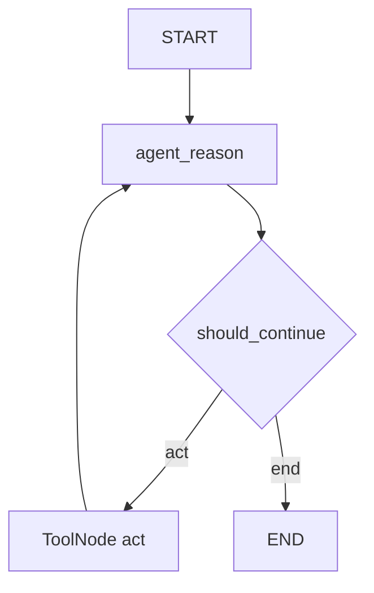

# 🕸️ Bringing Your ReAct Agent to Life: Nối các Node thành Graph hoàn chỉnh

> Nguồn: `044-Bringing-Your-ReAct-Agent-to-Life-Connecting-Nodes-into-a-Gr.txt` · [Udemy](https://ua.udemy.com/course/langgraph/learn/lecture/50657823)

Chào các bạn, mình là Eden đây! 👋

Đã đến lúc **ghép tất cả mọi thứ lại** trong file `main.py`: chúng ta sẽ implement graph ReAct của LangGraph — định nghĩa **node**, **edge (cạnh)**, **entry point**, rồi **compile** thành một app có thể chạy được.

---

### 📥 Imports và các hằng số

Bắt đầu với imports:

* Từ `langchain_core.messages` — **`HumanMessage`**, input để khởi động graph.
* Từ `langgraph.graph` — **`MessagesState`** (giữ toàn bộ message của chúng ta) và **`StateGraph`** — graph **tổng quát nhất**, có thể nhận bất kỳ state object nào chúng ta đưa vào. Đây là cách chúng ta khởi tạo graph.
* Từ `node.py` — **agent reasoning node** và **tool node** mà chúng ta đã viết.

Tiếp đó, mình định nghĩa vài **hằng số** để code gọn gàng, khỏi phải gõ lại chuỗi mỗi lần dùng:

```python
AGENT_REASON = "agent_reason"
ACT = "act"
LAST = -1
```

Hằng số `LAST = -1` dùng **cú pháp Python** để tham chiếu **message cuối cùng** giữa người dùng và agent — để dành cho phần sau, và cũng để code dễ đọc hơn.

---

### 🧩 Khởi tạo StateGraph và thêm node

Ta tạo một object state graph với `MessagesState`, đặt tên biến là **`flow`**:

```python
flow = StateGraph(MessagesState)

flow.add_node(AGENT_REASON, agent_reason)
flow.add_node(ACT, tool_node)
```

Để ý là mình dùng các hằng số vừa định nghĩa. Cursor auto-complete cho mình một **edge từ START đến `agent_reason`** — đúng về mặt logic, nhưng mình muốn định nghĩa theo cách khác. Mình dùng **`flow.set_entry_point(AGENT_REASON)`**: cách này cũng tạo một cạnh từ **node bắt đầu** đi tới node agent reasoning, và là cách mình thích dùng.

---

### 🔀 Conditional edge và hàm should_continue

Giờ hãy thêm các **edge**. Đầu tiên là **conditional edge (cạnh có điều kiện)** từ `agent_reason`, đi tới **tool node** hoặc **END** tùy theo một hàm mà chúng ta viết: **`should_continue`**.

```python
flow.add_conditional_edges(
    AGENT_REASON,
    should_continue,
    {END: END, ACT: ACT},
)
```

Tham số thứ ba là một **dictionary ánh xạ (mapping)**: từ chuỗi `end` sang node `END`, và từ chuỗi `act` sang node `ACT`. Mapping này cho LangGraph biết: giá trị nào mà `should_continue` trả về — **`end`** hay **`act`** — thì sẽ đi tới node tương ứng. Nhờ đó graph vẽ được **những đường nét đứt (dotted lines)** như các bạn thấy. *Nếu không viết mapping này, graph vẫn chạy đúng như mong muốn, chỉ có bản vẽ là không rõ ràng thôi.* Nó định nghĩa những node nào có thể đến sau `agent_reason`: tool node và node END.

Giờ implement `should_continue` — hàm nhận **state (MessagesState)** và trả về **chuỗi (string)** chỉ định node sẽ chạy sau `agent_reason`:

```python
def should_continue(state: MessagesState) -> str:
    messages = state["messages"]
    last_message = messages[LAST]
    if last_message.tool_calls:
        return ACT
    return END
```

Cách quyết định: kiểm tra **message cuối cùng** (đây chính là lúc dùng đến hằng số `LAST`).

* Nếu message cuối là một **tool call** → đi tới **tool node**. Nghĩa là reasoning engine đã quyết định cần gọi tool và đã có đủ thông tin về arguments → ta thực thi tool đó.
* Nếu **không có tool call** → kết thúc (**END**). Đây là **heuristic** cho biết LLM đã đủ sức trả lời câu hỏi, dù có dùng tool hay không.

Cuối cùng, định nghĩa edge từ **`ACT` quay về `AGENT_REASON`**: sau khi gọi tool xong, ta muốn agent **suy luận lại** để xem nên trả lời luôn hay chạy thêm một tool call nữa.



| Thành phần | Vai trò | Trong bài |
|---|---|---|
| Node | Khối xử lý state | `agent_reason`, `act` |
| Entry point | Node chạy đầu tiên | `set_entry_point(AGENT_REASON)` |
| Conditional edge | Định tuyến theo giá trị hàm trả về | `add_conditional_edges` với `should_continue` |
| Normal edge | Nối cố định hai node | `ACT` quay về `AGENT_REASON` |
| `END` | Kết thúc graph | Trả về khi message cuối không có tool call |

---

### ▶️ Compile, vẽ đồ thị và một lỗi nhỏ đáng nhớ

Vậy là graph đã đủ node, entry point và edge. Ta **compile** nó:

```python
app = flow.compile()
app.get_graph().draw_mermaid_png(output_file_path="flow.png")
```

Mình in đồ thị ra bằng hàm **`draw_mermaid_png`** để xuất thành file **`flow.png`**, xem có đúng hình vẽ mình trình bày trong video không.

Chạy lần đầu thì gặp **lỗi**: không import được `MessagesState`. Nguyên nhân là **thiếu một chữ "S"** — một lỗi nhỏ mà Cursor gây ra. Mình sửa lại, và nhận ra mình cũng quên cập nhật phần còn lại của code (kể cả trong `should_continue`) từ `MessageState` sang `MessagesState`. Sửa xong, chạy lại — **boom!** Đồ thị hiện ra đúng như hình mình đã chia sẻ.

### 🎯 Tự kiểm tra nhanh

**Câu 1:** `set_entry_point` khác gì so với một edge từ START?

<details>
<summary><b>Xem đáp án</b></summary>

**Đáp án:** Cả hai đều tạo cạnh từ node bắt đầu tới `agent_reason`; `set_entry_point` là cách mình thích dùng.

Giải thích: Cursor auto-complete gợi ý edge từ START, nhưng mình chọn cách khác.

Tham chiếu: Mục Khởi tạo StateGraph và thêm node.

</details>

**Câu 2:** `should_continue` quyết định dựa trên gì và trả về gì?

<details>
<summary><b>Xem đáp án</b></summary>

**Đáp án:** Dựa trên message cuối cùng — nếu có tool call trả về `ACT`, nếu không trả về `END`.

Giải thích: Đây là heuristic cho biết LLM đã đủ sức trả lời.

Tham chiếu: Mục Conditional edge và hàm should_continue.

</details>

**Câu 3:** Vì sao cần edge từ `ACT` quay về `AGENT_REASON`?

<details>
<summary><b>Xem đáp án</b></summary>

**Đáp án:** Để sau khi gọi tool xong, agent suy luận lại xem nên trả lời luôn hay chạy thêm tool call nữa.

Giải thích: Đây là vòng lặp đặc trưng của ReAct agent.

Tham chiếu: Mục Conditional edge và hàm should_continue.

</details>

**Câu 4:** Mapping ở tham số thứ ba của `add_conditional_edges` dùng làm gì; thiếu nó thì sao?

<details>
<summary><b>Xem đáp án</b></summary>

**Đáp án:** Ánh xạ giá trị `act`/`end` sang node tương ứng; thiếu mapping thì graph vẫn chạy đúng, chỉ có bản vẽ là không rõ ràng (thiếu dotted lines).

Giải thích: Mapping cho LangGraph biết node nào có thể đến sau `agent_reason`.

Tham chiếu: Mục Conditional edge và hàm should_continue.

</details>

**Câu 5:** Lỗi `MessageState` vs `MessagesState` nhắc nhở điều gì?

<details>
<summary><b>Xem đáp án</b></summary>

**Đáp án:** Thiếu một chữ "S" do Cursor gây ra; phải cập nhật tên class nhất quán trong toàn bộ code, kể cả `should_continue`.

Giải thích: Sửa xong thì đồ thị vẽ ra đúng như hình.

Tham chiếu: Mục Compile, vẽ đồ thị và một lỗi nhỏ đáng nhớ.

</details>

Bài sau chúng ta sẽ **chạy thử toàn bộ** và mổ xẻ các **trace** để xem chính xác mọi thứ vận hành ra sao. Hẹn gặp lại các bạn! 🚀

## Nguồn tham khảo

- [Udemy — Bringing Your ReAct Agent to Life: Connecting Nodes into a Graph](https://ua.udemy.com/course/langgraph/learn/lecture/50657823)
- [Graph API overview — Docs by LangChain](https://docs.langchain.com/oss/python/langgraph/graph-api)
- [StateGraph — langgraph Reference](https://reference.langchain.com/python/langgraph/graph/state/StateGraph)
