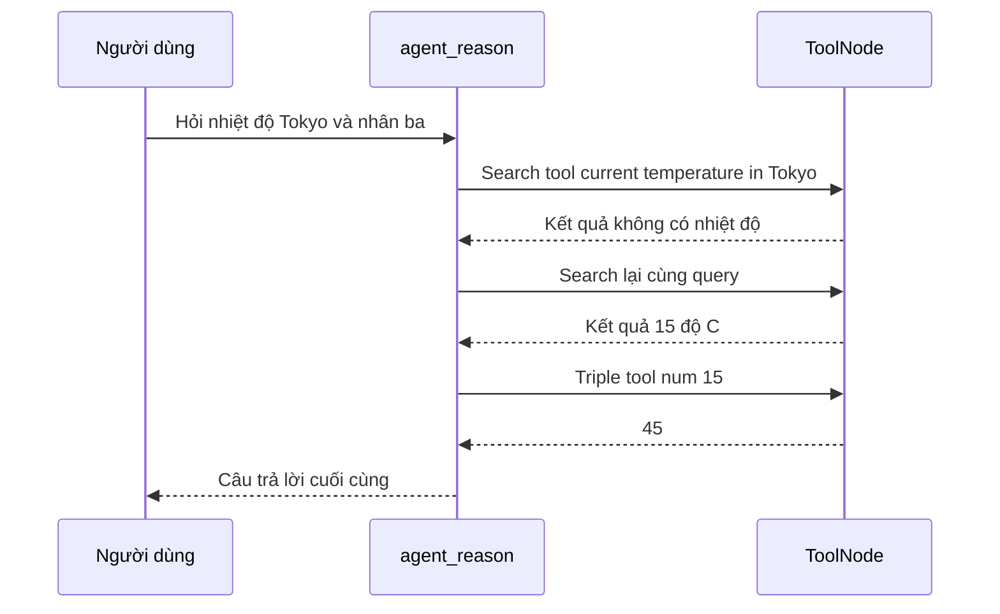

# 🏃 Chạy thử ReAct Agent trên LangGraph: Nhìn tận mắt từng Tool Call trong LangSmith

> Nguồn: `045-Running-Our-LangGraph-React-Agent-with-Function-Calling.txt` · [Udemy](https://ua.udemy.com/course/langgraph/learn/lecture/50679371)

Chào các bạn, mình là Eden đây! 👋

Bài cuối của section này là phần thú vị nhất: chúng ta sẽ **invoke graph** và xem agent thật sự hoạt động. Sau đó, mình mở **LangSmith** để cùng các bạn mổ xẻ từng node, từng tool call — để thấy rõ "bộ máy" bên trong chạy như thế nào.

---

### ⚙️ Invoke graph và kết quả đầu tiên

Ta gọi `app.invoke` với input là một dictionary có key **`messages`**, chứa danh sách **human message**:

```python
result = app.invoke(
    {"messages": [HumanMessage(content="What is the temperature in Tokyo? List it and then triple it.")]}
)
print(result["messages"][LAST].content)
```

Vì đây là thông tin **real-time**, mình kỳ vọng agent sẽ:

1. Tự suy luận cần gọi **search tool** để tìm thời tiết ở Tokyo.
2. Sau khi có kết quả, gọi tiếp **triple tool**.
3. Khi cả hai tool chạy xong, đưa ra câu trả lời cuối cùng.

Ở lần chạy đầu với câu hỏi về **weather**, agent liệt kê một loạt chỉ số thời tiết rồi chọn **độ ẩm là 69** để nhân ba thành **207** — mình thấy câu hỏi chưa đủ rõ ràng, nên đổi thành nhiệt độ: **"What is the temperature in Tokyo? List it and then triple it."** Kết quả lần này: **"The current temperature in Tokyo is 15 Celsius and triple it giving 45"**.

Agent chạy hơi lâu một chút vì phải thực hiện **nhiều tool call**: suy luận (một LLM call) → gọi tool → suy luận lại → gọi tool tiếp. Nhưng graph của chúng ta đang hoạt động chính xác như mong đợi.

---

### 🔍 Mổ xẻ trace trên LangSmith

Mở LangSmith ở project **react function calling** — có hai traces, mình mở cái thứ hai. Ngay từ đầu đã có một chi tiết **rất thú vị**: **search tool được gọi tới hai lần**, trong khi ta chỉ kỳ vọng một lần.

Theo kinh nghiệm của mình, hành vi này **khá thường gặp**, vì search result không phải lúc nào cũng đúng, và thông tin tìm được online có khi không đủ dùng. Trong trường hợp đó, agent **đủ thông minh để nhận ra** và chạy lại tool cho tới khi có câu trả lời.

*Một mẹo để tiết kiệm bớt tool call:* thêm argument **`max_results`** cho search tool — chính là số lượng kết quả sẽ trả về. Ta có thể cấu hình để nhận **5 kết quả** thay vì 1, khi đó **heuristic** là sẽ có một kết quả chứa câu trả lời cần tìm. *Tất nhiên không đảm bảo 100%, chỉ là heuristic thôi.*

Giờ cùng xem trace theo thứ tự:

* **Node `agent_reason`:** thấy **system message** cùng **cả hai tool** được cung cấp; agent trả về ý định gọi **search tool** với nội dung "current temperature in Tokyo".
* **`should_continue`:** đây **không phải là node** mà là **conditional edge function**. Nó nhận input, kiểm tra message cuối — một **AI tool call** — và quyết định đi tới **Act node**.
* **Node Act:** thực thi hàm search với input "current temperature in Tokyo". Kết quả trả về **không chứa nhiệt độ Tokyo** — một search result **vô dụng (non-helpful)**.
* Vì có edge từ tool node quay về `agent_reason`, agent nhận được kết quả này và quyết định **search lại** với cùng query, lần này kết quả bao gồm cả **domain** và đã chứa **15°C** — tốt hơn hẳn.
* **`agent_reason`** với kết quả search hợp lệ: agent quyết định gọi **hàm triple** với `num = 15` — **được trích xuất từ tool call trước đó**. Đúng chính xác điều mình muốn.
* **Tool node** thực thi triple tool với input `15`, kết quả trả về **45** — phần này đơn giản nên mình không đi sâu.
* Node cuối cùng được chạy lại là **`agent_reason`**: lần này nó quyết định **không cần làm gì thêm** → kết thúc.



| Tiêu chí | `agent_reason` | `should_continue` |
|---|---|---|
| Loại | Node trong graph | Conditional edge function, không phải node |
| Nhiệm vụ | Gọi LLM để suy luận | Kiểm tra message cuối và định tuyến |
| Xuất hiện trong trace | Có, như một node | Có, ở vai trò điều hướng |

Mình có đính kèm trace này trong tài nguyên của video và đã để chế độ **public** để các bạn xem lại.

---

### 📦 Commit và tổng kết section

Mình commit code với tên **graph** và push lên repository — code của cả section nằm trong commit này.

Mục tiêu của section là cho các bạn thấy **implement ReAct agent bằng graph dễ như thế nào**. Chúng ta không chỉ dùng graph, mà còn **tận dụng function calling** — và chính điều này mang lại cho ReAct agent của chúng ta **độ ổn định (stability)** cùng **hiệu năng tốt hơn**.

### 🎯 Tự kiểm tra nhanh

**Câu 1:** Vì sao search tool bị gọi tới hai lần?

<details>
<summary><b>Xem đáp án</b></summary>

**Đáp án:** Vì kết quả search lần đầu không chứa nhiệt độ Tokyo; agent nhận ra và chạy lại cho tới khi có câu trả lời.

Giải thích: Hành vi này khá thường gặp vì search result không phải lúc nào cũng đúng.

Tham chiếu: Mục Mổ xẻ trace trên LangSmith.

</details>

**Câu 2:** Mẹo thêm `max_results` cho search tool có tác dụng gì?

<details>
<summary><b>Xem đáp án</b></summary>

**Đáp án:** Tăng số lượng kết quả trả về (ví dụ 5) để heuristic có một kết quả chứa câu trả lời — nhưng không đảm bảo 100%.

Giải thích: Đây chỉ là mẹo tiết kiệm bớt tool call.

Tham chiếu: Mục Mổ xẻ trace trên LangSmith.

</details>

**Câu 3:** `should_continue` là node hay là gì?

<details>
<summary><b>Xem đáp án</b></summary>

**Đáp án:** Là conditional edge function, không phải node.

Giải thích: Nó nhận input, kiểm tra message cuối và quyết định node kế tiếp.

Tham chiếu: Mục Mổ xẻ trace trên LangSmith.

</details>

**Câu 4:** Agent lấy giá trị `15` để gọi triple tool từ đâu?

<details>
<summary><b>Xem đáp án</b></summary>

**Đáp án:** Trích xuất từ kết quả search hợp lệ ở tool call trước đó.

Giải thích: Đúng chính xác điều mình muốn khi thiết kế luồng.

Tham chiếu: Mục Mổ xẻ trace trên LangSmith.

</details>

**Câu 5:** Điều gì mang lại độ ổn định và hiệu năng tốt hơn cho ReAct agent?

<details>
<summary><b>Xem đáp án</b></summary>

**Đáp án:** Dùng graph kết hợp tận dụng function calling.

Giải thích: Đây là mục tiêu của cả section.

Tham chiếu: Mục Commit và tổng kết section.

</details>

Section khép lại ở đây. Hẹn gặp lại các bạn ở chặng tiếp theo, nơi chúng ta đi sâu vào **persistence (lưu trữ trạng thái của graph)** và những kỹ thuật production-grade khác! 🚀

## Nguồn tham khảo

- [Udemy — Running Our LangGraph React Agent with Function Calling](https://ua.udemy.com/course/langgraph/learn/lecture/50679371)
- [Trace LangGraph applications — Docs by LangChain](https://docs.langchain.com/langsmith/trace-with-langgraph)
