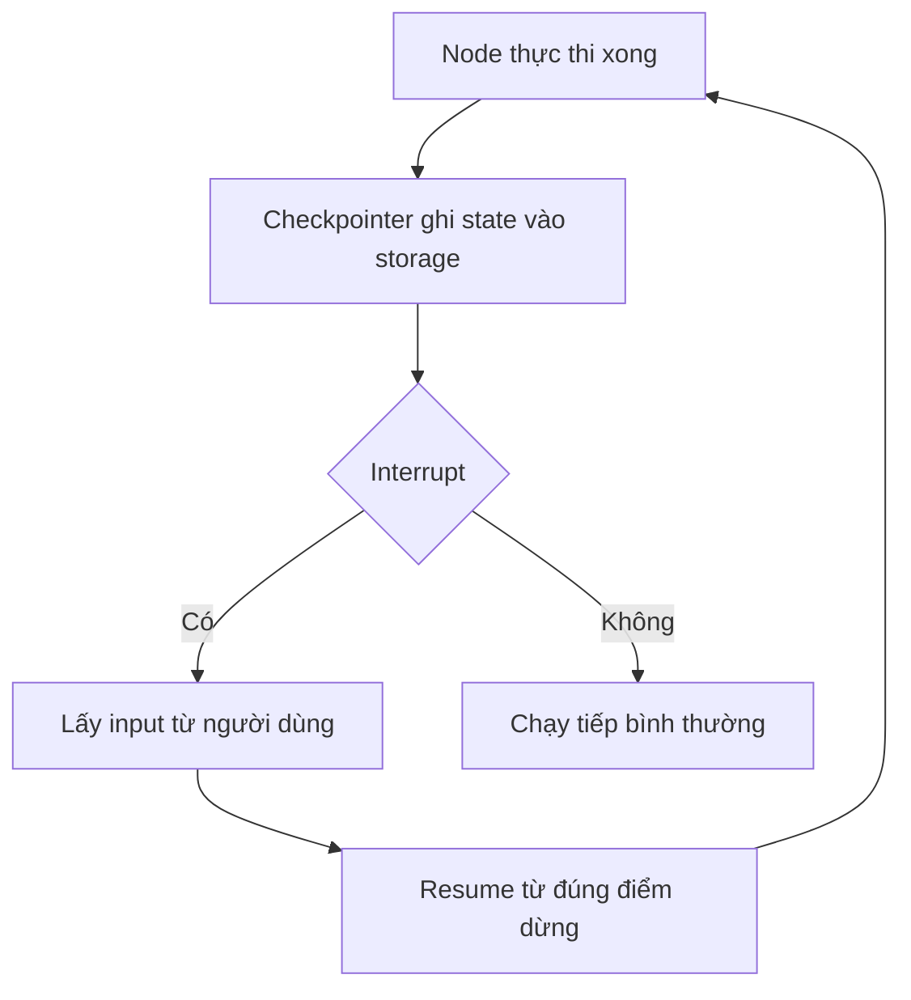

# 🧩 Persistence trong LangGraph: Khi AI Agent biết "nhớ" và chạy tiếp đúng chỗ

> Nguồn: `046-Persistence-in-LangGraph.txt` · [Udemy](https://ua.udemy.com/course/langgraph/learn/lecture/44431680)

Xin chào, lại là Eden đây! 👋 Hôm nay chúng ta sẽ nói về một tính năng mà mình xem là **cực kỳ quan trọng với mọi ứng dụng đạt chuẩn production (production grade)**: đó là **persistence (lưu trữ bền vững)** trong LangGraph.

Nếu các bạn từng thắc mắc làm sao để agent "dừng lại hỏi người dùng rồi chạy tiếp đúng chỗ cũ", hay đơn giản là làm sao nó nhớ được mọi thứ đã xảy ra, thì bài này chính là dành cho các bạn.

---

### 🎯 Persistence trong LangGraph nghĩa là gì?

Trong LangGraph, persistence có nghĩa là chúng ta có thể **lưu lại state (trạng thái) sau khi các node (nút) thực thi** — tại bất kỳ thời điểm nào — vào một **persistent storage (kho lưu trữ bền vững)** và có thể **truy xuất lại sau đó**, kể cả sau nhiều lần chạy hoặc nhiều lần bị ngắt quãng.

Nghe đơn giản vậy thôi, nhưng đây chính là nền móng cho rất nhiều tính năng nâng cao mà các bạn sẽ gặp xuyên suốt khóa học.

---

### 💬 Human-in-the-loop: lý do đầu tiên và lớn nhất

Vì sao persistence lại quan trọng đến vậy? Đầu tiên, nó mở đường cho các workflow **human-in-the-loop (con người can thiệp giữa vòng chạy)**.

Hầu hết ứng dụng chúng ta xây sẽ là **user facing (hướng tới người dùng cuối)**, nghĩa là sẽ có lúc cần nhận input từ người dùng, và sẽ có những node phụ thuộc hoàn toàn vào dữ liệu đó.

Điều tuyệt vời là LangGraph cho chúng ta một cách cực kỳ tiện lợi để **dừng việc thực thi graph (đồ thị)** lại. Framework sẽ tự động **checkpoint (lưu trạng thái)** vào persistent storage. Sau đó chúng ta đi lấy input từ người dùng, rồi **resume (chạy tiếp)** graph từ đúng điểm đã dừng, mang theo dữ liệu mới.

*Nếu không có persistence, chúng ta không thể làm được điều này.* Chính vì vậy mình luôn nhấn mạnh: đây là kiến thức bắt buộc phải nắm.

---

### 🧠 Memory, debugging và history

Persistence không chỉ phục vụ human-in-the-loop. Nó còn mang lại nhiều thứ giá trị khác:

* **Memory (bộ nhớ):** agent nhớ được những gì đã diễn ra.
* **Debugging (gỡ lỗi):** soi lại từng bước chạy để tìm vấn đề.
* **History (lịch sử):** xem lại toàn bộ quá trình thực thi.

Và nếu các bạn muốn có **nhiều session (phiên) của cùng một người dùng**, thì persistence là thứ bắt buộc phải có.

---

### ⚙️ Checkpointer — "trái tim" của persistence

Vậy LangGraph hiện thực hóa persistence như thế nào? Bằng các **checkpointer object**. Đây là **persistence layer (tầng lưu trữ)** mà LangGraph dựng sẵn cho chúng ta: nó nhận state và ghi vào persistent storage.

Bạn biết LangChain có rất nhiều integration với database đúng không? Persistence cũng vậy, ta có thể lưu vào:

* **Document database (cơ sở dữ liệu tài liệu):** Firestore, MongoDB.
* **Relational database (cơ sở dữ liệu quan hệ):** Postgres, SQLite, MySQL.
* **Graph database (cơ sở dữ liệu đồ thị):** Neo4j, AWS Neptune.

| Loại database | Ví dụ | Ghi chú |
|---|---|---|
| Document database | Firestore, MongoDB | Lưu dữ liệu dạng tài liệu |
| Relational database | Postgres, SQLite, MySQL | Khóa học này tập trung vào SQLite |
| Graph database | Neo4j, AWS Neptune | Dữ liệu dạng đồ thị |

Trong khóa học này, mình sẽ tập trung vào **SQLite**. Cách dùng rất đơn giản: import checkpointer từ `langgraph`, tạo một instance, và nó sẽ nhận state của chúng ta để persist xuống SQLite.

Điểm hay là storage có thể là **database local** ngay trên máy bạn, hoặc **database remote được quản lý** như Cloud SQL trên Google Cloud, AWS, hay Supabase — bạn chỉ cần đưa vào **connection string** mong muốn.

Và đây là phần quan trọng nhất: khi tạo graph, chúng ta **truyền checkpointer vào lúc compile**. LangGraph sẽ tự động **persist state sau mỗi lần một node thực thi**. Mỗi node chạy xong tạo ra một state mới, và state đó được ghi vào database để ta truy xuất lại bất cứ lúc nào.

Chính điều này cho phép ta dừng graph giữa chừng, lấy input người dùng, rồi chạy tiếp đúng chỗ đã dừng — tất cả nhờ checkpointer.

---

### 🎯 Tự kiểm tra nhanh

**Câu 1:** Persistence trong LangGraph nghĩa là gì?

<b>Xem đáp án</b>

**Đáp án:** Lưu state sau khi các node thực thi vào persistent storage để có thể truy xuất lại, kể cả sau nhiều lần chạy hoặc bị ngắt quãng.

Giải thích: Đây là nền móng cho nhiều tính năng nâng cao xuyên suốt khóa học.

Tham chiếu: Mục Persistence trong LangGraph nghĩa là gì.

**Câu 2:** Vì sao human-in-the-loop cần persistence?

<b>Xem đáp án</b>

**Đáp án:** Để dừng graph, checkpoint state, lấy input từ người dùng rồi resume đúng điểm đã dừng.

Giải thích: Không có persistence thì không thể làm được điều này.

Tham chiếu: Mục Human-in-the-loop.

**Câu 3:** Checkpointer được truyền vào lúc nào và persist state khi nào?

<b>Xem đáp án</b>

**Đáp án:** Truyền vào lúc compile graph; LangGraph tự động persist state sau mỗi lần một node thực thi.

Giải thích: Mỗi node chạy xong tạo state mới và được ghi vào database.

Tham chiếu: Mục Checkpointer — trái tim của persistence.

**Câu 4:** Ngoài human-in-the-loop, persistence còn mang lại gì?

<b>Xem đáp án</b>

**Đáp án:** Memory, debugging, history, và hỗ trợ nhiều session của cùng một người dùng.

Giải thích: Đây đều là các giá trị cốt lõi của persistence.

Tham chiếu: Mục Memory, debugging và history.

**Câu 5:** Có thể lưu state vào những loại database nào?

<b>Xem đáp án</b>

**Đáp án:** Document database (Firestore, MongoDB), relational (Postgres, SQLite, MySQL), graph (Neo4j, AWS Neptune) — local hoặc remote managed qua connection string.

Giải thích: Khóa học này tập trung vào SQLite.

Tham chiếu: Mục Checkpointer — trái tim của persistence.

Đó là toàn bộ tư duy đằng sau persistence trong LangGraph. Lý thuyết đã rõ, giờ là lúc bắt tay vào code để các bạn thấy mọi thứ diễn ra "rõ như ban ngày". Hẹn gặp lại ở bài thực hành nhé! 🚀

## Nguồn tham khảo

- [Udemy — Persistence in LangGraph](https://ua.udemy.com/course/langgraph/learn/lecture/44431680)
- [Persistence — Docs by LangChain](https://docs.langchain.com/oss/python/langgraph/persistence)
- [Interrupts — Docs by LangChain](https://docs.langchain.com/oss/python/langgraph/interrupts)
