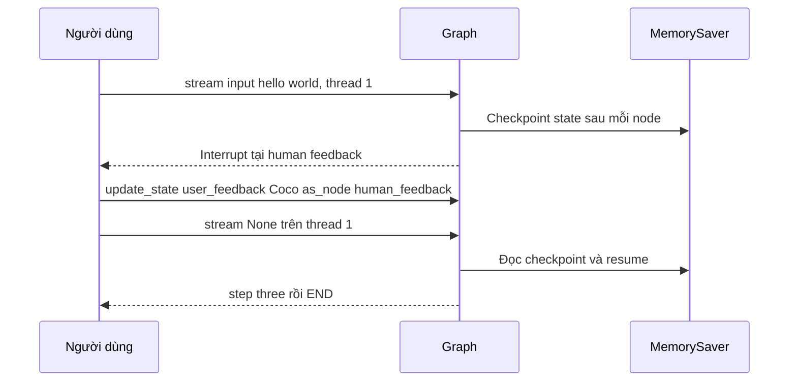

# 🧵 MemorySaver thực chiến: Thread, Interrupt và cách "chèn" phản hồi con người vào state

> Nguồn: `048-MemorySaver.txt` · [Udemy](https://ua.udemy.com/course/langgraph/learn/lecture/44768013)

Chào mừng các bạn quay trở lại! 👋 Hạ tầng đã dựng xong ở bài trước, giờ là lúc chúng ta **chạy thật** graph human-in-the-loop, mổ xẻ state bên trong **MemorySaver**, và xem cách con người can thiệp vào giữa vòng chạy của agent.

Hôm nay chúng ta sẽ kiểm tra state, luồng thực thi, và đặc biệt là dùng **breakpoint trong PyCharm** để "soi" từng bước — nên các bạn nhớ mở máy và bấm chạy theo nhé.

---

### 🧵 Thread ID — thứ phân biệt mọi cuộc hội thoại

Đầu tiên, mình thêm `if __name__ == "__main__":` — vì giờ chúng ta muốn test graph, quan sát state và luồng thực thi.

Mình tạo một biến **thread** — các bạn có thể nghĩ về **thread ID** như một **session ID (mã phiên) hoặc conversation ID (mã cuộc hội thoại)**. Cấu trúc của nó: một dictionary với duy nhất key **configurable**, và giá trị là dictionary chứa **thread_id bằng 1**. Chính thread ID này giúp phân biệt các lần chạy khác nhau của graph — **những người dùng khác nhau, thậm chí những cuộc hội thoại khác nhau của cùng một người dùng với agent**.

*Trong thực tế các bạn nên dùng UUID, nhưng ở đây mình để thread ID = 1 cho đơn giản.*

Input ban đầu khi invoke graph là dictionary với key **input** và value **hello world**. Mình dùng **`graph.stream`** — nhận input ban đầu, thread để phân biệt các lần chạy, và **stream mode = values** — rồi in ra từng event một.

Chạy thử, ta thấy: graph in ra input, chạy qua **step one**, rồi **không chạy node human feedback** — vì interrupt đã dừng graph lại.

---

### 🔬 Soi state bên trong MemorySaver

Giờ mình **chạy ở chế độ debug**, đặt breakpoint để xem tận mắt.

* Event đầu tiên chính là **start node**.
* Nếu nhìn vào biến **memory** (instance của MemorySaver), ta thấy nó có attribute **storage**. Bên trong storage là một object lồng nhau, đại diện cho state của graph qua từng node.
* Ở bước đầu tiên — **step one** — state đã ghi **input = hello world**, vì đó là lúc chúng ta chạy graph.
* Sau start node, ta chạy node số một nhưng node này **không cập nhật state**, nên state giữ nguyên và không có giá trị mới nào.

Chạy tiếp, ta thấy dòng print của step one. Vậy graph đã dừng sau interrupt.

Để kiểm tra node nào sẽ chạy tiếp, mình gọi **`graph.get_state(thread).next`** — nó trả về node kế tiếp theo đúng thread đã chỉ định. Và đúng như dự kiến: node tiếp theo là **human feedback**, khớp hoàn toàn với luồng trên hình.

---

### ✍️ Tự tay cập nhật state với phản hồi người dùng

Graph đang dừng, giờ mình lấy human input bằng hàm **`input()`** có sẵn của Python với câu hỏi: *"tell me what do you want to update the state with"* — kết quả lưu vào biến **user input**.

Để cập nhật state với dữ liệu mới, mình gọi **update_state** trên thread hiện tại (thread ID 1), truyền vào **values** — cụ thể là attribute **user feedback** (đúng attribute mình đã khai báo trong state) với giá trị là user input vừa nhập. Kèm theo keyword **`as_node="human_feedback"`** — thao tác này sẽ cập nhật **y như thể node human feedback vừa chạy** và ghi giá trị vào state trong luồng thực thi.

Chạy lại với breakpoint, mọi thứ diễn ra đúng trình tự:

1. **Start node** cập nhật state với input **hello world**.
2. **Step one** chạy nhưng không thay đổi state.
3. Đến **interrupt**, thay vì chạy node human feedback rỗng, ta nhận input từ console.
4. State được cập nhật vào key **user feedback**.

Nhập thử **"Coco"**, rồi mở **memory → storage**, ta thấy entry mới nhất ghi nhận node human feedback đã cập nhật **user_feedback = Coco**.

Giờ đánh giá biểu thức **`graph.get_state`** với thread hiện tại, ta thấy: node kế tiếp là **step three**, còn values gồm **input = hello world** và **user_feedback = coco**. Mình thêm vài dòng print cho dễ nhìn — một cái in state sau khi cập nhật thủ công, một cái in `graph.get_state` của thread hiện tại — rồi chạy lại với "Coco". Kết quả in ra chính xác: state mới là user_feedback coco + input hello world, node kế tiếp là step three.

| API | Việc làm | Chi tiết trong bài |
|---|---|---|
| `graph.stream` | Chạy graph và in từng event | Nhận input, thread, stream mode values; resume với input `None` |
| `graph.get_state` | Xem state và node kế tiếp | `graph.get_state(thread).next` trả về human feedback |
| `graph.update_state` | Chèn cập nhật vào state | Truyền values user_feedback, kèm `as_node="human_feedback"` |

---

### ▶️ Resume graph và xem trace trên LangSmith

Bước cuối cùng: **chạy tiếp** graph. Mình vẫn gọi **`graph.stream`**, nhưng lần này input là **None**, dùng lại đúng thread ID 1 và stream mode values để in toàn bộ event.

Kết quả: **step three** được in ra, và graph **kết thúc thực thi** sau human feedback — đúng như mong đợi.

Để quan sát toàn cảnh, mình bật trace trên **LangSmith**: thêm các biến môi trường cần thiết vào file **.env** (API key và cờ bật tracing), đặt tên project là **human in the loop + memory**, rồi import **load_dotenv** trong main để nạp các biến đó.

Chạy lại: step one chạy, interrupt xuất hiện, graph chờ human feedback. Mở LangSmith trước khi nhập phản hồi, ta thấy project cùng trace của lần chạy — trong đó ghi nhận đã thực thi step one. Nhập "Coco" và tiếp tục — ta thấy rõ **một lần cập nhật state thủ công** (user feedback = coco), rồi graph resume và **chạy step three**. Đó là toàn bộ trace của graph!

---

### 🎯 Tự kiểm tra nhanh

**Câu 1:** Thread ID được ví như gì và có cấu trúc ra sao?

<b>Xem đáp án</b>

**Đáp án:** Như một session ID hoặc conversation ID; cấu trúc là dictionary với key `configurable`, bên trong chứa `thread_id`.

Giải thích: Thread ID giúp phân biệt các lần chạy, người dùng và cuộc hội thoại khác nhau.

Tham chiếu: Mục Thread ID.

**Câu 2:** Vì sao thực tế nên dùng UUID cho thread ID?

<b>Xem đáp án</b>

**Đáp án:** Vì UUID đảm bảo định danh duy nhất cho từng phiên; con số 1 chỉ dùng cho ví dụ đơn giản.

Giải thích: Đây là lời khuyên thực tế của giảng viên.

Tham chiếu: Mục Thread ID.

**Câu 3:** `update_state` kèm `as_node="human_feedback"` có tác dụng gì?

<b>Xem đáp án</b>

**Đáp án:** Cập nhật state y như thể node human feedback vừa chạy và ghi giá trị vào luồng thực thi.

Giải thích: Nhờ đó state nhận được `user_feedback` mới.

Tham chiếu: Mục Tự tay cập nhật state với phản hồi người dùng.

**Câu 4:** `graph.get_state(thread).next` cho biết điều gì?

<b>Xem đáp án</b>

**Đáp án:** Node kế tiếp sẽ chạy theo đúng thread đã chỉ định.

Giải thích: Sau interrupt, node tiếp theo là human feedback; sau khi cập nhật là step three.

Tham chiếu: Mục Soi state bên trong MemorySaver.

**Câu 5:** Vì sao lần resume gọi `graph.stream` với input là `None`?

<b>Xem đáp án</b>

**Đáp án:** Để chạy tiếp từ checkpoint của thread hiện tại mà không nạp input mới; step three in ra rồi graph kết thúc.

Giải thích: Vẫn dùng lại thread ID 1 và stream mode values.

Tham chiếu: Mục Resume graph và xem trace trên LangSmith.

Các bạn thấy đấy, chỉ với một checkpointer tạm thời trong bộ nhớ, chúng ta đã điều khiển được agent dừng — hỏi — chạy tiếp mượt mà. Nhưng MemorySaver sẽ mất sạch dữ liệu sau mỗi lần chạy... nên ở bài tiếp theo, chúng ta sẽ nâng cấp lên **SqliteSaver** để state nằm vĩnh viễn trên đĩa. Hẹn gặp lại! 🚀

## Nguồn tham khảo

- [Udemy — MemorySaver](https://ua.udemy.com/course/langgraph/learn/lecture/44768013)
- [Persistence — Docs by LangChain](https://docs.langchain.com/oss/python/langgraph/persistence)
- [Interrupts — Docs by LangChain](https://docs.langchain.com/oss/python/langgraph/interrupts)
