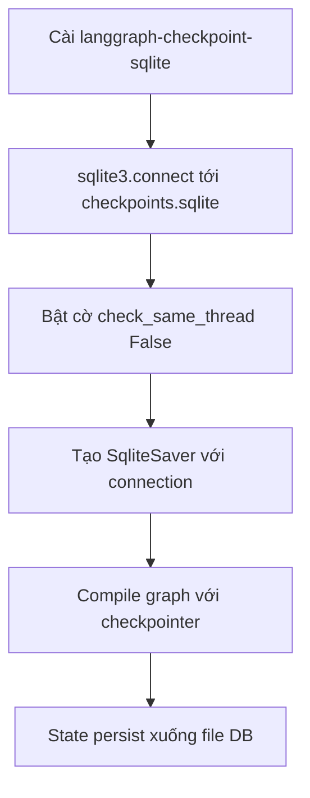

# 💾 SqliteSaver: Nâng cấp bộ nhớ tạm thành state "bám trụ" trên đĩa

> Nguồn: `049-SqliteSaver.txt` · [Udemy](https://ua.udemy.com/course/langgraph/learn/lecture/44768411)

Chào các bạn, Eden đây! 👋 Ở bài trước, **MemorySaver** đã giúp chúng ta làm quen với state được checkpoint. Nhưng nó là **ephemeral (tạm thời)**, nằm trong bộ nhớ và **mất sạch thông tin sau mỗi lần chương trình chạy**.

Hôm nay chúng ta sẽ chuyển sang **SqliteSaver** để persist state xuống **storage** và vào hẳn một **database SQLite**. Và các bạn sẽ thấy việc chuyển đổi này **dễ đến mức khó tin**!

---

### 📦 Cài đặt & import

Bước đầu tiên, cài package **langgraph-checkpoint-sqlite**. Đây là điểm cần lưu ý: nếu sau này các bạn muốn dùng checkpointer khác, mỗi loại sẽ có **subpackage riêng**. Cách tách các third-party implementation thành subpackage này rất quen thuộc nếu bạn từng làm với **LangChain** — ví dụ với **Pinecone** hay **Redis**.

Về import, chúng ta lấy **SqliteSaver** từ subpackage SQLite trong **LangGraph checkpoints**, và import thêm thư viện **`sqlite3`**.

---

### 🔧 Thay MemorySaver bằng SqliteSaver

Phần chuyển đổi thực sự rất gọn:

1. Thay vì dùng MemorySaver, ta tạo một **connection** tới database SQLite bằng **`sqlite3.connect`**, truyền vào database muốn kết nối. Ở đây mình có thể đặt một **DB URL** nếu muốn, nhưng mình chỉ viết **`checkpoints.sqlite`** — thế là SQLite sẽ chạy một database local ngay trên file system của mình.
2. Bật cờ **`check_same_thread=False`** để có thể thao tác database **từ nhiều thread khác nhau**. Lý do: trong main file, chúng ta chạy graph, dừng thực thi, rồi chạy lại — các lần chạy đó nằm trên những thread khác nhau. *Nếu không đặt cờ này thành false, bạn sẽ gặp lỗi khi cố chỉnh sửa DB từ các thread khác nhau.*
3. Tạo biến **memory**, lần này là một instance của **SqliteSaver**, và truyền vào connection vừa tạo.

Nhìn kỹ vào implementation của SqliteSaver trong LangGraph, bạn sẽ thấy có một phương thức cho phép **tạo checkpointer class từ một connection string**. Connection string đó có thể trỏ đến **database remote** như **Google Cloud SQL, AWS RDS, Supabase** — bất kỳ DB nào bạn dùng bản managed trên cloud — hoặc đơn giản là lưu xuống **ổ đĩa local** bằng cách để **`checkpoints.sqlite`** trong connection string. Đó chính xác là những gì chúng ta đang làm.

| Tiêu chí | MemorySaver | SqliteSaver |
|---|---|---|
| Nơi lưu state | Trong bộ nhớ | Database SQLite, mặc định file `checkpoints.sqlite` |
| Độ bền | Ephemeral, mất sạch sau mỗi lần chạy | Persist xuống đĩa, dừng và resume được |
| Cài đặt | Có sẵn trong `langgraph` | Cài thêm `langgraph-checkpoint-sqlite` |
| Khởi tạo | `MemorySaver()` | `SqliteSaver(connection)` |

---

### 🗄️ Kiểm chứng: file DB đã ra đời

Mình chạy lại toàn bộ, nhập **"cocoa"** và chạy đến khi kết thúc. Nhìn sang bên trái IDE, một file mới đã xuất hiện: **`checkpoints.sqlite`**.

Mở **DB tool** trong IDE, vào **Data Sources → SQLite**, load file `checkpoints.sqlite` rồi bấm OK. Trong đó ta thấy một bảng tên **checkpoints**. Double-click vào bảng (refresh trước cho chắc) — toàn bộ entry của database hiện ra, trông rất giống những gì ta thấy với MemorySaver. Khác biệt duy nhất — và cũng là khác biệt quan trọng nhất: **lần này state được persist xuống đĩa**, nên ta có thể **dừng và resume** thực thi, chạy tiếp đúng từ chỗ cũ.

---

### 🧪 Đổi thread ID và quan sát trên LangSmith

Thử nghiệm tiếp theo: mình đổi **thread ID thành 777**, comment lại phần đầu và phần input, rồi chạy. Graph vẫn đang chờ human feedback. Mở DB lên, ta thấy **các entry mới cho thread 777** đã được ghi vào.

Giờ **chạy tiếp** từ đúng chỗ dừng: comment hết phần đầu, bỏ comment phần nối tiếp, chạy và nhập **"banana"** thay cho "cocoa". Chạy xong, mở **LangSmith**:

* Trace cho thấy execution đã khởi động, và trong **metadata** ghi rõ **thread ID = 777**.
* Phần còn lại của quá trình thực thi cũng hiển thị đầy đủ.

Điều thú vị là trong LangSmith các bạn có thể vào mục **threads** — nơi liệt kê **tất cả các thread đã chạy**. Chọn thread 777, ta có đầy đủ thông tin về thread đó cùng những trace liên quan. *Đây là công cụ cực kỳ tiện lợi khi bạn cần debug và troubleshooting agent của mình.*

---

### 🎯 Tự kiểm tra nhanh

**Câu 1:** Vì sao chuyển từ MemorySaver sang SqliteSaver?

<b>Xem đáp án</b>

**Đáp án:** Vì MemorySaver là ephemeral, nằm trong bộ nhớ và mất sạch thông tin sau mỗi lần chương trình chạy.

Giải thích: SqliteSaver persist state xuống database SQLite.

Tham chiếu: Đoạn mở đầu.

**Câu 2:** Package cần cài là gì và có lưu ý gì cho checkpointer khác?

<b>Xem đáp án</b>

**Đáp án:** `langgraph-checkpoint-sqlite`; mỗi loại checkpointer khác sẽ có subpackage riêng.

Giải thích: Cách tách third-party implementation này quen thuộc nếu bạn từng làm với LangChain.

Tham chiếu: Mục Cài đặt & import.

**Câu 3:** Vì sao phải bật `check_same_thread=False`?

<b>Xem đáp án</b>

**Đáp án:** Để có thể thao tác database từ nhiều thread khác nhau, vì các lần chạy graph nằm trên những thread khác nhau.

Giải thích: Không đặt cờ này thành false sẽ gặp lỗi khi chỉnh sửa DB từ các thread khác.

Tham chiếu: Mục Thay MemorySaver bằng SqliteSaver.

**Câu 4:** Phương thức tạo checkpointer từ connection string cho phép gì?

<b>Xem đáp án</b>

**Đáp án:** Trỏ tới database remote như Google Cloud SQL, AWS RDS, Supabase, hoặc lưu xuống ổ đĩa local với `checkpoints.sqlite`.

Giải thích: Đó chính xác là những gì chúng ta đang làm trong bài.

Tham chiếu: Mục Thay MemorySaver bằng SqliteSaver.

**Câu 5:** Làm sao kiểm chứng state đã được persist?

<b>Xem đáp án</b>

**Đáp án:** File `checkpoints.sqlite` xuất hiện, mở DB tool xem bảng `checkpoints`; đổi thread ID thành 777 thấy entry mới, và LangSmith ghi metadata thread ID cùng mục threads.

Giải thích: Khác biệt quan trọng nhất là state nằm dưới đĩa nên dừng và resume được.

Tham chiếu: Mục Kiểm chứng file DB đã ra đời, mục Đổi thread ID.

MemorySaver giúp ta "cảm" được persistence, còn SqliteSaver cho ta một nền tảng thật sự để dừng — chạy tiếp — tra cứu lịch sử bất cứ lúc nào. Hành trình về persistence vẫn còn nhiều điều thú vị phía trước, hẹn gặp lại các bạn ở bài tiếp theo! 🚀

## Nguồn tham khảo

- [Udemy — SqliteSaver](https://ua.udemy.com/course/langgraph/learn/lecture/44768411)
- [SqliteSaver — langgraph.checkpoint.sqlite Reference](https://reference.langchain.com/python/langgraph.checkpoint.sqlite/SqliteSaver)
- [Checkpoints — langgraph Reference](https://reference.langchain.com/python/langgraph/checkpoints)
