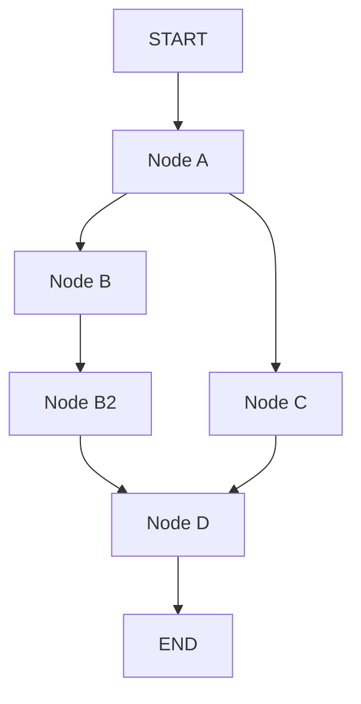

# 🧩 Fan-out/Fan-in nâng cao: Thêm bước phụ sau node B mà vẫn chạy song song

> Nguồn: `051-Parallel-node-fan-out-and-fan-in-with-extra-steps.txt` · [Udemy](https://ua.udemy.com/course/langgraph/learn/lecture/44862967)

Chào các bạn, Eden đây! 👋 Ở bài trước, chúng ta đã có một graph fan-out/fan-in cơ bản. Bài này, mình sẽ **nâng cấp chính graph đó** lên một phiên bản "khó nhằn" hơn: thêm một bước phụ sau node B.

Luồng thực thi mới sẽ diễn ra như sau:

1. Chạy **node A**.
2. Chạy song song **node B và node C**.
3. Khi node B xong, chạy tiếp **node B2**.
4. Sau khi đã có cả C lẫn B2, chạy **node D**.

---

### 🔧 Thay đổi duy nhất: đổi điểm đến của edge

Cách hiện thực vẫn **y hệt bài trước** — vẫn là graph đó với các node đó. Điểm khác biệt duy nhất nằm ở phần nối edge:

* Đáng lẽ nối **B → D**, ta đổi thành **B → B2**.
* Sau đó nối **B2 → D**.

Đến đây, thay vì viết hai dòng edge riêng lẻ cho B2 và C, mình dùng một cú pháp cực kỳ tiện lợi:

```python
builder.add_edge(["b2", "c"], "d")
```

Tham số đầu tiên là một **list** gồm `b2` và `c`, tham số thứ hai là node đích `d`. LangGraph sẽ tự tạo **hai edge trong một dòng**: từ **B2 → D** và từ **C → D**. Đây là cách rất hay để khai báo nhiều edge cùng lúc. Bảng so sánh nhanh hai cách khai báo:

| Cách khai báo | Code | Kết quả |
|---|---|---|
| Từng edge riêng lẻ | `add_edge("b2", "d")` và `add_edge("c", "d")` | Hai edge độc lập |
| Một dòng với list | `add_edge(["b2", "c"], "d")` | LangGraph tạo cả hai edge trong một dòng |

---

### 👀 Vẽ lại graph để "mắt thấy tai nghe"

Trước khi chạy, mình comment dòng invoke lại và vẽ lại graph. Kết quả compile hoàn toàn chính xác — đúng topology mong muốn:

* A là điểm bắt đầu.
* A tỏa ra B và C.
* B đi tiếp vào B2.
* B2 và C cùng gom vào D.

Sơ đồ topology của phiên bản nâng cấp:



Sau khi xác nhận graph đã dựng đúng, mình quay lại file `async.py`, bỏ comment dòng invoke và chạy thật. Các dòng print cho kết quả **chính xác như dự đoán**:

1. Node A chạy trước.
2. Node B và C chạy đồng thời.
3. Node B2 chạy sau khi B kết thúc.
4. Cuối cùng mới đến node D.

---

### 🔍 Soi trace trên LangSmith: bằng chứng không thể chối cãi

Mình mở **LangSmith** và xem timeline của lần chạy:

* Node **A** bắt đầu lúc **7:07:09** và mất **1 giây** để chạy.
* Node **B** bắt đầu lúc **7:07:10**, cũng mất 1 giây — và **node C cũng khởi chạy đúng 7:07:10**, chứng tỏ hai node chạy song song.
* Tiếp theo là **B2**.
* Chỉ sau khi B2 hoàn thành, **D** mới được thực thi.

### 🎯 Tự kiểm tra nhanh

**Câu 1:** Thay đổi duy nhất so với graph ở bài trước là gì?

<details>
<summary><b>Xem đáp án</b></summary>

**Đáp án:** Đổi edge B → D thành B → B2, rồi nối B2 → D.

Giải thích: Các node giữ nguyên, chỉ đổi điểm đến của edge.

Tham chiếu: Mục Thay đổi duy nhất.

</details>

**Câu 2:** Dòng `builder.add_edge(["b2", "c"], "d")` có tác dụng gì?

<details>
<summary><b>Xem đáp án</b></summary>

**Đáp án:** Tạo hai edge trong một dòng: B2 → D và C → D.

Giải thích: Tham số đầu là list nhiều node nguồn, tham số sau là node đích.

Tham chiếu: Mục Thay đổi duy nhất.

</details>

**Câu 3:** Thứ tự thực thi của graph nâng cấp là gì?

<details>
<summary><b>Xem đáp án</b></summary>

**Đáp án:** A chạy trước; B và C song song; B2 chạy sau khi B xong; cuối cùng mới đến D.

Giải thích: D chỉ chạy khi cả B2 lẫn C đã hoàn thành.

Tham chiếu: Mục Vẽ lại graph.

</details>

**Câu 4:** Trace LangSmith xác nhận B và C chạy song song thế nào?

<details>
<summary><b>Xem đáp án</b></summary>

**Đáp án:** A bắt đầu lúc 7:07:09 và mất 1 giây; B và C cùng khởi chạy lúc 7:07:10.

Giải thích: Hai node cùng mốc thời gian nghĩa là chúng chạy đồng thời.

Tham chiếu: Mục Soi trace trên LangSmith.

</details>

**Câu 5:** Giá trị của fan-out/fan-in thể hiện rõ nhất khi nào?

<details>
<summary><b>Xem đáp án</b></summary>

**Đáp án:** Khi graph lớn dần với hàng chục node — các nhánh độc lập chạy song song giúp tiết kiệm rất nhiều thời gian.

Giải thích: Không phải viết thêm bất kỳ dòng code async nào.

Tham chiếu: Mục Soi trace trên LangSmith.

</details>

Điều mình muốn các bạn ghi nhớ: dù có thêm bước phụ, LangGraph vẫn **tự động xử lý toàn bộ việc chạy song song** mà ta không phải viết thêm bất kỳ dòng code async nào. Lợi ích này càng rõ khi graph lớn dần — hãy tưởng tượng graph của bạn có hàng chục node, các bạn sẽ tiết kiệm được rất nhiều thời gian.

Ở bài tiếp theo, chúng ta sẽ kết hợp fan-out/fan-in với **conditional branching (rẽ nhánh theo điều kiện)** — nơi các node chạy song song không còn cố định mà được quyết định ngay lúc invoke. Hẹn gặp lại các bạn! 🚀

## Nguồn tham khảo

- [Udemy — Parallel node fan-out and fan-in with extra steps](https://ua.udemy.com/course/langgraph/learn/lecture/44862967)
- [LangGraph Docs — Use the graph API](https://docs.langchain.com/oss/python/langgraph/use-graph-api)
