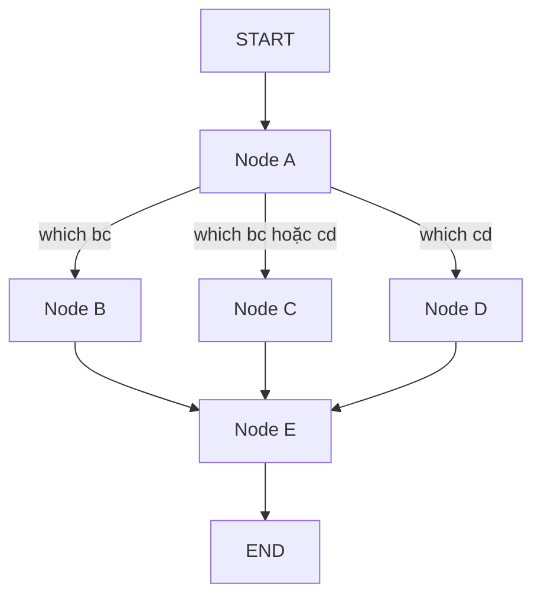

# 🔀 Conditional branching với async: Rẽ nhánh theo điều kiện mà các node vẫn chạy song song

> Nguồn: `052-Conditional-Branching-With-Async-Execution.txt` · [Udemy](https://ua.udemy.com/course/langgraph/learn/lecture/44872303)

Chào các bạn, Eden đây! 👋 Trong bài này, chúng ta sẽ kết hợp hai "tuyệt chiêu" đã học: **conditional branching (rẽ nhánh theo điều kiện)** và **async execution (chạy bất đồng bộ)**. Kết quả sẽ là một graph vừa biết "suy nghĩ" để chọn đường, vừa biết chạy song song để tiết kiệm thời gian.

Topology của bài hôm nay như sau:

1. Bắt đầu từ **node A**.
2. Từ A có **ba nhánh điều kiện** dẫn tới B, C và D.
3. Tùy vào state, ta sẽ chạy song song **B và C**, hoặc chạy song song **C và D**.
4. Sau đó, tất cả gom về **node E**.

---

### 🧱 Cập nhật state: thêm "công tắc" `which`

Đầu tiên, mình xóa toàn bộ node và edge đã dựng ở bài trước để bắt đầu lại. Sau đó, state được bổ sung một attribute mới tên là **`which`** — "công tắc" quyết định nhánh nào sẽ được chạy trong bước rẽ nhánh này.

`which` sẽ giữ một trong hai giá trị:

* **`"bc"`** — chạy song song node B và node C.
* **`"cd"`** — chạy song song node C và node D.

Hai nhánh tương ứng với hai giá trị của `which`:

| Giá trị `which` | Node chạy song song | Sau đó |
|---|---|---|
| `"bc"` | B và C | B, C → E |
| `"cd"` | C và D | C, D → E |

Giá trị này do **người dùng truyền vào lúc invoke graph**, dưới dạng string. Các bạn để ý: node C xuất hiện ở cả hai nhánh — chi tiết này khiến bài toán rẽ nhánh trở nên thú vị hơn một chút.

---

### 🧩 Dựng node và hàm "định tuyến"

Mình dán đoạn snippet tạo các node `a`, `b`, `c`, `d`, `e` cùng chuỗi string tương ứng để in ra, và nối edge từ start node vào **node A**. Lưu ý: lúc này chỉ dựng node, chưa dựng edge giữa chúng.

Tiếp theo là phần cốt lõi — **conditional edge function** (hàm quyết định đường đi dựa trên state). Mình import `Sequence` và viết hàm như sau:

```python
def route_bc_or_cd(state: State) -> Sequence[str]:
    if state["which"] == "cd":
        return ["c", "d"]
    return ["b", "c"]
```

Hàm nhận `state` làm input và trả về một **sequence (list các string)** — chính là danh sách các node sẽ được thực thi song song. Nếu `which` là `"cd"`, ta trả về `["c", "d"]`; ngược lại trả về `["b", "c"]`.

*Các giá trị này hoàn toàn mang tính minh họa* — các bạn có thể đặt bất kỳ logic nào mình muốn, thậm chí **dùng chính LLM để quyết định** nên đi nhánh nào. Hàm này chính là "bộ não" định tuyến cho quá trình thực thi graph.

---

### 🗺️ `add_conditional_edges` và bí mật của `path_map`

Giờ mình tạo biến **`intermediate`** chứa tất cả các node có thể đi tới từ A: `b`, `c`, `d`. Rồi gọi `add_conditional_edges` với ba tham số:

1. **Source:** node `a`.
2. **Logic:** hàm `route_bc_or_cd` vừa viết.
3. **Path map:** biến `intermediate`.

Nhiều bạn sẽ nghĩ tham số thứ ba là "thừa", nhưng không hề nhé! **Path map** giúp ích cho việc **vẽ graph**. Nó có thể là một dictionary ánh xạ string sang tên node, hoặc đơn giản là một **list tên node** — LangGraph sẽ dùng các giá trị này để vẽ.

Nếu bỏ qua `intermediate`, LangGraph sẽ mặc định rằng từ A có thể đi tới **mọi node**, và bạn sẽ nhận về một graph đầy những edge thừa thãi, rối rắm. Vì vậy hãy luôn khai báo rõ ràng — code và hình vẽ của bạn sẽ dễ đọc hơn rất nhiều.

Cuối cùng, mình nối **B, C, D → E**, rồi **E → END**. Xong phần dựng graph!

---

### ✅ Chạy thử hai kịch bản

Mình comment dòng invoke để vẽ graph trước — topology in ra **chính xác** như thiết kế. Sau đó bỏ comment và invoke với state có `which` để trống: kết quả là **A → B và C song song → E**, đúng như logic của hàm định tuyến.

Đổi `which` thành `"cd"` rồi chạy lại: lần này **C và D** chạy song song trước khi gom về E. Mọi thứ hoạt động chính xác với toàn bộ conditional edge.

Sơ đồ topology với hai nhánh điều kiện:



Các bạn có thể xem trace chi tiết của cả hai lần chạy trên **LangSmith** — cách đọc trace vẫn giống các bài trước nên mình không nhắc lại nữa. Hãy tự chạy thử trong môi trường của mình để cảm nhận rõ nhất nhé!

### 🎯 Tự kiểm tra nhanh

**Câu 1:** Attribute `which` trong state dùng để làm gì?

<details>
<summary><b>Xem đáp án</b></summary>

**Đáp án:** Làm "công tắc" quyết định nhánh song song nào sẽ chạy, do người dùng truyền vào lúc invoke.

Giải thích: `"bc"` chạy B và C; `"cd"` chạy C và D.

Tham chiếu: Mục Cập nhật state.

</details>

**Câu 2:** Hàm conditional edge `route_bc_or_cd` trả về gì?

<details>
<summary><b>Xem đáp án</b></summary>

**Đáp án:** Một sequence (list các string) tên các node sẽ được thực thi song song.

Giải thích: `which` là `"cd"` thì trả `["c", "d"]`, ngược lại trả `["b", "c"]`.

Tham chiếu: Mục Dựng node và hàm định tuyến.

</details>

**Câu 3:** `path_map` (biến `intermediate`) có vai trò gì?

<details>
<summary><b>Xem đáp án</b></summary>

**Đáp án:** Giúp LangGraph vẽ graph đúng các node có thể đi tới từ A.

Giải thích: Bỏ qua nó, graph sẽ mặc định A đi tới mọi node và sinh edge thừa.

Tham chiếu: Mục add_conditional_edges và bí mật của path_map.

</details>

**Câu 4:** Vì sao node C xuất hiện ở cả hai nhánh?

<details>
<summary><b>Xem đáp án</b></summary>

**Đáp án:** Nhánh `"bc"` chạy B và C, nhánh `"cd"` chạy C và D — C là node chung của cả hai.

Giải thích: Chính chi tiết này khiến bài toán rẽ nhánh thú vị hơn một chút.

Tham chiếu: Mục Cập nhật state.

</details>

**Câu 5:** Kết quả khi invoke với `which = "cd"` là gì?

<details>
<summary><b>Xem đáp án</b></summary>

**Đáp án:** A chạy trước, sau đó C và D chạy song song, rồi tất cả gom về E.

Giải thích: Conditional edge định tuyến dựa trên state lúc invoke.

Tham chiếu: Mục Chạy thử hai kịch bản.

</details>

Ở bài cuối của section, chúng ta sẽ dừng lại một chút để nhìn vào **mặt trái của async execution**: những rủi ro cần đề phòng và best practice để tránh chúng. Hẹn gặp lại các bạn! 🚀

## Nguồn tham khảo

- [Udemy — Conditional Branching With Async Execution](https://ua.udemy.com/course/langgraph/learn/lecture/44872303)
- [LangGraph Docs — Use the graph API](https://docs.langchain.com/oss/python/langgraph/use-graph-api)
- [LangGraph Docs — Graph API](https://docs.langchain.com/oss/python/langgraph/graph-api)
