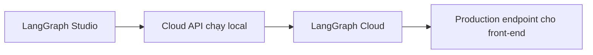

# 🧭 Khám phá Hệ sinh thái LangGraph: Studio, Cloud API và Cloud — Bộ ba giúp debug & triển khai agent

> Nguồn: `054-Intro.txt` · [Udemy](https://ua.udemy.com/course/langgraph/learn/lecture/45217543)

Chào các bạn, lại là Eden đây! 👋
Trong section mới này, chúng ta sẽ cùng nhau đi qua **hệ sinh thái LangGraph** dành cho việc **debug và testing** agent — cả ngay trên máy mình lẫn trên cloud.

Mình rất hào hứng với section này, bởi đây là những mảnh ghép giúp các bạn không chỉ "viết code chạy được", mà còn **nhìn thấy graph đang chạy**, sửa sai thật nhanh và mang agent của mình ra phục vụ thế giới thực.

---

### 🎨 LangGraph Studio — "IDE" trực quan cho graph của bạn

Chúng ta sẽ bắt đầu với **LangGraph Studio**, còn được gọi là **LangGraph IDE**. Ở đây các bạn có thể:

* **Trực quan hóa (visualize) graph** của mình.
* **Xem quá trình thực thi của graph trong thời gian thực**.
* **Dừng graph giữa chừng**, đặt **interrupt (điểm ngắt)**.
* **Quay lại một state (trạng thái)** cụ thể, **thay đổi state** rồi **chạy lại (rerun)** graph.

Đây là bộ công cụ cực kỳ tiện lợi để viết, thử nghiệm và **lặp lại nhanh (reiterate)** mỗi khi debug code LangGraph.

---

### 🌐 LangGraph Cloud API — biến compiled graph thành web server

Tiếp theo, chúng ta sẽ tìm hiểu **LangGraph Cloud API**. Nói một cách đơn giản, nó **lấy compiled graph (graph đã biên dịch) của các bạn** và tự động tạo ra một **web server**, expose graph qua một **interface rõ ràng, được định nghĩa bài bản**.

Nhờ đó, những ứng dụng khác — ví dụ như **front-end** — có thể dễ dàng "nói chuyện" với agent của bạn. Chúng ta sẽ:

1. Chạy **LangGraph Cloud API ngay trên máy local**.
2. Sau đó chuyển sang **LangGraph Cloud** — phiên bản làm điều tương tự nhưng **trên cloud**.
3. Cuối cùng là có được một **production-ready endpoint (điểm truy cập sẵn sàng cho môi trường thực tế)** để phục vụ front-end.

Hành trình của section này gói gọn trong sơ đồ:

Bảng tóm tắt vai trò của bộ ba:

| Công cụ | Vai trò chính | Chạy ở đâu |
|---|---|---|
| LangGraph Studio | Trực quan hóa và debug graph | Máy local, cần Docker |
| LangGraph Cloud API | Biến compiled graph thành web server | Máy local |
| LangGraph Cloud | Phiên bản managed trên cloud | Trên cloud |

---

### ⚠️ Vài điều cần lưu ý trước khi bắt đầu

* Section này yêu cầu các bạn cài **Docker**.
* Một số dịch vụ hiện **chỉ khả dụng trên máy Mac**.

*Nhưng nếu các bạn dùng Windows, mình vẫn khuyên xem hết section này nhé.* Bởi vì những khái niệm ở đây sẽ **xây nền tảng** để giải thích **LangGraph Cloud là gì và vì sao nó hữu ích**.

Đây là section chứa **rất nhiều thông tin mới, ý tưởng mới và thuật ngữ mới**, nên mình khuyên các bạn:

1. Xem các video ở **tốc độ bình thường (regular speed)**.
2. Nếu chưa hiểu ngay từ lần đầu, **đừng lo lắng** — hãy cứ xem tiếp rồi **xem lại**.
3. Hồi mới học những chủ đề này, chính mình cũng phải **lặp đi lặp lại rất nhiều lần** mới thấm.

*Không hiểu hết ngay từ lần xem đầu tiên là chuyện hoàn toàn bình thường, các bạn nhé!*

---

### 📦 Ứng dụng minh họa: Dự án Advanced Track

Một thông tin quan trọng về **ứng dụng ví dụ** dùng xuyên suốt section: đó chính là dự án **Advanced Track** trước đó — nơi chúng ta đã xây dựng **self-RAG**, **corrective RAG** và **adaptive RAG**. Chúng ta sẽ tận dụng lại code từ dự án này.

Còn nếu các bạn **chưa xem section trước** thì cũng không sao cả: chỉ cần vào **GitHub repository**, clone dự án về, làm theo hướng dẫn để **điền đầy đủ environment variables (biến môi trường)** và chạy local — thế là các bạn có thể bắt nhịp từ đây.

### 🎯 Tự kiểm tra nhanh

**Câu 1:** LangGraph Studio cho phép làm những gì?

<b>Xem đáp án</b>

**Đáp án:** Trực quan hóa graph, xem thực thi theo thời gian thực, đặt interrupt, quay lại state và rerun.

Giải thích: Đây là bộ công cụ giúp lặp nhanh khi debug code LangGraph.

Tham chiếu: Mục LangGraph Studio.

**Câu 2:** LangGraph Cloud API biến thứ gì thành web server?

<b>Xem đáp án</b>

**Đáp án:** Compiled graph (graph đã biên dịch) của bạn.

Giải thích: Nó expose graph qua một interface chuẩn để front-end "nói chuyện" với agent.

Tham chiếu: Mục LangGraph Cloud API.

**Câu 3:** Ba bước hành trình của section này là gì?

<b>Xem đáp án</b>

**Đáp án:** Chạy Cloud API trên máy local → chuyển sang LangGraph Cloud → có production-ready endpoint.

Giải thích: Từ môi trường test trên máy tới môi trường thực tế.

Tham chiếu: Mục LangGraph Cloud API.

**Câu 4:** Có lưu ý gì trước khi bắt đầu section?

<b>Xem đáp án</b>

**Đáp án:** Cần cài Docker; một số dịch vụ hiện chỉ khả dụng trên máy Mac.

Giải thích: Người dùng Windows vẫn nên xem hết vì các khái niệm xây nền tảng hiểu LangGraph Cloud.

Tham chiếu: Mục Vài điều cần lưu ý.

**Câu 5:** Ứng dụng minh họa xuyên suốt section là gì?

<b>Xem đáp án</b>

**Đáp án:** Dự án Advanced Track với self-RAG, corrective RAG và adaptive RAG.

Giải thích: Chưa xem section trước vẫn có thể clone repository rồi làm theo hướng dẫn.

Tham chiếu: Mục Ứng dụng minh họa.

Được rồi, cùng bắt đầu thôi nào! Hẹn gặp các bạn ở video đầu tiên về LangGraph Studio! 🚀

## Nguồn tham khảo

- [Udemy — Intro](https://ua.udemy.com/course/langgraph/learn/lecture/45217543)
- [LangChain Docs — LangSmith Studio](https://docs.langchain.com/langsmith/studio)
- [LangGraph Docs — LangGraph Studio](https://docs.langchain.com/oss/python/langgraph/studio)
