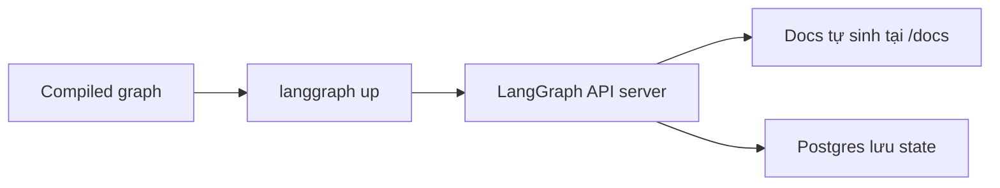

# 🚀 Chạy LangGraph Cloud API trên máy bạn: Từ langgraph.json đến web server "tự sinh"

> Nguồn: `056-LangGraph-Cloud-API---Environment-Setup-Local.txt` · [Udemy](https://ua.udemy.com/course/langgraph/learn/lecture/45217665)

Chào các bạn, Eden đây! 👋
Ở bài trước chúng ta đã chơi với LangGraph Studio. Hôm nay, mình sẽ đưa các bạn đi từ **LangSmith** tới việc **tự tay dựng một web server API từ graph** ngay trên máy local, chỉ với **LangGraph CLI**.

Mục tiêu cuối cùng: hiểu trọn quy trình **test local rồi mang lên LangGraph Cloud**, để agent của bạn có thể phục vụ bất kỳ front-end nào.

---

### 🎯 Bắt đầu từ LangSmith và tài liệu chính thức của LangGraph Cloud

Mình đang ở trong **LangSmith**, bấm vào **biểu tượng tên lửa (rocket icon)** để mở **LangGraph Cloud Console** — nơi hiển thị tất cả các service LangGraph Cloud đang chạy.

Từ đây, mình vào **tài liệu chính thức của LangGraph Cloud**, chọn **Tutorials & Quickstarts**. Có một tutorial giải thích **end-to-end** cách:

1. **Test ứng dụng LangGraph ngay trên máy local** — có sử dụng **LangServe**.
2. **Deploy nó lên LangGraph Cloud**.

Và tin vui là: **làm việc này siêu dễ**. Tất cả xoay quanh file **`langgraph.json`** mà chúng ta đã viết ở bài trước:

* Đường dẫn tới **environment variables**.
* Đường dẫn tới **graph** của mình.
* Các **dependencies** cần thiết cho ứng dụng.

Sau đó, các bạn chỉ cần **cài LangGraph CLI** rồi chạy app — thế là có ngay **ứng dụng chạy local trong container**.

---

### ⚙️ Chuẩn bị môi trường và làm quen LangGraph CLI

Đầu tiên, mình kiểm tra bằng `docker ps` để chắc chắn **không có container nào đang chạy**. Sau đó:

1. `cd` vào **repository** của dự án LangGraph — ở đây là repo **langgraph-course**.
2. Chạy **`poetry shell`** để kích hoạt **virtual environment (môi trường ảo)** với đầy đủ dependencies.
3. Nếu chưa có, cài **LangGraph CLI** bằng `poetry add langgraph-cli`.

Mình thử chạy `langgraph up` và nhận được thông báo rằng cần có **LangSmith API key** được cấu hình trong environment. Mình đổi biến **`LANGCHAIN_API_KEY`** thành **`LANGSMITH_API_KEY`** cho chắc ăn và đúng hướng dẫn — *biết đâu LangChain có logic tìm cả biến `LANGCHAIN_API_KEY` thì sao, mình không chắc lắm!*

Trước khi chạy lại, mình muốn "khoe" một chút về **LangGraph CLI**. Gõ `langgraph --help`, các bạn sẽ thấy danh sách command. Đáng chú ý nhất:

* **`langgraph dockerfile`** — sinh **Dockerfile** cho **LangGraph API server**. Mình thấy lệnh này cực hữu ích vì **viết Dockerfile khá phiền phức và — thật lòng mà nói — khá là nhàm chán**.

Mình chạy thử và nhận về một **Dockerfile** với điểm đáng chú ý: **base image lấy từ image dựng sẵn của LangChain** tên là **`langgraph-api`**. Trong đó cũng có đầy đủ **environment variables** cần thiết để chạy **LangGraph server**. Từ Dockerfile đó:

* **`langgraph build`** — build image cho bạn.
* **`langgraph up`** — nếu chưa có Dockerfile thì tạo luôn, build image và **chạy container**.

Bảng phân biệt nhanh ba lệnh CLI chính:

| Lệnh | Việc nó làm |
|---|---|
| `langgraph dockerfile` | Sinh Dockerfile cho LangGraph API server |
| `langgraph build` | Build Docker image từ Dockerfile |
| `langgraph up` | Tạo Dockerfile nếu chưa có, build image và chạy container |

---

### 🌐 Web server "tự sinh" — không viết một dòng API nào

Chạy `langgraph up` mất **khoảng một hai phút**. Kết quả: **API đang chạy tại `localhost:8123`**, và **tài liệu ở `localhost:8123/docs`** — tất cả đều do **LangChain tự sinh** cho chúng ta.

Điều thú vị là: chúng ta **không hề viết API nào cả, chỉ viết graph thôi!**

Mình mở thêm một màn hình terminal để xem các container đang chạy. `docker ps` cho thấy:

* Container **`langgraph-course-langgraph-api`** — chính là API mà LangChain tạo ra, sử dụng graph của chúng ta.
* Một **container Postgres** — nơi **lưu state** của graph.

Luồng từ graph tới web server:

Nhờ container Postgres này, chúng ta có thể **debug, đặt breakpoint và lưu state** như đã thấy ở bài về LangGraph Studio.

### 🎯 Tự kiểm tra nhanh

**Câu 1:** File `langgraph.json` chứa những thông tin gì?

<b>Xem đáp án</b>

**Đáp án:** Đường dẫn tới environment variables, đường dẫn tới graph, và các dependencies của ứng dụng.

Giải thích: Đây là trung tâm của toàn bộ quy trình test local rồi deploy.

Tham chiếu: Mục Bắt đầu từ LangSmith.

**Câu 2:** Lệnh `langgraph dockerfile` làm gì?

<b>Xem đáp án</b>

**Đáp án:** Sinh Dockerfile cho LangGraph API server, với base image dựng sẵn của LangChain tên là `langgraph-api`.

Giải thích: Nhờ đó ta không phải tự viết Dockerfile — việc vốn phiền phức và nhàm chán.

Tham chiếu: Mục Chuẩn bị môi trường.

**Câu 3:** `langgraph build` và `langgraph up` khác nhau thế nào?

<b>Xem đáp án</b>

**Đáp án:** `build` tạo image; `up` tạo Dockerfile nếu chưa có, build image rồi chạy container.

Giải thích: `up` là lệnh "tất cả trong một" để có server chạy local.

Tham chiếu: Mục Chuẩn bị môi trường.

**Câu 4:** Sau khi chạy `langgraph up`, ta có gì?

<b>Xem đáp án</b>

**Đáp án:** API chạy tại `localhost:8123` và tài liệu tại `localhost:8123/docs`, đều do LangChain tự sinh.

Giải thích: Ta không hề viết API nào cả, chỉ viết graph thôi!

Tham chiếu: Mục Web server tự sinh.

**Câu 5:** Những container nào chạy sau `langgraph up` và state được lưu ở đâu?

<b>Xem đáp án</b>

**Đáp án:** Container `langgraph-course-langgraph-api` và container Postgres; state được lưu trong Postgres.

Giải thích: Nhờ Postgres, ta có thể debug, đặt breakpoint và lưu state như ở LangGraph Studio.

Tham chiếu: Mục Web server tự sinh.

Còn bây giờ, cùng mình mở **tài liệu API** và xem LangChain đã "tặng" chúng ta những gì nhé. Ở bài tiếp theo, mình sẽ mổ xẻ thật sâu vào **Assistants, Threads và Runs**. Hẹn gặp lại các bạn! 🚀

## Nguồn tham khảo

- [Udemy — LangGraph Cloud API - Environment Setup (Local)](https://ua.udemy.com/course/langgraph/learn/lecture/45217665)
- [LangChain Docs — LangGraph CLI](https://docs.langchain.com/langsmith/cli)
- [LangChain Docs — Agent Server](https://docs.langchain.com/langsmith/agent-server)
