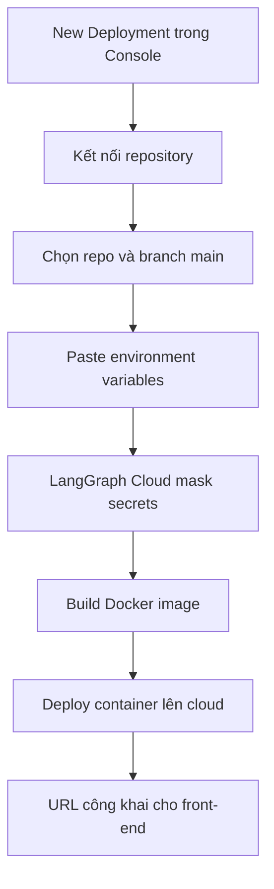

# ☁️ Deploy lên LangGraph Cloud: Đưa agent "lên mây" chỉ với vài cú click

> Nguồn: `058-Deploying-to-LangSmith-Deployment.txt` · [Udemy](https://ua.udemy.com/course/langgraph/learn/lecture/45218765)

Chào các bạn, Eden đây! 👋
Sau khi đã chạy LangGraph Cloud API ngay trên máy mình, hôm nay chúng ta sẽ **deploy dự án Advanced Track lên cloud** bằng **LangGraph Cloud Managed service** — nhanh đến mức chỉ cần **một vài cú click**.

---

### 🔌 Bước 1: Kết nối repository và chọn kiểu deployment

Trong **LangGraph Cloud Console**, mình bấm **New Deployment**. Bước đầu tiên là **kết nối repository chứa graph** với console. Mình đã làm sẵn việc này — vì thế bạn thấy **username GitHub** của mình ở đây; **LangSmith đã có quyền truy cập vào các repository** của mình.

Tiếp theo:

1. Ở mục **Select repo**, mình tìm dự án LangGraph tên **`langgraph-course`** — chính là repository chúng ta đã làm suốt các video vừa rồi.
2. Ở mục **Name**, mình đổi thành **`langgraph-course-example`** và giữ lại **suffix (hậu tố) mà hệ thống tự sinh**.
3. Chỉ định **file cấu hình LangGraph API** — trong đa số trường hợp chính là **`langgraph.json`** mà chúng ta đã quá quen mặt.
4. Chọn **branch** muốn deploy từ GitHub — ở đây là **`main`**.

Về **loại deployment**, có hai lựa chọn đáng chú ý:

* **Development instance:** phục vụ **tối đa 50 requests/giây**, **không có backup hay storage**.
* **Production deployment type:** dành cho khi bạn cần **compute ổn định và mạnh mẽ hơn hẳn**.

So sánh nhanh hai loại deployment:

| Loại deployment | Đặc điểm |
|---|---|
| Development instance | Tối đa 50 requests/giây, không có backup hay storage |
| Production deployment type | Compute ổn định và mạnh mẽ hơn hẳn |

---

### 🔐 Bước 2: Environment variables và secrets — LangGraph Cloud tự "che mặt" giúp bạn

Phần này mình thấy cực kỳ dễ chịu. Mình chỉ cần **mở file `.env`**, copy **toàn bộ environment variables** rồi **paste thẳng vào**.

Điều hay ho là:

* Mình **không phải nhập tay từng biến** một.
* LangGraph Cloud **tự phát hiện đâu là secret** — ví dụ **OpenAI API key** hay **LangSmith API key** — rồi **mask (che) chúng lại** và đánh dấu là secret.

Điều này có nghĩa: các giá trị đó sẽ được lưu trong **một secret manager storage chuyên dụng trên cloud**, chứ **không nằm trong environment variable dễ bị lộ**.

Sau đó, mình **xóa những biến không cần thiết**, vì giữ lại sẽ gây lỗi:

1. **LangSmith API key** — vì LangGraph Cloud **lấy từ tài khoản user đang đăng nhập**.
2. **`LANGCHAIN_TRACING_V2`** — vì LangGraph Cloud **tự động trace các LLM call**.
3. **`LANGCHAIN_PROJECT`** — vì project đã được đặt tên ngay khi tạo service.
4. **`PYTHONPATH`** — biến này **chỉ có ý nghĩa ở môi trường local**.

Cuối cùng chỉ còn lại **2 secrets: OpenAI API key và API key còn lại của dự án**. Sẵn sàng! Mình bấm **Submit**.

---

### ⚙️ "Hậu trường": LangGraph Cloud làm gì khi bạn bấm Deploy?

Ta được chuyển tới trang **deployments** và thấy một **deployment revision đang in progress**. Dưới nắp capo, LangGraph Cloud làm **gần như y hệt những gì chúng ta đã thấy ở local**:

1. **Build Docker image** từ repository đã kết nối — nhiều khả năng thông qua lệnh **`langgraph dockerfile`** để tạo Dockerfile trước.
2. **Build image từ Dockerfile** đó và **lưu vào artifact registry** dành cho Docker image, chạy trên cloud.
3. **Deploy và chạy container trên cloud**, rồi cho bạn một **URL** để tương tác.

Toàn bộ pipeline deploy gói gọn như sau:

Sau **vài phút**, quá trình hoàn tất và ứng dụng của chúng ta đã **deployed**. Click vào link, bạn sẽ được dẫn tới ứng dụng — giờ đã **public trên internet**.

Ứng dụng báo lỗi một chút vì đây mới là **base URL** — thêm **`/docs`** vào là xong. Và đây: **tài liệu API của ứng dụng đã deploy**, y như những gì ta thấy ở local. Thậm chí, bấm vào **LangGraph Studio**, chúng ta thấy **graph y hệt trong LangGraph IDE**!

---

### 🧪 Chạy thử trên cloud: breakpoint, interrupt và trace

Mình thử hỏi **"what is agent memory"** đúng như khi chạy local. Và kìa: **LangGraph đang chạy theo thời gian thực trên cloud, công khai cho cả internet**. Graph chạy xong và trả về: *"Agent memory refers to the ability of an agent to remember past experience"*.

Giờ thử thách hơn một chút:

1. Thêm **breakpoint trước `web search`**.
2. Hỏi **"what is graph rag"** — thông tin này **không có trong vector store**, nên graph sẽ phải đi tới web search. Đúng như dự đoán, nó **dừng ngay trước web search**.
3. Thêm một **interrupt trước `generate` node** và tiếp tục run. Lần này graph **lấy dữ liệu từ internet** về Graph RAG, và ta có thể **tìm chữ Microsoft** để xác nhận đúng chủ đề.
4. Tiếp tục run: graph **generate câu trả lời cuối cùng** cho câu hỏi về graph RAG.

Và tất nhiên, **traces** cũng có sẵn — mình mở thử một trace để các bạn xem. Quay lại **LangGraph Cloud Console**, bấm vào service vừa tạo, bạn sẽ thấy **toàn bộ trace của mọi lần chạy** ở phía dưới. Nếu muốn tạo phiên bản mới, chỉ cần bấm **New Revision** — rất đơn giản và trực tiếp.

### 🎯 Tự kiểm tra nhanh

**Câu 1:** Bước đầu tiên khi tạo deployment mới là gì?

<b>Xem đáp án</b>

**Đáp án:** Kết nối repository chứa graph với LangGraph Cloud Console.

Giải thích: Sau đó chọn repo, đặt tên, chỉ định `langgraph.json` và chọn branch muốn deploy.

Tham chiếu: Mục Bước 1.

**Câu 2:** Vì sao phải xóa LangSmith API key, `LANGCHAIN_TRACING_V2`, `LANGCHAIN_PROJECT` và `PYTHONPATH` khỏi biến môi trường?

<b>Xem đáp án</b>

**Đáp án:** Vì Cloud tự lấy key từ tài khoản đang đăng nhập, tự động trace, tự đặt tên project — còn `PYTHONPATH` chỉ có ý nghĩa ở local.

Giải thích: Giữ lại các biến này sẽ gây lỗi.

Tham chiếu: Mục Bước 2.

**Câu 3:** LangGraph Cloud làm gì khi bạn bấm Deploy?

<b>Xem đáp án</b>

**Đáp án:** Build Docker image, lưu image vào artifact registry trên cloud, deploy và chạy container rồi cấp URL.

Giải thích: Gần như y hệt những gì diễn ra ở local.

Tham chiếu: Mục Hậu trường.

**Câu 4:** Development instance khác Production deployment type thế nào?

<b>Xem đáp án</b>

**Đáp án:** Development giới hạn tối đa 50 requests/giây và không có backup hay storage; production cho compute ổn định, mạnh mẽ hơn hẳn.

Giải thích: Chọn theo nhu cầu thực tế của ứng dụng.

Tham chiếu: Mục Bước 1.

**Câu 5:** Muốn tạo phiên bản mới cho deployment đã có thì làm thế nào?

<b>Xem đáp án</b>

**Đáp án:** Bấm **New Revision** trong LangGraph Cloud Console.

Giải thích: Rất đơn giản và trực tiếp.

Tham chiếu: Mục Chạy thử trên cloud.

Vậy là agent của chúng ta đã chính thức "sống" trên cloud, sẵn sàng phục vụ front-end với một **production endpoint** thật thụ. Các bạn vừa đi hết một hành trình lớn: từ **LangGraph Studio**, qua **LangGraph Cloud API chạy local**, tới **deploy lên cloud**. Hãy tự thưởng cho mình một tràng pháo tay, và hẹn gặp lại ở những bài tiếp theo! 🚀

## Nguồn tham khảo

- [Udemy — Deploying to LangSmith Deployment](https://ua.udemy.com/course/langgraph/learn/lecture/45218765)
- [LangChain Docs — Deployment reference overview](https://docs.langchain.com/langsmith/deploy-reference-overview)
- [LangChain Docs — LangGraph CLI](https://docs.langchain.com/langsmith/cli)
