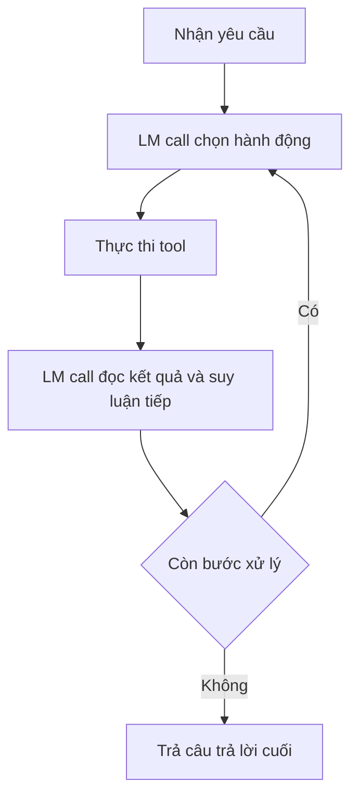

# 🏭 Đưa Agent lên Production: Những thách thức thật sự và lời khuyên "tỉnh táo" từ mình

> Nguồn: `059-Agents-In-Production.txt` · [Udemy](https://ua.udemy.com/course/langgraph/learn/lecture/43511228)

Chào các bạn, Eden đây! 👋 Sau khi đã cùng nhau xây dựng đủ loại agent, hôm nay mình muốn nói về chặng đường phía sau: **tích hợp agent vào môi trường production**. Đây là chủ đề mình rất tâm huyết, vì nó chính là khoảng cách lớn nhất giữa một bản demo chạy được và một ứng dụng thật sự phục vụ người dùng.

---

### 🐢 Vì sao agent khó lên production: chuỗi gọi tuần tự và context window

Khi làm việc với agent, các bạn sẽ thấy mình dùng rất nhiều LM call, bởi vì LM đóng vai trò **reasoning engine (cỗ máy lập luận)**. Mỗi bước agent thực hiện, mỗi tool nó dùng, đều phải đến *sau* một LM call đã quyết định dùng tool đó. Hệ quả là:

* Rất nhiều LM call cho một tác vụ.
* Các call này **diễn ra tuần tự**: cái sau phải chờ kết quả của cái trước.
* Tùy độ phức tạp và số reasoning step, ứng dụng có thể biến thành **long-running application (chạy rất lâu)**.

Để dễ hình dung, đây là chuỗi bước tuần tự của một lượt agent:

*Có vài workaround cho việc này — ví dụ dùng **semantic cache (bộ đệm ngữ nghĩa)** hoặc **LM cache** — nhưng trong khóa học mình sẽ không đi sâu.*

Vấn đề thứ hai là **context window (cửa sổ ngữ cảnh)**. Mỗi lần reasoning, chúng ta gửi một prompt khổng lồ vào LM. Phần lớn model hiện nay xử lý được khoảng **32K token**; nghe có vẻ nhiều, nhưng trong ứng dụng thực tế con số này bị vượt qua rất dễ dàng. Nghĩa là số bước agent có thể thực hiện sẽ bị giới hạn bởi context window.

Mình biết có những model như **Claude của Anthropic** nhận tới **100K token**, nhưng gửi 100K token vào LM kéo theo vô số vấn đề — điển hình là LM **quên thông tin ở giữa** prompt. Các bạn có thể tìm đọc paper **"Lost in the Middle"** để hiểu rõ hơn nhé.

---

### 🎲 Hallucination, xác suất và hóa đơn token

Chúng ta đều biết **hallucination (ảo giác)**: đặt câu hỏi và LM trả lời lệch hẳn khỏi vấn đề, đơn giản vì nó đang đoán từng token một. **Retrieval augmentation** là kỹ thuật tốt để giảm hallucination, vì ta "neo" LM bằng thông tin gửi trong context.

Nhưng vì LLM là một "sinh vật thống kê", mọi câu trả lời — kể cả việc chọn đúng tool — đều mang xác suất. Giả sử xác suất chọn đúng tool là **0.9**. Chỉ làm một lần thì quá tốt! Nhưng nếu call tuần tự hết bước này đến bước khác, theo **multiplication law (luật nhân xác suất)**, chỉ sau **6 bước**, xác suất có câu trả lời tốt rơi xuống còn **0.59**. Với một tác vụ lớn hơn, con số này còn thấp hơn nữa.

Một hướng giải quyết là **fine-tuning cho tool selection (chọn công cụ)**: lấy một LM và tinh chỉnh nó trên đúng bộ tool mà agent có. Đã có nhiều research paper chứng minh cách này giúp việc chọn tool, gọi API chính xác hơn hẳn mức 90% ban đầu.

Về **pricing (định giá)**: chúng ta trả tiền cho cả token gửi đi lẫn nhận về, mà prompt của agent thì rất lớn. Khi chạy ở quy mô hàng triệu lần, hóa đơn nhận được chắc chắn sẽ rất "đau". Chưa kể **GPT-4** mạnh về lập luận nhưng chạy rất chậm và rất đắt — dùng ở quy mô lớn có thể khiến bài toán kinh tế không còn hợp lý. Hai chiến lược được nhắc đến là dùng **semantic cache** thay cho LM call, và dùng **retrieval augmentation cho tool selection** (khóa học này không demo): khi có quá nhiều tool, hãy chạy semantic search để lọc ra những tool có khả năng liên quan nhất trước khi gọi LM reasoning.

---

### 🔒 Kiểm chứng phản hồi và bảo mật

Vì ta đặt cược vào phản hồi của LLM để chọn tool hay xuất nội dung cho người dùng, chúng ta cần cơ chế **response validation (kiểm chứng phản hồi)**. Ngay cả khi nội dung đúng, chỉ cần **sai format** là đủ làm hỏng ứng dụng. Nhưng testing là bài toán cực kỳ phức tạp — *cá nhân mình chưa từng gặp một giải pháp thật sự robust cho vấn đề này.* Lưu ý: mọi chủ đề trong bài này đều đúng cho **mọi ứng dụng LLM**, không riêng gì agent.

Về bảo mật: trong ứng dụng lớn, ta trao cho agent quyền chạy query database, gọi API, nói chuyện với bên thứ ba. Nếu kẻ xấu tấn công bằng **prompt injection (tiêm lệnh độc hại)** hoặc lấy được API key, chúng sẽ chạm tới các tool đó — và nếu database là tài sản riêng của công ty, các bạn thật sự gặp rắc rối. Vì vậy:

1. **Tuân thủ least privilege (đặc quyền tối thiểu):** chỉ cấp cho tool và agent quyền tối thiểu cần thiết.
2. **Đặt guardrails cho prompt:** cho phép hoặc chặn một số dạng prompt trước khi gửi tới agent.
3. **Dùng giải pháp có sẵn:** có nhiều lựa chọn open source; mình khuyên dùng **LLM Guard** — một dự án rất hứa hẹn với nhiều tính năng bảo mật cho LLM.

Nhìn lại toàn bài, đây là bảng tóm tắt các thách thức và hướng giảm nhẹ tương ứng:

| Thách thức | Hệ quả | Hướng giảm nhẹ |
|---|---|---|
| Chuỗi LM call tuần tự | Ứng dụng chạy rất lâu | Semantic cache, LM cache |
| Context window giới hạn | Số bước agent bị chặn trần | Tối ưu lượng thông tin gửi vào LM |
| Xác suất chọn đúng tool | Sai số nhân dần qua từng bước | Fine-tuning cho tool selection |
| Hóa đơn token | Chi phí lớn khi chạy quy mô lớn | Semantic cache, retrieval cho tool selection |
| Kiểm chứng phản hồi | Sai format là đủ làm hỏng ứng dụng | Chưa có giải pháp thật sự robust |
| Bảo mật | Prompt injection, lộ API key chạm tới tool | Least privilege, guardrails, LLM Guard |

---

### ⚖️ Lời khuyên cuối: đừng "overkill" với agent

Agent phát huy sức mạnh khi ta có một chuỗi bước **non-deterministic (không xác định trước)**. Ngược lại, nếu biết chính xác mình cần làm gì và mô tả được bằng lời hoặc bằng code, thì **bạn không cần dùng agent**.

Mình từng gặp không ít cá nhân và công ty cố dùng LM agent cho những bài toán mà giải pháp thật sự bền vững chỉ là một đoạn **code Python deterministic**. Lời khuyên của mình: trước khi dùng agent, hãy tự hỏi liệu mình có thể tự implement bằng code deterministic không — nếu có, mình thật lòng không khuyên các bạn dùng agent, vì như các bạn đã thấy, nó kèm theo rất nhiều thách thức.

### 🎯 Tự kiểm tra nhanh

**Câu 1:** Vì sao ứng dụng agent thường là long-running application?

<b>Xem đáp án</b>

**Đáp án:** Vì agent dùng rất nhiều LM call diễn ra tuần tự.

Giải thích: Mỗi tool call chỉ xảy ra sau khi LM đã suy luận và quyết định; cái sau chờ cái trước nên càng nhiều reasoning step càng lâu.

Tham chiếu: Mục Vì sao agent khó lên production.

**Câu 2:** Context window ảnh hưởng thế nào tới agent?

<b>Xem đáp án</b>

**Đáp án:** Nó giới hạn số bước agent có thể thực hiện.

Giải thích: Mỗi lần reasoning phải gửi một prompt khổng lồ; model phổ biến xử lý khoảng 32K token nên con số này bị vượt rất dễ.

Tham chiếu: Mục Vì sao agent khó lên production.

**Câu 3:** Vì sao xác suất chọn đúng tool 0.9 vẫn đáng lo?

<b>Xem đáp án</b>

**Đáp án:** Vì theo luật nhân xác suất, qua nhiều bước con số tụt rất nhanh — chỉ 6 bước còn khoảng 0.59.

Giải thích: Muốn cải thiện thì fine-tuning cho tool selection là hướng đã được research chứng minh.

Tham chiếu: Mục Hallucination, xác suất và hóa đơn token.

**Câu 4:** Ba việc cần làm để bảo mật ứng dụng agent là gì?

<b>Xem đáp án</b>

**Đáp án:** Tuân thủ least privilege, đặt guardrails cho prompt, và dùng giải pháp có sẵn như LLM Guard.

Giải thích: Kẻ xấu tấn công bằng prompt injection hoặc lấy API key có thể chạm tới database và API mà agent được cấp quyền.

Tham chiếu: Mục Kiểm chứng phản hồi và bảo mật.

**Câu 5:** Khi nào mình khuyên KHÔNG nên dùng agent?

<b>Xem đáp án</b>

**Đáp án:** Khi bài toán có thể giải quyết bằng code Python deterministic.

Giải thích: Agent chỉ phát huy sức mạnh với chuỗi bước non-deterministic; còn biết chính xác cần làm gì thì code deterministic bền vững hơn.

Tham chiếu: Mục Lời khuyên cuối.

Một lời "disclaimer" nho nhỏ để kết bài: agent là công nghệ tuyệt vời với tiềm năng khổng lồ. Đi từ prototype tới production **hoàn toàn khả thi**, chỉ là không hề dễ. Mình *không* hề nói agent chưa sẵn sàng cho production — mình chỉ muốn các bạn thật cẩn trọng, vì một công nghệ vĩ đại luôn đi kèm cái giá của nó.

Ở bài tiếp theo, hãy chuẩn bị tinh thần "so găng" nhé: chúng ta sẽ đặt **LangGraph** lên bàn cân với **CrewAI**. Hẹn gặp lại các bạn! 🚀

## Nguồn tham khảo

- [Udemy — Agents In Production](https://ua.udemy.com/course/langgraph/learn/lecture/43511228)
- [Lost in the Middle: How Language Models Use Long Contexts](https://arxiv.org/abs/2307.03172)
- [LLM Guard — GitHub](https://github.com/protectai/llm-guard)
