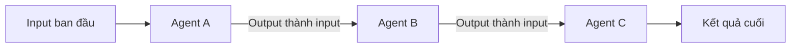

# 🥊 LangGraph vs CrewAI: Đâu là framework cho multi-agent "chạy được" thật sự?

> Nguồn: `060-LangGraph-VS-CrewAI-main-difference.txt` · [Udemy](https://ua.udemy.com/course/langgraph/learn/lecture/43593312)

Chào các bạn, Eden đây! 👋 Trong bài này, mình muốn chia sẻ góc nhìn cá nhân về hai framework đình đám nhất cho việc phát triển **generative AI agent** nói chung và **multi-agent architecture (kiến trúc đa tác nhân)** nói riêng: **LangGraph** và **CrewAI**. Cả hai đều tuyệt vời, nhưng chúng khác nhau ở một điểm cực kỳ quan trọng mà mình sắp "bật mí" ngay sau đây.

---

### 🤖 "Multi-agent" theo cách mình định nghĩa

Trước khi so sánh, mình cần làm rõ khái niệm. Khi nói **multi-agent**, mình đang nói về kiến trúc mà mỗi agent về cơ bản là:

* Một **prompt "xịn"** kèm theo một nhân vật (character) — ví dụ một **critique character (nhân vật phản biện)** có nhiệm vụ đưa ra lời góp ý ngắn gọn, sắc bén cho bản nháp bài viết của bạn.
* Hoặc một agent được trang bị **external tools (công cụ bên ngoài)** như web search, truy cập database, v.v.

Các agent này có thể **tương tác với nhau**: agent này gửi message cho agent kia, và output của agent này lại trở thành input của agent khác.

Điểm mấu chốt là chúng không hoạt động biệt lập, mà tạo thành một hệ thống có trao đổi qua lại — và chính cách chúng "nói chuyện" với nhau là thứ quyết định chất lượng đầu ra.

Sơ đồ tối giản của một hệ multi-agent, nơi output của agent này là input của agent kia:

---

### 🎛️ Flow engineering: điểm khác biệt lớn nhất

Theo mình, **LangGraph linh hoạt hơn CrewAI rất nhiều**, và đây là lý do cốt lõi.

LangGraph hiện thực hóa một ý tưởng gọi là **flow engineering (kỹ thuật thiết kế luồng)** — nơi chúng ta, những developer, có **toàn quyền kiểm soát** luồng chạy của các agent:

* Agent nào đang nói chuyện với agent nào.
* **State (trạng thái)** được chia sẻ giữa chúng là gì.
* Luồng thực thi của chương trình sẽ đi theo hình dạng nào.

Điều này cực kỳ quan trọng, bởi nếu để agent quá tự chủ, chúng sẽ "tản mạn" theo muôn hướng và không thật sự hoạt động được. Ví dụ rõ nhất là **AutoGPT** — một dự án tuyệt vời, đầy đổi mới và đẩy xa giới hạn của những gì chúng ta có thể làm, nhưng lại **không thể dùng trong hệ thống production** chính vì agent có quá nhiều tự do. LangGraph giải quyết bài toán đánh đổi giữa **tự do (freedom)** và **kiểm soát (control)** bằng chính các kỹ thuật flow engineering.

| Tiêu chí | LangGraph | CrewAI |
|---|---|---|
| Quyền kiểm soát luồng chạy | Developer toàn quyền nhờ flow engineering | Logic luồng chạy được "giấu" đi |
| Mức độ áp đặt quan điểm | Linh hoạt hơn rất nhiều | Framework khép kín hơn |
| Đánh giá của mình | Lựa chọn đúng cho production-grade | Framework tốt, nhưng ít quyền kiểm soát |

---

### 🎯 Tự kiểm tra nhanh

**Câu 1:** Trong bài này, "multi-agent" được định nghĩa là gì?

<b>Xem đáp án</b>

**Đáp án:** Là kiến trúc gồm nhiều agent tương tác với nhau, output của agent này thành input của agent khác.

Giải thích: Mỗi agent có thể là một prompt kèm nhân vật, hoặc được trang bị external tools như web search, database.

Tham chiếu: Mục "Multi-agent" theo cách mình định nghĩa.

**Câu 2:** Flow engineering là gì?

<b>Xem đáp án</b>

**Đáp án:** Là kỹ thuật thiết kế luồng, nơi developer kiểm soát agent nào nói với agent nào, state chia sẻ là gì và luồng chạy có hình dạng ra sao.

Giải thích: Đây là điểm khác biệt cốt lõi giữa LangGraph và CrewAI.

Tham chiếu: Mục Flow engineering.

**Câu 3:** Vì sao AutoGPT không dùng được trong production?

<b>Xem đáp án</b>

**Đáp án:** Vì agent có quá nhiều tự do, thiếu kiểm soát nên hoạt động "tản mạn".

Giải thích: Đây chính là bài toán đánh đổi giữa tự do và kiểm soát mà LangGraph nhắm giải quyết.

Tham chiếu: Mục Flow engineering.

**Câu 4:** CrewAI khác LangGraph ở điểm nào?

<b>Xem đáp án</b>

**Đáp án:** CrewAI "giấu" logic luồng chạy đi, nên không trao nhiều quyền kiểm soát flow như LangGraph.

Giải thích: Vì vậy LangGraph linh hoạt hơn rất nhiều theo góc nhìn của mình.

Tham chiếu: Mục Kết luận của mình.

**Câu 5:** Mình kết luận thế nào về việc chọn framework?

<b>Xem đáp án</b>

**Đáp án:** CrewAI là framework tốt, nhưng nếu mục tiêu là production-grade application cho người dùng cuối thì LangGraph là lựa chọn đúng đắn.

Giải thích: Lý do là quyền kiểm soát mà LangGraph trao cho bạn.

Tham chiếu: Mục Kết luận của mình.

---

### 🧭 Kết luận của mình

Ngược lại với LangGraph, **CrewAI "giấu" logic luồng chạy đi**, nên chúng ta không có nhiều quyền kiểm soát flow như khi dùng LangGraph.

Vậy nên, để kết lại: mình cho rằng CrewAI là một framework tốt, nhưng nếu mục tiêu là một **production-grade application** thật sự dùng được với người dùng cuối, thì **LangGraph là lựa chọn đúng đắn** — đơn giản vì quyền kiểm soát mà nó trao cho bạn.

Ở bài tiếp theo, mình sẽ giới thiệu một "hiện thân" hoàn hảo của triết lý này: **GPT Researcher** — research agent mã nguồn mở được xây dựng chuẩn production. Hẹn gặp lại các bạn! 🚀

## Nguồn tham khảo

- [Udemy — LangGraph VS CrewAI, main difference](https://ua.udemy.com/course/langgraph/learn/lecture/43593312)
- [LangGraph — Tài liệu chính thức](https://docs.langchain.com/oss/python/langgraph/overview)
- [CrewAI — Tài liệu chính thức](https://docs.crewai.com)
- [AutoGPT — GitHub](https://github.com/Significant-Gravitas/AutoGPT)
