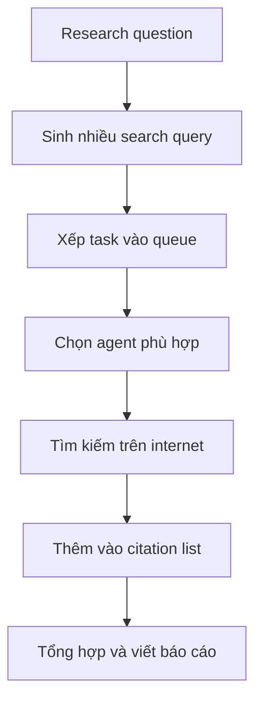

# 🔬 GPT Researcher: Cỗ máy nghiên cứu tự động đạt chuẩn production (Demo thực chiến)

> Nguồn: `061-GPT-Researcher.txt` · [Udemy](https://ua.udemy.com/course/langgraph/learn/lecture/44765461)

Chào các bạn, Eden đây! 👋 Trong bài này, chúng ta sẽ cùng tìm hiểu **GPT Researcher** — một **autonomous research agent (agent nghiên cứu tự động)** mã nguồn mở do **Assaf Elovic** tạo ra. Đây là ví dụ tuyệt vời về một agent thật sự **production-ready (sẵn sàng cho môi trường thực tế)** và có thể vận hành được, chứ không chỉ dừng ở mức demo.

---

### 🌟 Vì sao mình "mê" GPT Researcher

GPT Researcher hội tụ đủ những yếu tố mà mình cho là tối quan trọng khi xây dựng một generative AI agent:

1. **Scalable (có thể mở rộng quy mô).**
2. **Khả thi và cost efficient (tiết kiệm chi phí).**
3. **Output chất lượng rất cao.**

Và đặc biệt, nó **tận dụng LangGraph** trong phần triển khai của mình. GPT Researcher cho ra những **research report (báo cáo nghiên cứu)** cực kỳ chất lượng về bất kỳ chủ đề nào: nó có thể tìm kiếm trên internet, hoặc tìm kiếm trên dữ liệu local của bạn.

Theo mình đánh giá, artifact nhận được còn **tốt hơn output của ChatGPT hay Perplexity**, bởi vì nó xử lý dữ liệu rất nhiều và làm rất tốt việc **aggregation (tổng hợp)** thông tin trước khi viết báo cáo. Báo cáo có thể dài **8–9 trang** — nhiều hơn hẳn mức 1.000–2.000 từ mà các LLM thông thường xuất ra. Vậy mà mỗi lần research chỉ tốn **chưa tới 1 cent**!

---

### 🖥️ Xem tận mắt: demo research về GraphRAG

Mình đã clone repository này về máy và chạy GPT Researcher trực tiếp (cách cài đặt mình sẽ hướng dẫn ở các video sau). Trong phần demo, mình chọn chủ đề **GraphRAG**.

Quy trình gồm vài lựa chọn thú vị:

* **Loại báo cáo:** mình chọn **summary report**; ngoài ra còn có bản **in-depth (chuyên sâu)** hoặc **resource report**.
* **Giọng điệu (tone):** mình để **objective (khách quan)**; các bạn có thể đổi thành **formal, analytical, persuasive** và nhiều lựa chọn khác.
* **Nguồn dữ liệu:** tìm thông tin trên **web** hoặc làm việc với **local documents (tài liệu nội bộ)** — lựa chọn này rất hợp cho thông tin proprietary mà bạn không muốn chia sẻ ra ngoài.

| Tiêu chí | Tìm trên web | Tìm trên tài liệu local |
|---|---|---|
| Nguồn dữ liệu | Thông tin công khai trên internet | Tài liệu nội bộ của bạn |
| Phù hợp nhất | Chủ đề rộng, cần nhiều nguồn | Thông tin proprietary cần bảo mật |

Một điểm mình rất thích là **agentic interface (giao diện agentic)**: nó phản ánh đúng những gì agent đang làm ở từng bước. Trong tương lai, chúng ta có thể thêm các **stop (điểm dừng)** và **breakpoint (điểm ngắt)** để can thiệp, "uốn nắn" và ground agent nhằm đạt kết quả tốt hơn.

---

### ⚙️ Bên trong "cỗ máy suy nghĩ": technology agent và các search query

Điều đầu tiên researcher làm là **suy nghĩ về research question** cho tác vụ đã cho. Chỉ search một câu đơn giản về GraphRAG là không đủ — nó muốn đặt ra nhiều câu hỏi tìm kiếm hơn để có kết quả chi tiết hơn và nhiều nguồn hơn. *Cách này mô phỏng rất đúng workflow nghiên cứu thật của con người.*

Tiếp đến, nó **đưa task vào queue** để bắt đầu research. Nếu bạn có nhiều chủ đề, nhiều task sẽ **chạy đồng thời (concurrently)** — tiết kiệm thời gian đáng kể.

Sau đó, researcher chọn loại agent phù hợp; ở đây nó dùng **technology agent (agent công nghệ)** — về bản chất là một **prompt rất công phu**, "neo" agent vào việc thể hiện tốt ở các chủ đề công nghệ, ví dụ gán persona cho một người cực kỳ am hiểu kỹ thuật, biết code. Đây là một kỹ thuật **prompt engineering** rất hay để LLM cho output tốt hơn.

Với chủ đề GraphRAG, research agent tìm kiếm theo các query như:

1. **GraphRAG technology overview.**
2. **GraphRAG use cases in applications.**
3. **GraphRAG reviews and comparisons.**

Nhờ đó, kết quả không còn là một truy vấn hời hợt về GraphRAG mà chi tiết hơn hẳn. Khi có kết quả từ internet, điều đầu tiên nó làm là **thêm vào citation list (danh sách trích dẫn)** — mỗi khi nhắc tới nguồn nào, nó đều liên kết tới nguồn đó, để câu trả lời thật sự được **grounded (neo vào dữ liệu thật)**.

Researcher tiếp tục review thông tin trong các citation, xử lý và "nghiền" toàn bộ dữ liệu. Giao diện hiển thị cả **intermediate result (kết quả trung gian)** lẫn **chi phí của bước research** — và như các bạn thấy, chi phí cực kỳ nhỏ.

Toàn bộ dòng chảy của một lượt research có thể tóm gọn như sau:

---

### 📄 Thành quả cuối cùng: báo cáo GraphRAG và những trích dẫn "xịn"

Sau khi xử lý xong toàn bộ thông tin, GPT Researcher bắt đầu **generate report**. Bản báo cáo về GraphRAG bao quát rất nhiều khía cạnh: ứng dụng, khái niệm, thuật toán... Trong phần introduction, nó mô tả **GraphRAG là một kỹ thuật tối ưu hóa retrieval augmentation (tăng cường truy xuất) bằng cách tận dụng knowledge graph (đồ thị tri thức)**, nhằm có thêm context liên quan, mạch lạc về các mối liên hệ giữa các entity. Nó cũng chỉ ra cấu trúc graph xoay quanh retrieval, augmentation và generation.

Mình thậm chí tải báo cáo về dưới dạng **PDF** để xem cho đẹp. Phần citation dẫn thẳng tới **blog chính thức của Microsoft** — nơi họ giới thiệu GraphRAG — cùng các nguồn khác như cộng đồng **Open Data Science Conference 2024** và repository GitHub của Microsoft.

À, nhân đây mình bật mí: mình sắp có bài nói tại **London** về **LangChain, LangGraph và agents**. Sẽ rất vui, các bạn nhớ tham gia nhé!

### 🎯 Tự kiểm tra nhanh

**Câu 1:** GPT Researcher là gì và do ai tạo ra?

<b>Xem đáp án</b>

**Đáp án:** Là autonomous research agent mã nguồn mở do Assaf Elovic tạo ra.

Giải thích: Nó là ví dụ về một agent production-ready, vận hành được thật chứ không chỉ dừng ở demo.

Tham chiếu: Đoạn mở đầu bài.

**Câu 2:** Ba yếu tố khiến mình đánh giá cao GPT Researcher là gì?

<b>Xem đáp án</b>

**Đáp án:** Scalable, cost efficient và output chất lượng rất cao.

Giải thích: Đây cũng là ba tiêu chí then chốt khi xây dựng bất kỳ generative AI agent nào.

Tham chiếu: Mục Vì sao mình "mê" GPT Researcher.

**Câu 3:** Vì sao artifact của GPT Researcher tốt hơn output ChatGPT hay Perplexity?

<b>Xem đáp án</b>

**Đáp án:** Vì nó xử lý rất nhiều dữ liệu và làm tốt việc aggregation trước khi viết báo cáo.

Giải thích: Báo cáo có thể dài 8–9 trang, hơn hẳn mức 1.000–2.000 từ của LLM thông thường, mà chi phí chưa tới 1 cent.

Tham chiếu: Mục Vì sao mình "mê" GPT Researcher.

**Câu 4:** Technology agent trong ví dụ GraphRAG là gì?

<b>Xem đáp án</b>

**Đáp án:** Về bản chất là một prompt rất công phu, gán persona chuyên gia am hiểu kỹ thuật cho agent.

Giải thích: Đây là kỹ thuật prompt engineering để LLM cho output tốt hơn ở chủ đề công nghệ.

Tham chiếu: Mục Bên trong "cỗ máy suy nghĩ".

**Câu 5:** Citation list giúp ích gì cho báo cáo?

<b>Xem đáp án</b>

**Đáp án:** Nó liên kết mỗi thông tin với nguồn tương ứng, giúp câu trả lời được grounded vào dữ liệu thật.

Giải thích: Kết quả từ internet được thêm ngay vào citation list mỗi khi researcher nhắc tới một nguồn.

Tham chiếu: Mục Bên trong "cỗ máy suy nghĩ".

Để kết lại: GPT Researcher là ví dụ rất tốt về một **agentic application** có thể **scale**, **hiệu năng cao** và **tiết kiệm chi phí** — ba tiêu chí then chốt khi xây dựng bất kỳ generative AI agent nào. Ở các bài tiếp theo, mình sẽ hướng dẫn cài đặt chi tiết và "mổ xẻ" kiến trúc bên trong nó. Hẹn gặp lại các bạn! 🚀

## Nguồn tham khảo

- [Udemy — GPT Researcher](https://ua.udemy.com/course/langgraph/learn/lecture/44765461)
- [GPT Researcher — GitHub](https://github.com/assafelovic/gpt-researcher)
- [GPT Researcher — Documentation](https://docs.gptr.dev)
