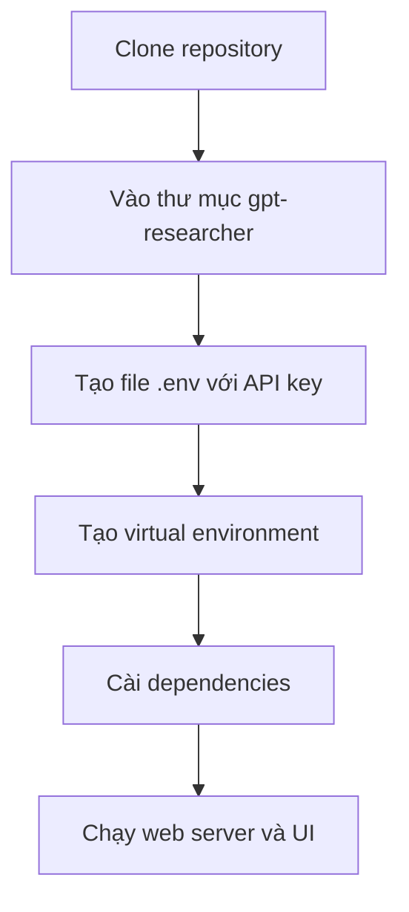

# 🛠️ Cài đặt GPT Researcher: Từ clone repo đến chạy UI trong vài bước

> Nguồn: `062-GPT-Researcher---Setup.txt` · [Udemy](https://ua.udemy.com/course/langgraph/learn/lecture/45087035)

Chào các bạn, Eden đây! 👋 Sau khi đã xem GPT Researcher "biểu diễn" ở bài trước, hôm nay mình sẽ hướng dẫn các bạn **cài đặt nó ngay trên máy local** — từ clone source code, cấu hình API key, tạo virtual environment cho tới khởi động web UI. Cùng bắt tay vào làm nhé!

---

### 📥 Lấy source code về máy

Đầu tiên, mình đang ở trên **GitHub repository** của GPT Researcher. Các bạn hãy **clone repository** bằng URL của nó về máy.

Sau khi đã có code, chúng ta cần **cd vào thư mục đó** và mở phần hướng dẫn chạy (instructions) trong repository. Theo hướng dẫn, mình di chuyển vào thư mục con: `cd gpt-researcher`.

*Lưu ý nhỏ: nếu bạn dùng Windows, hãy dùng lệnh tương đương trong PowerShell hoặc Git Bash nhé.*

Toàn bộ quy trình cài đặt gói gọn trong sơ đồ sau:

---

### 🔑 Tạo file .env và cấu hình API key

Ở bước này, chúng ta cần khai báo **OpenAI API key** và **Tavily API key** để có thể sử dụng researcher. Trong repository hiện tại **chưa có file `.env`**, nên mình sẽ tạo mới một file và khởi tạo nó với hai biến môi trường chứa API key.

Mình điền **Tavily API key** và **OpenAI API key** vào đó — bạn có thể dùng bất kỳ LLM nào mình muốn — rồi lưu file lại.

---

### 🐍 Tạo virtual environment và cài dependencies

Giờ là lúc dựng **virtual environment (môi trường ảo)** để các package không "đụng chạm" nhau:

1. Mình tạo môi trường ảo bằng module có sẵn trong **Python Standard Library**, đặt tên là `research_venv`. Chỉ sau vài giây là xong.
2. Kích hoạt môi trường bằng cách trỏ tới thư mục `bin` và chạy script `activate` (lệnh `source research_venv/bin/activate`).
3. Cài toàn bộ dependencies bằng `pip install -r requirements.txt`.

Quá trình này sẽ mất một đến hai phút vì GPT Researcher dùng **rất nhiều package**. *Cứ kiên nhẫn ngồi đợi một chút nhé, mọi thứ đều đáng giá!*

---

### 🚀 Khởi động web server và UI

Khi mọi dependency đã được cài xong, mình copy câu lệnh khởi động **web server + UI** từ hướng dẫn. Chạy nó lên, mở trình duyệt và tải ứng dụng — đây chính là giao diện chúng ta đã thấy ở demo trước.

### 🎯 Tự kiểm tra nhanh

**Câu 1:** Hai API key cần khai báo để chạy GPT Researcher là gì?

<b>Xem đáp án</b>

**Đáp án:** OpenAI API key và Tavily API key.

Giải thích: Bạn vẫn có thể dùng bất kỳ LLM nào mình muốn, nhưng vẫn cần khai báo để researcher hoạt động.

Tham chiếu: Mục Tạo file .env và cấu hình API key.

**Câu 2:** Vì sao phải tự tạo file `.env`?

<b>Xem đáp án</b>

**Đáp án:** Vì repository hiện tại chưa có file này.

Giải thích: Mình tạo mới file và khởi tạo nó với hai biến môi trường chứa API key rồi lưu lại.

Tham chiếu: Mục Tạo file .env và cấu hình API key.

**Câu 3:** Virtual environment dùng để làm gì?

<b>Xem đáp án</b>

**Đáp án:** Để các package không "đụng chạm" nhau.

Giải thích: Mình tạo môi trường ảo bằng module có sẵn trong Python Standard Library, đặt tên là `research_venv`.

Tham chiếu: Mục Tạo virtual environment và cài dependencies.

**Câu 4:** Sau khi kích hoạt môi trường ảo, cài dependencies bằng cách nào?

<b>Xem đáp án</b>

**Đáp án:** Chạy `pip install -r requirements.txt`.

Giải thích: Quá trình này mất một đến hai phút vì GPT Researcher dùng rất nhiều package.

Tham chiếu: Mục Tạo virtual environment và cài dependencies.

**Câu 5:** Bước cuối cùng để dùng GPT Researcher là gì?

<b>Xem đáp án</b>

**Đáp án:** Chạy lệnh khởi động web server + UI rồi mở trình duyệt để tải ứng dụng.

Giải thích: Đây chính là giao diện đã thấy ở demo bài trước.

Tham chiếu: Mục Khởi động web server và UI.

Vậy là xong! Bây giờ các bạn đã có thể thoải mái thử nghiệm GPT Researcher ngay trên máy mình. Ở video tiếp theo, mình sẽ cùng các bạn "mổ xẻ" **kiến trúc bên trong** của cỗ máy này để hiểu vì sao nó chạy tốt đến vậy. Hẹn gặp lại! 🚀

## Nguồn tham khảo

- [Udemy — GPT Researcher Setup](https://ua.udemy.com/course/langgraph/learn/lecture/45087035)
- [GPT Researcher — Getting Started](https://docs.gptr.dev/docs/gpt-researcher/getting-started)
- [GPT Researcher — GitHub](https://github.com/assafelovic/gpt-researcher)
