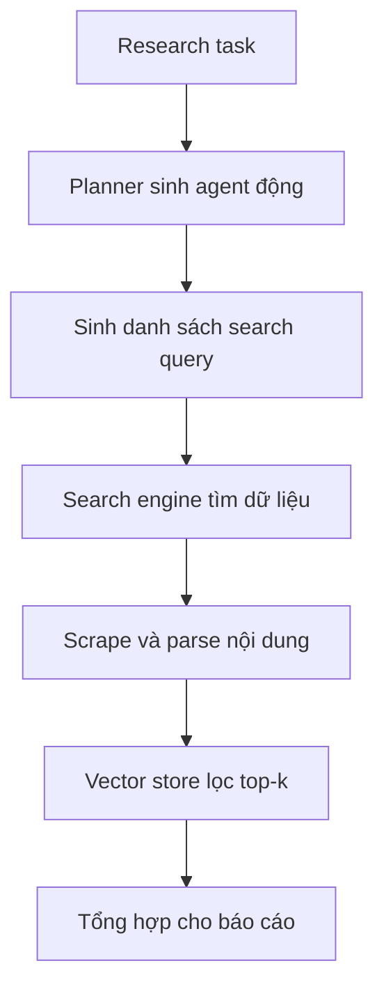

# 🧠 Kiến trúc GPT Researcher: "Mổ xẻ" bộ não của cỗ máy nghiên cứu tự động

> Nguồn: `063-GPT-Researcher---Architecture.txt` · [Udemy](https://ua.udemy.com/course/langgraph/learn/lecture/45087037)

Chào các bạn, Eden đây! 👋 Hôm nay chúng ta sẽ cùng "mổ xẻ" **GPT Researcher**: nó được xây dựng thế nào, kiến trúc và luồng chạy của một bản in-depth research ra sao. Đây cũng là dịp rất tốt để cảm nhận **generative AI development life cycle (vòng đời phát triển ứng dụng Gen AI)** đã tiến hóa thế nào trong năm qua — bên trong nó là rất nhiều ý tưởng hay và các kỹ thuật prompt engineering đáng để biết.

---

### 🎯 Khởi đầu: research task và planner "động"

Mọi thứ bắt đầu với một **research task** — chính là query mà bạn đưa cho GPT Researcher. Từ đó, một **planner** sẽ **sinh động (dynamically generate)** ra research agent phù hợp với chủ đề đang tìm kiếm.

Nhớ lại ví dụ ở bài demo: chúng ta hỏi về **GraphRAG** và GPT Researcher đã tạo ra một **technology agent (agent công nghệ)** — agent "đo ni đóng giày" cho các chủ đề kỹ thuật. Để dễ hình dung, các bạn có thể nghĩ technology agent đơn giản là một **prompt công phu** gán cho agent vai trò và persona của một người cực kỳ đam mê công nghệ, biết code.

Điều "cool" là tất cả đều được tạo **tự động**. GPT Researcher lấy chủ đề bạn tìm kiếm, tự quyết định loại agent cần dùng — có thể là về **nông nghiệp**, **công nghệ**, **tài chính**... khả năng là vô tận. Thông tin này được đưa vào một prompt công phu, rồi LLM trả về persona cho agent. Mọi thứ ở đây đều rất linh hoạt.

---

### ✍️ Kỹ thuật few-shot: dạy LLM "đúc" persona cho agent

Trong prompt gửi cho LLM ở đầu mỗi lượt chạy, các bạn sẽ thấy có **few-shot examples** — ví dụ mẫu cho LLM biết output đúng phải trông như thế nào. Kết quả nhận về là **loại research agent** kèm **prompt persona** của nó.

Đây là một ý tưởng cực hay, giúp cải thiện performance và cho ra output tốt hơn. *Mình thật sự rất thích kỹ thuật này!*

---

### 🔎 Sinh thêm search query để research "đào sâu"

Khi đã có persona cho agent, bước tiếp theo là tạo ra các **research query** để tìm kiếm online. Từ chủ đề gốc, GPT Researcher muốn việc nghiên cứu **in-depth (chuyên sâu)** hơn, nên ngoài query đúng chủ đề, nó còn truy vấn cả những khía cạnh xung quanh.

Prompt ở bước này sẽ yêu cầu LLM sinh ra **đúng số lượng query** mà bạn đã cấu hình khi khởi tạo GPT Researcher. Ở ví dụ demo, chúng ta đã thấy các query như:

* **GraphRAG technology overview.**
* **GraphRAG use cases and applications.**
* **GraphRAG reviews and comparisons.**

Nhờ tìm nhiều khía cạnh khác nhau của cùng một chủ đề, dữ liệu thu về phong phú hơn, qua đó xử lý ra kết quả tốt hơn hẳn.

---

### 🌐 Tìm kiếm, scrape dữ liệu và "sàng lọc" bằng vector store

Khi đã có danh sách query, GPT Researcher kích hoạt **search engine** để tìm dữ liệu — nền tảng cho báo cáo nghiên cứu. Tùy cấu hình và độ sâu mong muốn, nó có thể lấy thông tin từ **hàng chục đến hàng trăm website**.

Với mỗi site, researcher **scrape** thông tin rồi **parse** và xử lý toàn bộ nội dung trang — một tác vụ rất thử thách, bởi các trang web có thể là **HTML, README hay cả mã JavaScript**. Sau đó, nó dùng **vector store** để **chunk (chia nhỏ)** dữ liệu và chỉ lấy ra những thông tin **liên quan nhất** cho research task ban đầu — cụ thể là **top-k** thông tin hữu ích nhất cho báo cáo.

Và nhớ nhé: **mọi thứ đều động**. Tùy vào query, loại agent nhận được và system prompt được sinh tự động, "người bạn đồng hành" này sẽ thay đổi xuyên suốt hành trình nghiên cứu — kể cả khi tìm kiếm hay khi tạo query.

Toàn bộ pipeline của một bản in-depth research đi theo luồng như sau:

### 🎯 Tự kiểm tra nhanh

**Câu 1:** Planner trong GPT Researcher làm gì?

<b>Xem đáp án</b>

**Đáp án:** Sinh động ra research agent phù hợp với chủ đề đang tìm kiếm.

Giải thích: Với chủ đề GraphRAG, planner đã tạo ra technology agent — loại agent "đo ni đóng giày" cho chủ đề kỹ thuật.

Tham chiếu: Mục Khởi đầu.

**Câu 2:** Few-shot examples trong prompt có tác dụng gì?

<b>Xem đáp án</b>

**Đáp án:** Cho LLM biết output đúng phải trông như thế nào.

Giải thích: Kết quả nhận về là loại research agent kèm prompt persona của nó — một kỹ thuật giúp cải thiện performance.

Tham chiếu: Mục Kỹ thuật few-shot.

**Câu 3:** Số lượng research query sinh ra phụ thuộc vào gì?

<b>Xem đáp án</b>

**Đáp án:** Đúng số lượng query mà bạn đã cấu hình khi khởi tạo GPT Researcher.

Giải thích: Ngoài query đúng chủ đề, nó còn truy vấn các khía cạnh xung quanh để research in-depth hơn.

Tham chiếu: Mục Sinh thêm search query.

**Câu 4:** Vector store đóng vai trò gì trong pipeline?

<b>Xem đáp án</b>

**Đáp án:** Chunk dữ liệu đã scrape và chỉ lấy ra top-k thông tin liên quan nhất cho research task ban đầu.

Giải thích: Nhờ đó báo cáo chỉ dùng những thông tin hữu ích nhất.

Tham chiếu: Mục Tìm kiếm, scrape dữ liệu và "sàng lọc" bằng vector store.

**Câu 5:** Vì sao kiến trúc này chưa được coi là multi-agent system?

<b>Xem đáp án</b>

**Đáp án:** Vì nó có nodes và edges nhưng không có cycle, chưa có nhiều agent phối hợp thật sự.

Giải thích: Bài tiếp theo sẽ biến nó thành hệ multi-agent, nơi GPT Researcher đóng vai một node trong LangGraph.

Tham chiếu: Đoạn kết bài.

Kiến trúc này có **nodes** và **edges**, nhưng các bạn sẽ để ý: nó **không có cycle (vòng lặp)** và chưa hẳn là một **multi-agent system**. Vậy nên ở bài tiếp theo, mình sẽ chỉ các bạn cách biến nó thành một hệ multi-agent thật sự, nơi GPT Researcher đóng vai một node trong LangGraph. Hẹn gặp lại các bạn! 🚀

## Nguồn tham khảo

- [Udemy — GPT Researcher Architecture](https://ua.udemy.com/course/langgraph/learn/lecture/45087037)
- [GPT Researcher — GitHub](https://github.com/assafelovic/gpt-researcher)
- [GPT Researcher — Documentation](https://docs.gptr.dev)
