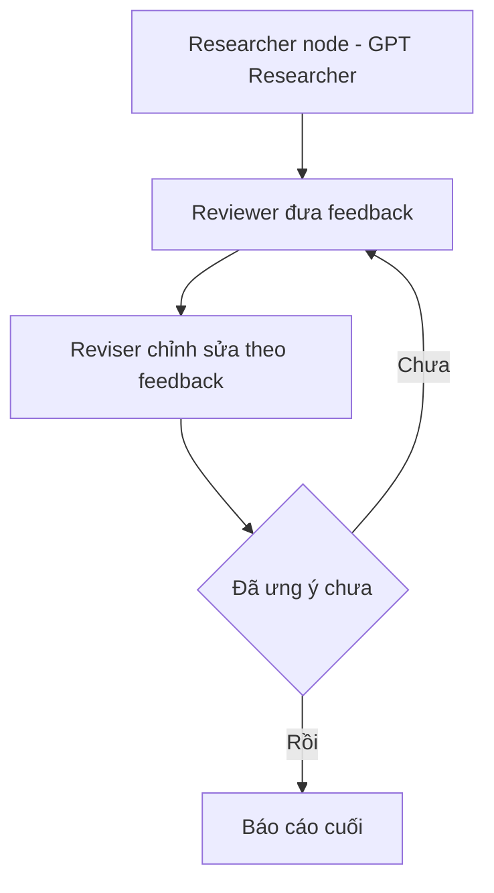

# 🕸️ Multi-Agent Architecture: Biến GPT Researcher thành một node trong LangGraph

> Nguồn: `064-Multi-Agent-Architecture.txt` · [Udemy](https://ua.udemy.com/course/langgraph/learn/lecture/45105647)

Chào các bạn, Eden đây! 👋 Sau khi đã hiểu GPT Researcher và kiến trúc của nó, hôm nay chúng ta sẽ làm điều mình thấy cực kỳ hấp dẫn: **nhúng GPT Researcher vào một multi-agent system** dưới dạng **một node trong LangGraph**. Kiến trúc agentic này từng gây bão trên Twitter và khắp các cộng đồng, bởi nó cho thấy khả năng **composability (lắp ghép)** tuyệt vời của multi-agent system.

---

### 🧩 Toàn bộ GPT Researcher chỉ là... một node

Các bạn cứ hình dung: **toàn bộ kiến trúc chúng ta vừa tìm hiểu** có thể được đóng gói thành **một node duy nhất** trong đồ thị LangGraph. Thứ mình sắp demo là một phiên bản **reflection agent (agent phản tư)** kết hợp với GPT Researcher.

Xin gửi lời cảm ơn tới **Assaf Elovic** — tác giả của GPT Researcher — cùng cộng đồng đã đóng góp và tạo ra kiến trúc multi-agent tuyệt vời này!

| Tiêu chí | Kiến trúc GPT Researcher | Multi-agent với LangGraph |
|---|---|---|
| Cấu trúc | Nodes và edges, không có cycle | Researcher node + vòng lặp reviewer-reviser |
| Tính chất | Chưa hẳn là multi-agent | Team of agents cùng viết research với reflection |
| Đầu ra | Báo cáo nghiên cứu | Báo cáo được phản biện và chỉnh sửa qua nhiều vòng |

---

### 🔁 Vòng lặp reviewer — reviser lấy cảm hứng từ paper STORM

Trong repository GPT Researcher, mình mở thư mục **`multi_agents`**. Ở đây có một implementation dùng GPT Researcher và LangGraph, lấy cảm hứng từ **paper STORM**, tạo ra một **team of agents (đội ngũ agent)** cùng viết research mạch lạc kèm kỹ thuật **reflection (phản tư)**.

Kiến trúc trong thư mục gồm:

* **Researcher node:** chứa toàn bộ logic chúng ta đã xem ở các video trước.
* **Vòng lặp reviewer — reviser:** **reviewer (người phản biện)** đưa feedback cho bài research, còn **reviser (người chỉnh sửa)** sửa lại theo feedback đó.

Hai bước này lặp đi lặp lại cho tới khi chúng ta có sản phẩm cuối ưng ý — rất giống **reflection agent** mà chúng ta đã xây dựng ở các phần trước của khóa học.

Vòng lặp đó diễn ra như sau:

---

### 🐳 Chạy demo: Docker Compose, Next.js và cú search "LangGraph"

Mình copy các hướng dẫn từ documentation và chạy **`docker compose up`**. Các bạn lưu ý cần **cài đặt và đang chạy Docker**; nếu là lần đầu tải images thì sẽ mất một chút thời gian.

Hệ thống tạo ra **hai container**:

1. **Next.js** — đóng vai trò **frontend**.
2. **GPT Researcher** — đóng vai trò **backend LangGraph**.

Sau khi mọi thứ "lên", mình truy cập **localhost:3000** và thấy ngay phần **search settings**: chọn **tone (giọng điệu)**, **report type (loại báo cáo)**... Lần này mình thử tìm chủ đề **LangGraph** và bắt đầu chạy.

Kết quả đúng như mong đợi: **technology agent** lại được chọn, và nó chạy nhiều **search query** — từ tài liệu chính thức, GitHub, cho tới vài **Medium blog** uy tín. Báo cáo hiện dần ra và trông rất ổn: bao quát được **gist (tinh thần chính)** của LangGraph, kèm đầy đủ references. Mình mở cả bản **PDF** để kiểm tra — các URL trỏ tới tài nguyên mà hệ multi-agent đã dùng đều **chính xác** (ví dụ một bài trên Medium).

---

### 💻 Bên trong code: researcher chính là một instance của GPT Researcher

Giờ hãy cùng "lội" vào code của kiến trúc này. Trong thư mục **`multi_agents/agents`** — cấu trúc rất giống những gì chúng ta đã làm trong khóa — có một loạt agent:

* **Review agent:** xem xét output của researcher và đưa feedback, y như **reflection agent**; prompt của nó vẫn mang persona của researcher từ trước.
* **Reviser:** nhận feedback và chỉnh sửa nội dung theo đúng góp ý.
* **Researcher:** phần quan trọng nhất theo mình. Nó chính là **một instance của GPT Researcher** mà chúng ta đã tìm hiểu — bạn có thể **import** nó từ **GPT Researcher SDK**, cài qua pip rồi khởi tạo object. Toàn bộ logic nghiên cứu "nằm gọn" dưới object **`GPTResearcher`**.

Định nghĩa node chỉ đơn giản là thực thi research với input query của bạn, còn mọi "phép thuật" bên trong do GPT Researcher lo liệu. *Vậy là chỉ với vài dòng tích hợp, bạn đã có thể tận dụng một research agent chuẩn production như một mảnh ghép trong hệ multi-agent của riêng mình!*

### 🎯 Tự kiểm tra nhanh

**Câu 1:** Vì sao nói toàn bộ GPT Researcher có thể đóng gói thành một node?

<b>Xem đáp án</b>

**Đáp án:** Vì toàn bộ kiến trúc nghiên cứu của nó được bọc trong node researcher của graph LangGraph.

Giải thích: Đây là minh chứng cho khả năng composability — lắp ghép — của multi-agent system.

Tham chiếu: Mục Toàn bộ GPT Researcher chỉ là... một node.

**Câu 2:** Vòng lặp reviewer-reviser hoạt động thế nào?

<b>Xem đáp án</b>

**Đáp án:** Reviewer đưa feedback cho bài research, reviser sửa lại theo feedback đó, lặp tới khi có sản phẩm cuối ưng ý.

Giải thích: Cách này rất giống reflection agent đã xây dựng ở các phần trước của khóa học.

Tham chiếu: Mục Vòng lặp reviewer — reviser.

**Câu 3:** Kiến trúc multi-agent này lấy cảm hứng từ paper nào?

<b>Xem đáp án</b>

**Đáp án:** Paper STORM.

Giải thích: Implementation dùng GPT Researcher và LangGraph, tạo ra team of agents cùng viết research mạch lạc.

Tham chiếu: Mục Vòng lặp reviewer — reviser.

**Câu 4:** Demo chạy bằng gì và tạo ra những container nào?

<b>Xem đáp án</b>

**Đáp án:** Chạy `docker compose up` để tạo hai container: Next.js làm frontend và GPT Researcher làm backend LangGraph.

Giải thích: Cần cài đặt và đang chạy Docker; lần đầu tải images sẽ mất một chút thời gian.

Tham chiếu: Mục Chạy demo.

**Câu 5:** Researcher trong thư mục `multi_agents/agents` là gì?

<b>Xem đáp án</b>

**Đáp án:** Là một instance của GPT Researcher, import từ GPT Researcher SDK.

Giải thích: Toàn bộ logic nghiên cứu nằm gọn dưới object `GPTResearcher`; node chỉ thực thi research với input query.

Tham chiếu: Mục Bên trong code.

Đó chính là sức mạnh của **composability** mà mình muốn các bạn thấy. Trong bài cuối của phần này, mình có một món quà rất đặc biệt: một cuộc phỏng vấn với chính **Assaf Elovic** về tương lai của GPT Researcher và chủ đề **deep research** đang rất "hot". Hẹn gặp lại các bạn! 🚀

## Nguồn tham khảo

- [Udemy — Multi-Agent Architecture](https://ua.udemy.com/course/langgraph/learn/lecture/45105647)
- [STORM: Synthesis of Topic Outlines through Retrieval and Multi-perspective Question Asking](https://arxiv.org/abs/2402.14207)
- [GPT Researcher — GitHub](https://github.com/assafelovic/gpt-researcher)
