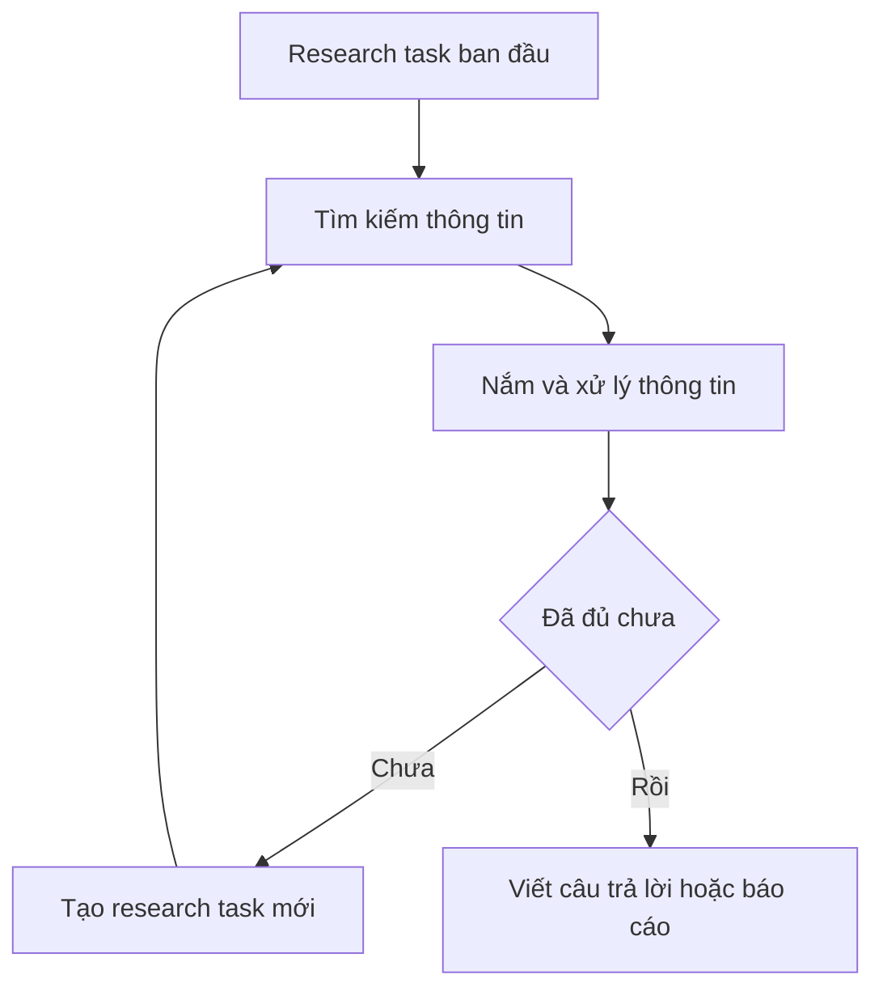

# 🎙️ Deep Research cùng Assaf Elovic: Tương lai của research agent, Human-in-the-Loop và bài học từ GPT Researcher

> Nguồn: `065-Deep-Research-with-Assaf-Elovic.txt` · [Udemy](https://ua.udemy.com/course/langgraph/learn/lecture/48913535)

Chào các bạn, Eden đây! 👋 Trong bài đặc biệt này, mình có cuộc trò chuyện với **Assaf Elovic** — tác giả của **GPT Researcher**. Đây là một phiên rất dài nhưng vô cùng thú vị, bởi chúng mình đã bàn về rất nhiều chủ đề nóng: **AI engineering, deep research, phát triển agentic và multi-agent, evaluation (đánh giá), human-in-the-loop (con người can thiệp giữa vòng chạy), LangGraph** và còn nhiều hơn thế. Bài này sẽ khác một chút so với phần còn lại của khóa học vì là dạng phỏng vấn — mình hy vọng các bạn sẽ thấy hữu ích!

---

### 🗺️ Roadmap của GPT Researcher: tập trung cho developer và sứ mệnh "factuality"

Cộng đồng GPT Researcher **tập trung vào developer**. Trong khi ngày càng nhiều **deep research product** xuất hiện từ OpenAI, Google (và có thể cả Microsoft sắp ra mắt), nhóm của Assaf **không có tham vọng cạnh tranh trực tiếp với các sản phẩm dành cho người dùng đại chúng**.

Niềm tin cốt lõi của họ: **hầu như mọi multi-agent workflow đều cần một research process (quy trình nghiên cứu)**. Mà xây một research agent thật tốt thì vô cùng phức tạp. Vì vậy, họ muốn GPT Researcher trở thành **"agent research mà bạn cắm vào workflow đa tác nhân của mình"** — bạn không phải tự xây từ đầu.

Sứ mệnh của họ là tối ưu cho **factuality (độ xác thực) và chống misinformation (thông tin sai lệch)** khi làm việc với AI. Và bằng cách **giữ mã nguồn mở**, họ tin rằng cộng đồng có thể cùng nhau tạo ra **research agent tốt nhất thị trường**.

---

### 🕳️ Deep research là gì? "Đi sâu" khác gì "đi rộng"?

**Deep research** là ý tưởng **lặp trên research task gốc**: liên tục tạo ra các research task mới cho tới khi hệ thống tự kết luận rằng nó đã có đủ nội dung để trả lời câu hỏi ban đầu.

Trước thời deep research, cách làm phổ biến là: research task được gửi một lần vào **search engine**, rồi LLM viết câu trả lời dựa trên kết quả trả về. Vấn đề là bạn gần như "mù" trước chất lượng kết quả — search engine quyết định thông tin nào đúng, LLM chỉ việc dùng nó, nên tiềm năng của LLM không được khai thác tối đa.

Deep research khác ở chỗ: **tìm kiếm → nắm thông tin → tự hỏi "đã đủ chưa?" → nếu chưa, tạo research task mới → lặp lại** cho tới khi thật sự hài lòng.

Vòng lặp đó có thể mô tả như sau:

Điều thú vị là GPT Researcher **đã có cơ chế tương tự từ hai năm trước** — từ node publisher, bạn có thể quyết định quay lại loop. Vậy khác biệt nằm ở đâu?

* GPT Researcher đi theo hướng **breadth (bề rộng) — "wide"**: sinh thêm các research question phụ để có cái nhìn bao quát, research **song song (parallel)**, rồi **aggregate (tổng hợp)** tất cả và viết báo cáo.
* Deep research đi theo hướng **chiều sâu — "deep"**: đào sâu liên tục qua nhiều vòng lặp.

Cộng đồng đã đánh giá GPT Researcher trên **SimpleQA benchmark của OpenAI** và nhận ra: ngay cả với concept "đi rộng" cũ, nó **vẫn dẫn đầu về chất lượng** so với tất cả các deep research product khác. Và mới đây, chỉ vài tuần trước, cộng đồng đã bổ sung luôn **khả năng deep research** vào GPT Researcher — giờ nó vừa rộng vừa sâu. Việc đánh giá còn dang dở vì **mỗi lượt chạy mất khoảng 5 phút** và tốn **nửa đô**, nên chạy trọn bộ SimpleQA sẽ rất lâu.

À, một chi tiết đáng chú ý: **search engine mặc định của GPT Researcher là Tavily**. Assaf chọn nó vì Tavily không chỉ dựa vào một index của internet, mà biết lấy **nhiều candidate khác nhau rồi tinh lọc qua vài bước** để ra những **nguồn đáng tin cậy nhất** — rất hợp với sứ mệnh factuality của dự án.

| Tiêu chí | GPT Researcher truyền thống | Deep research |
|---|---|---|
| Hướng đi | Breadth — đi rộng | Đi sâu qua nhiều vòng lặp |
| Cách làm | Sinh câu hỏi phụ, research song song rồi aggregate | Lặp trên research task gốc tới khi đủ nội dung |
| Đánh giá | Dẫn đầu SimpleQA so với các deep research product | Đã được bổ sung vào GPT Researcher gần đây |

---

### ⚠️ Thách thức của deep research: vòng lặp vô hạn, chất lượng và chi phí

LLM được huấn luyện để **"làm chúng ta hài lòng"**. Nên khi giao cho nó quyết định "đi tiếp hay dừng", theo kiểu hướng dẫn "nếu học được gì mới đáng research, hãy research tiếp", thì **95% tới 99%** trường hợp nó sẽ chọn **tạo thêm research task** thay vì nói "mình hài lòng rồi". Hệ quả là nếu không cẩn thận, deep research sẽ **lặp vô hạn**.

Giải pháp tạm thời: đặt **guardrail deterministic (giới hạn mang tính xác định)** — dừng sau một độ sâu nhất định. Nhưng cái giá phải trả là có thể... dừng sai lúc: biết đâu LLM "đúng" khi muốn đi sâu thêm một bước thì bạn đã cắt ngang, và bạn không còn tối ưu cho năng lực của nó nữa.

Thách thức thứ hai còn khó nhằn hơn: sau iteration đầu tiên, LLM có thể **"bịa" ra những research task chẳng đóng góp gì** cho nghiên cứu. Thông tin nhiễu đó làm **context phình lên**, dễ **tăng hallucination** và khiến bạn phải xử lý thông tin không liên quan. Theo Assaf, thách thức lớn nhất chính là **quản lý chất lượng khi đi sâu**.

Về **chi phí**: các sản phẩm như OpenAI, Gemini hay Perplexity tính khoảng **200 USD/tháng**. GPT Researcher rẻ hơn nhiều — khoảng **nửa đô một lần research** — nhưng cộng dồn ở quy mô lớn thì vẫn đáng lo. Vậy xu hướng model ngày càng nhanh hơn, rẻ hơn, tốt hơn có khiến bài toán này biến mất? Assaf cho rằng về mặt chiến lược, nhiều công ty lớn giả định **chi phí sẽ chỉ giảm**, nên không đầu tư quá nhiều cho nó. Nhưng có một "caveat": sự xuất hiện của **GPT-4.5** với mức giá API đắt đỏ — ước tính **gấp khoảng 100 lần GPT-4**. Nghĩa là nếu muốn dùng những model mạnh nhất, bạn vẫn phải rất quan tâm chi phí.

Một góc nhìn rất hay khác: dù **chi phí có về 0** và context có khổng lồ, vấn đề **needle in a haystack (kim trong đống rơm)** vẫn tồn tại — context càng lớn, LLM càng khó tìm đúng thông tin tốt nhất. Cộng đồng từng thử GPT Researcher với API của Gemini và **context khoảng một triệu token**, kết quả **rất kém**. Kết luận: *dù chi phí hay giới hạn context ra sao, chúng ta vẫn nên tối ưu thứ mình "nhét" vào LLM.*

---

### 🕸️ Vì sao GPT Researcher chọn LangGraph (và tăng 30% chất lượng)

Nhóm của Assaf **đã xây dựng với LangGraph hơn một năm**, và đây là một trong những phần phổ biến nhất của codebase. Lý do:

* **Concept "workflow là một graph" cực thông minh:** nó chia bài toán thành các action chuyên biệt, rất giống tư duy **microservices** — tức các **micro agents**, mỗi agent đảm nhận một nhiệm vụ thật chuyên biệt.
* Nhờ đó, bạn **kiểm soát chất lượng của từng node**, đồng thời **mở rộng (scale) ứng dụng** khi nó lớn lên. Cộng đồng liên tục gửi **pull request** cải thiện từng agent cụ thể; nếu dùng một khối **monolith**, mức độ đóng góp chắc chắn thấp hơn nhiều vì rất khó để "nhảy vào" dự án.
* **LangGraph ít opinionated (áp đặt quan điểm)** → developer và doanh nghiệp có toàn quyền tùy biến, sáng tạo theo cách mình muốn. Trong khi đó, **CrewAI và các đối thủ rất opinionated**, framework khép kín hơn, và nhóm của Assaf **cảm thấy bị giới hạn** khi thử nghiệm.

Ban đầu GPT Researcher **không được xây bằng graph**. Khi dự án trưởng thành, cần thêm guardrails và sự robust hơn, họ đã chuyển sang LangGraph — và xem đó là một **nâng cấp**. Hiện họ đang xây **phiên bản LangGraph của deep research**, vì với tư duy open source của họ, bước tiếp theo luôn là **từ POC lên LangGraph**.

Nhờ LangChain, dự án cũng có sẵn nhiều "vũ khí": **contextual compression** đã được giới thiệu từ hai năm trước (trong khi vài tháng trước Anthropic mới công bố paper cho thấy **contextual retriever** là phương pháp retrieval tốt nhất cho workflow RAG — và LangChain đã có nó từ lâu). GPT Researcher hỗ trợ cả **web data lẫn local data**, cho phép **index tài liệu nội bộ**, và bạn có thể dùng **bất kỳ LLM, retriever hay embedding** nào. Kết quả: **chất lượng cải thiện 30%** — một con số khổng lồ — nhờ kiến trúc micro agents chuyên biệt.

Về **evaluation**: đây vẫn là một trong những bài toán khó nhất khi scale AI, vì chưa có cách tự động hóa thật thông minh. GPT Researcher đã công bố cách đánh giá bằng **SimpleQA dataset** của OpenAI — bộ dữ liệu này kiểm tra **factuality**: có bao nhiêu fact được viết đúng dựa trên các câu hỏi cần dữ liệu bên ngoài, đúng với sứ mệnh của dự án. Mục tiêu lớn hiện tại là **tự động hóa testing và đánh giá các bản cập nhật** mà không làm giảm chất lượng, khi ngày càng nhiều code được merge. Họ cũng đang cân nhắc **OpenEvals của LangChain** như một lựa chọn thay thế, vì nó giải quyết được nhiều thứ thú vị — chẳng hạn chạy **nhiều evaluation song song** cho một task.

---

### 👤 Human-in-the-loop và những con số biết nói của cộng đồng

Về **human-in-the-loop**, Assaf lấy ví dụ từ trải nghiệm với **deep research của OpenAI**: bạn chọn chế độ deep research, đặt câu hỏi, rồi nhận thông báo kiểu "mình sẽ đi nghiên cứu và quay lại sau 5–30 phút". Assaf **không thích trải nghiệm này chút nào** — cảm giác như mất kiểm soát, và nếu kết quả về không đúng ý thì lại tốn thêm 30 phút nữa. Anh tin rằng trải nghiệm người dùng với AI còn rất nhiều dư địa để cải thiện, và đây chính là đất diễn của human-in-the-loop.

HITL giải quyết đúng những vấn đề chúng ta đã bàn: có lúc vòng lặp không dừng, có lúc dừng quá sớm hoặc quá muộn. Thay vì bắt người dùng chờ đợi mù mịt, hệ thống có thể quay lại hỏi: *"Đây là những gì mình có tới giờ, mình định đào sâu vào các hướng này, bạn thấy ổn không? Có muốn mình tìm hướng khác không?"* — điều này quan trọng để người dùng **cảm thấy được kiểm soát và tin tưởng**, đồng thời hoàn thiện 5% trường hợp mà AI "hiểu sai" mong đợi.

Trải nghiệm tốt nhất là **cho người dùng chọn mức độ tự chủ**: có người thích tự động hoàn toàn, có người muốn kiểm soát từng bước. Và phương án tối ưu thường là **hybrid (lai)**: để AI tự làm các bước đầu, nhưng khi gặp **xung đột (conflict)** thì gọi con người. Assaf lấy ví dụ từ **customer support**: khi knowledge base có hai nguồn mâu thuẫn nhau, AI cần hiểu rằng đây là lúc cần con người hỗ trợ — nghiên cứu cũng vậy. Đáng mừng là **LangGraph đã có cơ chế human-in-the-loop rất thanh lịch: dynamic interrupt**. Nhóm GPT Researcher **đã triển khai nó** trong quy trình research chuẩn và trong giải pháp multi-agent LangGraph, và dự định áp dụng ngay cho phiên bản deep research dùng graph.

Cuối buổi trò chuyện, Assaf chia sẻ vài con số ấn tượng của dự án: cộng đồng đang **chuẩn bị cán mốc 20.000 sao**, **hơn 6.000 developer** hoạt động trên Discord, **khoảng 15–20 pull request mỗi tuần**, cùng **hàng nghìn tổ chức doanh nghiệp** đã đưa GPT Researcher vào workflow của họ (một số được vinh danh ngay trên trang chủ dự án).

*Thật truyền cảm hứng khi thấy một dự án mã nguồn mở thu hút được nhiều người cùng chung tay đến vậy!*

### 🎯 Tự kiểm tra nhanh

**Câu 1:** Deep research lặp lại điều gì cho tới khi dừng?

<b>Xem đáp án</b>

**Đáp án:** Lặp trên research task gốc — liên tục tạo research task mới cho tới khi hệ thống tự kết luận đã đủ nội dung.

Giải thích: Khác với cách research một lần vào search engine rồi để LLM viết câu trả lời.

Tham chiếu: Mục Deep research là gì.

**Câu 2:** Vì sao deep research dễ rơi vào vòng lặp vô hạn?

<b>Xem đáp án</b>

**Đáp án:** Vì LLM được huấn luyện để "làm chúng ta hài lòng" — 95% tới 99% trường hợp nó chọn tạo thêm research task thay vì dừng.

Giải thích: Với hướng dẫn kiểu "nếu học được gì mới đáng research, hãy research tiếp", nó gần như luôn đi tiếp.

Tham chiếu: Mục Thách thức của deep research.

**Câu 3:** Guardrail deterministic có trade-off gì?

<b>Xem đáp án</b>

**Đáp án:** Nó dừng đúng lúc số vòng chạm trần, nhưng có thể dừng sai lúc — cắt ngang khi LLM còn muốn đi sâu thêm.

Giải thích: Đánh đổi giữa việc chặn lặp vô hạn và tối ưu năng lực của LLM.

Tham chiếu: Mục Thách thức của deep research.

**Câu 4:** Vì sao nhóm Assaf chọn LangGraph?

<b>Xem đáp án</b>

**Đáp án:** Vì concept "workflow là một graph" chia bài toán thành các micro agents chuyên biệt, kiểm soát chất lượng từng node được, dễ scale và mở cho cộng đồng đóng góp; LangGraph cũng ít opinionated hơn CrewAI.

Giải thích: Nhờ kiến trúc micro agents chuyên biệt, chất lượng cải thiện 30%.

Tham chiếu: Mục Vì sao GPT Researcher chọn LangGraph.

**Câu 5:** Phương án HITL tối ưu mà Assaf mô tả là gì?

<b>Xem đáp án</b>

**Đáp án:** Hybrid — để AI tự làm các bước đầu, nhưng khi gặp xung đột thì gọi con người.

Giải thích: Kiểu như customer support khi knowledge base có hai nguồn mâu thuẫn; LangGraph đã có dynamic interrupt để hỗ trợ.

Tham chiếu: Mục Human-in-the-loop.

Đó là toàn bộ cuộc trò chuyện của mình với Assaf. Hy vọng những chia sẻ này hữu ích cho hành trình xây dựng agent của chính các bạn: hãy giữ tư duy **developer-first**, tối ưu context, cân nhắc HITL ngay từ đầu và đừng ngại chọn công cụ trao cho bạn nhiều quyền kiểm soát. Hẹn gặp lại các bạn ở những bài tiếp theo! 🚀

## Nguồn tham khảo

- [Udemy — Deep Research with Assaf Elovic](https://ua.udemy.com/course/langgraph/learn/lecture/48913535)
- [GPT Researcher — GitHub](https://github.com/assafelovic/gpt-researcher)
- [OpenEvals — LangChain](https://github.com/langchain-ai/openevals)
- [LangGraph — Interrupts](https://docs.langchain.com/oss/python/langgraph/interrupts)
