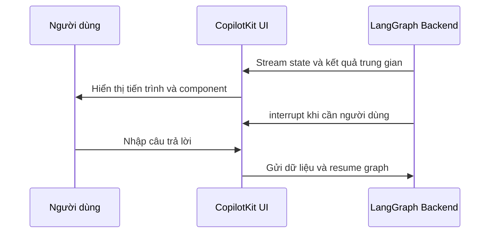

# 🎨 Generative UI: Khi giao diện trở thành "cầu nối niềm tin" giữa người dùng và AI

> Nguồn: `066-Generative-UI.txt` · [Udemy](https://ua.udemy.com/course/langgraph/learn/lecture/46421717)

Xin chào các bạn, Eden đây! 👋

Sau khi đã dành rất nhiều thời gian cho phần backend của các ứng dụng AI, hôm nay mình muốn nói về một nửa còn lại của bức tranh: **trải nghiệm người dùng (UX) và giao diện người dùng (UI) trong các ứng dụng generative AI**.

Mình cũng sẽ giới thiệu **CopilotKit** — dự án mã nguồn mở mà theo mình đang cung cấp những "viên gạch" tốt nhất để xây dựng **generative UI (giao diện sinh động)** cho ứng dụng của các bạn.

---

### 🧠 Backend tốt vẫn chưa đủ để tạo nên một ứng dụng hoàn chỉnh

Xây dựng backend cho các ứng dụng generative AI là một thử thách lớn. Chúng ta có thể dành rất nhiều thời gian để xây dựng **agent**, xây dựng **hệ thống RAG**, rồi đảm bảo rằng output trả về cho người dùng là chính xác, đáng tin cậy và chất lượng.

Nhưng đó mới chỉ là **một mảnh ghép** của bức tranh. Để ứng dụng thực sự hoàn chỉnh, chúng ta còn cần tạo ra một **giao diện đẹp** và một **trải nghiệm người dùng thật tự nhiên**.

Vấn đề nằm ở chữ "tin": người dùng biết rõ các ứng dụng generative AI còn khá "thất thường" — không phải lúc nào cũng cho ra câu trả lời đúng, và đôi khi còn thất bại. Xây dựng được **niềm tin giữa người dùng và ứng dụng AI** là điều chúng ta phải chủ động làm việc, chứ không thể chờ nó tự đến.

---

### 🔍 Transparency: cho người dùng biết câu trả lời "đến từ đâu"

Theo mình, để tạo dựng niềm tin giữa người dùng và hệ thống, chúng ta cần **minh bạch (transparency)**. Người dùng cần biết câu trả lời đến từ đâu:

* Nếu đang xây dựng **agent**, hãy minh bạch xem agent có những **tool (công cụ)** nào, đang dùng tool nào để tạo ra câu trả lời, và **vì sao nó chọn tool đó**.
* Hãy cho thấy cả **quá trình suy luận (reasoning)** của agent cùng những bước tính toán trung gian trước khi ra kết quả cuối cùng — để người dùng thấy câu trả lời cuối đã được "chăm chút" như thế nào.
* Với ứng dụng **RAG**, hãy cho người dùng thấy những **tài liệu (document)** nào đã được dùng để tạo ra câu trả lời, để họ biết nó được "neo" vào nguồn nào.

Tất cả những điều này góp phần tạo nên niềm tin tốt hơn giữa người dùng và ứng dụng generative AI của các bạn.

---

### 🤝 Gặp gỡ CopilotKit: bộ "xếp hình" cho generative UI

Tất cả các demo trong bài này đều được lấy từ **tài liệu chính thức của CopilotKit**. Dự án này là mã nguồn mở, và theo mình đánh giá, họ đang là những người **tiên phong** trong lĩnh vực generative UI và generative UX hiện nay.

Trong repository của họ, các bạn có thể tha hồ khám phá và tìm thấy những **starter kit** giúp triển khai giao diện frontend đẹp mắt cho phần backend generative AI của mình.

Nói thật, đây **không phải một khóa học full-stack**, nên mình sẽ không đi quá sâu vào chủ đề này. Mình chỉ giới thiệu để các bạn biết rằng CopilotKit mang đến một loạt **component và hook** dùng ở frontend, giúp việc xây dựng generative UI và trải nghiệm người dùng trên các ứng dụng AI (vận hành bởi **LangChain** hay **LangGraph**) trở nên cực kỳ dễ dàng.

Đặc biệt, mình muốn nhấn mạnh vào **hỗ trợ dành riêng cho các ứng dụng LangChain và LangGraph**. CopilotKit giới thiệu **CoAgents**, tích hợp liền mạch với backend LangGraph. Video của **Ariel** từ CopilotKit (mình để link trong bài học) đã minh họa điều này một cách vô cùng trực quan.

---

### ⚙️ Vì sao build frontend cho LangGraph khó... và CopilotKit xử lý ra sao?

Một ứng dụng LangGraph có **rất nhiều thứ chuyển động cùng lúc**:

* **State (trạng thái)** liên tục thay đổi, kèm theo các **kết quả trung gian** nằm trong state đó.
* Các **node (nút)** đang thực thi, có khi chạy **song song** với nhau.
* Và cả **human-in-the-loop (con người can thiệp giữa vòng chạy)**, nơi chúng ta dừng việc thực thi graph, nhận input từ người dùng, rồi cho graph chạy tiếp.

Nghe đến đây thôi đã thấy... "ác mộng" rồi, đúng không? *Nhưng đừng lo lắng!* CopilotKit đã làm rất tốt việc triển khai các component cho tất cả những gì mình vừa kể, và tất cả đều được xây dựng trên nền ứng dụng LangGraph. Nhờ đó, việc tích hợp LangGraph với CopilotKit trở nên vô cùng đơn giản.

Luồng tương tác giữa backend LangGraph và giao diện CopilotKit diễn ra như sau:

Một điều mình muốn nói rõ: **mình không có bất kỳ liên kết hay lợi ích nào từ CopilotKit cả**. Mình thật sự tin đây là một dự án tốt, và họ đang làm rất xuất sắc trong lĩnh vực generative UI.

### 🎯 Tự kiểm tra nhanh

**Câu 1:** Vì sao backend tốt vẫn chưa đủ để tạo nên ứng dụng hoàn chỉnh?

<b>Xem đáp án</b>

**Đáp án:** Vì còn cần một giao diện đẹp và trải nghiệm người dùng tự nhiên, cũng như xây dựng niềm tin với người dùng.

Giải thích: Người dùng biết các ứng dụng generative AI còn "thất thường"; ta phải chủ động xây dựng niềm tin chứ không thể chờ nó tự đến.

Tham chiếu: Mục Backend tốt vẫn chưa đủ.

**Câu 2:** Transparency cần cho người dùng thấy những gì?

<b>Xem đáp án</b>

**Đáp án:** Với agent: agent có tool nào, đang dùng tool nào, vì sao chọn tool đó và cả quá trình suy luận; với RAG: những document nào đã được dùng.

Giải thích: Mục tiêu là để người dùng biết câu trả lời "đến từ đâu".

Tham chiếu: Mục Transparency.

**Câu 3:** Vì sao build frontend cho LangGraph được ví là "ác mộng"?

<b>Xem đáp án</b>

**Đáp án:** Vì state liên tục thay đổi với kết quả trung gian, nhiều node có thể chạy song song, và có human-in-the-loop phải dừng graph để chờ input.

Giải thích: Có rất nhiều thứ chuyển động cùng lúc khiến việc hiển thị chúng trở nên phức tạp.

Tham chiếu: Mục Vì sao build frontend cho LangGraph khó.

**Câu 4:** CopilotKit hỗ trợ gì cho ứng dụng LangChain/LangGraph?

<b>Xem đáp án</b>

**Đáp án:** Một loạt component và hook frontend, starter kit, cùng CoAgents tích hợp liền mạch với backend LangGraph.

Giải thích: Nhờ đó việc xây dựng generative UI cho ứng dụng AI trở nên cực kỳ dễ dàng.

Tham chiếu: Mục Gặp gỡ CopilotKit.

**Câu 5:** Mình có liên kết lợi ích gì với CopilotKit không?

<b>Xem đáp án</b>

**Đáp án:** Không — mình không có bất kỳ liên kết hay lợi ích nào từ CopilotKit.

Giải thích: Mình chỉ thật sự tin đây là dự án tốt và họ làm rất xuất sắc trong lĩnh vực generative UI.

Tham chiếu: Mục Vì sao build frontend cho LangGraph khó.

Nếu các bạn muốn ứng dụng AI của mình không chỉ "chạy đúng" mà còn khiến người dùng cảm thấy an tâm và tin tưởng, đây chính là hướng đi đáng để đầu tư. Hẹn gặp lại các bạn ở bài tiếp theo, nơi chúng ta sẽ đi sâu hơn vào human-in-the-loop với CopilotKit nhé! 🚀

## Nguồn tham khảo

- [Udemy — Generative UI](https://ua.udemy.com/course/langgraph/learn/lecture/46421717)
- [CopilotKit — Documentation](https://docs.copilotkit.ai)
- [CopilotKit — GitHub](https://github.com/CopilotKit/CopilotKit)
- [LangGraph — Tài liệu chính thức](https://docs.langchain.com/oss/python/langgraph/overview)
