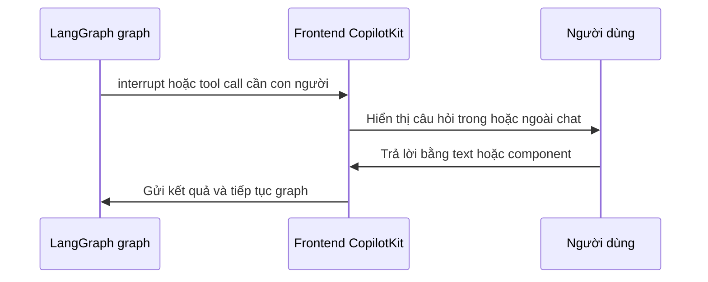

# 🔁 Human-in-the-Loop với CopilotKit: Hai kiểu can thiệp, vô vàn cách triển khai (Đừng bỏ qua!)

> Nguồn: `067-HIL.txt` · [Udemy](https://ua.udemy.com/course/langgraph/learn/lecture/50465971)

**Human-in-the-loop (con người can thiệp giữa vòng chạy)** là một phần cực kỳ quan trọng của bất kỳ ứng dụng agent nào. Trong bài này, mình đã mang đến một cuộc trò chuyện với đội ngũ CopilotKit để các bạn hiểu rõ: **chúng ta đang có những hỗ trợ gì**, và **làm sao biến nó thành một trải nghiệm người dùng thật mượt mà**.

Cùng bắt đầu nhé!

---

### 🎯 Trước tiên, phân biệt hai kiểu can thiệp của con người

Câu trả lời đầu tiên khá thú vị: hệ thống hỗ trợ cả hai kiểu tương tác người — agent:

* **Human-in-the-loop:** người dùng **tham gia trực tiếp như một bước** trong quá trình agent đang chạy.
* **Human-on-the-loop:** agent cứ chạy, và người dùng **có cơ hội nhảy vào khi cần thiết**.

| Tiêu chí | Human-in-the-loop | Human-on-the-loop |
|---|---|---|
| Cách con người tham gia | Trực tiếp như một bước trong quá trình agent chạy | Có cơ hội nhảy vào khi cần thiết |
| Trạng thái agent | Tạm dừng ở bước cần con người | Cứ chạy liên tục |

Cả hai đều cần thiết cho một ứng dụng hoàn chỉnh. Và bên trong mỗi kiểu lại có rất nhiều **biến thể (variant)**, khác nhau cả về mặt kỹ thuật lẫn góc nhìn trải nghiệm người dùng.

---

### 💬 Góc nhìn trải nghiệm: trong chat, ngoài chat và... gần như mọi thứ

Từ góc độ trải nghiệm người dùng, tương tác human-in-the-loop có thể diễn ra theo nhiều hình thức:

1. **Chỉ với text:** một câu hỏi đơn giản hiện ra ngay trong khung chat.
2. **Với native UX component (thành phần giao diện gốc):** câu hỏi có thể là một **JSON question** và bạn render nó thành bất kỳ component nào mình muốn; câu trả lời cũng có thể là **dữ liệu có cấu trúc (structured data)** gửi ngược về agent.
3. **Trong chat lẫn ngoài chat:** mọi thứ ở trên đều có phiên bản "trong chat" và "ngoài chat".

Ví dụ dễ hình dung nhất cho tương tác **ngoài chat** là một **pop-up**: agent đang chạy và bỗng hỏi "Tôi thấy bạn đang muốn làm X, Y, Z. Bạn có muốn tiếp tục không?". Hoặc một dấu chỉ vào một phần tử trên màn hình, hay thậm chí chỉ là một **dấu tick** xuất hiện cạnh một element — agent "nhận ra" nó muốn chọn phần tử này, tick sẵn, người dùng chỉ việc bấm nút và kết quả quay ngược trở lại agent.

Nói ngắn gọn: **bất kỳ tương tác nào mà ứng dụng có thể hỗ trợ đều có thể trở thành một tương tác human-in-the-loop**. Tất nhiên, tương tác **trong chat** vẫn chiếm phần lớn, bởi suy cho cùng chat chính là "Slack với agent" — kênh giao tiếp chính giữa bạn và một thực thể thông minh khác.

---

### 🛠️ Góc nhìn kỹ thuật: interrupt do lập trình viên và tool call do LLM

Về mặt kỹ thuật, hành động của con người có thể được khởi tạo theo hai cách chính:

1. **Lập trình viên chủ động khởi tạo:** bạn biết agent đang ở một trạng thái nhất định và cần hỏi người dùng đúng câu hỏi vào đúng thời điểm. Cách làm là gọi hàm **`interrupt`** của LangGraph — lập trình viên gọi `interrupt` một cách tường minh, và tương tác human-in-the-loop được kích hoạt ngay lập tức.
2. **Dựa trên tool call:** bạn "khoán" việc quyết định cho **LLM** — LLM tự quyết định gọi một tool, và **con người đóng vai trò chính là tool đó**. Agent cần một câu trả lời cho câu hỏi nào đó, nó phát ra một **tool call**; tool call này quay về frontend, người dùng trả lời qua giao diện native (trong chat hoặc ngoài chat), rồi kết quả được gửi ngược lại vào agent.

Ví dụ kinh điển là một **agent chăm sóc khách hàng (customer support)**: khi nhận thấy thiếu thông tin về người dùng, nó có thể tự chọn hỏi những câu cần thiết — chẳng hạn "Vấn đề của bạn là gì?", "Số điện thoại của bạn là gì?" — để xác minh đúng người. Agent tự quyết định hỏi gì, và câu hỏi sẽ được hiển thị qua kênh phù hợp mà lập trình viên toàn quyền kiểm soát.

Dòng chảy của một lượt human-in-the-loop đi qua ba thành phần như sau:

---

### 🧩 Hai "cần gạt" chính: useInterrupt và useCopilotAction

CopilotKit hỗ trợ rất nhiều "hương vị" tương tác khác nhau, nhưng tựu chung có hai nhóm chính:

* **`useInterrupt`** — một **React hook** dùng để "bắt" các lệnh `interrupt` do lập trình viên khởi tạo thủ công.
* **`useCopilotAction`** — dùng để cung cấp các **front-end tool call**, có thể được "trả bài" ngay trong chat hoặc ngoài chat. Trong thuật ngữ của CopilotKit, đây được gọi là **front-end action** — một trong những cơ chế hỗ trợ tương tác human-in-the-loop.

Cách `useCopilotAction` hoạt động cũng rất dễ hiểu: hook này định nghĩa một **closure** — một khối code "nằm chờ sẵn". Khi agent xác định rằng nó cần đến tương tác với con người, khối code đó sẽ được thực thi, trả về một giá trị, và giá trị đó được **chuyển ngược lại vào agent**.

*Đây là cách giải thích có phần đơn giản hóa*, vì mỗi thứ đều có vài biến thể. Ví dụ, thay vì trả kết quả đồng bộ (synchronous), bạn có thể dùng phiên bản **bất đồng bộ (asynchronous)**: người dùng làm gì đó, rồi gọi một **callback** để hoàn tất.

### 🎯 Tự kiểm tra nhanh

**Câu 1:** Human-in-the-loop và human-on-the-loop khác nhau thế nào?

<b>Xem đáp án</b>

**Đáp án:** HITL là người dùng tham gia trực tiếp như một bước trong quá trình agent chạy; human-on-the-loop là agent cứ chạy và người dùng nhảy vào khi cần.

Giải thích: Cả hai kiểu đều cần thiết cho một ứng dụng hoàn chỉnh.

Tham chiếu: Mục Phân biệt hai kiểu can thiệp.

**Câu 2:** Tương tác human-in-the-loop có thể diễn ra dưới những hình thức nào?

<b>Xem đáp án</b>

**Đáp án:** Chỉ với text, với native UX component như JSON question render thành component tùy ý, và đều có phiên bản trong chat lẫn ngoài chat.

Giải thích: Ví dụ ngoài chat là pop-up, dấu chỉ vào phần tử, hay dấu tick sẵn cạnh một element.

Tham chiếu: Mục Góc nhìn trải nghiệm.

**Câu 3:** Về mặt kỹ thuật, hành động của con người được khởi tạo theo hai cách nào?

<b>Xem đáp án</b>

**Đáp án:** Lập trình viên chủ động gọi hàm `interrupt` của LangGraph, hoặc dựa trên tool call do LLM quyết định.

Giải thích: Ở cách thứ hai, con người đóng vai trò chính là tool mà agent gọi tới.

Tham chiếu: Mục Góc nhìn kỹ thuật.

**Câu 4:** `useInterrupt` được dùng để làm gì?

<b>Xem đáp án</b>

**Đáp án:** Là React hook dùng để "bắt" các lệnh `interrupt` do lập trình viên khởi tạo thủ công.

Giải thích: Đây là một trong hai "cần gạt" chính của CopilotKit cho human-in-the-loop.

Tham chiếu: Mục Hai "cần gạt" chính.

**Câu 5:** `useCopilotAction` hoạt động như thế nào?

<b>Xem đáp án</b>

**Đáp án:** Hook định nghĩa một closure "nằm chờ sẵn"; khi agent cần tương tác, khối code đó chạy, trả về giá trị và giá trị được chuyển ngược lại vào agent.

Giải thích: Có phiên bản bất đồng bộ — người dùng làm gì đó rồi gọi callback để hoàn tất.

Tham chiếu: Mục Hai "cần gạt" chính.

Khi graph bị dừng bởi một `interrupt` mà lập trình viên đã định trước, `useCopilotAction` sẽ trao quyền cho người dùng nhập thông tin cần thiết, rồi tiếp tục cho graph chạy từ đúng điểm dừng đó. Các bạn thấy đấy, "phép thuật" ở đây thực ra chỉ là những cơ chế rất rõ ràng. Hẹn gặp lại ở bài tiếp theo, chúng ta sẽ cùng mổ xẻ sâu hơn hành trình tương tác người — agent nhé! 🚀

## Nguồn tham khảo

- [Udemy — Human in the Loop](https://ua.udemy.com/course/langgraph/learn/lecture/50465971)
- [CopilotKit — Documentation](https://docs.copilotkit.ai)
- [LangGraph — Interrupts](https://docs.langchain.com/oss/python/langgraph/interrupts)
