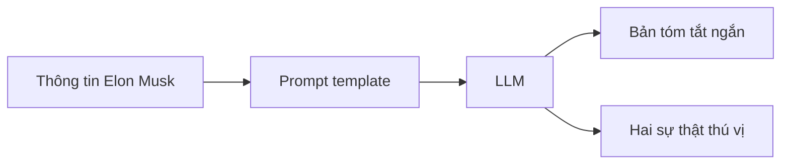

# 🎯 Chúng ta sẽ xây gì? Viết chiếc "Hello World" đầu tiên với LangChain

> Nguồn: `006-What-are-we-building-LangChain-Hello-World-Chain.txt` · [Udemy](https://ua.udemy.com/course/langchain/learn/lecture/52021759)

Chào các bạn, Eden đây! 👋 Ở section này, chúng ta sẽ cùng viết **chain LangChain đầu tiên** — và như mọi hành trình lập trình tử tế, nó bắt đầu bằng một chiếc **Hello World**.

Không có gì phức tạp đâu, chúng ta học bằng cách làm (learn by doing), và mình sẽ giới thiệu từng viên gạch nền tảng mà bạn sẽ dùng xuyên suốt khóa học.

---

### 🧪 Chúng ta sẽ xây gì?

Ý tưởng cực kỳ đơn giản: chúng ta lấy **thông tin về Elon Musk**, gửi vào một **LLM**, để model này:

1. **Tóm tắt (summarize)** thông tin đó thành một đoạn ngắn.
2. **Tạo ra vài sự thật thú vị (cool facts)** về Elon Musk.

Đó chính là chain **LangChain Hello World** — nhỏ gọn nhưng chứa đựng gần như toàn bộ các thành phần cơ bản mà chúng ta sẽ dùng về sau.

Toàn bộ luồng đi của chain gói gọn trong sơ đồ sau:

---

### 🧱 Những khái niệm bạn sẽ gặp

Đây là section "learn by doing", nên song song với việc viết code, mình sẽ giới thiệu những cấu trúc (constructs) nền tảng của LangChain:

* **Prompt templates** — khuôn mẫu để tạo prompt linh động.
* **Prompts** — đầu vào mà LLM thực sự nhận.
* **Chat models** — giao diện để trò chuyện với các LLM.
* **Chains** — cách nối các thành phần thành một luồng xử lý.
* **Debugging và tracing** — kỹ năng quan trọng để "nhìn xuyên" vào ứng dụng LLM khi nó chạy.

*Đừng lo nếu các thuật ngữ này còn lạ lẫm — mình sẽ đi cùng bạn từng bước một.*

---

### 🔌 Bạn có thể dùng LLM nào?

Trong section này, mình sẽ dùng **GPT-5 của OpenAI**. Tuy nhiên, bạn hoàn toàn có thể dùng bất kỳ **first-tier LLM** nào mà bạn thích — chẳng hạn **Gemini của Google** hay **Claude của Anthropic**.

Đặc biệt, mình cũng sẽ hướng dẫn cách dùng **Ollama** để chạy **open-weights model** ngay trên máy của bạn, và chúng ta sẽ thử với **Gemma 3 của Google**. Vậy là dù bạn muốn dùng API trả phí hay model miễn phí chạy local, khóa học đều đáp ứng được.

---

### 🎯 Tự kiểm tra nhanh

**Câu 1:** Chain Hello World sẽ làm gì với thông tin về Elon Musk?

<b>Xem đáp án</b>

**Đáp án:** Tóm tắt thông tin thành một đoạn ngắn và tạo ra vài sự thật thú vị về Elon Musk.

Giải thích: Đây là bài toán nhỏ gọn nhưng chứa các thành phần cơ bản của LangChain.

Tham chiếu: Mục Chúng ta sẽ xây gì.

**Câu 2:** Những constructs nền tảng nào sẽ gặp trong section này?

<b>Xem đáp án</b>

**Đáp án:** Prompt templates, prompts, chat models, chains, debugging và tracing.

Giải thích: Song song với việc viết code, mình giới thiệu từng viên gạch nền tảng này.

Tham chiếu: Mục Những khái niệm bạn sẽ gặp.

**Câu 3:** Model nào được dùng chính trong section?

<b>Xem đáp án</b>

**Đáp án:** GPT-5 của OpenAI, nhưng bạn có thể thay bằng first-tier LLM khác như Gemini hay Claude.

Giải thích: Khóa học tôn trọng quyền tự do chọn model của bạn.

Tham chiếu: Mục Bạn có thể dùng LLM nào.

**Câu 4:** Làm sao để chạy model miễn phí ngay trên máy?

<b>Xem đáp án</b>

**Đáp án:** Dùng Ollama để chạy open-weights model, và khóa học sẽ thử với Gemma 3 của Google.

Giải thích: Vậy là dù dùng API trả phí hay model local miễn phí, khóa học đều đáp ứng được.

Tham chiếu: Mục Bạn có thể dùng LLM nào.

**Câu 5:** Vì sao bài Hello World này quan trọng?

<b>Xem đáp án</b>

**Đáp án:** Vì nó chứa gần như toàn bộ các thành phần cơ bản mà chúng ta sẽ dùng xuyên suốt khóa học.

Giải thích: Học bằng cách làm (learn by doing) là cách tiếp cận của cả section.

Tham chiếu: Mục Chúng ta sẽ xây gì.

Hy vọng bạn sẽ thích chiếc "Hello World" đầu tiên này. Nào, cùng mình vào code thôi! 🚀

## Nguồn tham khảo

- [Udemy — What are we building? LangChain Hello World Chain](https://ua.udemy.com/course/langchain/learn/lecture/52021759)
- [LangChain Docs — Overview](https://docs.langchain.com/oss/python/langchain/overview)
