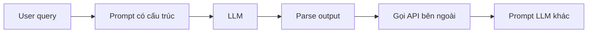

# 🧩 LangChain Fundamentals: Prompt Template, Chat Model và Chain — bộ ba nền tảng

> Nguồn: `008-LangChain-Fundamentals-Prompt-Templates-ChatModels-and-Chain.txt` · [Udemy](https://ua.udemy.com/course/langchain/learn/lecture/52011213)

Chào các bạn, Eden đây! Môi trường đã sẵn sàng, nhưng trước khi viết chain đầu tiên, hãy cùng mình làm quen với **bộ ba khái niệm nền tảng nhất** của LangChain: **prompt template**, **chat model** và **chain**.

Hiểu chúng thật chắc, mọi thứ về sau sẽ trở nên dễ như ăn kẹo.

---

### 📝 Prompt Template — "khuôn mẫu" cho câu lệnh

Hãy bắt đầu từ khái niệm gốc: LLM nhận đầu vào là một thứ gọi là **prompt**. Prompt đơn giản chỉ là **đoạn text** chúng ta đưa cho LLM; nó xử lý rồi trả về output cho ta. (Nếu muốn tìm hiểu định nghĩa "học thuật" và các thành phần cấu tạo nên prompt, bạn có thể xem video chuyên sâu của mình.)

Khi lập trình, ta thường muốn prompt **có tham số**. Cùng một khuôn prompt nhưng:

* Lần này sản phẩm là **thức ăn cho mèo (cat food)**.
* Lần khác là một món đồ hoàn toàn khác.
* Lần cuối là một **cây đàn piano**.

Mỗi input khác nhau sẽ cho output khác nhau. Và đây là lúc abstraction đầu tiên của LangChain xuất hiện: **Prompt Template**.

**Prompt template thực chất là một wrapper class bao quanh prompt**, bổ sung khả năng nhận input. Nhờ nó, ta chạy được cùng một prompt với nhiều input khác nhau, và mọi thứ được format thành chuỗi string để gửi tới LLM. Nó còn rất nhiều tính năng khác mà chúng ta sẽ khám phá dần trong khóa học.

---

### 💬 Chat Model — giao diện chuẩn để "nói chuyện" với LLM

Tiếp theo, hãy làm quen với class **`ChatOpenAI`** — một **chat model**, tức wrapper bao quanh OpenAI API.

Chat model thường sẽ là **interface chính** để bạn tương tác với các LLM. Đây là cách chuẩn mà LangChain giúp ta nói chuyện với GPT-4, Claude của Anthropic, Gemini của Google, và cả những model mã nguồn mở như Llama của Facebook thông qua Ollama.

Một chút "lịch sử" cho dễ hình dung:

* **Ngày xưa:** nhiều LLM chỉ nhận một **chuỗi string** và trả về một **chuỗi string**.
* **Hiện đại:** LLM được thiết kế cho hội thoại, nên chúng hoạt động tốt nhất khi ta cung cấp một **danh sách message** mô tả cuộc đối thoại cùng lịch sử trò chuyện, rồi nhận về một message.

Đó chính là lõi của **chat model interface**:

* **Input:** danh sách các message có cấu trúc — chỉ dẫn hệ thống (system instruction), câu hỏi của người dùng, phản hồi của AI...
* **Output:** một **AI message** đại diện cho câu trả lời của LLM.

| Thời kỳ | Input | Output |
|---|---|---|
| Ngày xưa | Một chuỗi string | Một chuỗi string |
| Hiện đại | Danh sách message kèm lịch sử hội thoại | Một AI message |

Ngoài việc sinh văn bản giống con người, chat model còn có những khả năng rất "xịn" khác mà khóa học sẽ dùng tới. Nếu tò mò, bạn xem video trong phần glossary — *còn không thì cứ yên tâm, chúng ta sẽ thực hành trực tiếp.*

---

### 🔬 Thói quen vàng: đọc source code của framework

Một trong những thói quen tốt nhất mà một developer nên rèn là: **mở thẳng source code của framework mình đang dùng** — ở đây là LangChain.

Cách làm cực đơn giản: **Cmd/Ctrl + click vào tên class** để xem implementation. Bạn sẽ thấy documentation được viết ngay trong source code, cùng toàn bộ logic bên trong. Mình đã thử với `ChatOpenAI` và mọi thứ đều nằm đó.

Khám phá trực tiếp như vậy là cách tuyệt vời để hiểu "hậu trường" (behind the scenes) — và chúng ta sẽ làm việc này **rất nhiều** trong khóa học. *Bạn không cần thuộc lòng nội bộ của mọi class đâu — mục tiêu trước mắt chỉ là viết chain đầu tiên thôi!*

---

### 🔗 Chain — khi các thành phần "nối đuôi" nhau

Và đây là nhân vật chính của section: **chain**. Một chain là một **workflow kết nối nhiều component lại với nhau thành chuỗi**, trong đó **output của bước trước trở thành input của bước sau**.

Mỗi bước trong chain có thể là:

1. Một lệnh gọi LLM.
2. Một prompt.
3. Một phép biến đổi dữ liệu thuần túy (plain data transformation).
4. Một tool call — chúng ta sẽ bàn sau, đừng lo.
5. Hoặc thậm chí là **một chain khác**.

Chain cho phép ta vượt xa mô hình "một prompt — một phản hồi" đơn lẻ. Ví dụ, thay vì hỏi model một câu hỏi lớn, ta có thể:

1. Format câu truy vấn của người dùng thành một **prompt có cấu trúc**.
2. Gửi prompt đó cho LLM.
3. **Parse output** của LLM thành dữ liệu có cấu trúc.
4. Dùng dữ liệu đó để **gọi API bên ngoài**, rồi đưa kết quả API vào **một prompt LLM khác**.

Chính tư duy **composition (lắp ghép)** này giúp ta xây được những thứ rất nâng cao — và cũng là lý do LangChain trở nên phổ biến, được dùng rộng rãi: đây là framework đầu tiên thật sự cho phép làm những việc phức tạp như vậy và xây dựng **agents** trên nền LLM. *Còn agents, chúng ta sẽ đào cực sâu về sau.*

Ví dụ về một chain nhiều bước như mình vừa kể:

---

### 🎯 Tự kiểm tra nhanh

**Câu 1:** Prompt template thực chất là gì?

<b>Xem đáp án</b>

**Đáp án:** Một wrapper class bao quanh prompt, bổ sung khả năng nhận input động và format thành chuỗi string gửi tới LLM.

Giải thích: Nhờ nó, ta chạy được cùng một prompt với nhiều input khác nhau.

Tham chiếu: Mục Prompt Template — "khuôn mẫu" cho câu lệnh.

**Câu 2:** Chat model interface nhận input và trả output như thế nào?

<b>Xem đáp án</b>

**Đáp án:** Nhận danh sách message có cấu trúc kèm lịch sử hội thoại, trả về một AI message.

Giải thích: Đây là lõi của chat model interface và cũng là cách các LLM hiện đại hoạt động tốt nhất.

Tham chiếu: Mục Chat Model — giao diện chuẩn để "nói chuyện" với LLM.

**Câu 3:** Vì sao nên rèn thói quen đọc source code của framework?

<b>Xem đáp án</b>

**Đáp án:** Để thấy documentation viết ngay trong source code cùng toàn bộ logic bên trong — hiểu "hậu trường" (behind the scenes).

Giải thích: Cách làm cực đơn giản: Cmd/Ctrl + click vào tên class.

Tham chiếu: Mục Thói quen vàng — đọc source code của framework.

**Câu 4:** Chain là gì?

<b>Xem đáp án</b>

**Đáp án:** Một workflow kết nối nhiều component thành chuỗi, trong đó output của bước trước trở thành input của bước sau.

Giải thích: Chain cho phép vượt xa mô hình "một prompt — một phản hồi" đơn lẻ.

Tham chiếu: Mục Chain — khi các thành phần "nối đuôi" nhau.

**Câu 5:** Một bước trong chain có thể là những gì? (kể ít nhất 3)

<b>Xem đáp án</b>

**Đáp án:** Một lệnh gọi LLM, một prompt, một phép biến đổi dữ liệu thuần túy, một tool call hoặc thậm chí là một chain khác.

Giải thích: Chính tư duy composition (lắp ghép) này giúp xây được những thứ rất nâng cao.

Tham chiếu: Mục Chain — khi các thành phần "nối đuôi" nhau.

Nắm chắc bộ ba này rồi, chúng ta đã sẵn sàng viết chain LangChain đầu tiên. Hẹn gặp bạn ở bài tiếp theo nhé! 🚀

## Nguồn tham khảo

- [Udemy — LangChain Fundamentals: Prompt Templates, ChatModels, and Chains](https://ua.udemy.com/course/langchain/learn/lecture/52011213)
- [LangChain Docs — Overview](https://docs.langchain.com/oss/python/langchain/overview)
